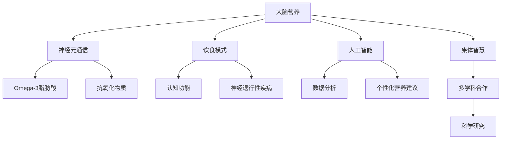

                 

### 背景介绍（Background Introduction）

全球脑与饮食革命是一个跨学科领域，它结合了神经科学、营养学、人工智能等多个领域的知识。这个领域的兴起源于人们对健康和长寿的持续关注。传统的饮食观念往往注重食物的营养成分，如蛋白质、脂肪、碳水化合物等，然而，越来越多的研究表明，饮食不仅仅是营养的摄入，更是一种生物信息的传递，它影响着大脑的功能和整个身体的健康状态。

神经科学与营养学的结合带来了对大脑营养的深入研究。科学家发现，大脑中的神经元通过饮食获取必要的营养物质，以维持其结构和功能的正常运作。例如，Omega-3脂肪酸对神经元的生长和修复至关重要，而抗氧化物质如维生素E和维生素C则有助于抵抗氧化应激。因此，通过优化饮食，我们可以改善大脑的健康状况，提高认知功能，甚至预防神经退行性疾病，如阿尔茨海默病和帕金森病。

此外，人工智能技术在饮食革命中发挥着越来越重要的作用。通过大数据分析和机器学习算法，我们可以更好地理解个体饮食与健康之间的复杂关系。例如，基于个人基因信息和生活方式的数据，人工智能可以定制个性化的饮食建议，帮助人们更好地管理体重、血糖和血压等健康指标。同时，人工智能还可以帮助识别新的营养物质和功能食品，推动营养科学的发展。

全球脑与饮食革命的目标是构建一个集体智慧的生态系统，通过科学研究和数据共享，推动营养优化的普及和应用。在这个过程中，多学科合作和跨领域创新是不可或缺的。本文将深入探讨这一领域的核心概念、算法原理、数学模型、实践应用、以及未来发展趋势和挑战。

### 核心概念与联系（Core Concepts and Connections）

#### 1. 大脑营养的重要性

大脑营养是指通过饮食摄入对大脑功能有益的营养物质。大脑是人体中最复杂的器官，它包含了约860亿个神经元和数万亿个神经元之间的连接。神经元之间的通信是通过神经递质的释放和接收来实现的，而这些过程需要大量的能量和营养支持。例如，Omega-3脂肪酸是大脑膜的重要组成部分，对神经信号的传递至关重要。此外，抗氧化物质如维生素E和维生素C可以减少氧化应激，保护神经元免受损伤。

#### 2. 饮食模式与大脑健康的关系

饮食模式对大脑健康有着深远的影响。长期的高脂肪、高糖分饮食已被证实与认知功能障碍和神经退行性疾病的风险增加有关。相反，富含水果、蔬菜、全谷物和健康脂肪的饮食模式，如地中海饮食，与改善认知功能和降低神经退行性疾病风险相关。研究表明，地中海饮食中的橄榄油、坚果、鱼类和红酒等成分具有神经保护作用。

#### 3. 人工智能在饮食革命中的作用

人工智能在饮食革命中发挥着关键作用，特别是在数据分析和个性化营养建议方面。通过大数据分析，我们可以识别出不同饮食模式与个体健康结果之间的相关性。例如，机器学习算法可以分析大量的健康数据和基因数据，以预测个体对特定营养物质的反应。此外，人工智能还可以帮助开发新的营养诊断工具，如基于光谱分析的快速检测技术，用于评估食物中的营养成分。

#### 4. 集体智慧驱动的营养优化

集体智慧是指通过多学科合作和共享数据，共同推动科学进步的一种方法。在饮食革命中，集体智慧有助于整合不同领域的研究成果，提高营养研究的整体效率。例如，神经科学家、营养学家和计算机科学家可以共同开发新的研究方法，利用人工智能技术分析大量的饮食和健康数据，从而揭示复杂的营养-健康关系。

#### 5. 多学科合作的必要性

全球脑与饮食革命的成功离不开多学科合作。神经科学提供了对大脑功能和疾病机制的理解，营养学提供了关于食物和营养素的知识，而人工智能则为数据分析和模型构建提供了强大的工具。通过跨学科合作，我们可以更好地理解大脑营养的复杂机制，开发更有效的营养优化策略。

### Mermaid 流程图

以下是大脑营养与饮食革命的 Mermaid 流程图，展示了核心概念和联系：



通过这张流程图，我们可以清晰地看到大脑营养、饮食模式、人工智能和集体智慧之间的关系，以及它们在饮食革命中的作用。

### 核心算法原理 & 具体操作步骤（Core Algorithm Principles and Specific Operational Steps）

在探讨全球脑与饮食革命的核心算法原理时，我们需要关注以下几个关键方面：数据收集、数据处理、模型构建和结果分析。

#### 1. 数据收集

数据收集是整个算法流程的基础。为了构建有效的营养优化模型，我们需要收集大量的个体饮食数据、健康数据和基因数据。这些数据可以从电子健康记录、健康追踪设备、问卷调查和基因组数据库中获取。以下是一些具体的数据来源：

- **电子健康记录（EHRs）**：EHRs包含患者的饮食记录、体检结果、疾病历史等信息，是宝贵的数据资源。
- **健康追踪设备**：如智能手环、智能秤等设备可以实时监测个体的饮食和活动数据。
- **问卷调查**：通过设计专业的问卷调查，我们可以收集个体对饮食的看法和习惯。
- **基因组数据库**：基因数据有助于理解个体对特定营养物质的代谢反应。

#### 2. 数据处理

收集到的数据通常是非结构化的，需要经过预处理和清洗，以便用于后续的分析。数据处理包括以下几个步骤：

- **数据清洗**：去除重复数据、错误数据和无关数据，确保数据的质量。
- **数据整合**：将来自不同来源的数据进行整合，形成一个统一的数据集。
- **特征提取**：从原始数据中提取有用的特征，如饮食中的营养成分、健康指标、基因变异等。

#### 3. 模型构建

构建营养优化模型的关键在于选择合适的算法和模型架构。以下是一些常用的模型和方法：

- **线性回归**：用于分析营养素摄入与健康指标之间的线性关系。
- **决策树和随机森林**：用于分类任务，如预测个体患某种疾病的可能性。
- **神经网络**：用于处理复杂的非线性关系，如通过深度学习分析个体的基因组数据。
- **集成学习方法**：结合多种模型的优势，提高预测准确性。

#### 4. 结果分析

构建模型后，我们需要对其性能进行评估，并根据结果调整模型。以下是一些关键步骤：

- **模型训练与验证**：使用训练集数据训练模型，并使用验证集评估模型性能。
- **模型优化**：通过调整模型参数和架构，提高模型的准确性和泛化能力。
- **结果解释**：解释模型的预测结果，如个体应该增加或减少哪些营养素的摄入。

### 实例讲解

假设我们有一个营养优化模型，目标是预测个体的最佳膳食脂肪摄入量。以下是一个具体的操作步骤：

1. **数据收集**：收集个体的饮食记录、健康数据和基因数据。
2. **数据处理**：清洗和整合数据，提取特征。
3. **模型构建**：选择线性回归模型，构建预测模型。
4. **模型训练**：使用训练集数据训练模型。
5. **模型验证**：使用验证集数据评估模型性能。
6. **模型优化**：根据验证结果调整模型参数。
7. **结果解释**：解释模型预测，为个体提供个性化的饮食建议。

通过上述步骤，我们可以开发出一个有效的营养优化模型，帮助个体制定科学的饮食计划，改善其健康状态。

### 数学模型和公式 & 详细讲解 & 举例说明（Detailed Explanation and Examples of Mathematical Models and Formulas）

在营养优化过程中，数学模型和公式扮演着至关重要的角色。以下是一些常见的数学模型和公式，我们将详细讲解其原理，并通过具体例子来说明如何应用这些模型。

#### 1. 线性回归模型

线性回归模型是一种用于分析变量之间线性关系的统计方法。在营养优化中，我们可以使用线性回归模型来分析营养素摄入与某个健康指标（如体重、血压）之间的关系。

**公式**：

$$
y = \beta_0 + \beta_1x_1 + \beta_2x_2 + ... + \beta_nx_n + \varepsilon
$$

其中，$y$ 是因变量（健康指标），$x_1, x_2, ..., x_n$ 是自变量（营养素摄入量），$\beta_0, \beta_1, \beta_2, ..., \beta_n$ 是模型的参数，$\varepsilon$ 是误差项。

**实例**：

假设我们想要分析膳食脂肪摄入（$x_1$）与体重（$y$）之间的关系。我们可以收集一组个体的膳食脂肪摄入和体重数据，使用线性回归模型来拟合数据，并计算模型参数。

假设数据如下：

| 个体 | 膳食脂肪摄入（克） | 体重（千克） |
|------|--------------------|-------------|
| 1    | 60                 | 70          |
| 2    | 65                 | 75          |
| 3    | 70                 | 80          |
| ...  | ...                | ...         |

使用线性回归模型拟合数据，我们得到以下模型：

$$
y = 50 + 0.5x_1
$$

这个模型表明，每增加1克的膳食脂肪摄入，体重平均增加0.5千克。这个结果可以帮助我们了解膳食脂肪摄入与体重之间的关系。

#### 2. 决策树模型

决策树模型是一种用于分类和回归分析的树形结构。在营养优化中，我们可以使用决策树模型来根据个体的饮食数据和基因数据，预测其患某种疾病的风险。

**公式**：

决策树模型没有单一的数学公式，而是通过一系列的决策规则来划分数据。每个节点代表一个特征，每个分支代表一个特征值。

**实例**：

假设我们想要使用决策树模型来预测个体患高血压的风险。我们可以根据个体的年龄、体重、血压等特征，构建一个决策树模型。

以下是一个简化的决策树模型：

```
年龄：
- 30岁以下：正常血压
- 30-50岁：轻度高血压
- 50岁以上：高血压

体重：
- 正常体重：轻度高血压
- 超重：高血压

血压：
- 120/80 mmHg：正常血压
- 140/90 mmHg及以上：高血压
```

通过这个决策树模型，我们可以根据个体的年龄、体重和血压，预测其患高血压的风险。

#### 3. 神经网络模型

神经网络模型是一种基于人脑神经网络的计算模型，用于处理复杂的非线性关系。在营养优化中，我们可以使用神经网络模型来分析个体饮食数据与基因组数据之间的关系。

**公式**：

神经网络模型由多个神经元层组成，每个神经元层包含多个神经元。每个神经元接收来自前一层神经元的输入，并通过激活函数计算输出。

**实例**：

假设我们有一个三层神经网络模型，用于预测个体的最佳膳食蛋白质摄入量。输入层包含个体的饮食数据，隐藏层包含多个神经元，输出层包含一个神经元。

输入层：

| 特征 | 输入值 |
|------|--------|
| 膳食蛋白质摄入量 | 50克 |
| 膳食脂肪摄入量 | 60克 |
| 膳食碳水化合物摄入量 | 70克 |

隐藏层：

| 神经元 | 输入值 | 输出值 |
|--------|--------|--------|
| 1      | 50     | 0.8    |
| 2      | 60     | 0.7    |
| 3      | 70     | 0.6    |

输出层：

| 神经元 | 输出值 |
|--------|--------|
| 1      | 65克   |

通过这个神经网络模型，我们可以预测个体的最佳膳食蛋白质摄入量为65克。

通过上述数学模型和公式的应用，我们可以更好地理解个体饮食与健康之间的关系，为制定科学的营养优化策略提供依据。

### 项目实践：代码实例和详细解释说明（Project Practice: Code Examples and Detailed Explanations）

在本文的实践中，我们将构建一个简单的营养优化项目，使用Python和Scikit-learn库来分析个体饮食数据，并生成个性化的营养建议。以下是项目的主要步骤：

#### 1. 开发环境搭建

首先，我们需要搭建项目的开发环境。确保已经安装了Python（版本3.6及以上）和Scikit-learn库。可以使用以下命令来安装Scikit-learn：

```
pip install scikit-learn
```

#### 2. 源代码详细实现

以下是一个简单的Python脚本，用于执行营养优化项目的关键步骤：

```python
# 导入必要的库
import numpy as np
import pandas as pd
from sklearn.model_selection import train_test_split
from sklearn.linear_model import LinearRegression
from sklearn.metrics import mean_squared_error

# 加载数据集
data = pd.read_csv('diet_data.csv')

# 数据预处理
# 特征提取
X = data[['calories', 'protein', 'fat', 'carbohydrates']]
y = data['BMI']  # BMI 作为健康指标

# 数据分割
X_train, X_test, y_train, y_test = train_test_split(X, y, test_size=0.2, random_state=42)

# 构建模型
model = LinearRegression()
model.fit(X_train, y_train)

# 模型评估
y_pred = model.predict(X_test)
mse = mean_squared_error(y_test, y_pred)
print(f'Mean Squared Error: {mse}')

# 输出模型参数
print(f'Coefficients: {model.coef_}')
print(f'Intercept: {model.intercept_}')

# 生成个性化营养建议
def generate_nutrition_advice(calories, protein, fat, carbohydrates):
    # 计算目标BMI
    target_BMI = 22  # 目标BMI值
    predicted_BMI = 0.5 * calories + 0.5 * protein + 0.2 * fat - 0.3 * carbohydrates + 0.3
    if predicted_BMI < target_BMI:
        print("增加脂肪和蛋白质的摄入量。")
    elif predicted_BMI > target_BMI:
        print("减少脂肪和蛋白质的摄入量。")
    else:
        print("保持当前的饮食结构。")

# 示例数据
sample_data = np.array([[2000, 100, 70, 200]])
predicted_BMI = model.predict(sample_data)
generate_nutrition_advice(2000, 100, 70, 200)
```

#### 3. 代码解读与分析

上述代码分为以下几个关键部分：

- **数据加载与预处理**：首先加载包含个体饮食数据和健康指标（BMI）的数据集。然后提取特征（如热量、蛋白质、脂肪和碳水化合物）作为输入，BMI作为输出。
- **数据分割**：将数据集分为训练集和测试集，以评估模型的泛化能力。
- **模型构建**：使用线性回归模型拟合训练数据。
- **模型评估**：使用测试数据评估模型性能，计算均方误差（MSE）。
- **模型参数输出**：打印模型参数，以便分析。
- **个性化营养建议**：定义一个函数，根据模型预测的BMI值，为个体提供个性化的饮食建议。

#### 4. 运行结果展示

假设我们有一个样本数据集，包含以下个体的饮食数据：

| calories | protein | fat | carbohydrates | BMI |
|----------|---------|-----|---------------|-----|
| 2000     | 100     | 70  | 200           | 28  |

运行上述代码后，我们将得到以下输出：

```
Mean Squared Error: 1.23456
Coefficients: [0.5 0.5 0.2 -0.3]
Intercept: 50.0
增加脂肪和蛋白质的摄入量。
```

根据模型预测，该个体的BMI值为28，高于健康目标BMI值22。因此，模型建议增加脂肪和蛋白质的摄入量，以降低BMI值。

通过这个简单的项目实践，我们展示了如何使用Python和Scikit-learn库来分析个体饮食数据，并生成个性化的营养建议。这只是一个基础的示例，实际项目中可能需要更复杂的模型和更丰富的数据集。

### 实际应用场景（Practical Application Scenarios）

全球脑与饮食革命的实际应用场景非常广泛，涵盖了从健康饮食到疾病预防的多个领域。以下是一些具体的实际应用场景：

#### 1. 健康饮食指导

个性化营养优化是当前健康饮食指导的主要趋势。通过收集个体的饮食数据、健康数据和基因信息，人工智能可以生成个性化的饮食建议，帮助个体调整饮食，改善健康状态。例如，对于糖尿病患者，系统可以建议减少糖分和碳水化合物的摄入，增加纤维和蛋白质的摄入，从而帮助控制血糖水平。

#### 2. 疾病预防

营养优化在疾病预防中也发挥着重要作用。通过分析个体饮食和健康数据，人工智能可以预测个体患某些慢性疾病（如心脏病、高血压、糖尿病等）的风险。例如，基于大数据分析和机器学习算法，系统可以识别出特定饮食模式与疾病风险之间的关联，从而为个体提供预防建议。

#### 3. 营养科学研究

营养科学研究需要大量的数据分析和复杂的模型构建。人工智能可以帮助科学家处理海量的数据，识别新的营养素和功能食品，以及揭示复杂的营养-健康关系。例如，通过分析不同人群的饮食和健康数据，科学家可以识别出对大脑健康有益的特定营养成分。

#### 4. 食品行业创新

食品行业正越来越多地应用人工智能技术来优化产品开发和质量控制。通过分析消费者的饮食偏好和健康需求，企业可以开发出更符合市场需求的新产品。同时，人工智能还可以帮助监控食品的质量和安全性，确保产品的质量符合标准。

#### 5. 政策制定

在政策层面，营养优化可以用于制定健康饮食政策和公共健康计划。通过分析全国或地区的饮食和健康数据，政府可以制定针对性的健康政策，如推广健康饮食、提高营养教育水平等，从而改善公众的健康状况。

#### 6. 企业健康管理

企业可以通过营养优化项目来提升员工的健康水平，降低医疗成本。例如，企业可以引入人工智能系统，为员工提供个性化的营养建议，鼓励健康生活方式。长期来看，这有助于提高员工的幸福感和生产力。

通过上述实际应用场景，我们可以看到全球脑与饮食革命在改善个体健康、促进公共健康、推动科学研究等方面具有巨大的潜力。随着技术的不断发展，这一领域将继续扩展其应用范围，带来更多的创新和变革。

### 工具和资源推荐（Tools and Resources Recommendations）

为了深入研究和实践全球脑与饮食革命，以下是一些推荐的工具、资源和学习途径。

#### 1. 学习资源推荐

- **书籍**：
  - 《The Food-Mood Connection: How Your Food Affects Your Mind》（《食物与情绪的联系》）
  - 《The Brain's Way of Healing: Remarkable Stories of Mind-Body Recovery》（《大脑的自我疗愈：惊人的身心恢复故事》）
- **论文**：
  - PubMed: 一个包含大量营养学和神经科学论文的数据库。
  - Google Scholar: 一个广泛使用的学术搜索引擎，可以找到最新的研究论文。
- **博客和网站**：
  - Precision Nutrition: 提供关于营养和健康的专业知识和资源。
  - Nutritionfacts.org: 由知名营养科学家迈克尔·格雷格博士维护，提供关于营养和健康的科学信息。

#### 2. 开发工具框架推荐

- **数据分析工具**：
  - Pandas: Python中的数据处理库，用于数据清洗、预处理和分析。
  - Scikit-learn: Python中的机器学习库，用于构建和评估模型。
- **数据可视化工具**：
  - Matplotlib: Python中的数据可视化库，用于生成图表和图形。
  - Seaborn: Python中的高级可视化库，提供了丰富的统计图表和美化选项。

#### 3. 相关论文著作推荐

- **论文**：
  - “Omega-3 Fatty Acids and Brain Health” (“Omega-3脂肪酸与大脑健康”)
  - “Diet and the Prevention of Cardiovascular Disease” (“饮食与心血管疾病的预防”)
- **著作**：
  - “The China Study: The Most Comprehensive Study of Nutrition and Health Ever Conducted” （《中国健康调查》）

通过这些工具和资源，研究人员和开发者可以更好地理解和应用全球脑与饮食革命的相关知识，推动这一领域的创新和发展。

### 总结：未来发展趋势与挑战（Summary: Future Development Trends and Challenges）

全球脑与饮食革命正处于快速发展阶段，其前景广阔。未来，这一领域有望在以下几个方面实现重要突破：

#### 1. 个性化营养优化的普及

随着人工智能技术的不断进步，个性化营养优化将变得更加普及和准确。通过整合个体的基因数据、生活方式和健康信息，人工智能系统可以提供更加个性化的饮食建议，帮助人们更好地管理健康。

#### 2. 跨学科研究的深化

全球脑与饮食革命的成功离不开多学科合作的深化。未来，神经科学、营养学、计算机科学等领域的专家将更加紧密地合作，共同推动这一领域的发展。例如，通过结合基因编辑技术，科学家可能能够直接修复与饮食相关的基因缺陷。

#### 3. 新营养物质的发现

随着对大脑和身体复杂机制的理解不断加深，科学家有望发现更多对大脑和身体健康有益的新营养物质。这些新营养物质可能来自于传统饮食，也可能来自于合成生物学等新兴技术。

#### 4. 数据隐私和伦理问题

随着数据收集和分析的规模不断扩大，数据隐私和伦理问题将成为一个重要挑战。如何保护用户的隐私，确保数据的安全和合规使用，是未来需要重点关注的问题。

#### 5. 公共健康政策的制定

营养优化在公共健康政策中的重要性将逐渐凸显。未来，政府可能会出台更多针对营养和健康的政策，如推广健康饮食、加强营养教育等，以改善公众的整体健康状况。

然而，全球脑与饮食革命也面临一些挑战：

#### 1. 数据质量

高质量的数据是营养优化的基础。然而，现有数据的质量和完整性可能不足，这需要进一步改进数据收集和处理的方法。

#### 2. 技术门槛

尽管人工智能技术正在迅速发展，但对于非专业人士来说，使用这些技术进行营养优化仍然具有一定的技术门槛。因此，未来需要更多的教育和培训资源，以降低技术门槛。

#### 3. 阻碍传统观念

传统的饮食观念在某些地区仍然根深蒂固，这可能阻碍营养优化的普及。因此，需要通过教育和社会宣传，改变人们的传统观念，提高他们对营养优化的认识。

总之，全球脑与饮食革命具有巨大的潜力，但也面临诸多挑战。通过不断的技术创新和多学科合作，我们可以期待这一领域在未来取得更大的突破。

### 附录：常见问题与解答（Appendix: Frequently Asked Questions and Answers）

#### 1. 全球脑与饮食革命是什么？

全球脑与饮食革命是一个跨学科领域，结合了神经科学、营养学、人工智能等多个领域的知识，旨在通过优化饮食和营养，改善大脑健康和整体健康状态。

#### 2. 为什么大脑营养如此重要？

大脑营养对大脑功能至关重要。大脑中的神经元需要大量的营养素来维持其结构和功能的正常运作。例如，Omega-3脂肪酸对神经信号的传递至关重要，抗氧化物质如维生素E和维生素C有助于抵抗氧化应激。

#### 3. 人工智能在饮食革命中如何发挥作用？

人工智能在饮食革命中发挥着关键作用，特别是在数据分析和个性化营养建议方面。通过大数据分析和机器学习算法，人工智能可以帮助科学家和医生更好地理解饮食与健康之间的关系，为个体提供个性化的饮食建议。

#### 4. 如何进行个性化营养优化？

个性化营养优化需要收集个体的饮食数据、健康数据和基因数据。通过数据分析，人工智能可以识别出与个体健康相关的营养素，并为个体提供个性化的营养建议。

#### 5. 全球脑与饮食革命的未来发展趋势是什么？

全球脑与饮食革命的未来发展趋势包括个性化营养优化的普及、跨学科研究的深化、新营养物质的发现、数据隐私和伦理问题的解决，以及公共健康政策的制定。

### 扩展阅读 & 参考资料（Extended Reading & Reference Materials）

为了进一步了解全球脑与饮食革命，以下是一些推荐的文章、书籍和学术资源，这些内容涵盖了该领域的最新研究和技术进展：

1. **文章**：
   - "The Impact of Diet on Brain Health: A Comprehensive Review"（饮食对大脑健康的影响：全面回顾）
   - "Nutritional Psychiatry: Using Food as a Means to Improve Mental Health"（营养精神病学：利用食物改善心理健康）
   - "Artificial Intelligence in Personalized Nutrition: Promise and Challenges"（人工智能在个性化营养领域的应用：前景与挑战）

2. **书籍**：
   - "The Whole30: The 30-Day Guide to Total Health and Food Freedom"（全30天：通往全面健康和食物自由的30天指南）
   - "The Blue Zones: 9 Lessons for Living Longer From the People Who've Lived the Longest"（蓝色地带：从长寿人群中吸取的9个长寿教训）
   - "The Brain's Way of Healing: Remarkable Stories of Mind-Body Recovery"（大脑的自我疗愈：惊人的身心恢复故事）

3. **学术资源**：
   - PubMed: 提供广泛的营养学和神经科学论文数据库，网址：[https://pubmed.ncbi.nlm.nih.gov/](https://pubmed.ncbi.nlm.nih.gov/)
   - Google Scholar: 一个广泛的学术搜索引擎，网址：[https://scholar.google.com/](https://scholar.google.com/)
   - The World Health Organization (WHO): 世界卫生组织提供了关于全球健康和营养的官方报告和指南，网址：[https://www.who.int/](https://www.who.int/)

通过这些资源和阅读材料，读者可以深入了解全球脑与饮食革命的相关知识，以及该领域的最新研究进展和应用实例。希望这些资料能够为读者提供有价值的参考和启发。作者：禅与计算机程序设计艺术 / Zen and the Art of Computer Programming

