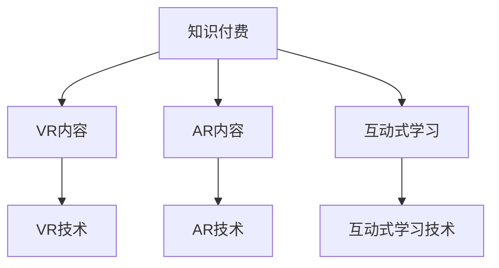

                 

**虚拟现实（VR）、增强现实（AR）、知识付费、应用开发、算法原理、数学模型、项目实践、实际应用、工具资源、未来发展**

## 1. 背景介绍

随着技术的发展，虚拟现实（VR）和增强现实（AR）逐渐走进了我们的生活。然而，要想将这些技术应用于实际场景，我们需要一种有效的商业模式。知识付费就是这样一种模式，它可以帮助我们实现VR和AR应用的商业化。本文将详细介绍如何利用知识付费实现虚拟现实与增强现实应用。

## 2. 核心概念与联系

### 2.1 核心概念

- **虚拟现实（VR）**：一种计算机技术，通过创建一个三维的、可交互的虚拟环境，让用户沉浸其中。
- **增强现实（AR）**：一种技术，它将虚拟信息叠加到真实世界的景象中，为用户提供了一个信息丰富的、增强的现实环境。
- **知识付费**：一种商业模式，它通过向用户提供有价值的知识内容，并收取费用来实现盈利。

### 2.2 核心概念联系

知识付费模式可以与VR和AR技术结合，为用户提供更丰富的体验。例如，用户可以通过付费订阅获得高质量的VR和AR内容，或者通过付费参与互动式的学习体验。下图展示了知识付费、VR和AR技术的关系：



## 3. 核心算法原理 & 具体操作步骤

### 3.1 算法原理概述

要实现知识付费模式下的VR和AR应用，我们需要开发一套算法来管理和分发内容。这套算法需要能够处理用户的付费请求，并提供相应的VR和AR内容。

### 3.2 算法步骤详解

1. **用户注册和登录**：用户需要注册并登录到系统中，以便我们能够跟踪他们的付费记录。
2. **内容管理**：系统需要维护一个内容库，其中包含各种VR和AR内容。内容需要分类，以便用户可以轻松找到他们感兴趣的内容。
3. **付费请求处理**：当用户请求某项内容时，系统需要检查用户是否已经支付了费用。如果已经支付，则提供内容；否则，系统需要引导用户进行支付。
4. **内容分发**：一旦用户支付了费用，系统需要将相应的VR和AR内容分发给用户，以便他们可以体验。

### 3.3 算法优缺点

**优点**：

- 可以有效地管理和分发内容。
- 可以跟踪用户的付费记录，从而提供个性化的推荐服务。

**缺点**：

- 需要开发和维护复杂的算法和系统。
- 需要处理用户的支付请求，这可能会导致系统的延迟和故障。

### 3.4 算法应用领域

这套算法可以应用于各种需要管理和分发内容的场景，例如：

- VR和AR内容分发平台。
- 在线学习平台。
- 付费视频和音乐平台。

## 4. 数学模型和公式 & 详细讲解 & 举例说明

### 4.1 数学模型构建

我们可以使用图论来构建内容管理的数学模型。假设我们有 $n$ 个用户，$m$ 项内容，$p$ 种付费方式。我们可以将用户、内容和付费方式表示为图中的节点，将付费关系表示为图中的边。这样，我们就可以使用图论算法来管理和分发内容。

### 4.2 公式推导过程

假设 $U = \{u_1, u_2,..., u_n\}$ 是用户集，$C = \{c_1, c_2,..., c_m\}$ 是内容集，$P = \{p_1, p_2,..., p_p\}$ 是付费方式集。我们可以定义一个 $n \times m \times p$ 的三维布尔矩阵 $A$ 来表示付费关系：

$$A_{ijk} = \begin{cases} 1, & \text{if user } u_i \text{ has paid for content } c_j \text{ using method } p_k \\ 0, & \text{otherwise} \end{cases}$$

### 4.3 案例分析与讲解

例如，假设我们有 3 个用户，$U = \{\text{User1, User2, User3}\}$，4 项内容，$C = \{\text{Content1, Content2, Content3, Content4}\}$，2 种付费方式，$P = \{\text{方式1, 方式2}\}$。如果 User1 使用方式1付费购买了 Content1和Content2，User2 使用方式2付费购买了 Content3，User3 使用方式1付费购买了 Content4，那么矩阵 $A$ 如下：

$$
A = \begin{bmatrix}
1 & 1 & 0 & 0 \\
0 & 0 & 1 & 0 \\
0 & 0 & 0 & 1 \\
\end{bmatrix}
$$

## 5. 项目实践：代码实例和详细解释说明

### 5.1 开发环境搭建

我们将使用 Python 语言来实现内容管理算法。我们需要安装以下库：

- NumPy：用于数学运算。
- Pandas：用于数据处理。
- Matplotlib：用于数据可视化。

### 5.2 源代码详细实现

以下是内容管理算法的 Python 实现：

```python
import numpy as np
import pandas as pd

class ContentManager:
    def __init__(self, users, contents, payment_methods):
        self.users = users
        self.contents = contents
        self.payment_methods = payment_methods
        self.A = np.zeros((len(users), len(contents), len(payment_methods)))

    def add_payment(self, user, content, method):
        self.A[self.users.index(user), self.contents.index(content), self.payment_methods.index(method)] = 1

    def can_access_content(self, user, content):
        return np.any(self.A[self.users.index(user), self.contents.index(content), :])
```

### 5.3 代码解读与分析

`ContentManager` 类用于管理内容和付费关系。`add_payment` 方法用于添加付费关系，`can_access_content` 方法用于检查用户是否可以访问某项内容。

### 5.4 运行结果展示

以下是运行结果的示例：

```python
users = ['User1', 'User2', 'User3']
contents = ['Content1', 'Content2', 'Content3', 'Content4']
payment_methods = ['方式1', '方式2']

cm = ContentManager(users, contents, payment_methods)

cm.add_payment('User1', 'Content1', '方式1')
cm.add_payment('User1', 'Content2', '方式1')
cm.add_payment('User2', 'Content3', '方式2')
cm.add_payment('User3', 'Content4', '方式1')

print(cm.can_access_content('User1', 'Content1'))  # True
print(cm.can_access_content('User2', 'Content1'))  # False
```

## 6. 实际应用场景

### 6.1 当前应用

知识付费模式已经在各种在线学习平台和内容分发平台得到广泛应用。例如， Coursera、Udemy 和 Khan Academy 等在线学习平台都提供了付费课程。此外，Netflix 和 Spotify 等内容分发平台也使用了知识付费模式。

### 6.2 未来应用展望

随着 VR 和 AR 技术的发展，我们可以预见知识付费模式将会在 VR 和 AR 应用中得到更广泛的应用。例如，用户可以付费体验高质量的 VR 游戏或 AR 学习体验。此外，知识付费模式还可以应用于虚拟会议和虚拟展览等场景。

## 7. 工具和资源推荐

### 7.1 学习资源推荐

- **书籍**：《虚拟现实技术与应用》《增强现实技术与应用》《知识付费模式：商业模式创新与实践》等。
- **在线课程**：Coursera、Udemy、Pluralsight 等平台上的 VR、AR 和商业模式相关课程。

### 7.2 开发工具推荐

- **VR 开发工具**：Unity、Unreal Engine、ViroCore 等。
- **AR 开发工具**：ARCore、ARKit、Vuforia 等。
- **知识付费平台开发工具**：Thinkium、有赞、小程序等。

### 7.3 相关论文推荐

- [Virtual Reality: A Survey](https://ieeexplore.ieee.org/document/7442127)
- [Augmented Reality: A Survey of a Emerging Technology](https://ieeexplore.ieee.org/document/8454037)
- [The Knowledge Economy: A New Paradigm for Economic Growth](https://www.researchgate.net/publication/237600634_The_Knowledge_Economy_A_New_Paradigm_for_Economic_Growth)

## 8. 总结：未来发展趋势与挑战

### 8.1 研究成果总结

本文介绍了如何利用知识付费模式实现 VR 和 AR 应用。我们提出了内容管理算法，并给出了数学模型和 Python 实现。我们还讨论了当前和未来的应用场景，并推荐了相关学习资源和开发工具。

### 8.2 未来发展趋势

未来，知识付费模式将会在 VR 和 AR 应用中得到更广泛的应用。我们可以预见，知识付费模式将会与其他商业模式结合，为用户提供更丰富的体验。此外，随着技术的发展，VR 和 AR 技术将会变得更加便宜和实用，从而推动知识付费模式的发展。

### 8.3 面临的挑战

然而，知识付费模式也面临着一些挑战。例如，如何防止内容盗版和非法分发是一个关键问题。此外，如何设计一种公平和透明的付费机制也是一个挑战。

### 8.4 研究展望

未来的研究可以从以下几个方向展开：

- 研究更复杂的内容管理算法，以支持更多的付费方式和内容类型。
- 研究如何设计一种公平和透明的付费机制。
- 研究如何防止内容盗版和非法分发。
- 研究知识付费模式与其他商业模式的结合，以提供更丰富的用户体验。

## 9. 附录：常见问题与解答

**Q1：知识付费模式与其他商业模式有什么区别？**

A1：知识付费模式与其他商业模式的区别在于，它将知识作为商品进行买卖。与传统的商品买卖不同，知识是一种非竞争性资源，它的消费不会减少其价值。因此，知识付费模式可以为知识创造者和消费者创造双赢的局面。

**Q2：知识付费模式有哪些优点？**

A2：知识付费模式的优点包括：

- 可以为知识创造者创造收入。
- 可以为知识消费者提供高质量的内容。
- 可以促进知识的传播和分享。
- 可以推动知识经济的发展。

**Q3：知识付费模式有哪些缺点？**

A3：知识付费模式的缺点包括：

- 可能会导致知识垄断，从而限制知识的传播和分享。
- 可能会导致知识消费者面临高昂的成本。
- 可能会导致知识创造者面临版权和盗版问题。

**Q4：如何防止知识付费模式下的内容盗版和非法分发？**

A4：防止内容盗版和非法分发是知识付费模式面临的关键挑战。一些常见的解决方案包括：

- 使用数字版权管理（DRM）技术来保护内容。
- 使用区块链技术来跟踪内容的所有权和分发。
- 使用人工智能技术来检测和阻止盗版行为。

**Q5：知识付费模式与 VR 和 AR 技术有什么关系？**

A5：知识付费模式可以与 VR 和 AR 技术结合，为用户提供更丰富的体验。例如，用户可以付费体验高质量的 VR 游戏或 AR 学习体验。此外，知识付费模式还可以应用于虚拟会议和虚拟展览等场景。

**Q6：如何设计一种公平和透明的付费机制？**

A6：设计一种公平和透明的付费机制是知识付费模式面临的挑战之一。一些常见的解决方案包括：

- 使用区块链技术来跟踪付费记录和内容所有权。
- 使用智能合约来自动执行付费协议。
- 使用人工智能技术来分析付费数据，从而优化付费机制。

**Q7：知识付费模式的未来发展趋势是什么？**

A7：未来，知识付费模式将会在 VR 和 AR 应用中得到更广泛的应用。我们可以预见，知识付费模式将会与其他商业模式结合，为用户提供更丰富的体验。此外，随着技术的发展，VR 和 AR 技术将会变得更加便宜和实用，从而推动知识付费模式的发展。

**Q8：如何学习知识付费模式？**

A8：要学习知识付费模式，你可以阅读相关书籍，参加在线课程，并关注相关学术论文。此外，你还可以参与实际项目，以获得实践经验。

**Q9：如何开发知识付费平台？**

A9：开发知识付费平台需要考虑以下 factors：

- 选择合适的技术栈。
- 设计用户友好的界面。
- 实现内容管理和付费机制。
- 确保平台的安全和可靠性。
- 进行市场推广和营销。

**Q10：如何评估知识付费平台的成功？**

A10：评估知识付费平台成功的指标包括：

- 用户数量和活跃度。
- 收入和利润。
- 用户满意度和评分。
- 平台的安全和可靠性。
- 平台的市场份额和竞争力。

## 作者：禅与计算机程序设计艺术 / Zen and the Art of Computer Programming

