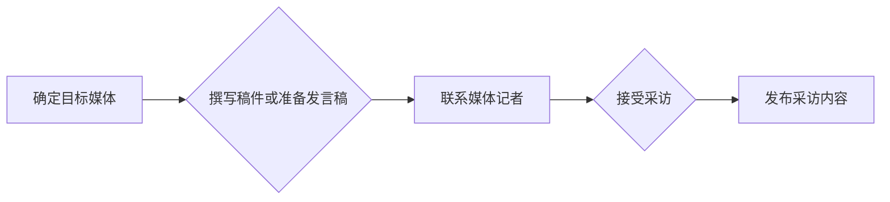

                 

## 媒体曝光：接受采访，成为意见领袖

> 关键词：人工智能、意见领袖、媒体曝光、技术沟通、技术写作、采访技巧、个人品牌

### 1. 背景介绍

在当今科技飞速发展的时代，技术专家们扮演着越来越重要的角色。他们不仅需要精通专业的技术知识，更需要能够清晰地将复杂的技术概念传达给大众，成为技术领域的意见领袖。媒体曝光是技术专家提升个人影响力、传播技术思想、推动行业发展的重要途径之一。接受采访，分享自己的见解和经验，可以帮助技术专家建立个人品牌，扩大知名度，并与更广泛的受众建立联系。

### 2. 核心概念与联系

**2.1 媒体曝光的意义**

媒体曝光是指技术专家通过各种媒体平台，例如新闻媒体、科技博客、社交媒体等，向公众展示自己的专业知识和观点的过程。

**2.2 意见领袖的定义**

意见领袖是指在特定领域拥有广泛影响力的人，他们能够通过自己的观点和见解，影响他人的决策和行为。

**2.3 技术专家与媒体曝光的联系**

技术专家拥有专业的技术知识和经验，是媒体曝光的理想对象。通过接受采访，分享自己的见解和经验，技术专家可以：

* **提升个人知名度和影响力：** 媒体曝光可以帮助技术专家扩大知名度，建立个人品牌，成为行业内的意见领袖。
* **传播技术思想和理念：** 技术专家可以通过采访机会，向公众普及技术知识，传播自己的技术思想和理念。
* **推动行业发展：** 技术专家的观点和见解，可以对行业发展起到重要的推动作用。
* **拓展人脉和合作机会：** 媒体曝光可以帮助技术专家拓展人脉，结识更多同行和潜在合作伙伴。

**2.4 媒体曝光的流程**

媒体曝光的流程一般包括以下几个步骤：

* **确定目标媒体：** 技术专家需要根据自己的目标受众和领域，选择合适的媒体平台进行曝光。
* **撰写稿件或准备发言稿：** 技术专家需要根据采访主题，撰写高质量的稿件或准备发言稿。
* **联系媒体记者：** 技术专家需要主动联系媒体记者，表达自己的意愿，并提供相关信息。
* **接受采访：** 技术专家需要认真准备，并积极参与采访，清晰地表达自己的观点和见解。
* **发布采访内容：** 媒体发布采访内容后，技术专家可以转发分享，扩大影响力。

**2.5 Mermaid 流程图**



### 3. 核心算法原理 & 具体操作步骤

**3.1 算法原理概述**

媒体曝光的本质是一种信息传播和影响力传递的过程。它可以看作是一种算法，其核心原理是：

* **信息传递：** 技术专家通过媒体平台，将自己的专业知识和观点传递给目标受众。
* **影响力传递：** 受众对技术专家的观点产生认同和影响，从而改变他们的认知和行为。

**3.2 算法步骤详解**

1. **信息收集和分析：** 技术专家需要了解目标受众的兴趣和需求，并收集相关信息，以便撰写有价值的稿件或准备发言稿。
2. **内容创作：** 技术专家需要以清晰、简洁、易懂的语言，将复杂的技术概念转化为大众能够理解的语言。
3. **媒体选择：** 技术专家需要根据目标受众和领域，选择合适的媒体平台进行曝光。
4. **联系媒体记者：** 技术专家需要主动联系媒体记者，表达自己的意愿，并提供相关信息。
5. **采访准备：** 技术专家需要认真准备，并熟悉采访主题，以便在采访中清晰地表达自己的观点和见解。
6. **采访进行：** 技术专家需要保持冷静和自信，并积极参与采访，与记者进行互动。
7. **内容发布：** 媒体发布采访内容后，技术专家可以转发分享，扩大影响力。

**3.3 算法优缺点**

**优点：**

* **提升个人知名度和影响力：** 媒体曝光可以帮助技术专家扩大知名度，建立个人品牌，成为行业内的意见领袖。
* **传播技术思想和理念：** 技术专家可以通过采访机会，向公众普及技术知识，传播自己的技术思想和理念。
* **推动行业发展：** 技术专家的观点和见解，可以对行业发展起到重要的推动作用。
* **拓展人脉和合作机会：** 媒体曝光可以帮助技术专家拓展人脉，结识更多同行和潜在合作伙伴。

**缺点：**

* **时间成本高：** 媒体曝光需要投入大量的时间和精力，包括信息收集、内容创作、媒体联系、采访准备等。
* **竞争激烈：** 媒体曝光是一个竞争激烈的领域，技术专家需要不断提升自己的专业水平和沟通能力，才能脱颖而出。
* **信息控制权：** 媒体对采访内容有一定的控制权，技术专家需要谨慎选择媒体平台，并与记者进行充分沟通，确保自己的观点能够准确地传达给受众。

**3.4 算法应用领域**

媒体曝光的应用领域非常广泛，包括：

* **科技行业：** 技术专家可以通过媒体曝光，分享自己的技术见解，推广自己的产品和服务。
* **学术界：** 学者可以通过媒体曝光，传播自己的研究成果，提升学术影响力。
* **商业领域：** 企业家可以通过媒体曝光，提升品牌知名度，吸引投资和客户。
* **公益领域：** 志愿者可以通过媒体曝光，宣传公益项目，呼吁社会关注。

### 4. 数学模型和公式 & 详细讲解 & 举例说明

**4.1 数学模型构建**

媒体曝光的影响力可以看作是一个动态的系统，其影响力传播过程可以抽象为一个数学模型。

假设：

* $I_t$ 表示在时间 $t$ 时刻的技术专家的影响力。
* $C_t$ 表示在时间 $t$ 时刻的技术专家发布的媒体内容数量。
* $R_t$ 表示在时间 $t$ 时刻受众对媒体内容的阅读量。
* $E_t$ 表示在时间 $t$ 时刻受众对技术专家的认同度。

则影响力传播模型可以表示为：

$$I_{t+1} = f(I_t, C_t, R_t, E_t)$$

其中，$f$ 是一个影响力传播函数，其具体形式取决于各种因素，例如媒体平台、内容质量、受众特征等。

**4.2 公式推导过程**

影响力传播函数 $f$ 的具体形式可以根据实际情况进行推导。例如，可以假设影响力传播函数为线性函数：

$$I_{t+1} = aI_t + bC_t + cR_t + dE_t$$

其中，$a$, $b$, $c$, $d$ 是影响力传播系数，可以通过数据分析和模型训练来确定。

**4.3 案例分析与讲解**

假设一个技术专家在社交媒体平台上发布了一篇关于人工智能的博客文章，该文章获得了 1000 次阅读量，并引发了 50 条评论。

根据上述影响力传播模型，我们可以计算该技术专家的影响力变化：

$$I_{t+1} = aI_t + bC_t + cR_t + dE_t$$

其中，$C_t$ = 1 (发布了一篇博客文章)，$R_t$ = 1000 (阅读量)，$E_t$ = 0.5 (假设评论数量与受众认同度成正比)。

如果我们假设影响力传播系数为 $a$ = 0.8, $b$ = 0.2, $c$ = 0.1, $d$ = 0.3，则我们可以计算出该技术专家的影响力变化：

$$I_{t+1} = 0.8I_t + 0.2 + 0.1 \times 1000 + 0.3 \times 0.5$$

通过计算，我们可以得到该技术专家的影响力 $I_{t+1}$ 的值。

### 5. 项目实践：代码实例和详细解释说明

**5.1 开发环境搭建**

为了实现媒体曝光的自动化，我们可以使用 Python 语言开发一个简单的脚本，自动发布技术博客文章到社交媒体平台。

开发环境搭建步骤如下：

1. 安装 Python 语言环境。
2. 安装必要的 Python 库，例如 requests、tweepy 等。
3. 创建一个新的 Python 项目文件夹。
4. 在项目文件夹中创建 main.py 文件，用于编写脚本代码。

**5.2 源代码详细实现**

```python
import requests
import tweepy

# 你的 Twitter API 凭据
consumer_key = "你的消费者密钥"
consumer_secret = "你的消费者密钥"
access_token = "你的访问令牌"
access_token_secret = "你的访问令牌密钥"

# 创建 Twitter API 对象
auth = tweepy.OAuthHandler(consumer_key, consumer_secret)
auth.set_access_token(access_token, access_token_secret)
api = tweepy.API(auth)

# 博客文章内容
blog_content = """
## 媒体曝光：接受采访，成为意见领袖

> 关键词：人工智能、意见领袖、媒体曝光、技术沟通、技术写作、采访技巧、个人品牌

### 1. 背景介绍

...
"""

# 发布博客文章到 Twitter
api.update_status(status=blog_content)

print("博客文章已成功发布到 Twitter!")
```

**5.3 代码解读与分析**

* 该脚本首先导入必要的 Python 库，例如 requests 和 tweepy。
* 然后，需要填写你的 Twitter API 凭据，包括消费者密钥、消费者密钥、访问令牌和访问令牌密钥。
* 接着，创建 Twitter API 对象，并使用 API 对象发布博客文章到 Twitter。
* 最后，打印一条消息，确认博客文章已成功发布。

**5.4 运行结果展示**

运行该脚本后，你的博客文章将被自动发布到你的 Twitter 账号。

### 6. 实际应用场景

**6.1 技术博客文章发布**

技术专家可以通过脚本自动发布博客文章到 Twitter，扩大文章的传播范围，吸引更多读者。

**6.2 社交媒体互动**

技术专家可以通过脚本自动回复 Twitter 的评论和私信，与粉丝进行互动，建立更紧密的联系。

**6.3 数据分析与报告**

技术专家可以通过脚本收集 Twitter 的数据，例如用户互动量、话题趋势等，并生成数据分析报告，了解用户的兴趣和需求。

**6.4 未来应用展望**

随着人工智能技术的不断发展，媒体曝光的自动化程度将越来越高。未来，我们可以看到更多更智能的媒体曝光工具，例如：

* **自动生成内容：** 基于人工智能，自动生成高质量的博客文章、社交媒体帖子等内容。
* **智能匹配媒体平台：** 根据技术专家的领域和目标受众，智能匹配合适的媒体平台进行曝光。
* **个性化内容推荐：** 根据用户的兴趣和行为，推荐个性化的技术内容。

### 7. 工具和资源推荐

**7.1 学习资源推荐**

* **书籍：**
    * 《技术写作》
    * 《媒体沟通》
    * 《社交媒体营销》
* **在线课程：**
    * Coursera 上的《数字营销》课程
    * Udemy 上的《社交媒体营销》课程

**7.2 开发工具推荐**

* **Python：** 强大的编程语言，适合开发自动化脚本。
* **Tweepy：** 用于与 Twitter API 交互的 Python 库。
* **Requests：** 用于发送 HTTP 请求的 Python 库。

**7.3 相关论文推荐**

* **影响力传播模型研究**
* **社交媒体营销策略研究**
* **人工智能在媒体曝光中的应用研究**

### 8. 总结：未来发展趋势与挑战

**8.1 研究成果总结**

通过以上分析，我们可以总结出以下研究成果：

* 媒体曝光是技术专家提升个人影响力和传播技术思想的重要途径。
* 媒体曝光可以看作是一种算法，其影响力传播过程可以抽象为数学模型。
* 随着人工智能技术的不断发展，媒体曝光的自动化程度将越来越高。

**8.2 未来发展趋势**

未来，媒体曝光的发展趋势包括：

* **更加智能化：** 基于人工智能，媒体曝光工具将更加智能化，能够自动生成内容、智能匹配媒体平台、个性化推荐内容等。
* **更加个性化：** 媒体曝光将更加注重个性化，根据用户的兴趣和行为，推荐个性化的技术内容。
* **更加多元化：** 媒体曝光的平台将更加多元化，包括社交媒体、博客平台、视频平台等。

**8.3 面临的挑战**

媒体曝光也面临着一些挑战：

* **信息过载：** 随着互联网信息量的不断增长，信息过载问题日益严重，技术专家需要找到更有效的方式，将自己的内容传达给目标受众。
* **用户信任度下降：** 用户对网络信息的信任度不断下降，技术专家需要更加注重内容的真实性和可靠性。
* **算法监管：** 随着人工智能技术的应用，媒体曝光算法的监管问题也越来越重要，需要制定相应的规范和标准。

**8.4 研究展望**

未来，我们需要继续研究媒体曝光的算法原理、影响力传播机制、用户行为模式等，并探索更加智能化、个性化、多元化的媒体曝光模式，帮助技术专家更好地传播技术思想，提升个人影响力。

### 9. 附录：常见问题与解答

**9.1 如何提高媒体曝光率？**

* 创作高质量、有价值的内容。
* 选择合适的媒体平台。
* 与媒体记者建立联系。
* 积极参与社交媒体互动。
* 利用数据分析，优化内容策略。

**9.2 如何应对信息过载问题？**

* 聚焦目标受众，精准投放内容。
* 使用数据分析，了解用户兴趣和需求。
* 采用多种内容形式，例如视频、音频、图片等。
* 利用人工智能技术，自动生成内容。

**9.3 如何提升用户信任度？**

* 提供真实、可靠的信息。
* 避免过度营销和虚假宣传。
* 建立良好的用户口碑。
* 透明化运营，公开数据和算法。


作者：禅与计算机程序设计艺术 / Zen and the Art of Computer Programming<end_of_turn>

