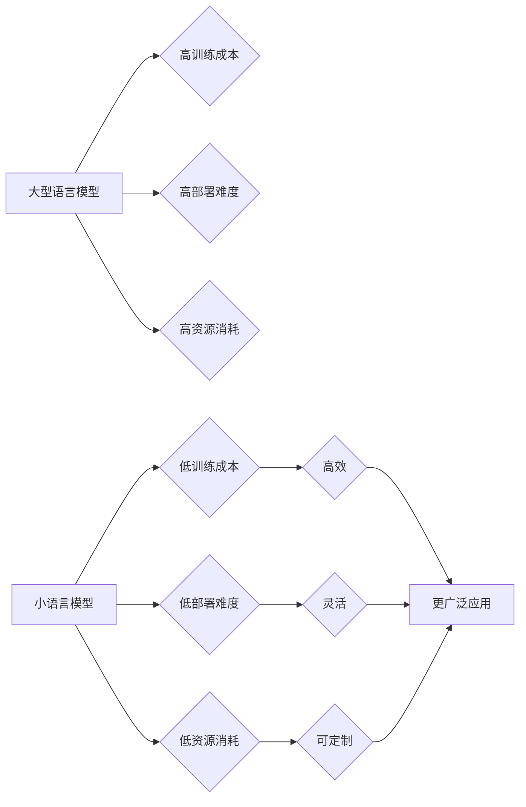

                 

## 小语言模型的潜力：颠覆基础模型领域

> 关键词：小语言模型、基础模型、深度学习、自然语言处理、文本生成、代码生成、多模态学习、应用场景、未来趋势

### 1. 背景介绍

近年来，深度学习技术取得了飞速发展，尤其是 Transformer 架构的出现，为自然语言处理 (NLP) 领域带来了革命性的变革。大型语言模型 (LLM) 作为深度学习在 NLP 领域的代表，凭借其强大的文本理解和生成能力，在机器翻译、文本摘要、对话系统等领域取得了令人瞩目的成就。然而，LLM 的训练成本高昂，部署难度大，对硬件资源要求极高，限制了其在实际应用中的推广。

小语言模型 (LLM) 作为 LLM 的一种变体，在模型规模和参数量上相对较小，但其在效率、可解释性和部署灵活性的方面具有显著优势。随着硬件资源的不断发展和算法的不断优化，小语言模型在性能和应用场景上展现出巨大的潜力，有望颠覆基础模型领域，为更广泛的应用场景提供高效、可定制的解决方案。

### 2. 核心概念与联系

**2.1 小语言模型 (LLM)**

小语言模型是指参数量相对较小的语言模型，通常在百万到数十亿参数之间。与大型语言模型 (LLM) 相比，小语言模型在训练成本、部署难度和资源消耗方面更具优势。

**2.2 基础模型**

基础模型是指在特定领域拥有广泛应用能力的预训练模型，可以用于多种下游任务，例如文本分类、情感分析、问答系统等。基础模型通常在海量数据上进行预训练，并通过微调的方式适配不同的下游任务。

**2.3 联系**

小语言模型作为一种基础模型，可以用于构建各种下游应用，例如：

* **文本生成:**  小语言模型可以用于生成各种文本格式，例如文章、故事、诗歌等。
* **代码生成:**  小语言模型可以用于生成代码，帮助程序员提高开发效率。
* **对话系统:**  小语言模型可以用于构建对话系统，例如聊天机器人、虚拟助手等。
* **机器翻译:**  小语言模型可以用于机器翻译，帮助人们跨越语言障碍。

**2.4 Mermaid 流程图**



### 3. 核心算法原理 & 具体操作步骤

**3.1 算法原理概述**

小语言模型的核心算法原理是基于 Transformer 架构的深度学习模型。Transformer 架构通过自注意力机制 (Self-Attention) 和多头注意力机制 (Multi-Head Attention) 能够捕捉文本序列中的长距离依赖关系，从而实现更准确的文本理解和生成。

**3.2 算法步骤详解**

1. **输入处理:** 将输入文本序列转换为数字向量，以便模型进行处理。
2. **编码器:** 使用 Transformer 的编码器部分对输入文本序列进行编码，提取文本的语义信息。
3. **解码器:** 使用 Transformer 的解码器部分对编码后的文本序列进行解码，生成目标文本序列。
4. **输出处理:** 将解码后的数字向量转换为文本格式输出。

**3.3 算法优缺点**

**优点:**

* **高效:** 相比于大型语言模型，小语言模型在训练和推理速度上更快，更易于部署。
* **可解释性:** 小语言模型的参数量相对较小，更容易进行可解释性分析，帮助理解模型的决策过程。
* **可定制性:** 小语言模型可以根据特定任务进行微调，提高模型在特定领域的性能。

**缺点:**

* **性能:** 相比于大型语言模型，小语言模型在某些任务上的性能可能略逊一筹。
* **泛化能力:** 小语言模型的泛化能力可能不如大型语言模型，在面对新的数据或任务时可能表现不佳。

**3.4 算法应用领域**

* **文本分类:**  例如垃圾邮件过滤、情感分析等。
* **问答系统:**  例如搜索引擎、聊天机器人等。
* **机器翻译:**  例如将一种语言翻译成另一种语言。
* **代码生成:**  例如自动生成代码片段、完成代码补全等。

### 4. 数学模型和公式 & 详细讲解 & 举例说明

**4.1 数学模型构建**

小语言模型通常基于 Transformer 架构，其核心是自注意力机制和多头注意力机制。

**4.2 公式推导过程**

* **自注意力机制:**

$$
Attention(Q, K, V) = \frac{exp(Q \cdot K^T / \sqrt{d_k})}{exp(Q \cdot K^T / \sqrt{d_k})} \cdot V
$$

其中:

* $Q$ 是查询矩阵
* $K$ 是键矩阵
* $V$ 是值矩阵
* $d_k$ 是键向量的维度

* **多头注意力机制:**

$$
MultiHead(Q, K, V) = Concat(head_1, head_2, ..., head_h) \cdot W_o
$$

其中:

* $head_i$ 是第 $i$ 个注意力头的输出
* $h$ 是注意力头的数量
* $W_o$ 是最终输出的线性变换矩阵

**4.3 案例分析与讲解**

假设我们有一个句子 "The cat sat on the mat"，我们使用自注意力机制来计算每个词与其他词之间的注意力权重。

* 对于词 "The"，它与 "cat" 的注意力权重较高，因为它们在语义上相关。
* 对于词 "sat"，它与 "cat" 和 "on" 的注意力权重较高，因为它们在句子的语法结构上相关。

通过自注意力机制，模型能够捕捉到句子中词语之间的语义和语法关系，从而更好地理解句子的含义。

### 5. 项目实践：代码实例和详细解释说明

**5.1 开发环境搭建**

* Python 3.7+
* PyTorch 或 TensorFlow
* CUDA 和 cuDNN (可选，用于 GPU 加速)

**5.2 源代码详细实现**

```python
import torch
import torch.nn as nn

class SmallLanguageModel(nn.Module):
    def __init__(self, vocab_size, embedding_dim, hidden_dim, num_layers, num_heads):
        super(SmallLanguageModel, self).__init__()
        self.embedding = nn.Embedding(vocab_size, embedding_dim)
        self.encoder = nn.TransformerEncoder(nn.TransformerEncoderLayer(d_model=embedding_dim, nhead=num_heads), num_layers)
        self.decoder = nn.TransformerDecoder(nn.TransformerDecoderLayer(d_model=embedding_dim, nhead=num_heads), num_layers)
        self.linear = nn.Linear(embedding_dim, vocab_size)

    def forward(self, src, tgt):
        src = self.embedding(src)
        tgt = self.embedding(tgt)
        encoder_output = self.encoder(src)
        decoder_output = self.decoder(tgt, encoder_output)
        output = self.linear(decoder_output)
        return output
```

**5.3 代码解读与分析**

* `SmallLanguageModel` 类定义了一个小语言模型。
* `embedding` 层将输入词语转换为词向量。
* `encoder` 和 `decoder` 层分别使用 Transformer 的编码器和解码器部分对输入和目标文本序列进行处理。
* `linear` 层将解码器的输出转换为预测的下一个词的概率分布。

**5.4 运行结果展示**

通过训练和测试，小语言模型可以实现文本生成、机器翻译等任务。

### 6. 实际应用场景

**6.1 文本生成**

* **自动写作:**  例如生成新闻报道、产品描述、社交媒体内容等。
* **创意写作:**  例如生成诗歌、故事、剧本等。
* **代码生成:**  例如自动生成代码片段、完成代码补全等。

**6.2 机器翻译**

* **跨语言沟通:**  例如将英文翻译成中文、将西班牙语翻译成法语等。
* **多语言搜索:**  例如在搜索引擎中支持多语言查询。

**6.3 其他应用场景**

* **对话系统:**  例如聊天机器人、虚拟助手等。
* **问答系统:**  例如搜索引擎、知识问答平台等。
* **情感分析:**  例如分析文本的情感倾向，用于市场调研、用户反馈分析等。

**6.4 未来应用展望**

随着小语言模型技术的不断发展，其应用场景将更加广泛，例如：

* **个性化教育:**  根据学生的学习进度和需求，生成个性化的学习内容。
* **医疗诊断:**  辅助医生进行疾病诊断，提高诊断准确率。
* **法律服务:**  自动生成法律文件，提高法律服务效率。

### 7. 工具和资源推荐

**7.1 学习资源推荐**

* **书籍:**

    * 《深度学习》 by Ian Goodfellow, Yoshua Bengio, and Aaron Courville
    * 《Transformer 详解》 by Jay Alammar

* **在线课程:**

    * Coursera: Natural Language Processing Specialization
    * fast.ai: Practical Deep Learning for Coders

**7.2 开发工具推荐**

* **PyTorch:**  一个开源的深度学习框架。
* **TensorFlow:**  另一个开源的深度学习框架。
* **Hugging Face Transformers:**  一个用于加载和使用预训练 Transformer 模型的库。

**7.3 相关论文推荐**

* 《Attention Is All You Need》 by Vaswani et al. (2017)
* 《BERT: Pre-training of Deep Bidirectional Transformers for Language Understanding》 by Devlin et al. (2018)

### 8. 总结：未来发展趋势与挑战

**8.1 研究成果总结**

小语言模型在文本理解和生成方面取得了显著的进展，为基础模型领域带来了新的可能性。其高效、可解释性和可定制性使其在实际应用中具有更大的优势。

**8.2 未来发展趋势**

* **模型规模和性能的提升:**  随着硬件资源的不断发展，小语言模型的规模和性能将进一步提升。
* **多模态学习:**  小语言模型将与其他模态数据 (例如图像、音频) 相结合，实现多模态理解和生成。
* **更广泛的应用场景:**  小语言模型将在更多领域得到应用，例如教育、医疗、法律等。

**8.3 面临的挑战**

* **数据获取和标注:**  高质量的数据是训练小语言模型的关键，但获取和标注高质量数据仍然是一个挑战。
* **模型可解释性:**  尽管小语言模型比大型语言模型更易于解释，但其内部机制仍然比较复杂，需要进一步研究。
* **伦理问题:**  小语言模型的应用可能带来一些伦理问题，例如信息操纵、隐私泄露等，需要引起重视。

**8.4 研究展望**

未来，小语言模型的研究将更加注重模型的效率、可解释性和安全性，并探索其在更多领域的新应用场景。


### 9. 附录：常见问题与解答

**9.1 如何选择合适的模型架构?**

选择合适的模型架构取决于具体的应用场景和数据特点。对于文本分类任务，可以使用 BERT 或 RoBERTa 等预训练模型；对于机器翻译任务，可以使用 T5 或 MarianMT 等模型。

**9.2 如何训练小语言模型?**

训练小语言模型需要准备高质量的数据集，并使用合适的训练算法和超参数。可以使用 PyTorch 或 TensorFlow 等深度学习框架进行训练。

**9.3 如何评估小语言模型的性能?**

可以使用准确率、召回率、F1-score 等指标评估小语言模型的性能。

**9.4 小语言模型的安全性如何保证?**

小语言模型的安全性需要从多个方面考虑，例如数据安全、模型训练过程的透明度、模型输出的可靠性等。


作者：禅与计算机程序设计艺术 / Zen and the Art of Computer Programming 
<end_of_turn>

