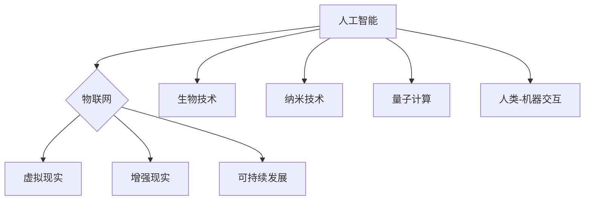

                 

## 2050年的人类生活：科技与生活的融合

> 关键词：人工智能、物联网、虚拟现实、增强现实、生物技术、纳米技术、量子计算、可持续发展、人类-机器交互、未来趋势

### 1. 背景介绍

2050年，距离我们并不遥远。在这个充满机遇和挑战的时代，科技将以前所未有的速度发展，深刻地改变着人类的生活方式、社会结构和价值观。人工智能、物联网、虚拟现实、增强现实、生物技术、纳米技术、量子计算等前沿技术将相互融合，构建一个更加智能、互联、沉浸式的未来世界。

人类社会正处于一个重要的转折点。传统工业社会正在向信息化、智能化社会转型，科技创新成为推动社会进步的引擎。随着技术的不断发展，人类将面临着前所未有的机遇和挑战。

### 2. 核心概念与联系

**2.1 人工智能 (AI)**

人工智能是指模拟人类智能行为的计算机系统。它涵盖了广泛的领域，包括机器学习、深度学习、自然语言处理、计算机视觉等。

**2.2 物联网 (IoT)**

物联网是指通过传感器、网络和数据分析技术，将各种物理设备和物体连接到互联网，实现数据互联互通和智能化管理。

**2.3 虚拟现实 (VR)**

虚拟现实是指通过计算机技术模拟真实环境，用户可以身临其境地体验虚拟世界。

**2.4 增强现实 (AR)**

增强现实是指在现实世界中叠加虚拟信息，用户可以同时感知现实世界和虚拟世界。

**2.5 生物技术**

生物技术是指利用生物学原理和技术，开发新的产品和服务。

**2.6 纳米技术**

纳米技术是指在纳米尺度上对物质进行操控和加工。

**2.7 量子计算**

量子计算利用量子力学原理，实现比传统计算机更强大的计算能力。

**2.8 人类-机器交互 (HCI)**

人类-机器交互是指人类与计算机系统之间进行交互和沟通。

**2.9 可持续发展**

可持续发展是指满足当前需求，同时不损害未来世代满足其自身需求的能力。

**2.10 未来趋势**

未来，这些核心概念将相互融合，形成一个更加智能、互联、沉浸式的未来世界。



### 3. 核心算法原理 & 具体操作步骤

**3.1 算法原理概述**

深度学习算法是人工智能领域的核心算法之一，它能够通过多层神经网络学习复杂的模式和关系。深度学习算法的原理是模仿人类大脑的神经网络结构，通过大量的训练数据，让神经网络不断学习和优化，最终能够实现对数据的理解和预测。

**3.2 算法步骤详解**

1. **数据预处理:** 将原始数据进行清洗、转换和特征提取，使其适合深度学习算法的训练。
2. **网络结构设计:** 根据任务需求，设计多层神经网络的结构，包括神经元的数量、连接方式和激活函数等。
3. **参数初始化:** 为神经网络中的参数进行随机初始化。
4. **前向传播:** 将输入数据通过神经网络层层传递，最终得到输出结果。
5. **反向传播:** 计算输出结果与真实值的误差，并根据误差反向传播，调整神经网络的参数。
6. **优化算法:** 使用优化算法，例如梯度下降法，不断更新神经网络的参数，使其能够更好地拟合数据。
7. **模型评估:** 使用测试数据评估模型的性能，并根据评估结果进行模型调优。

**3.3 算法优缺点**

**优点:**

* 能够学习复杂的模式和关系。
* 性能优于传统机器学习算法。
* 可应用于多种领域，例如图像识别、自然语言处理、语音识别等。

**缺点:**

* 需要大量的训练数据。
* 计算量大，训练时间长。
* 模型解释性差，难以理解模型的决策过程。

**3.4 算法应用领域**

深度学习算法已广泛应用于各个领域，例如：

* **计算机视觉:** 图像识别、目标检测、图像分割、人脸识别等。
* **自然语言处理:** 文本分类、情感分析、机器翻译、对话系统等。
* **语音识别:** 语音转文本、语音助手等。
* **医疗诊断:** 病理图像分析、疾病预测等。
* **金融分析:** 风险评估、欺诈检测等。

### 4. 数学模型和公式 & 详细讲解 & 举例说明

**4.1 数学模型构建**

深度学习算法的核心是神经网络模型。神经网络模型可以看作是一个由多个层组成的计算图，每个层包含多个神经元。神经元之间通过连接权重进行信息传递。

**4.2 公式推导过程**

深度学习算法的训练过程是通过优化神经网络的连接权重来实现的。常用的优化算法是梯度下降法。梯度下降法的核心思想是通过计算误差对权重的梯度，不断调整权重，使得误差最小化。

**梯度下降公式:**

$$w_{t+1} = w_t - \eta \frac{\partial L}{\partial w}$$

其中：

* $w_t$ 是当前时刻的权重。
* $w_{t+1}$ 是下一个时刻的权重。
* $\eta$ 是学习率，控制着权重更新的步长。
* $\frac{\partial L}{\partial w}$ 是误差函数 $L$ 对权重 $w$ 的梯度。

**4.3 案例分析与讲解**

假设我们有一个简单的线性回归问题，目标是预测房价。我们可以使用一个单层神经网络来解决这个问题。

神经网络的输入层包含房屋面积、房间数量等特征。隐藏层包含一个神经元，输出层包含一个神经元，输出房价的预测值。

通过训练数据，我们可以使用梯度下降法来优化神经网络的连接权重，使得模型能够准确预测房价。

### 5. 项目实践：代码实例和详细解释说明

**5.1 开发环境搭建**

为了实现深度学习算法的项目实践，我们需要搭建一个合适的开发环境。常用的开发环境包括：

* **Python:** 深度学习框架的编程语言。
* **TensorFlow:** Google 开发的开源深度学习框架。
* **PyTorch:** Facebook 开发的开源深度学习框架。
* **CUDA:** NVIDIA 开发的 GPU 计算平台。

**5.2 源代码详细实现**

以下是一个使用 TensorFlow 实现线性回归的简单代码示例：

```python
import tensorflow as tf

# 定义模型
model = tf.keras.models.Sequential([
  tf.keras.layers.Dense(units=1, input_shape=[1])
])

# 编译模型
model.compile(optimizer='sgd', loss='mean_squared_error')

# 训练模型
model.fit(x_train, y_train, epochs=100)

# 预测房价
predictions = model.predict(x_test)
```

**5.3 代码解读与分析**

这段代码首先定义了一个简单的线性回归模型，包含一个隐藏层和一个输出层。然后，使用随机梯度下降算法 (SGD) 优化模型的连接权重，并使用均方误差 (MSE) 作为损失函数。最后，使用训练好的模型对测试数据进行预测。

**5.4 运行结果展示**

训练完成后，我们可以使用测试数据评估模型的性能。常用的评估指标包括均方误差 (MSE)、平均绝对误差 (MAE) 等。

### 6. 实际应用场景

**6.1 智能家居**

深度学习算法可以用于智能家居的场景识别、设备控制、个性化服务等。例如，可以识别用户的语音指令，控制灯光、空调等设备；可以根据用户的行为习惯，自动调节家居环境。

**6.2 自动驾驶**

深度学习算法是自动驾驶的核心技术之一，可以用于车辆的感知、决策、控制等方面。例如，可以识别道路上的障碍物、行人、交通信号灯等；可以根据周围环境，规划行驶路线；可以控制车辆的加速、减速、转向等动作。

**6.3 医疗诊断**

深度学习算法可以用于医疗图像分析、疾病预测、药物研发等方面。例如，可以识别病理图像中的异常区域，辅助医生进行诊断；可以根据患者的病史和体征，预测疾病的风险；可以筛选潜在的药物候选物。

**6.4 金融风险管理**

深度学习算法可以用于金融风险管理、欺诈检测、投资决策等方面。例如，可以识别金融交易中的异常行为，降低风险；可以检测信用卡欺诈，保护用户权益；可以根据市场数据，预测股票价格走势。

**6.5 未来应用展望**

随着技术的不断发展，深度学习算法将在更多领域得到应用，例如：

* **个性化教育:** 根据学生的学习情况，提供个性化的学习内容和教学方法。
* **精准农业:** 利用传感器数据和深度学习算法，提高农业生产效率和产品质量。
* **科学研究:** 加速科学发现，解决复杂科学问题。

### 7. 工具和资源推荐

**7.1 学习资源推荐**

* **Coursera:** 提供深度学习相关的在线课程，例如 Andrew Ng 的深度学习课程。
* **Udacity:** 提供深度学习相关的在线课程和项目，例如深度学习工程师 Nanodegree。
* **Fast.ai:** 提供深度学习相关的教程和实践项目。

**7.2 开发工具推荐**

* **TensorFlow:** Google 开发的开源深度学习框架。
* **PyTorch:** Facebook 开发的开源深度学习框架。
* **Keras:** TensorFlow 上的深度学习 API，易于使用。

**7.3 相关论文推荐**

* **AlexNet:** ImageNet Large Scale Visual Recognition Challenge 2012 冠军论文。
* **VGGNet:** 2014 年 ImageNet 大规模视觉识别挑战赛冠军论文。
* **ResNet:** 深度残差网络，解决深度网络训练中的梯度消失问题。

### 8. 总结：未来发展趋势与挑战

**8.1 研究成果总结**

近年来，深度学习算法取得了显著的进展，在计算机视觉、自然语言处理、语音识别等领域取得了突破性成果。

**8.2 未来发展趋势**

未来，深度学习算法将朝着以下方向发展：

* **更深更广的网络结构:** 研究更深、更广的网络结构，提高模型的表达能力和泛化能力。
* **自监督学习:** 利用无标签数据进行训练，降低对标注数据的依赖。
* **联邦学习:** 在不共享原始数据的条件下，训练模型，保护用户隐私。
* **可解释性:** 研究深度学习模型的决策过程，提高模型的可解释性和可信度。

**8.3 面临的挑战**

深度学习算法也面临着一些挑战：

* **数据依赖:** 深度学习算法需要大量的训练数据，获取高质量数据仍然是一个难题。
* **计算资源:** 训练深度学习模型需要大量的计算资源，成本较高。
* **模型解释性:** 深度学习模型的决策过程难以理解，缺乏可解释性。
* **伦理问题:** 深度学习算法的应用可能引发一些伦理问题，例如算法偏见、隐私泄露等。

**8.4 研究展望**

未来，我们需要继续探索深度学习算法的潜力，解决其面临的挑战，推动深度学习技术朝着更安全、更可靠、更可解释的方向发展。

### 9. 附录：常见问题与解答

**9.1 什么是深度学习？**

深度学习是一种机器学习的子领域，它利用多层神经网络来学习复杂的模式和关系。

**9.2 深度学习算法有哪些？**

常见的深度学习算法包括卷积神经网络 (CNN)、循环神经网络 (RNN)、生成对抗网络 (GAN) 等。

**9.3 如何训练深度学习模型？**

训练深度学习模型需要使用大量的训练数据，并使用优化算法来调整模型的连接权重，使得模型能够准确预测目标值。

**9.4 深度学习算法有哪些应用场景？**

深度学习算法已广泛应用于各个领域，例如计算机视觉、自然语言处理、语音识别、医疗诊断、金融风险管理等。


作者：禅与计算机程序设计艺术 / Zen and the Art of Computer Programming 
<end_of_turn>

