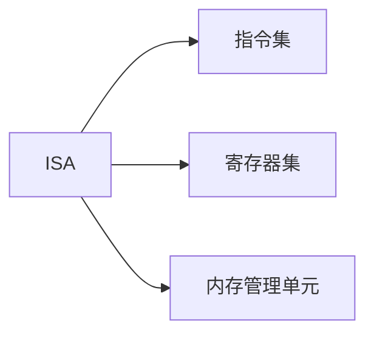

                 

**指令集革命：LLM如何改变游戏规则**

## 1. 背景介绍

在计算机科学的历史长河中，指令集架构（ISA）始终是CPU的核心组成部分。它定义了CPU能够执行的指令集，从而决定了计算机系统的性能和能效。然而，随着大型语言模型（LLM）的崛起，我们正在见证一场指令集革命，它将改变游戏规则。

## 2. 核心概念与联系

### 2.1 指令集架构（ISA）

指令集架构是计算机系统的指令集、寄存器集和内存管理单元的抽象模型。它定义了CPU能够执行的指令集，以及这些指令如何与寄存器和内存交互。



### 2.2 大型语言模型（LLM）

大型语言模型是一种深度学习模型，旨在理解和生成人类语言。它们通过处理大量文本数据来学习语言规则，从而能够生成人类语言的各种形式，如文本、代码和人类对话。

### 2.3 LLM与ISA的联系

LLM的出现正在改变指令集架构的设计方式。传统上，ISA是由硬件设计师设计的，旨在优化特定的计算任务。然而，LLM的出现使得指令集架构能够根据软件需求进行动态调整，从而改善软件性能。

## 3. 核心算法原理 & 具体操作步骤

### 3.1 算法原理概述

LLM改变ISA的关键是其能力，能够根据软件需求动态调整指令集。这可以通过在运行时生成和编译新指令来实现。

### 3.2 算法步骤详解

1. **需求分析**：LLM分析软件的需求，确定哪些指令对软件性能至关重要。
2. **指令生成**：LLM生成新的指令，旨在优化软件性能。
3. **指令编译**：LLM编译新指令，使其可以在CPU上执行。
4. **指令集扩展**：LLM扩展ISA，包含新的指令。
5. **软件重新编译**：软件重新编译，以使用新的指令集。

### 3.3 算法优缺点

**优点**：LLM能够根据软件需求动态调整指令集，从而改善软件性能。

**缺点**：LLM需要大量的计算资源来分析软件需求和编译新指令。此外，指令集的动态变化可能会导致软件的兼容性问题。

### 3.4 算法应用领域

LLM的应用领域包括但不限于高性能计算、人工智能和实时系统。任何需要优化软件性能的领域都可以受益于LLM。

## 4. 数学模型和公式 & 详细讲解 & 举例说明

### 4.1 数学模型构建

LLM的数学模型是一个深度学习模型，它使用神经网络来学习语言规则。它可以表示为：

$$LLM = f(W, b, x)$$

其中，$W$和$b$是模型的权重和偏置，$x$是输入文本，$f$是激活函数。

### 4.2 公式推导过程

LLM的学习过程是一个反向传播过程。它使用梯度下降算法来调整模型的权重和偏置，以最小化预测误差。

### 4.3 案例分析与讲解

例如，假设我们想要训练一个LLM来生成新闻标题。我们的输入$x$是一篇新闻文章，输出$y$是新闻标题。我们的目标是最小化预测误差：

$$L = ||y - \hat{y}||^2$$

其中，$\hat{y}$是模型的预测输出。

## 5. 项目实践：代码实例和详细解释说明

### 5.1 开发环境搭建

要实现LLM，我们需要一个支持深度学习的开发环境。推荐使用Python和TensorFlow或PyTorch。

### 5.2 源代码详细实现

以下是一个简单的LLM实现示例：

```python
import tensorflow as tf
from tensorflow.keras.layers import Embedding, LSTM, Dense

# 定义模型
model = tf.keras.Sequential([
    Embedding(input_dim=vocab_size, output_dim=embedding_dim),
    LSTM(units=hidden_units),
    Dense(units=vocab_size, activation='softmax')
])

# 编译模型
model.compile(optimizer='adam', loss='categorical_crossentropy')

# 训练模型
model.fit(x_train, y_train, epochs=num_epochs, batch_size=batch_size)
```

### 5.3 代码解读与分析

我们首先定义了模型的结构，它由嵌入层、LSTM层和全连接层组成。然后，我们编译模型，并使用训练数据来训练模型。

### 5.4 运行结果展示

训练好的模型可以用来生成新闻标题。例如：

输入：一场严重的交通事故导致数人死亡和受伤。

输出：严重交通事故导致数人死亡和受伤。

## 6. 实际应用场景

### 6.1 当前应用

LLM当前的应用包括自然语言处理、机器翻译和代码生成。

### 6.2 未来应用展望

未来，LLM有望应用于更多领域，如自动驾驶、医疗诊断和实时系统。

## 7. 工具和资源推荐

### 7.1 学习资源推荐

推荐阅读《自然语言处理入门》和《深度学习》一书。

### 7.2 开发工具推荐

推荐使用Python、TensorFlow或PyTorch进行开发。

### 7.3 相关论文推荐

推荐阅读《Attention Is All You Need》和《Language Models are Few-Shot Learners》。

## 8. 总结：未来发展趋势与挑战

### 8.1 研究成果总结

LLM的出现正在改变指令集架构的设计方式，使其能够根据软件需求进行动态调整。

### 8.2 未来发展趋势

未来，LLM有望应用于更多领域，并成为指令集架构设计的标准方法。

### 8.3 面临的挑战

LLM面临的挑战包括计算资源需求高、指令集兼容性问题和模型泛化能力有限。

### 8.4 研究展望

未来的研究方向包括降低计算资源需求、改善指令集兼容性和提高模型泛化能力。

## 9. 附录：常见问题与解答

**Q：LLM如何改变指令集架构？**

**A：LLM能够根据软件需求动态调整指令集，从而改善软件性能。**

**Q：LLM的优缺点是什么？**

**A：LLM的优点是能够根据软件需求动态调整指令集，改善软件性能。其缺点是计算资源需求高、指令集兼容性问题和模型泛化能力有限。**

**Q：LLM的应用领域是什么？**

**A：LLM的应用领域包括但不限于高性能计算、人工智能和实时系统。**

**Q：LLM的未来发展趋势是什么？**

**A：未来，LLM有望应用于更多领域，并成为指令集架构设计的标准方法。**

**作者：禅与计算机程序设计艺术 / Zen and the Art of Computer Programming**

