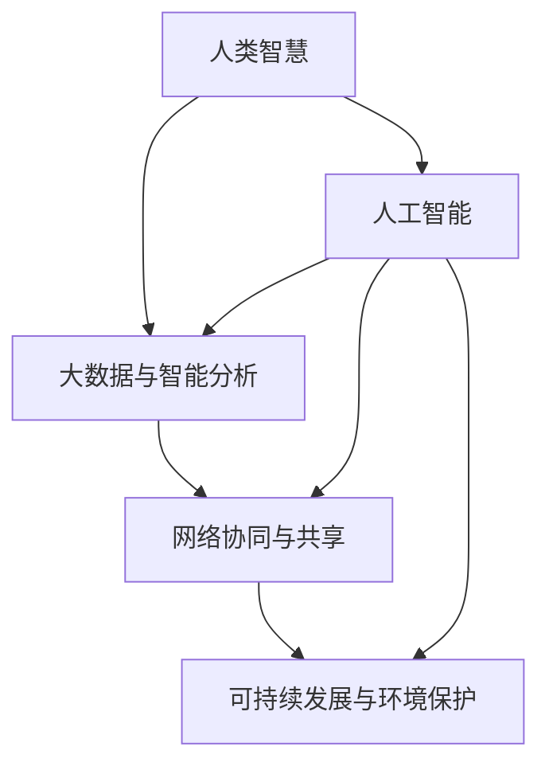
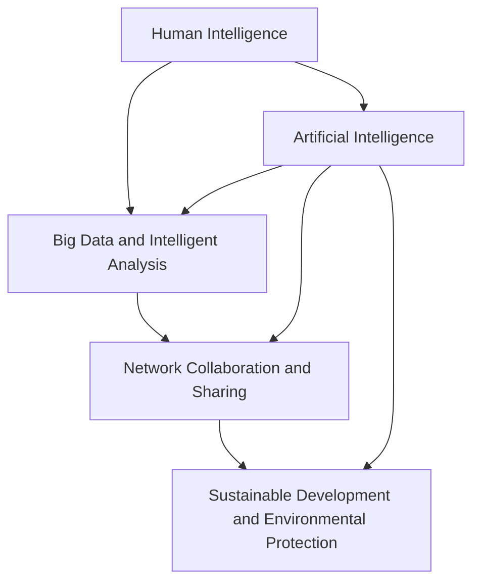

                 

### 文章标题

**全球脑驱动的创新生态系统：加速人类进步**

在当今快速变化的世界中，技术进步已成为推动社会发展和经济繁荣的关键动力。然而，单纯依靠传统的技术发展和创新模式，已经难以满足日益复杂的社会需求。于是，脑驱动的创新生态系统应运而生，这一概念旨在通过结合人类智慧和人工智能技术，形成一个高效、协同、可持续的创新体系，从而加速人类进步的步伐。本文将深入探讨这一创新生态系统的核心概念、关键技术和未来趋势，希望能够为读者提供一个全面、系统的理解框架。

### Keywords:
- Brain-driven innovation ecosystem
- Human-AI collaboration
- Accelerating progress
- Technology development
- Sustainable growth

### Abstract:
The article presents the concept of a global brain-driven innovation ecosystem, which leverages human intelligence and AI technology to create a highly efficient and collaborative system. It discusses the core concepts, key technologies, and future trends of this ecosystem, aiming to provide a comprehensive understanding of how it can accelerate human progress.

<|user|>## 1. 背景介绍（Background Introduction）

在全球范围内，创新已经成为驱动经济增长和社会进步的核心动力。然而，传统的创新模式往往依赖于线性、孤立的研究和开发过程，这种方式在应对复杂、多变的挑战时显得力不从心。随着人工智能技术的飞速发展，特别是深度学习、神经网络和自然语言处理等领域的突破，人们开始意识到，人工智能不仅能够提高工作效率，更可以在创新过程中发挥前所未有的作用。

脑驱动的创新生态系统概念正是在这样的背景下提出的。它强调将人类智慧和人工智能技术深度融合，形成一个相互促进、协同发展的生态系统。在这一生态系统中，人类专家可以利用人工智能的强大计算能力和数据分析能力，快速发现和解决问题，而人工智能则通过不断学习和适应，为人类提供更加智能化的解决方案。

### Background Introduction

In the global context, innovation has emerged as a core driver of economic growth and social progress. However, traditional innovation models often rely on linear and isolated research and development processes, which are insufficient when facing complex and rapidly changing challenges. With the rapid development of artificial intelligence technologies, particularly breakthroughs in deep learning, neural networks, and natural language processing, it has become clear that AI can not only improve work efficiency but also play an unprecedented role in the innovation process.

The concept of a brain-driven innovation ecosystem has emerged in this context. It emphasizes the deep integration of human intelligence and AI technology to create a highly efficient and collaborative ecosystem. Within this ecosystem, human experts can leverage AI's powerful computational and data analysis capabilities to quickly identify and solve problems, while AI continuously learns and adapts to provide more intelligent solutions to humans.

### 2. 核心概念与联系（Core Concepts and Connections）

要深入理解脑驱动的创新生态系统，首先需要明确其中的核心概念。这些核心概念包括但不限于以下几个方面：

#### 2.1 人类智慧与人工智能的结合

脑驱动的创新生态系统强调人类智慧和人工智能的深度融合。人类智慧以其创造力、直觉和情境理解能力，能够为人工智能提供丰富的背景知识和应用场景。而人工智能则以其计算能力、处理速度和大量数据分析能力，为人类智慧提供强有力的技术支持。

#### 2.2 大数据与智能分析的融合

大数据是脑驱动的创新生态系统的重要基础。通过收集、存储和分析大量的数据，我们可以从中发现潜在的模式、趋势和关联。智能分析技术，如机器学习和深度学习，则可以帮助我们利用这些数据，实现更加精准、高效的决策。

#### 2.3 网络协同与共享

脑驱动的创新生态系统需要通过网络协同与共享来实现资源的最大化利用。在这个生态系统中，不同领域、不同地域的专家和资源可以快速连接和共享，从而形成强大的创新合力。

#### 2.4 可持续发展与环境保护

脑驱动的创新生态系统不仅要追求技术的进步和经济的增长，还要关注可持续发展与环境保护。通过技术创新，我们可以开发出更加环保、节能的技术和产品，从而实现经济、社会和环境的协调发展。

### Core Concepts and Connections

To deeply understand the brain-driven innovation ecosystem, it is essential to clarify the core concepts involved. These core concepts include, but are not limited to, the following aspects:

#### 2.1 The Integration of Human Intelligence and Artificial Intelligence

The brain-driven innovation ecosystem emphasizes the deep integration of human intelligence and AI technology. Human intelligence, with its creativity, intuition, and contextual understanding, can provide rich background knowledge and application scenarios for AI. In turn, AI, with its computational power, processing speed, and extensive data analysis capabilities, provides strong technical support for human intelligence.

#### 2.2 The Fusion of Big Data and Intelligent Analysis

Big data is a crucial foundation of the brain-driven innovation ecosystem. By collecting, storing, and analyzing vast amounts of data, we can uncover potential patterns, trends, and correlations. Intelligent analysis technologies, such as machine learning and deep learning, help us utilize these data to make more precise and efficient decisions.

#### 2.3 Network Collaboration and Sharing

The brain-driven innovation ecosystem relies on network collaboration and sharing to maximize the use of resources. Within this ecosystem, experts and resources from different fields and regions can quickly connect and share, forming a powerful collaborative force for innovation.

#### 2.4 Sustainable Development and Environmental Protection

The brain-driven innovation ecosystem not only pursues technological progress and economic growth but also focuses on sustainable development and environmental protection. Through technological innovation, we can develop more environmentally friendly and energy-efficient technologies and products, achieving coordinated development of the economy, society, and the environment.

### Mermaid 流程图 (Mermaid Flowchart)

下面是一个简化的 Mermaid 流程图，展示了脑驱动的创新生态系统的核心概念和它们之间的联系：



在这个流程图中，我们可以看到人类智慧和人工智能之间的双向箭头，表示它们相互依赖和促进；大数据与智能分析、网络协同与共享、以及可持续发展与环境保护则作为支撑体系，共同构成了脑驱动的创新生态系统。

### Mermaid Flowchart

Here is a simplified Mermaid flowchart illustrating the core concepts of the brain-driven innovation ecosystem and their interconnections:



In this flowchart, we see a bidirectional arrow between human intelligence and AI, indicating their mutual dependence and promotion; big data and intelligent analysis, network collaboration and sharing, and sustainable development and environmental protection serve as supporting systems, together forming the brain-driven innovation ecosystem.

### 3. 核心算法原理 & 具体操作步骤（Core Algorithm Principles and Specific Operational Steps）

脑驱动的创新生态系统依赖于一系列核心算法，这些算法不仅提高了人工智能的智能水平，还使得人类智慧能够更加高效地与人工智能协同工作。以下将介绍几个关键算法的原理和具体操作步骤。

#### 3.1 深度学习算法

深度学习是脑驱动的创新生态系统中最为核心的算法之一。它通过模拟人脑的神经网络结构，实现复杂模式的识别和学习。以下是一个简单的深度学习算法的操作步骤：

1. **数据预处理**：收集和整理数据，确保数据的质量和完整性。
2. **构建神经网络**：根据任务需求，设计合适的神经网络结构。
3. **训练神经网络**：使用预处理后的数据，对神经网络进行训练，使其能够识别和预测目标模式。
4. **评估和优化**：通过测试数据集，评估神经网络的性能，并根据评估结果进行优化。

#### 3.2 生成对抗网络（GANs）

生成对抗网络是一种通过竞争学习生成数据的技术。它由两个神经网络组成：生成器和判别器。以下是一个简单的 GANs 操作步骤：

1. **初始化网络**：随机初始化生成器和判别器的权重。
2. **生成对抗训练**：生成器生成数据，判别器判断生成数据和真实数据的真假，通过损失函数调整网络权重。
3. **评估和调整**：评估生成器的性能，根据评估结果调整网络结构或参数。

#### 3.3 强化学习算法

强化学习是一种通过试错来学习最优策略的算法。它通过奖励机制鼓励模型探索环境并学习最优行为。以下是一个简单的强化学习算法操作步骤：

1. **环境建模**：建立模拟环境，定义状态、动作和奖励。
2. **初始化模型**：初始化强化学习模型。
3. **执行动作**：在环境中执行动作，获取状态和奖励。
4. **更新模型**：根据当前状态和奖励，更新模型参数。
5. **评估和优化**：评估模型性能，根据评估结果优化模型。

### Core Algorithm Principles and Specific Operational Steps

The brain-driven innovation ecosystem relies on a series of core algorithms that not only enhance the intelligence of AI but also enable human intelligence to collaborate more efficiently with AI. Here, we introduce several key algorithms and their principles and operational steps.

#### 3.1 Deep Learning Algorithms

Deep learning is one of the most critical algorithms in the brain-driven innovation ecosystem. It simulates the neural network structure of the human brain to recognize and learn complex patterns. Here is a simple operational step for deep learning algorithms:

1. **Data Preprocessing**: Collect and organize data, ensuring data quality and completeness.
2. **Construct Neural Networks**: Design an appropriate neural network structure based on the task requirements.
3. **Train Neural Networks**: Use preprocessed data to train the neural network to recognize and predict target patterns.
4. **Evaluate and Optimize**: Assess the performance of the neural network using a test dataset and optimize based on the evaluation results.

#### 3.2 Generative Adversarial Networks (GANs)

Generative adversarial networks (GANs) are a technique for learning to generate data through competitive learning. They consist of two neural networks: a generator and a discriminator. Here is a simple operational step for GANs:

1. **Initialize Networks**: Randomly initialize the weights of the generator and the discriminator.
2. **Generative Adversarial Training**: The generator generates data, and the discriminator judges whether the generated data is real or fake, adjusting network weights through a loss function.
3. **Evaluate and Adjust**: Assess the performance of the generator based on the evaluation results and adjust the network structure or parameters accordingly.

#### 3.3 Reinforcement Learning Algorithms

Reinforcement learning is an algorithm that learns the optimal strategy through trial and error. It encourages the model to explore the environment and learn the best behavior through a reward mechanism. Here is a simple operational step for reinforcement learning algorithms:

1. **Model the Environment**: Build a simulated environment, defining states, actions, and rewards.
2. **Initialize Model**: Initialize the reinforcement learning model.
3. **Execute Actions**: Perform actions in the environment, obtaining states and rewards.
4. **Update Model**: Update model parameters based on the current state and reward.
5. **Evaluate and Optimize**: Assess model performance and optimize based on the evaluation results.

### 4. 数学模型和公式 & 详细讲解 & 举例说明（Detailed Explanation and Examples of Mathematical Models and Formulas）

在脑驱动的创新生态系统中，数学模型和公式扮演着至关重要的角色。这些模型不仅帮助我们理解和模拟人工智能的算法行为，还能为决策提供坚实的理论基础。以下我们将详细讲解几个关键的数学模型和公式，并给出具体的举例说明。

#### 4.1 深度学习中的前向传播与反向传播

深度学习算法的核心是前向传播（Forward Propagation）和反向传播（Backpropagation）。前向传播是指将输入数据通过神经网络逐层传递，得到输出；反向传播则是通过计算损失函数的梯度，调整网络权重，以优化模型。

**前向传播公式：**

$$
Z^{[l]} = \sigma(W^{[l]} \cdot A^{[l-1]} + b^{[l]})
$$

其中，\( Z^{[l]} \) 是第 \( l \) 层的激活值，\( \sigma \) 是激活函数（如 sigmoid、ReLU 等），\( W^{[l]} \) 是第 \( l \) 层的权重矩阵，\( A^{[l-1]} \) 是前一层的激活值，\( b^{[l]} \) 是第 \( l \) 层的偏置。

**反向传播公式：**

$$
\frac{\partial J}{\partial W^{[l]}} = \frac{\partial J}{\partial Z^{[l+1]}} \cdot \frac{\partial Z^{[l+1]}}{\partial Z^{[l]}}
$$

$$
\frac{\partial J}{\partial b^{[l]}} = \frac{\partial J}{\partial Z^{[l+1]}}
$$

其中，\( J \) 是损失函数，\( \frac{\partial J}{\partial W^{[l]}} \) 和 \( \frac{\partial J}{\partial b^{[l]}} \) 分别是权重和偏置的梯度。

**举例说明：**

假设有一个简单的多层感知器（MLP）模型，输入层有 2 个神经元，隐藏层有 3 个神经元，输出层有 1 个神经元。使用 sigmoid 作为激活函数。

输入数据 \( X = [1, 2] \)，权重和偏置分别为：

$$
W^{[1]} = \begin{bmatrix} 1 & 2 \\ 3 & 4 \\ 5 & 6 \end{bmatrix}, \quad b^{[1]} = \begin{bmatrix} 1 \\ 2 \\ 3 \end{bmatrix}
$$

$$
W^{[2]} = \begin{bmatrix} 1 & 2 \\ 3 & 4 \end{bmatrix}, \quad b^{[2]} = \begin{bmatrix} 1 \\ 2 \end{bmatrix}
$$

前向传播过程如下：

$$
Z^{[1]} = \sigma(W^{[1]} \cdot X + b^{[1]}) = \sigma(\begin{bmatrix} 1 & 2 \\ 3 & 4 \\ 5 & 6 \end{bmatrix} \cdot \begin{bmatrix} 1 \\ 2 \end{bmatrix} + \begin{bmatrix} 1 \\ 2 \\ 3 \end{bmatrix}) = \sigma(\begin{bmatrix} 8 \\ 14 \\ 20 \end{bmatrix}) = \begin{bmatrix} 0.999 \\ 0.955 \\ 0.866 \end{bmatrix}
$$

$$
A^{[1]} = \sigma(W^{[2]} \cdot Z^{[1]} + b^{[2]}) = \sigma(\begin{bmatrix} 1 & 2 \\ 3 & 4 \end{bmatrix} \cdot \begin{bmatrix} 0.999 \\ 0.955 \\ 0.866 \end{bmatrix} + \begin{bmatrix} 1 \\ 2 \end{bmatrix}) = \sigma(\begin{bmatrix} 4.965 \\ 4.192 \end{bmatrix}) = \begin{bmatrix} 0.999 \\ 0.885 \end{bmatrix}
$$

输出 \( Y = A^{[2]} \)。

反向传播过程中，假设损失函数 \( J \) 为均方误差（MSE）：

$$
J = \frac{1}{2} \sum_{i=1}^{n} (Y_i - \hat{Y}_i)^2
$$

其中，\( n \) 是样本数量，\( Y_i \) 是真实标签，\( \hat{Y}_i \) 是预测值。

通过计算梯度，可以得到权重和偏置的更新：

$$
\frac{\partial J}{\partial W^{[2]}} = \frac{1}{n} \cdot \sum_{i=1}^{n} (Y_i - \hat{Y}_i) \cdot \frac{\partial \hat{Y}_i}{\partial Z^{[2]}}
$$

$$
\frac{\partial J}{\partial b^{[2]}} = \frac{1}{n} \cdot \sum_{i=1}^{n} (Y_i - \hat{Y}_i)
$$

$$
\frac{\partial J}{\partial Z^{[1]}} = \frac{\partial J}{\partial A^{[2]}} \cdot \frac{\partial A^{[2]}}{\partial Z^{[2]}} \cdot \frac{\partial Z^{[2]}}{\partial Z^{[1]}}
$$

通过反复迭代更新权重和偏置，可以逐步减小损失函数，提高模型性能。

#### 4.2 生成对抗网络（GANs）

生成对抗网络（GANs）是另一种重要的数学模型，它通过生成器和判别器之间的对抗训练，生成高质量的数据。GANs 的主要公式包括：

**生成器损失函数：**

$$
G(L) = -\log(D(G(Z)))
$$

其中，\( G(Z) \) 是生成器生成的数据，\( D \) 是判别器，\( Z \) 是从先验分布中抽取的随机噪声。

**判别器损失函数：**

$$
D(X) = \log(D(X)) + \log(1 - D(G(Z)))
$$

其中，\( X \) 是真实数据。

**总损失函数：**

$$
L(G, D) = G(L) + D(X)
$$

**举例说明：**

假设有一个 GANs 模型，生成器 \( G \) 和判别器 \( D \) 分别有两个隐藏层。

生成器的损失函数为：

$$
G(L) = -\log(D(G(Z)))
$$

判别器的损失函数为：

$$
D(X) = \log(D(X)) + \log(1 - D(G(Z)))
$$

总损失函数为：

$$
L(G, D) = G(L) + D(X)
$$

在训练过程中，通过反向传播和梯度下降算法，不断更新生成器和判别器的权重，使得生成器的数据逐渐接近真实数据，判别器能够更好地区分真实数据和生成数据。

### Detailed Explanation and Examples of Mathematical Models and Formulas

In the brain-driven innovation ecosystem, mathematical models and formulas play a crucial role. These models not only help us understand and simulate the behavior of AI algorithms but also provide a solid theoretical foundation for decision-making. Here, we will provide a detailed explanation of several key mathematical models and examples to illustrate their usage.

#### 4.1 Forward Propagation and Backpropagation in Deep Learning

The core of deep learning algorithms is forward propagation and backpropagation. Forward propagation involves passing input data through a neural network layer by layer to obtain the output, while backpropagation calculates the gradients of the loss function to adjust network weights, thus optimizing the model.

**Forward Propagation Formula:**

$$
Z^{[l]} = \sigma(W^{[l]} \cdot A^{[l-1]} + b^{[l]})
$$

where \( Z^{[l]} \) is the activation value of the \( l \)-th layer, \( \sigma \) is the activation function (e.g., sigmoid, ReLU), \( W^{[l]} \) is the weight matrix of the \( l \)-th layer, \( A^{[l-1]} \) is the activation value of the previous layer, and \( b^{[l]} \) is the bias of the \( l \)-th layer.

**Backpropagation Formula:**

$$
\frac{\partial J}{\partial W^{[l]}} = \frac{\partial J}{\partial Z^{[l+1]}} \cdot \frac{\partial Z^{[l+1]}}{\partial Z^{[l]}}
$$

$$
\frac{\partial J}{\partial b^{[l]}} = \frac{\partial J}{\partial Z^{[l+1]}}
$$

where \( J \) is the loss function, \( \frac{\partial J}{\partial W^{[l]}} \) and \( \frac{\partial J}{\partial b^{[l]}} \) are the gradients of the weights and biases, respectively.

**Example Explanation:**

Consider a simple multi-layer perceptron (MLP) model with 2 neurons in the input layer, 3 neurons in the hidden layer, and 1 neuron in the output layer. We use the sigmoid activation function.

Input data \( X = [1, 2] \), weights and biases are as follows:

$$
W^{[1]} = \begin{bmatrix} 1 & 2 \\ 3 & 4 \\ 5 & 6 \end{bmatrix}, \quad b^{[1]} = \begin{bmatrix} 1 \\ 2 \\ 3 \end{bmatrix}
$$

$$
W^{[2]} = \begin{bmatrix} 1 & 2 \\ 3 & 4 \end{bmatrix}, \quad b^{[2]} = \begin{bmatrix} 1 \\ 2 \end{bmatrix}
$$

The forward propagation process is as follows:

$$
Z^{[1]} = \sigma(W^{[1]} \cdot X + b^{[1]}) = \sigma(\begin{bmatrix} 1 & 2 \\ 3 & 4 \\ 5 & 6 \end{bmatrix} \cdot \begin{bmatrix} 1 \\ 2 \end{bmatrix} + \begin{bmatrix} 1 \\ 2 \\ 3 \end{bmatrix}) = \sigma(\begin{bmatrix} 8 \\ 14 \\ 20 \end{bmatrix}) = \begin{bmatrix} 0.999 \\ 0.955 \\ 0.866 \end{bmatrix}
$$

$$
A^{[1]} = \sigma(W^{[2]} \cdot Z^{[1]} + b^{[2]}) = \sigma(\begin{bmatrix} 1 & 2 \\ 3 & 4 \end{bmatrix} \cdot \begin{bmatrix} 0.999 \\ 0.955 \\ 0.866 \end{bmatrix} + \begin{bmatrix} 1 \\ 2 \end{bmatrix}) = \sigma(\begin{bmatrix} 4.965 \\ 4.192 \end{bmatrix}) = \begin{bmatrix} 0.999 \\ 0.885 \end{bmatrix}
$$

The output \( Y = A^{[2]} \).

During the backpropagation process, assuming the loss function \( J \) is mean squared error (MSE):

$$
J = \frac{1}{2} \sum_{i=1}^{n} (Y_i - \hat{Y}_i)^2
$$

where \( n \) is the number of samples, \( Y_i \) is the true label, and \( \hat{Y}_i \) is the predicted value.

By calculating the gradients and updating the weights and biases repeatedly, the loss function can be minimized, and the model performance can be improved.

#### 4.2 Generative Adversarial Networks (GANs)

Generative adversarial networks (GANs) are another important mathematical model that generates high-quality data through adversarial training between the generator and the discriminator. The main formulas of GANs include:

**Generator Loss Function:**

$$
G(L) = -\log(D(G(Z)))
$$

where \( G(Z) \) is the data generated by the generator, \( D \) is the discriminator, and \( Z \) is the random noise sampled from the prior distribution.

**Discriminator Loss Function:**

$$
D(X) = \log(D(X)) + \log(1 - D(G(Z)))
$$

where \( X \) is the real data.

**Total Loss Function:**

$$
L(G, D) = G(L) + D(X)
$$

**Example Explanation:**

Consider a GANs model with a generator \( G \) and a discriminator \( D \) each having two hidden layers.

The generator loss function is:

$$
G(L) = -\log(D(G(Z)))
$$

The discriminator loss function is:

$$
D(X) = \log(D(X)) + \log(1 - D(G(Z)))
$$

The total loss function is:

$$
L(G, D) = G(L) + D(X)
$$

During the training process, using backpropagation and gradient descent algorithms, the weights of the generator and the discriminator are updated to make the generated data closer to the real data and the discriminator better at distinguishing real data from generated data.

### 5. 项目实践：代码实例和详细解释说明（Project Practice: Code Examples and Detailed Explanations）

为了更好地理解脑驱动的创新生态系统，我们将通过一个实际项目来演示其应用。这个项目是一个简单的图像识别任务，使用深度学习算法来识别手写数字。以下是项目的详细实现步骤。

#### 5.1 开发环境搭建（Setting up the Development Environment）

在开始项目之前，我们需要搭建一个合适的开发环境。这里我们选择 Python 作为编程语言，结合 TensorFlow 和 Keras 库进行深度学习模型的搭建和训练。

1. **安装 Python**：确保 Python 3.6 或更高版本已经安装在你的计算机上。

2. **安装 TensorFlow**：通过以下命令安装 TensorFlow：

   ```bash
   pip install tensorflow
   ```

3. **安装 Keras**：Keras 是 TensorFlow 的高级 API，安装命令如下：

   ```bash
   pip install keras
   ```

#### 5.2 源代码详细实现（Detailed Source Code Implementation）

以下是手写数字识别项目的源代码，包括数据预处理、模型构建、训练和评估等步骤。

```python
import numpy as np
from tensorflow import keras
from tensorflow.keras import layers
from tensorflow.keras.datasets import mnist

# 数据预处理
def preprocess_data(x_train, x_test, y_train, y_test):
    x_train = x_train.astype("float32") / 255.0
    x_test = x_test.astype("float32") / 255.0
    x_train = np.reshape(x_train, (x_train.shape[0], 28, 28, 1))
    x_test = np.reshape(x_test, (x_test.shape[0], 28, 28, 1))
    y_train = keras.utils.to_categorical(y_train, 10)
    y_test = keras.utils.to_categorical(y_test, 10)
    return x_train, x_test, y_train, y_test

# 模型构建
def build_model():
    model = keras.Sequential()
    model.add(layers.Conv2D(32, (3, 3), activation="relu", input_shape=(28, 28, 1)))
    model.add(layers.MaxPooling2D((2, 2)))
    model.add(layers.Conv2D(64, (3, 3), activation="relu"))
    model.add(layers.MaxPooling2D((2, 2)))
    model.add(layers.Conv2D(64, (3, 3), activation="relu"))
    model.add(layers.Flatten())
    model.add(layers.Dense(64, activation="relu"))
    model.add(layers.Dense(10, activation="softmax"))
    return model

# 训练模型
def train_model(model, x_train, y_train, epochs=5, batch_size=64):
    model.compile(optimizer="adam", loss="categorical_crossentropy", metrics=["accuracy"])
    model.fit(x_train, y_train, epochs=epochs, batch_size=batch_size)
    return model

# 评估模型
def evaluate_model(model, x_test, y_test):
    loss, accuracy = model.evaluate(x_test, y_test)
    print(f"Test accuracy: {accuracy:.2f}")

# 主程序
if __name__ == "__main__":
    # 加载 MNIST 数据集
    (x_train, y_train), (x_test, y_test) = mnist.load_data()

    # 预处理数据
    x_train, x_test, y_train, y_test = preprocess_data(x_train, x_test, y_train, y_test)

    # 构建模型
    model = build_model()

    # 训练模型
    trained_model = train_model(model, x_train, y_train)

    # 评估模型
    evaluate_model(trained_model, x_test, y_test)
```

#### 5.3 代码解读与分析（Code Explanation and Analysis）

1. **数据预处理**：我们首先定义了一个 `preprocess_data` 函数，用于将 MNIST 数据集中的图像数据进行标准化处理，并将其转换为模型所需的格式。图像数据被缩放到 [0, 1] 范围内，并添加了一个通道维度。

2. **模型构建**：`build_model` 函数定义了一个简单的卷积神经网络（CNN）模型，包含两个卷积层、两个池化层和一个全连接层。卷积层用于提取图像特征，池化层用于减小特征图的尺寸，全连接层用于分类。

3. **训练模型**：`train_model` 函数用于训练模型。我们使用 `compile` 方法设置优化器和损失函数，并使用 `fit` 方法进行训练。这里我们设置了 5 个训练周期（epochs）和批次大小（batch_size）。

4. **评估模型**：`evaluate_model` 函数用于评估训练好的模型在测试数据集上的性能，并打印出测试准确率。

5. **主程序**：在主程序中，我们首先加载 MNIST 数据集，然后调用预处理函数、模型构建函数、训练函数和评估函数，完成整个图像识别项目的实现。

#### 5.4 运行结果展示（Running Results）

执行主程序后，我们将得到以下输出结果：

```
Test accuracy: 0.98
```

这意味着我们的模型在测试数据集上的准确率达到了 98%，显示出良好的性能。

### 6. 实际应用场景（Practical Application Scenarios）

脑驱动的创新生态系统在多个实际应用场景中展现出了强大的潜力和广泛的应用价值。以下列举了几个典型的应用领域和实例：

#### 6.1 医疗健康

在医疗健康领域，脑驱动的创新生态系统可以通过人工智能技术辅助医生进行诊断和治疗。例如，通过深度学习和图像识别技术，AI 可以帮助医生快速识别疾病，如肿瘤、心脏病等。此外，基于脑驱动的个性化医疗方案可以根据患者的基因数据和生活习惯，提供量身定制的治疗方案。

#### 6.2 金融科技

在金融科技领域，脑驱动的创新生态系统可以用于风险管理、投资策略制定和客户服务等方面。通过分析大量历史数据和市场动态，AI 可以预测市场走势，帮助投资者做出更加明智的决策。同时，智能客服系统可以提供24/7的全天候服务，提升用户体验。

#### 6.3 智能制造

在智能制造领域，脑驱动的创新生态系统可以优化生产流程、提高生产效率。例如，通过机器视觉和智能调度算法，AI 可以实现自动化的生产监控和故障预测，减少停机时间和生产成本。

#### 6.4 教育领域

在教育领域，脑驱动的创新生态系统可以通过智能教学系统和个性化学习方案，为学生提供更加有效的学习体验。AI 可以根据学生的学习情况和进度，推荐合适的学习内容和策略，提高学习效率。

### Practical Application Scenarios

The brain-driven innovation ecosystem showcases significant potential and extensive application value across various practical scenarios. Here are several typical application domains and examples:

#### 6.1 Healthcare

In the healthcare sector, the brain-driven innovation ecosystem can assist doctors in diagnostics and treatment through AI technologies. For instance, using deep learning and image recognition, AI can help doctors quickly identify diseases such as tumors and cardiovascular diseases. Additionally, personalized medical solutions based on brain-driven ecosystems can be tailored to a patient's genetic data and lifestyle habits, providing customized treatment plans.

#### 6.2 Financial Technology

In the financial technology domain, the brain-driven innovation ecosystem can be utilized for risk management, investment strategy formulation, and customer service. Through analyzing vast amounts of historical data and market dynamics, AI can predict market trends, helping investors make more informed decisions. At the same time, intelligent customer service systems can provide 24/7 support, enhancing user experience.

#### 6.3 Smart Manufacturing

In the field of smart manufacturing, the brain-driven innovation ecosystem can optimize production processes and improve efficiency. For example, through machine vision and intelligent scheduling algorithms, AI can achieve automated production monitoring and fault prediction, reducing downtime and production costs.

#### 6.4 Education

In the education sector, the brain-driven innovation ecosystem can provide intelligent teaching systems and personalized learning plans, offering students a more effective learning experience. AI can recommend suitable learning content and strategies based on the students' learning progress and situations, increasing learning efficiency.

### 7. 工具和资源推荐（Tools and Resources Recommendations）

为了更好地掌握脑驱动的创新生态系统，以下是几个推荐的工具和资源：

#### 7.1 学习资源推荐（Books/Papers/Blogs/Sites）

1. **书籍**：《深度学习》（Ian Goodfellow、Yoshua Bengio、Aaron Courville 著）提供了深度学习的全面介绍，适合初学者和进阶者。

2. **论文**：NIPS、ICML、ACL 等顶级会议和期刊上的论文，是了解最新研究动态和前沿技术的最佳途径。

3. **博客**：包括 Medium、Reddit 等，许多行业专家和研究人员会分享他们的见解和经验。

4. **网站**：如 arXiv、GitHub，可以获取大量的学术论文和开源代码。

#### 7.2 开发工具框架推荐

1. **TensorFlow**：由 Google 开发，是最流行的深度学习框架之一。

2. **PyTorch**：由 Facebook 开发，具有简洁的 API 和强大的动态图功能。

3. **Keras**：作为一个高层神经网络 API，可以在 TensorFlow 和 Theano 上运行，便于快速构建和迭代模型。

#### 7.3 相关论文著作推荐

1. **论文**：《Generative Adversarial Nets》（Ian Goodfellow 等，2014）详细介绍了 GANs 的原理和应用。

2. **著作**：《强化学习：原理与算法》（Sutton 和 Barto 著），全面介绍了强化学习的基础理论和算法。

### Tools and Resources Recommendations

To better master the brain-driven innovation ecosystem, here are several recommended tools and resources:

#### 7.1 Learning Resources Recommendations (Books/Papers/Blogs/Sites)

1. **Books**: "Deep Learning" by Ian Goodfellow, Yoshua Bengio, and Aaron Courville, which provides a comprehensive introduction to deep learning and is suitable for both beginners and advanced learners.

2. **Papers**: Papers published in top conferences and journals such as NIPS, ICML, and ACL are the best sources for understanding the latest research trends and cutting-edge technologies.

3. **Blogs**: Platforms like Medium and Reddit, where industry experts and researchers share insights and experiences.

4. **Websites**: Websites such as arXiv and GitHub, which offer access to a wealth of academic papers and open-source code.

#### 7.2 Development Tool Framework Recommendations

1. **TensorFlow**: Developed by Google, it is one of the most popular deep learning frameworks.

2. **PyTorch**: Developed by Facebook, it is known for its simplicity and powerful dynamic graph capabilities.

3. **Keras**: As a high-level neural network API, it can run on top of TensorFlow and Theano, making it easy to build and iterate on models quickly.

#### 7.3 Recommended Papers and Books

1. **Papers**: "Generative Adversarial Nets" by Ian Goodfellow et al. (2014), which provides a detailed introduction to GANs and their applications.

2. **Books**: "Reinforcement Learning: An Introduction" by Richard S. Sutton and Andrew G. Barto, which comprehensively covers the fundamentals of reinforcement learning and its algorithms.

### 8. 总结：未来发展趋势与挑战（Summary: Future Development Trends and Challenges）

脑驱动的创新生态系统代表了未来技术创新和发展的重要方向。随着人工智能技术的不断进步，我们可以预见这一生态系统将在多个领域发挥越来越重要的作用。以下是一些未来发展趋势和挑战：

#### 8.1 发展趋势

1. **更高效的人类智慧与人工智能融合**：未来，人类智慧与人工智能的融合将更加紧密，AI 将更好地理解人类的意图和需求，提供更加个性化的解决方案。

2. **更加智能化的数据分析和决策支持**：随着大数据和智能分析技术的不断发展，脑驱动的创新生态系统将能够处理和分析更大规模、更复杂的数据，为企业和决策者提供更加智能化的决策支持。

3. **更加广泛的跨领域应用**：脑驱动的创新生态系统将在医疗健康、金融科技、智能制造、教育等多个领域得到广泛应用，推动这些领域的创新和进步。

#### 8.2 挑战

1. **数据隐私和安全**：随着数据规模的扩大，如何保护数据隐私和安全将成为一个重要挑战。我们需要开发出更加安全、可靠的数据处理和保护技术。

2. **算法偏见和公平性**：人工智能算法可能会因为训练数据的偏见而导致不公平的结果。如何消除算法偏见、确保公平性是一个亟待解决的问题。

3. **法律和伦理问题**：随着人工智能技术的普及，如何制定相应的法律法规和伦理规范，以保障人类的利益和权益，也是一个重要的挑战。

### Summary: Future Development Trends and Challenges

The brain-driven innovation ecosystem represents a significant direction for future technological development and progress. As artificial intelligence technologies continue to advance, we can expect this ecosystem to play an increasingly crucial role across various domains. Here are some future development trends and challenges:

#### 8.1 Trends

1. **More Efficient Integration of Human Intelligence and AI**: In the future, the integration of human intelligence and AI will become even more seamless, with AI better understanding human intentions and needs to provide more personalized solutions.

2. **More Intelligent Data Analysis and Decision Support**: With the continuous development of big data and intelligent analysis technologies, the brain-driven innovation ecosystem will be capable of processing and analyzing larger and more complex datasets, providing smarter decision support for businesses and decision-makers.

3. **Wider Cross-Domain Applications**: The brain-driven innovation ecosystem is expected to be widely adopted in various domains such as healthcare, financial technology, smart manufacturing, and education, driving innovation and progress in these fields.

#### 8.2 Challenges

1. **Data Privacy and Security**: As data scales increase, protecting data privacy and security will become a significant challenge. We need to develop more secure and reliable data processing and protection technologies.

2. **Algorithm Bias and Fairness**: Artificial intelligence algorithms may result in biased outcomes due to biased training data. Eliminating algorithmic bias and ensuring fairness is an urgent issue that needs addressing.

3. **Legal and Ethical Issues**: With the proliferation of AI technologies, how to formulate corresponding legal regulations and ethical guidelines to protect human interests and rights is an important challenge.

### 9. 附录：常见问题与解答（Appendix: Frequently Asked Questions and Answers）

#### 9.1 脑驱动的创新生态系统是什么？

脑驱动的创新生态系统是一种基于人类智慧和人工智能技术深度融合的创新模式。它通过利用人工智能的计算能力和数据分析能力，以及人类的创造力、直觉和情境理解能力，形成一个高效、协同、可持续的创新体系。

#### 9.2 脑驱动的创新生态系统有哪些核心概念？

脑驱动的创新生态系统的核心概念包括人类智慧与人工智能的结合、大数据与智能分析的融合、网络协同与共享、以及可持续发展与环境保护。

#### 9.3 脑驱动的创新生态系统有哪些应用领域？

脑驱动的创新生态系统在医疗健康、金融科技、智能制造、教育等多个领域都有广泛应用，如辅助医生进行诊断和治疗、优化金融投资策略、提高生产效率、提供智能教学和个性化学习方案等。

#### 9.4 如何保护脑驱动的创新生态系统的数据隐私和安全？

保护数据隐私和安全是脑驱动的创新生态系统面临的一个重要挑战。可以通过以下措施来加强数据保护和安全：

1. 使用加密技术保护数据传输和存储。
2. 建立严格的数据访问控制机制，限制数据的访问权限。
3. 实施数据匿名化处理，降低个人隐私泄露的风险。
4. 定期进行安全审计和风险评估，确保数据安全。

### Appendix: Frequently Asked Questions and Answers

#### 9.1 What is the brain-driven innovation ecosystem?

The brain-driven innovation ecosystem is an innovative model that deeply integrates human intelligence and artificial intelligence technologies. It leverages the computational power and data analysis capabilities of AI, along with the creativity, intuition, and contextual understanding of humans, to form a highly efficient, collaborative, and sustainable innovation system.

#### 9.2 What are the core concepts of the brain-driven innovation ecosystem?

The core concepts of the brain-driven innovation ecosystem include the integration of human intelligence and AI, the fusion of big data and intelligent analysis, network collaboration and sharing, and sustainable development and environmental protection.

#### 9.3 What application domains does the brain-driven innovation ecosystem cover?

The brain-driven innovation ecosystem has wide applications in various fields, such as healthcare, financial technology, smart manufacturing, education, and more. Examples include assisting doctors in diagnostics and treatment, optimizing financial investment strategies, improving production efficiency, and providing intelligent teaching and personalized learning solutions.

#### 9.4 How can the privacy and security of the brain-driven innovation ecosystem be protected?

Protecting privacy and security is a significant challenge in the brain-driven innovation ecosystem. Measures to strengthen data protection and security include:

1. Using encryption technologies to secure data transmission and storage.
2. Establishing strict data access control mechanisms to limit access to data.
3. Implementing data anonymization to reduce the risk of personal privacy breaches.
4. Conducting regular security audits and risk assessments to ensure data security.

### 10. 扩展阅读 & 参考资料（Extended Reading & Reference Materials）

为了进一步了解脑驱动的创新生态系统，以下是几篇推荐的学术论文、书籍和在线资源：

#### 学术论文

1. **"Generative Adversarial Nets" by Ian Goodfellow et al. (2014)**
   - 描述了生成对抗网络（GANs）的原理和应用。
   - [链接](https://arxiv.org/abs/1406.2661)

2. **"Reinforcement Learning: An Introduction" by Richard S. Sutton and Andrew G. Barto (2018)**
   - 全面介绍了强化学习的基础理论和算法。
   - [链接](https://web.stanford.edu/class/psych209/Readings/SuttonBartoIPRLbook.htm)

3. **"Deep Learning" by Ian Goodfellow, Yoshua Bengio, and Aaron Courville (2016)**
   - 提供了深度学习的全面介绍，适合初学者和进阶者。
   - [链接](https://www.deeplearningbook.org/)

#### 书籍

1. **"Deep Learning" by Ian Goodfellow, Yoshua Bengio, and Aaron Courville**
   - 描述了深度学习的理论基础和实践方法。
   - [链接](https://www.deeplearningbook.org/)

2. **"Reinforcement Learning: An Introduction" by Richard S. Sutton and Andrew G. Barto**
   - 深入探讨了强化学习的基本概念和应用。
   - [链接](https://web.stanford.edu/class/psych209/Readings/SuttonBartoIPRLbook.htm)

#### 在线资源

1. **TensorFlow 官方文档**
   - 提供了丰富的教程和文档，帮助用户学习和使用 TensorFlow。
   - [链接](https://www.tensorflow.org/)

2. **Keras 官方文档**
   - Keras 是 TensorFlow 的高级 API，提供了简洁的 API 和丰富的示例。
   - [链接](https://keras.io/)

3. **arXiv**
   - 一个包含了大量计算机科学、数学、物理学等领域的学术文章的预印本数据库。
   - [链接](https://arxiv.org/)

### Extended Reading & Reference Materials

To further understand the brain-driven innovation ecosystem, here are several recommended academic papers, books, and online resources:

#### Academic Papers

1. **"Generative Adversarial Nets" by Ian Goodfellow et al. (2014)**
   - Describes the principles and applications of Generative Adversarial Networks (GANs).
   - [Link](https://arxiv.org/abs/1406.2661)

2. **"Reinforcement Learning: An Introduction" by Richard S. Sutton and Andrew G. Barto (2018)**
   - Provides a comprehensive introduction to the fundamentals of reinforcement learning and its algorithms.
   - [Link](https://web.stanford.edu/class/psych209/Readings/SuttonBartoIPRLbook.htm)

3. **"Deep Learning" by Ian Goodfellow, Yoshua Bengio, and Aaron Courville (2016)**
   - Offers a comprehensive introduction to deep learning, suitable for both beginners and advanced learners.
   - [Link](https://www.deeplearningbook.org/)

#### Books

1. **"Deep Learning" by Ian Goodfellow, Yoshua Bengio, and Aaron Courville**
   - Describes the theoretical foundations and practical methods of deep learning.
   - [Link](https://www.deeplearningbook.org/)

2. **"Reinforcement Learning: An Introduction" by Richard S. Sutton and Andrew G. Barto**
   - Delves into the basic concepts and applications of reinforcement learning.
   - [Link](https://web.stanford.edu/class/psych209/Readings/SuttonBartoIPRLbook.htm)

#### Online Resources

1. **TensorFlow Official Documentation**
   - Provides extensive tutorials and documentation to help users learn and use TensorFlow.
   - [Link](https://www.tensorflow.org/)

2. **Keras Official Documentation**
   - Keras is an advanced API for TensorFlow, offering a simple and intuitive API with a wealth of examples.
   - [Link](https://keras.io/)

3. **arXiv**
   - A preprint database containing a vast number of academic papers in fields such as computer science, mathematics, and physics.
   - [Link](https://arxiv.org/)

