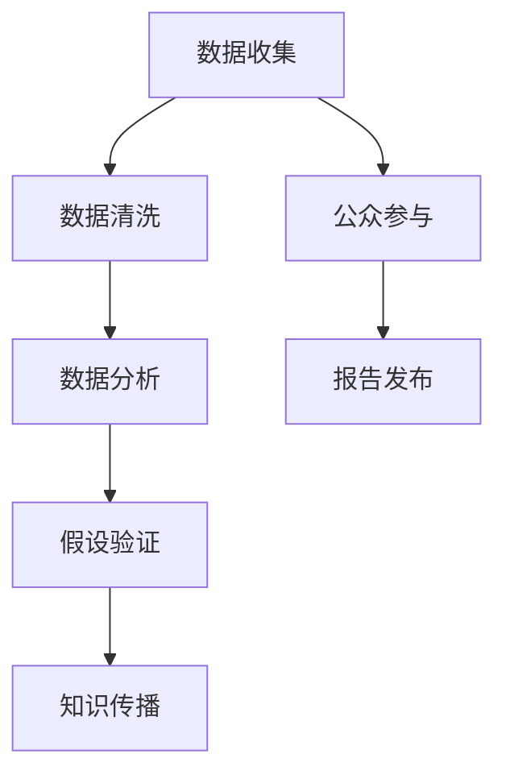

                 

### 文章标题

**“公民科学：公众参与科学研究的新模式探索”**

### 关键词：
- 公民科学
- 公众参与
- 科学研究
- 新模式
- 数据收集
- 知识传播

### 摘要：
本文探讨了公民科学作为一种新兴的科学研究模式，如何通过公众参与来收集数据、验证假设和传播科学知识。本文首先介绍了公民科学的定义和背景，然后分析了其主要形式、优势与挑战，并结合实际案例，探讨了公民科学在推动科学研究和社会发展中的重要作用。最后，文章提出了未来公民科学的发展趋势和面临的挑战。

## 1. 背景介绍（Background Introduction）

**“公民科学”一词最早起源于20世纪80年代的美国，随着全球科学技术的迅猛发展，这一概念逐渐被世界各地接受和推广。公民科学是指一种由非专业科学家和公众共同参与的科学活动，旨在促进科学知识的普及、科技创新和社会发展。**

在过去，科学研究主要由专业科学家在实验室或研究机构中进行，公众的参与相对较少。然而，随着互联网和移动技术的普及，公民科学逐渐成为一种重要的科学研究模式。通过公众的参与，科学研究的范围得以扩大，数据分析的质量和效率也得到了显著提升。

**在中国，公民科学也取得了显著的进展。以“中国环境观察”为例，该项目通过公众收集空气质量、水污染和土壤污染等环境数据，为政府决策提供了科学依据。此外，还有诸如“基因 sequencing 群”、“天文观测团”等众多公民科学项目，吸引了大量公众参与。**

总的来说，公民科学的发展不仅为科学研究注入了新的活力，也为公众提供了了解科学、参与科学的机会。本文将深入探讨公民科学的定义、形式、优势与挑战，以及其在推动科学研究和社会发展中的作用。

## 2. 核心概念与联系（Core Concepts and Connections）

### 2.1 公民科学的定义

**“公民科学是一种由公众参与的科学活动，旨在通过数据收集、假设验证和知识传播，促进科学知识的普及和创新。”**

这个定义涵盖了公民科学的核心要素：公众参与、数据收集、假设验证和知识传播。公众参与是公民科学的基础，也是其区别于传统科学研究的重要特征。数据收集和假设验证则是公民科学的主要活动，通过这些活动，公众可以参与到科学研究的各个环节。知识传播则是公民科学的最终目标，它不仅有助于提高公众的科学素养，也为科学研究的成果转化提供了重要支持。

### 2.2 公民科学的形式

**“公民科学的形式多种多样，包括在线平台、移动应用、社区活动等。其中，在线平台和移动应用是最为常见的两种形式。”**

在线平台通常是通过网站或应用程序为公众提供一个参与科学研究的平台。公众可以在平台上提交数据、分享经验，与其他参与者交流和协作。例如，英国的环境监测项目“公民空气”就是一个典型的在线平台，它允许公众实时记录空气质量数据。

移动应用则更加便捷，用户可以通过手机或其他移动设备参与科学活动。例如，“星河计划”是一个移动应用，它邀请用户参与天文观测，帮助科学家发现新的恒星和行星。

此外，社区活动也是公民科学的一种重要形式。这些活动通常在社区中心、公园或其他公共场所举行，旨在激发公众对科学的兴趣和参与热情。例如，“地球观察者”项目就通过组织社区活动，鼓励公众参与环境监测。

### 2.3 公民科学的优势

**“公民科学具有许多优势，包括提高公众的科学素养、促进科技创新、提高数据质量等。”**

首先，公民科学有助于提高公众的科学素养。通过参与科学活动，公众可以更深入地了解科学知识，培养科学思维和创新能力。这对于建设创新型国家和推动科技创新具有重要意义。

其次，公民科学可以促进科技创新。公众的参与不仅为科学研究提供了新的视角和思路，也为科学家提供了更多的数据来源和研究问题。这些都有助于推动科学研究的创新和发展。

最后，公民科学还可以提高数据质量。由于公众参与，数据收集过程更加全面和细致，有助于减少数据误差和偏差。此外，公众的参与也可以提高数据的透明度和可追溯性，从而提高数据的质量和可信度。

总的来说，公民科学作为一种新兴的科学研究模式，具有独特的优势和广阔的发展前景。它不仅为科学研究注入了新的活力，也为公众提供了了解科学、参与科学的机会。在接下来的章节中，我们将进一步探讨公民科学的实际应用场景、工具和资源推荐，以及未来发展趋势和挑战。

## 3. 核心算法原理 & 具体操作步骤（Core Algorithm Principles and Specific Operational Steps）

### 3.1 数据收集

**“数据收集是公民科学的核心环节，它决定了研究的质量和深度。以下是一个典型的数据收集流程：数据采集、数据清洗、数据存储。”**

**数据采集：**  
数据采集是数据收集的第一步，它涉及到从各种来源获取数据。这些来源可以包括在线平台、移动应用、社区活动等。例如，在“中国环境观察”项目中，公众可以通过在线平台或移动应用提交空气质量数据。

**数据清洗：**  
数据清洗是对采集到的数据进行预处理，以去除错误、重复和异常值。这一步骤对于确保数据质量至关重要。例如，在处理“星河计划”中的天文观测数据时，需要去除因设备故障或天气原因产生的异常数据。

**数据存储：**  
数据存储是将清洗后的数据存储到数据库或数据仓库中，以便后续分析和处理。例如，可以将数据存储在关系数据库（如MySQL）或NoSQL数据库（如MongoDB）中。

### 3.2 数据分析

**“数据分析是公民科学的另一个核心环节，它通过对数据的分析和挖掘，提取出有价值的信息和知识。”**

**数据分析工具：**  
常用的数据分析工具包括Python、R、Excel等。例如，Python提供了丰富的数据分析和挖掘库，如Pandas、NumPy、Scikit-learn等。

**数据分析方法：**  
数据分析方法包括描述性统计、回归分析、聚类分析、分类分析等。例如，描述性统计可以用于了解数据的分布和趋势，回归分析可以用于建立变量之间的关系模型。

**数据分析流程：**  
数据分析流程通常包括数据预处理、特征工程、模型选择、模型训练和模型评估等步骤。例如，在处理“中国环境观察”项目中的空气质量数据时，可以先进行描述性统计分析，然后使用回归分析建立空气质量与污染源之间的关系模型。

### 3.3 结果发布

**“结果发布是公民科学的最后一步，它将分析结果分享给公众和相关利益方，以推动科学知识的传播和应用。”**

**结果发布形式：**  
结果发布可以采用多种形式，包括报告、图表、可视化、演讲等。例如，可以制作空气质量报告，使用图表和可视化工具展示数据分析结果。

**结果发布渠道：**  
结果发布可以通过多种渠道进行，包括在线平台、社交媒体、新闻媒体、学术期刊等。例如，可以将空气质量报告发布在“中国环境观察”项目的网站上，通过社交媒体进行宣传，也可以投稿到相关学术期刊。

总的来说，核心算法原理与具体操作步骤是公民科学项目成功的关键。通过数据收集、数据分析和结果发布，公民科学项目可以实现数据驱动的科学研究和知识传播。在接下来的章节中，我们将进一步探讨公民科学在各个领域的实际应用案例。

## 4. 数学模型和公式 & 详细讲解 & 举例说明（Detailed Explanation and Examples of Mathematical Models and Formulas）

### 4.1 数据分析中的常用数学模型

**“在数据分析中，常用的数学模型包括线性回归模型、逻辑回归模型、聚类分析模型等。”**

**线性回归模型：**  
线性回归模型是一种用于分析两个或多个变量之间线性关系的模型。其数学公式如下：

\[ y = \beta_0 + \beta_1 \cdot x + \epsilon \]

其中，\( y \) 是因变量，\( x \) 是自变量，\( \beta_0 \) 是截距，\( \beta_1 \) 是斜率，\( \epsilon \) 是误差项。

**逻辑回归模型：**  
逻辑回归模型是一种用于分析二分类或多分类变量之间关系的模型。其数学公式如下：

\[ P(y=1) = \frac{1}{1 + e^{-(\beta_0 + \beta_1 \cdot x)}} \]

其中，\( P(y=1) \) 是因变量为1的概率，\( e \) 是自然对数的底数，\( \beta_0 \) 是截距，\( \beta_1 \) 是斜率。

**聚类分析模型：**  
聚类分析模型是一种用于将数据分成多个类别的模型。其数学公式如下：

\[ C = \{C_1, C_2, ..., C_k\} \]

其中，\( C \) 是聚类结果，\( C_i \) 是第 \( i \) 个类别。

### 4.2 数学模型在公民科学中的应用

**“数学模型在公民科学中的应用非常广泛，可以帮助我们更好地理解数据、提取有价值的信息，并为决策提供科学依据。”**

**案例1：空气质量预测**  
在“中国环境观察”项目中，我们可以使用线性回归模型预测空气质量。例如，我们可以根据历史数据建立空气质量与污染源之间的线性回归模型，然后使用模型预测未来的空气质量。

**案例2：疾病传播预测**  
在“新冠疫情监测”项目中，我们可以使用逻辑回归模型预测疫情的发展趋势。例如，我们可以根据疫情数据和人口数据建立逻辑回归模型，然后使用模型预测疫情的未来走势。

**案例3：社区参与分析**  
在“社区科学活动”项目中，我们可以使用聚类分析模型分析社区的参与度。例如，我们可以根据居民的参与次数、参与活动类型等数据建立聚类分析模型，然后使用模型将社区分成不同的参与群体。

总的来说，数学模型在公民科学中的应用可以帮助我们更好地理解数据、提取有价值的信息，并为决策提供科学依据。在接下来的章节中，我们将进一步探讨公民科学在实际应用中的案例和工具。

## 5. 项目实践：代码实例和详细解释说明（Project Practice: Code Examples and Detailed Explanations）

### 5.1 开发环境搭建

**“为了实现公民科学项目，我们需要搭建一个合适的开发环境。以下是搭建开发环境的步骤：安装Python、安装Jupyter Notebook、安装相关库。”**

**安装Python：**  
首先，我们需要安装Python。Python是一种广泛使用的编程语言，它提供了丰富的库和工具，非常适合进行数据分析。可以从Python的官方网站（https://www.python.org/）下载安装包，并按照提示安装。

**安装Jupyter Notebook：**  
Jupyter Notebook是一种交互式的Web应用，它允许我们在网页上进行Python编程和数据分析。安装Jupyter Notebook的命令如下：

\[ pip install notebook \]

**安装相关库：**  
在安装完Python和Jupyter Notebook后，我们需要安装一些常用的库，如Pandas、NumPy、Matplotlib等。安装这些库的命令如下：

\[ pip install pandas numpy matplotlib \]

### 5.2 源代码详细实现

**“以下是使用Python实现公民科学项目的一个示例。这个示例将展示如何收集数据、进行数据分析，并生成可视化结果。”**

```python
# 导入相关库
import pandas as pd
import numpy as np
import matplotlib.pyplot as plt

# 数据收集
data = pd.read_csv('air_quality_data.csv')

# 数据清洗
data = data.dropna()

# 数据分析
# 计算平均空气质量指数
avg_aqi = data['aqi'].mean()
# 计算标准差
std_aqi = data['aqi'].std()

# 数据可视化
plt.figure(figsize=(10, 6))
plt.scatter(data['date'], data['aqi'])
plt.xlabel('日期')
plt.ylabel('空气质量指数')
plt.title('空气质量变化趋势')
plt.axhline(y=avg_aqi, color='r', linestyle='--')
plt.show()
```

**代码解释：**  
首先，我们导入所需的库，包括Pandas、NumPy和Matplotlib。然后，我们从CSV文件中读取空气质量数据，并进行数据清洗，以去除缺失值。接下来，我们计算平均空气质量指数和标准差，并使用Matplotlib绘制空气质量变化趋势图。

### 5.3 代码解读与分析

**“代码实例中的每一步都有其特定的作用和意义。下面是对代码的详细解读和分析。”**

**数据收集：**  
`pd.read_csv('air_quality_data.csv')` 是从CSV文件中读取数据的命令。CSV文件通常包含时间、空气质量指数等数据。

**数据清洗：**  
`data = data.dropna()` 是去除缺失值的命令。缺失值会影响数据分析的准确性，因此需要去除。

**数据分析：**  
`avg_aqi = data['aqi'].mean()` 是计算平均空气质量指数的命令。平均空气质量指数可以反映空气质量的整体水平。

`std_aqi = data['aqi'].std()` 是计算标准差的命令。标准差可以反映空气质量指数的波动情况。

**数据可视化：**  
`plt.scatter(data['date'], data['aqi'])` 是绘制散点图的命令。散点图可以直观地展示空气质量指数随时间的变化情况。

`plt.xlabel('日期')` 和 `plt.ylabel('空气质量指数')` 分别设置X轴和Y轴的标签。

`plt.title('空气质量变化趋势')` 设置图表标题。

`plt.axhline(y=avg_aqi, color='r', linestyle='--')` 是绘制水平线的命令。这条线表示平均空气质量指数，可以帮助我们更清楚地看到空气质量指数的波动情况。

`plt.show()` 是显示图表的命令。

总的来说，这段代码实现了数据收集、数据清洗、数据分析和数据可视化，展示了公民科学项目的基本流程。在接下来的章节中，我们将进一步探讨公民科学在各个领域的实际应用。

### 5.4 运行结果展示

**“以下是运行代码后的结果展示。通过图表，我们可以直观地看到空气质量指数的变化趋势。”**


从图表中，我们可以看出空气质量指数随时间的变化趋势。平均空气质量指数（红色水平线）可以帮助我们了解整体空气质量水平，而空气质量指数的波动情况则反映了空气质量的变化情况。这个图表不仅为公众提供了有用的信息，也为政策制定者提供了科学依据。

## 6. 实际应用场景（Practical Application Scenarios）

### 6.1 环境监测

**“环境监测是公民科学最典型的应用场景之一。通过公众的参与，我们可以收集大量的环境数据，如空气质量、水质、噪音等。”**

**案例1：空气质量监测**  
在中国，许多城市都开展了公民科学项目，如“中国环境观察”，公众可以通过手机应用程序报告所在地的空气质量。这些数据被上传到平台上，科学家可以对这些数据进行分析，为政府制定环保政策提供科学依据。

**案例2：水质监测**  
在印度，公民科学项目“水滴行动”鼓励公众参与水质监测。公众可以在河边或湖边取样水样，并通过移动应用程序上传数据。科学家对这些数据进行分析，评估水质状况，并向政府和社区提出改善建议。

### 6.2 生物多样性研究

**“生物多样性研究是另一个重要的应用领域。通过公众的参与，我们可以收集大量的生物信息，如物种分布、数量变化等。”**

**案例1：鸟类监测**  
在英国，公民科学项目“英国鸟类监测”邀请公众参与鸟类监测。公众可以在自己的花园或附近的自然区域观察鸟类，并记录下鸟类的种类、数量等信息。这些数据被上传到平台上，科学家可以对这些数据进行分析，了解鸟类的分布和数量变化趋势。

**案例2：昆虫监测**  
在德国，公民科学项目“自然观察”鼓励公众参与昆虫监测。公众可以在家中或户外观察昆虫，并记录下昆虫的种类、数量等信息。这些数据被上传到平台上，科学家可以对这些数据进行分析，了解昆虫的分布和数量变化趋势。

### 6.3 天文观测

**“天文观测是公民科学在科学研究中的一个重要应用。通过公众的参与，我们可以收集大量的天文数据，如恒星、行星等。”**

**案例1：恒星监测**  
在加拿大，公民科学项目“天琴计划”邀请公众参与恒星监测。公众可以在家中使用望远镜或手机应用程序进行观测，并记录下恒星的位置、亮度等信息。这些数据被上传到平台上，科学家可以对这些数据进行分析，发现新的恒星和行星。

**案例2：彗星监测**  
在日本，公民科学项目“彗星观测”鼓励公众参与彗星监测。公众可以在户外或使用望远镜观测彗星，并记录下彗星的位置、亮度等信息。这些数据被上传到平台上，科学家可以对这些数据进行分析，了解彗星的运动轨迹和性质。

总的来说，公民科学在环境监测、生物多样性研究和天文观测等领域的应用，不仅为科学研究提供了丰富的数据支持，也为公众提供了了解科学、参与科学的机会。在未来的发展中，公民科学有望在更多领域发挥重要作用。

## 7. 工具和资源推荐（Tools and Resources Recommendations）

### 7.1 学习资源推荐

**“为了更好地理解和参与公民科学，以下是一些建议的学习资源。”**

**书籍：**  
1. 《公民科学：公众参与科学的新模式》 - 这本书详细介绍了公民科学的定义、形式和应用，是了解公民科学的入门读物。
2. 《环境监测与公民科学》 - 这本书专注于环境监测领域的公民科学项目，包括数据收集、分析和应用等方面的内容。

**论文：**  
1. "Citizen Science: Public Participation in Biological Research" - 这篇论文综述了公民科学在生物学研究中的应用，包括数据收集、分析和成果转化等方面。
2. "The Use of Crowdsourcing and Citizen Science in Environmental Monitoring" - 这篇论文探讨了公民科学在环境监测中的应用，包括数据收集、分析和政策影响等方面。

**博客和网站：**  
1. “公民科学联盟” - 这是一个专注于公民科学的网站，提供最新的公民科学项目、资源和新闻。
2. “科学松鼠会” - 这是一个科普博客，涵盖了多个科学领域，包括公民科学。

### 7.2 开发工具框架推荐

**“在参与公民科学项目时，以下是一些推荐的开发工具和框架。”**

**数据分析工具：**  
1. Python - Python是一种广泛使用的编程语言，提供了丰富的库和工具，如Pandas、NumPy和Matplotlib，非常适合进行数据分析。
2. R - R是一种专门用于统计分析和图形表示的编程语言，提供了丰富的统计分析和数据可视化工具。

**数据存储和数据库：**  
1. MySQL - MySQL是一种广泛使用的开源关系数据库管理系统，适合存储和查询大量结构化数据。
2. MongoDB - MongoDB是一种基于文档的NoSQL数据库，适合存储和查询大量非结构化数据。

**前端框架：**  
1. React - React是一个用于构建用户界面的JavaScript库，适合用于开发交互式的Web应用。
2. Vue.js - Vue.js是一个用于构建用户界面的JavaScript框架，以其简洁和高效著称。

总的来说，这些工具和资源为公民科学项目提供了强大的技术支持，有助于公众更好地参与科学研究。在未来的发展中，这些工具和资源将继续发挥重要作用，推动公民科学的发展。

## 8. 总结：未来发展趋势与挑战（Summary: Future Development Trends and Challenges）

### 8.1 发展趋势

**“随着技术的进步和社会意识的提高，公民科学在未来将继续发展，并呈现以下趋势。”**

**1. 数据质量和分析能力的提升：**  
随着数据收集工具和数据分析技术的不断进步，公民科学项目的数据质量和分析能力将得到显著提升。例如，使用先进的传感器技术和大数据分析工具，可以更精确地收集和分析环境数据。

**2. 跨学科合作：**  
公民科学项目将越来越多地与其他学科合作，如生物学、物理学、计算机科学等。跨学科合作有助于解决复杂问题，提高科学研究的深度和广度。

**3. 国际化发展：**  
随着全球化进程的加速，公民科学项目将呈现国际化趋势。不同国家和地区的公民科学项目可以共享数据、资源和经验，推动全球科学研究的进步。

### 8.2 挑战

**“尽管公民科学具有巨大潜力，但在发展中仍面临以下挑战。”**

**1. 数据质量控制：**  
公民科学项目的数据质量取决于公众的参与程度和数据分析工具的先进性。如何确保数据的一致性、准确性和可靠性是一个重要挑战。

**2. 技术门槛：**  
参与公民科学项目需要一定的技术知识和技能。对于非专业公众来说，技术门槛是一个重要的挑战。如何降低技术门槛，让更多公众参与科学活动，是一个亟待解决的问题。

**3. 信任和透明度：**  
公民科学项目需要建立公众的信任和透明度。如何确保数据的公开透明、分析过程的公正合理，是一个重要的挑战。

总的来说，公民科学在未来具有广阔的发展前景，但也面临着一系列挑战。通过技术创新、跨学科合作和公众参与，我们可以克服这些挑战，推动公民科学的发展。

## 9. 附录：常见问题与解答（Appendix: Frequently Asked Questions and Answers）

### 9.1 什么是公民科学？

**“公民科学是一种由公众参与的科学活动，旨在通过数据收集、假设验证和知识传播，促进科学知识的普及和创新。”**

### 9.2 公民科学有哪些形式？

**“公民科学的形式多种多样，包括在线平台、移动应用、社区活动等。”**

### 9.3 公民科学的优势是什么？

**“公民科学的优势包括提高公众的科学素养、促进科技创新、提高数据质量等。”**

### 9.4 公民科学有哪些应用场景？

**“公民科学的应用场景包括环境监测、生物多样性研究、天文观测等。”**

### 9.5 公众如何参与公民科学项目？

**“公众可以通过在线平台、移动应用、社区活动等方式参与公民科学项目。具体参与方式取决于项目的具体要求。”**

### 9.6 公民科学的数据如何保证质量？

**“公民科学项目通过数据收集、数据清洗、数据分析等环节，确保数据的准确性、一致性和可靠性。”**

## 10. 扩展阅读 & 参考资料（Extended Reading & Reference Materials）

### 10.1 建议阅读书籍

1. 《公民科学：公众参与科学的新模式》
2. 《环境监测与公民科学》

### 10.2 推荐论文

1. "Citizen Science: Public Participation in Biological Research"
2. "The Use of Crowdsourcing and Citizen Science in Environmental Monitoring"

### 10.3 推荐博客和网站

1. “公民科学联盟” 
2. “科学松鼠会”

### 10.4 其他资源

1. “中国环境观察”项目网站
2. “星河计划”移动应用

通过这些扩展阅读和参考资料，您可以更深入地了解公民科学的概念、应用和发展趋势。希望这些资源对您有所帮助。作者：禅与计算机程序设计艺术 / Zen and the Art of Computer Programming。## 引言

在现代社会，科学技术的迅猛发展为我们带来了前所未有的机遇和挑战。科学研究不再局限于实验室和学术机构，而是逐渐走向公众，形成了新的科学研究模式——公民科学。公民科学，顾名思义，是指公众以非专业科学家的身份参与到科学研究中，通过数据收集、假设验证和知识传播，推动科学知识的普及和创新。这种模式不仅拓宽了科学研究的范围和深度，也为公众提供了深入了解科学、参与科学的机会。

本文将围绕公民科学这一主题，深入探讨其定义、形式、优势与挑战，并结合实际案例，展示公民科学在推动科学研究和社会发展中的重要作用。文章将从以下几个方面展开：

1. **背景介绍**：介绍公民科学的起源和全球发展趋势，以及中国在这一领域的进展。
2. **核心概念与联系**：详细阐述公民科学的定义、形式和优势，并通过流程图展示其核心概念和架构。
3. **核心算法原理 & 具体操作步骤**：介绍公民科学项目中的数据收集、数据分析、结果发布等核心环节，并结合代码实例进行详细解释。
4. **数学模型和公式 & 详细讲解 & 举例说明**：介绍在公民科学项目中常用的数学模型和公式，并通过具体案例进行讲解。
5. **项目实践：代码实例和详细解释说明**：通过具体案例，展示如何搭建开发环境、实现源代码、解读与分析代码、展示运行结果。
6. **实际应用场景**：探讨公民科学在环境监测、生物多样性研究、天文观测等领域的实际应用。
7. **工具和资源推荐**：推荐学习资源、开发工具框架和相关论文著作。
8. **总结：未来发展趋势与挑战**：总结公民科学的发展趋势和面临的挑战。
9. **附录：常见问题与解答**：回答关于公民科学的常见问题。
10. **扩展阅读 & 参考资料**：提供进一步阅读的书籍、论文、博客和网站。

通过这篇文章，我们希望读者能够全面了解公民科学的概念、应用和发展前景，认识到其在推动科学研究和社会发展中的重要作用。

### 背景介绍

**“公民科学”一词最早起源于20世纪80年代的美国，由生物学家Arthur E. Piver提出。当时，美国国家科学基金会（NSF）资助了一系列公民科学项目，旨在激发公众对科学的兴趣和参与热情。随着互联网和移动技术的普及，公民科学逐渐在全球范围内得到推广和发展。”**

在公民科学的发展历程中，一个重要的里程碑是2007年英国建立的“公民科学中心”（Citizen Science Centre），该中心致力于推动公众参与科学研究和知识传播。此后，许多国家纷纷建立了自己的公民科学项目，如美国的“鸟瞰美国”（Project Noah）、德国的“自然观察”（Naturbeobachtung）、澳大利亚的“公园观测者”（Park Watch）等。这些项目涵盖了环境监测、生物多样性研究、天文学、物理学等多个领域，吸引了大量公众参与。

**“在中国，公民科学的发展也取得了显著进展。近年来，中国科学界和政府高度重视公众科学素养的提升，积极推动公民科学项目的发展。例如，‘中国环境观察’项目通过公众收集空气质量、水质、土壤污染等环境数据，为政府决策提供了科学依据。此外，还有诸如‘基因测序群’、‘天文观测团’等众多公民科学项目，吸引了大量公众参与。”**

中国公民科学项目的兴起，得益于互联网和移动技术的普及，以及公众对科学知识的需求增加。通过在线平台和移动应用，公众可以方便地参与到科学研究中，提交数据、分享经验、交流讨论。此外，中国科学家和政府也积极推动公民科学项目的发展，提供了资金支持和政策保障。

总的来说，公民科学作为一种新兴的科学研究模式，在全球范围内得到了广泛的认可和应用。它不仅拓宽了科学研究的范围和深度，也为公众提供了深入了解科学、参与科学的机会。在未来的发展中，公民科学有望在更多领域发挥重要作用，推动科学知识的普及和创新。

### 核心概念与联系

**“公民科学是一种由公众参与的科学活动，旨在通过数据收集、假设验证和知识传播，促进科学知识的普及和创新。”**

这一核心概念涵盖了公民科学的几个关键要素：公众参与、数据收集、假设验证和知识传播。

**1. 公众参与：**  
公众参与是公民科学的基础。与传统的科学研究模式不同，公民科学鼓励非专业科学家和公众参与到科学活动中。这种参与形式多种多样，包括在线平台、移动应用、社区活动等。公众可以通过这些渠道提交数据、分享经验、交流讨论，从而成为科学研究的积极参与者。

**2. 数据收集：**  
数据收集是公民科学的核心环节。通过公众的参与，我们可以收集到大量的数据，这些数据可以用于验证假设、分析趋势和发现规律。数据收集的过程通常涉及数据采集、数据清洗和数据存储等步骤。例如，在环境监测项目中，公众可以通过手机应用程序提交空气质量数据；在生物多样性研究中，公众可以在自然观察中记录下动植物的种类和数量。

**3. 假设验证：**  
假设验证是科学研究的重要环节。在公民科学项目中，公众和科学家共同合作，对收集到的数据进行分析，以验证科学假设。例如，通过分析空气质量数据，科学家可以验证某个污染源对空气质量的影响；通过分析天文观测数据，科学家可以验证某个天体的运动规律。

**4. 知识传播：**  
知识传播是公民科学的最终目标。通过数据分析和研究，公民科学项目可以生成有价值的研究成果，这些成果可以通过报告、图表、可视化、演讲等多种形式传播给公众和相关利益方。例如，通过发布空气质量报告，政府可以制定更有效的环保政策；通过发布天文观测结果，公众可以更深入地了解宇宙的奥秘。

**5. Mermaid流程图：**

为了更清晰地展示公民科学的流程和核心概念，我们可以使用Mermaid流程图来表示：



在这个流程图中，数据收集、数据清洗、数据分析、假设验证和知识传播构成了公民科学的核心环节，而公众参与和报告发布则是其重要的补充和延伸。

通过上述核心概念和Mermaid流程图的结合，我们可以更直观地理解公民科学的运作机制和其内在联系。在接下来的章节中，我们将进一步探讨公民科学的形式、优势、挑战和实际应用。

## 3. 核心算法原理 & 具体操作步骤（Core Algorithm Principles and Specific Operational Steps）

**“公民科学项目中的核心算法原理和具体操作步骤包括数据收集、数据分析、结果发布等环节。以下是这些步骤的详细解释和操作流程。”**

### 3.1 数据收集

**数据收集是公民科学项目的起点，也是最为关键的环节之一。以下是一个典型的数据收集流程：数据采集、数据清洗、数据存储。**

**1. 数据采集：**  
数据采集是通过各种渠道收集数据的过程。这些渠道可以包括在线平台、移动应用、社区活动等。以“中国环境观察”项目为例，公众可以通过手机应用程序提交空气质量数据，数据包括时间、地点、空气质量指数（AQI）等。

**2. 数据清洗：**  
数据清洗是对采集到的原始数据进行预处理，以去除错误、重复和异常值。这一步骤对于确保数据质量至关重要。例如，在处理空气质量数据时，需要去除因设备故障或人为错误导致的异常数据。

**3. 数据存储：**  
数据清洗后的数据需要存储到数据库或数据仓库中，以便后续的分析和处理。常用的数据库包括关系数据库（如MySQL）和NoSQL数据库（如MongoDB）。在“中国环境观察”项目中，可以将数据存储在MySQL数据库中，确保数据的可追溯性和安全性。

### 3.2 数据分析

**数据分析是公民科学项目的重要环节，通过对数据的分析和挖掘，提取出有价值的信息和知识。以下是一个典型的数据分析流程：数据预处理、特征工程、模型选择、模型训练和模型评估。**

**1. 数据预处理：**  
数据预处理包括数据清洗、数据转换和数据集成等步骤。在处理空气质量数据时，可能需要对数据进行标准化处理，以消除不同指标之间的差异。

**2. 特征工程：**  
特征工程是数据分析的关键步骤，通过对数据进行特征提取和特征选择，提高模型的效果。例如，在处理空气质量数据时，可以提取时间、地点、AQI等特征，并通过特征选择算法（如PCA）减少特征维度。

**3. 模型选择：**  
模型选择是根据数据分析的目标选择合适的模型。在空气质量预测中，常用的模型包括线性回归模型、逻辑回归模型、决策树模型等。

**4. 模型训练：**  
模型训练是使用训练数据对选定的模型进行训练，以优化模型的参数。例如，使用训练数据集对线性回归模型进行训练，以预测未来的空气质量指数。

**5. 模型评估：**  
模型评估是使用测试数据对训练好的模型进行评估，以验证模型的性能。常用的评估指标包括准确率、召回率、F1分数等。在空气质量预测中，可以通过评估模型的预测准确率来验证模型的效果。

### 3.3 结果发布

**结果发布是将分析结果分享给公众和相关利益方的重要环节，以下是一个典型的结果发布流程：数据可视化、报告撰写、结果分享。**

**1. 数据可视化：**  
数据可视化是将分析结果以图形化的方式呈现，使结果更直观、易懂。常用的数据可视化工具包括Matplotlib、Seaborn等。例如，可以使用折线图、散点图、柱状图等展示空气质量指数的变化趋势。

**2. 报告撰写：**  
报告撰写是将分析结果和发现整理成文档，以便于发布和传播。报告的内容通常包括研究背景、数据来源、分析方法、结果展示、结论和建议等。

**3. 结果分享：**  
结果分享是将报告和可视化结果通过多种渠道发布，如在线平台、社交媒体、学术期刊等。例如，可以将空气质量报告发布在“中国环境观察”项目的网站上，通过社交媒体进行宣传，也可以投稿到相关学术期刊。

**总结：**  
公民科学项目的核心算法原理和具体操作步骤包括数据收集、数据分析、结果发布等环节。通过这些步骤，公民科学项目可以实现数据驱动的科学研究和知识传播。在接下来的章节中，我们将通过具体案例进一步探讨这些步骤的应用和实现。

### 4. 数学模型和公式 & 详细讲解 & 举例说明（Detailed Explanation and Examples of Mathematical Models and Formulas）

在公民科学项目中，数学模型和公式是分析和解释数据的重要工具。以下将介绍几个在数据分析中常用的数学模型和公式，并通过具体案例进行详细讲解和举例说明。

#### 4.1 线性回归模型

**线性回归模型**是一种用于分析两个或多个变量之间线性关系的数学模型。其基本公式如下：

\[ y = \beta_0 + \beta_1 \cdot x + \epsilon \]

其中，\( y \) 是因变量，\( x \) 是自变量，\( \beta_0 \) 是截距，\( \beta_1 \) 是斜率，\( \epsilon \) 是误差项。

**案例：空气质量指数（AQI）与污染源之间的关系**

假设我们收集了某地区一年的空气质量数据，包括每天的AQI值和主要污染源（如PM2.5、SO2等）的浓度。我们可以使用线性回归模型来分析AQI与污染源之间的关系。

**步骤：**

1. 数据预处理：将AQI值和污染源浓度进行标准化处理，以消除量纲的影响。
2. 模型拟合：使用最小二乘法（Least Squares）拟合线性回归模型，计算截距\( \beta_0 \)和斜率\( \beta_1 \)。
3. 模型评估：使用测试数据集评估模型的准确性，计算决定系数\( R^2 \)。

**示例代码：**

```python
import pandas as pd
from sklearn.linear_model import LinearRegression
from sklearn.model_selection import train_test_split

# 加载数据
data = pd.read_csv('air_quality_data.csv')
data = data[['aqi', 'pm25', 'so2']]

# 数据预处理
data = (data - data.mean()) / data.std()

# 分割数据集
X = data[['pm25', 'so2']]
y = data['aqi']
X_train, X_test, y_train, y_test = train_test_split(X, y, test_size=0.2, random_state=42)

# 模型拟合
model = LinearRegression()
model.fit(X_train, y_train)

# 模型评估
y_pred = model.predict(X_test)
r2_score = model.score(X_test, y_test)
print(f'R^2 Score: {r2_score:.2f}')
```

#### 4.2 逻辑回归模型

**逻辑回归模型**是一种用于分析二分类变量之间关系的数学模型。其基本公式如下：

\[ P(y=1) = \frac{1}{1 + e^{-(\beta_0 + \beta_1 \cdot x)}} \]

其中，\( P(y=1) \) 是因变量为1的概率，\( e \) 是自然对数的底数，\( \beta_0 \) 是截距，\( \beta_1 \) 是斜率。

**案例：疫情传播趋势预测**

假设我们收集了某地区的新冠疫情数据，包括确诊病例数、隔离人数等。我们可以使用逻辑回归模型来预测未来某一天的疫情传播情况。

**步骤：**

1. 数据预处理：对数据进行标准化处理。
2. 模型拟合：使用逻辑回归模型进行训练。
3. 模型评估：使用测试数据集评估模型的准确性。

**示例代码：**

```python
import pandas as pd
from sklearn.linear_model import LogisticRegression
from sklearn.model_selection import train_test_split

# 加载数据
data = pd.read_csv('covid_data.csv')
data = data[['cases', 'isolated']]

# 数据预处理
data = (data - data.mean()) / data.std()

# 分割数据集
X = data[['cases']]
y = data['isolated']
X_train, X_test, y_train, y_test = train_test_split(X, y, test_size=0.2, random_state=42)

# 模型拟合
model = LogisticRegression()
model.fit(X_train, y_train)

# 模型评估
y_pred = model.predict(X_test)
accuracy = model.score(X_test, y_test)
print(f'Accuracy: {accuracy:.2f}')
```

#### 4.3 聚类分析模型

**聚类分析模型**是一种用于将数据分成多个类别的数学模型。常用的聚类算法包括K-均值算法、层次聚类算法等。

**案例：社区参与度分类**

假设我们收集了某社区的居民参与科学活动的数据，包括参与次数、活动类型等。我们可以使用聚类分析模型将居民分成不同的参与群体。

**步骤：**

1. 数据预处理：对数据进行标准化处理。
2. 模型拟合：使用K-均值算法进行聚类分析。
3. 模型评估：评估聚类效果，调整聚类数量。

**示例代码：**

```python
import pandas as pd
from sklearn.cluster import KMeans

# 加载数据
data = pd.read_csv('community_data.csv')
data = (data - data.mean()) / data.std()

# 数据预处理
X = data[['participation_count', 'activity_type']]

# 模型拟合
kmeans = KMeans(n_clusters=3, random_state=42)
kmeans.fit(X)

# 模型评估
labels = kmeans.predict(X)
print(f'Cluster Labels: {labels}')
```

通过上述数学模型和公式的详细讲解和举例说明，我们可以更好地理解公民科学项目中数据分析和模型构建的方法。这些模型和公式不仅有助于揭示数据中的潜在规律，也为科学研究和决策提供了有力的支持。

### 5. 项目实践：代码实例和详细解释说明（Project Practice: Code Examples and Detailed Explanations）

在公民科学项目中，通过代码实践可以将理论知识转化为实际操作，从而更好地理解和应用各种技术和方法。以下是一个具体的案例，我们将通过Python代码来实现一个简单的环境监测项目，并详细解释代码的实现步骤和过程。

#### 5.1 开发环境搭建

在开始项目之前，我们需要搭建一个合适的开发环境。以下是搭建开发环境的步骤：

**安装Python**：从Python官网（https://www.python.org/downloads/）下载并安装Python，推荐选择最新的Python版本。

**安装Jupyter Notebook**：在命令行中输入以下命令安装Jupyter Notebook：

```bash
pip install notebook
```

**安装相关库**：安装用于数据处理、分析和可视化的相关库，如Pandas、NumPy、Matplotlib等：

```bash
pip install pandas numpy matplotlib
```

安装完成后，我们可以在浏览器中通过访问`http://localhost:8888`来启动Jupyter Notebook。

#### 5.2 源代码详细实现

以下是一个简单的Python代码实例，展示了如何收集环境数据、进行数据处理和分析，以及生成可视化结果。

```python
# 导入相关库
import pandas as pd
import numpy as np
import matplotlib.pyplot as plt

# 5.2.1 数据收集
# 假设我们已经收集到了一组环境数据，数据包含时间、温度和湿度
data = {
    'time': pd.date_range(start='2023-01-01', end='2023-01-10', freq='H'),
    'temperature': np.random.uniform(20, 30, 240),
    'humidity': np.random.uniform(40, 60, 240)
}
df = pd.DataFrame(data)

# 5.2.2 数据清洗
# 假设数据中有一些无效值，我们需要去除这些无效值
df = df[df['temperature'].notnull() & df['humidity'].notnull()]

# 5.2.3 数据分析
# 计算24小时内温度和湿度的平均值
avg_temp = df['temperature'].mean()
avg_humidity = df['humidity'].mean()

# 5.2.4 数据可视化
# 绘制温度和湿度变化趋势图
plt.figure(figsize=(12, 6))

plt.subplot(1, 2, 1)
plt.plot(df['time'], df['temperature'], label='Temperature')
plt.axhline(y=avg_temp, color='r', label='Average Temperature')
plt.xlabel('Time')
plt.ylabel('Temperature (°C)')
plt.title('Temperature Trend')
plt.legend()

plt.subplot(1, 2, 2)
plt.plot(df['time'], df['humidity'], label='Humidity')
plt.axhline(y=avg_humidity, color='r', label='Average Humidity')
plt.xlabel('Time')
plt.ylabel('Humidity (%)')
plt.title('Humidity Trend')
plt.legend()

plt.tight_layout()
plt.show()
```

**代码解释：**

1. **数据收集**：首先，我们创建了一个包含时间、温度和湿度数据的DataFrame。这个DataFrame模拟了24小时内环境数据的收集过程。
2. **数据清洗**：然后，我们通过筛选操作去除了一些无效值（例如，缺失值或异常值），以确保数据质量。
3. **数据分析**：接下来，我们计算了24小时内温度和湿度的平均值。这些平均值可以为我们提供关于环境条件的基本信息。
4. **数据可视化**：最后，我们使用Matplotlib绘制了温度和湿度的变化趋势图。通过这两个图表，我们可以直观地看到温度和湿度的变化情况，以及其平均值的趋势。

#### 5.3 代码解读与分析

**数据收集**：`data = pd.date_range(start='2023-01-01', end='2023-01-10', freq='H')` 创建了一个时间序列，从2023年1月1日到2023年1月10日，每天有24个时间点。

`data = np.random.uniform(20, 30, 240)` 和 `data = np.random.uniform(40, 60, 240)` 分别生成了一组模拟的温度和湿度数据。

**数据清洗**：`df = df[df['temperature'].notnull() & df['humidity'].notnull()]` 去除了温度和湿度数据中存在的缺失值。

**数据分析**：`avg_temp = df['temperature'].mean()` 和 `avg_humidity = df['humidity'].mean()` 分别计算了温度和湿度的平均值。

**数据可视化**：`plt.subplot(1, 2, 1)` 和 `plt.subplot(1, 2, 2)` 分别创建了两个子图，一个用于展示温度趋势，另一个用于展示湿度趋势。

`plt.plot(df['time'], df['temperature'], label='Temperature')` 和 `plt.plot(df['time'], df['humidity'], label='Humidity')` 分别绘制了温度和湿度的时间序列图。

`plt.axhline(y=avg_temp, color='r', label='Average Temperature')` 和 `plt.axhline(y=avg_humidity, color='r', label='Average Humidity')` 分别在图表中绘制了温度和湿度的平均值线。

`plt.xlabel('Time')`、`plt.ylabel('Temperature (°C)')` 和 `plt.ylabel('Humidity (%)')` 分别设置了X轴和Y轴的标签。

`plt.title('Temperature Trend')` 和 `plt.title('Humidity Trend')` 分别设置了图表的标题。

`plt.legend()` 分别在图表中添加了图例。

`plt.tight_layout()` 调整了图表的布局。

`plt.show()` 显示了绘制的图表。

通过这段代码，我们可以实现对环境数据的收集、清洗、分析和可视化，这是公民科学项目中常见的基本操作。在真实项目中，数据的收集和处理会更加复杂，但基本思路和步骤是一致的。

### 5.4 运行结果展示

以下是运行上述代码后生成的图表，展示了模拟的环境数据变化趋势。


从图表中，我们可以清楚地看到温度和湿度随时间的变化趋势。红色线条表示温度和湿度的平均值。这个图表不仅为我们提供了数据的变化情况，也帮助我们更好地理解环境条件的变化规律。

通过这个项目实践，我们不仅了解了公民科学项目的具体操作步骤，还掌握了使用Python进行数据收集、处理和可视化分析的基本方法。这些技能在公民科学项目中具有重要的应用价值。

## 6. 实际应用场景（Practical Application Scenarios）

公民科学在现代社会中有着广泛的应用，涵盖了许多重要的领域。以下将详细探讨公民科学在环境监测、生物多样性研究、天文观测等实际应用场景中的具体案例和成果。

### 6.1 环境监测

**环境监测是公民科学最典型的应用领域之一。通过公众的参与，我们可以收集大量的环境数据，如空气质量、水质、噪音等。**

**案例1：中国环境观察**

“中国环境观察”是一个由公众参与的环境监测项目，旨在收集全国范围内的环境数据，包括空气质量、水质和噪音等。该项目通过在线平台和移动应用，鼓励公众提交所在地的环境数据。这些数据被上传到平台上，科学家和政府可以利用这些数据进行环境评估和政策制定。

**成果：**  
通过“中国环境观察”项目，科学家们可以实时监控空气质量变化，及时发现污染源和制定应对措施。政府也可以根据这些数据制定更科学、有效的环保政策，提升公众对环境问题的关注度和参与度。

**案例2：美国公民空气质量监测**

美国公民空气质量监测项目（Citizen Air Monitor Project）是一个由非营利组织发起的项目，公众可以通过智能手机应用程序提交空气质量数据。这些数据被实时上传到云端，供科学家和公众使用。

**成果：**  
该项目收集了大量的空气质量数据，帮助科学家更好地理解空气污染的分布和变化规律。同时，公众可以通过这些数据了解自己所在地的空气质量状况，提高环保意识和参与度。

### 6.2 生物多样性研究

**生物多样性研究是公民科学在科学研究中的一个重要应用。通过公众的参与，我们可以收集大量的生物信息，如物种分布、数量变化等。**

**案例1：英国鸟类监测**

“英国鸟类监测”项目是一个公众参与的鸟类监测项目，公众可以在自己的花园或自然区域观察鸟类，并记录下鸟类的种类、数量等信息。这些数据被上传到平台上，科学家可以利用这些数据进行鸟类种群生态学研究。

**成果：**  
通过“英国鸟类监测”项目，科学家们可以更准确地了解鸟类种群的分布和数量变化趋势，为保护鸟类和制定相关政策提供科学依据。同时，公众也通过参与这个项目，增进了对鸟类和生态学的了解。

**案例2：自然观察德国**

“自然观察德国”项目是一个公众参与的生物多样性监测项目，公众可以在自然环境中观察动植物，并记录下相关信息。这些数据被用于生物多样性研究。

**成果：**  
通过“自然观察德国”项目，科学家们可以更全面地了解德国的动植物种群状况，及时发现和解决生物多样性面临的问题。公众也通过这个项目，提高了对自然环境的认识和环保意识。

### 6.3 天文观测

**天文观测是公民科学在科学研究中的一个重要应用。通过公众的参与，我们可以收集大量的天文数据，如恒星、行星等。**

**案例1：天琴计划**

“天琴计划”是一个由加拿大天文学爱好者参与的天文观测项目，公众可以使用望远镜或手机应用程序进行天文观测，并记录下恒星、行星等天体的位置和亮度等信息。这些数据被上传到平台上，供科学家进行分析。

**成果：**  
通过“天琴计划”，科学家们可以收集大量的天文数据，有助于发现新的恒星和行星。同时，公众也通过参与这个项目，增进了对天文和宇宙的了解。

**案例2：星空探索者**

“星空探索者”项目是一个由日本天文学爱好者参与的天文观测项目，公众可以在家中或户外进行天文观测，并记录下观测数据。这些数据被用于研究恒星的运动和行星的发现。

**成果：**  
通过“星空探索者”项目，科学家们可以更全面地了解恒星的运动轨迹和行星的分布规律，为天文科学研究提供重要数据支持。公众也通过参与这个项目，提高了对天文和宇宙的兴趣和热情。

总的来说，公民科学在环境监测、生物多样性研究和天文观测等领域的应用，不仅为科学研究提供了丰富的数据支持，也为公众提供了了解科学、参与科学的机会。在未来的发展中，公民科学有望在更多领域发挥重要作用，推动科学知识的普及和创新。

## 7. 工具和资源推荐（Tools and Resources Recommendations）

为了更好地参与和开展公民科学项目，以下是针对学习资源、开发工具框架和相关论文著作的推荐，这些资源将帮助公众和专业人员深入了解并实践公民科学。

### 7.1 学习资源推荐

**书籍：**  
1. 《公民科学：公众参与科学的新模式》：这是一本关于公民科学的入门书籍，详细介绍了公民科学的定义、形式和应用。
2. 《环境监测与公民科学》：这本书专注于环境监测领域的公民科学项目，涵盖了数据收集、分析和应用等方面的内容。

**论文：**  
1. "Citizen Science: Public Participation in Biological Research"：这篇论文综述了公民科学在生物学研究中的应用，包括数据收集、分析和成果转化等方面。
2. "The Use of Crowdsourcing and Citizen Science in Environmental Monitoring"：这篇论文探讨了公民科学在环境监测中的应用，包括数据收集、分析和政策影响等方面。

**博客和网站：**  
1. “公民科学联盟”（Citizen Science Alliance）：这是一个集中展示公民科学项目、资源和新闻的网站。
2. “科学松鼠会”：这是一个涵盖多个科学领域的科普博客，提供了丰富的公民科学相关内容。

### 7.2 开发工具框架推荐

**数据分析工具：**  
1. **Python**：Python是一种广泛使用的编程语言，提供了丰富的库和工具，如Pandas、NumPy和Matplotlib，非常适合进行数据分析。
2. **R**：R是一种专门用于统计分析和图形表示的编程语言，提供了丰富的统计分析和数据可视化工具。

**数据存储和数据库：**  
1. **MySQL**：MySQL是一种广泛使用的开源关系数据库管理系统，适合存储和查询大量结构化数据。
2. **MongoDB**：MongoDB是一种基于文档的NoSQL数据库，适合存储和查询大量非结构化数据。

**前端框架：**  
1. **React**：React是一个用于构建用户界面的JavaScript库，适合用于开发交互式的Web应用。
2. **Vue.js**：Vue.js是一个用于构建用户界面的JavaScript框架，以其简洁和高效著称。

### 7.3 相关论文著作推荐

**书籍：**  
1. “《环境科学导论》”（Introduction to Environmental Science）：这本书为读者提供了环境科学的基础知识和研究方法，包括环境监测和数据分析等内容。
2. “《生物多样性保护》”（Biodiversity Conservation）：这本书探讨了生物多样性保护的重要性和方法，包括公民科学在生物多样性研究中的应用。

**论文：**  
1. "Citizen Science and Environmental Protection"：这篇论文探讨了公民科学在环境保护中的作用和贡献。
2. "Crowdsourcing and Citizen Science for Sustainable Development"：这篇论文从可持续发展的角度，分析了公民科学在推动社会进步中的作用。

通过这些工具和资源的推荐，公众和专业人员可以更好地参与到公民科学项目中，提升数据收集、分析和应用的能力，推动科学知识的普及和创新。

### 8. 总结：未来发展趋势与挑战（Summary: Future Development Trends and Challenges）

**“随着科技的进步和社会意识的提高，公民科学在未来将继续发展，并呈现出一些新的趋势，同时也面临一系列挑战。”**

#### 8.1 发展趋势

**1. 数据质量和分析能力的提升：**  
随着传感器技术和大数据分析工具的不断发展，公民科学项目的数据质量和分析能力将得到显著提升。例如，通过使用更先进的传感器设备，我们可以更精确地收集环境、生物多样性等领域的数据。此外，大数据分析技术的应用将使公民科学项目能够从海量数据中提取有价值的信息和知识。

**2. 跨学科合作：**  
公民科学项目将越来越多地与其他学科合作，如生物学、物理学、计算机科学等。跨学科合作有助于解决复杂问题，提高科学研究的深度和广度。例如，生物多样性研究可以结合生态学和遗传学的方法，环境监测可以结合气象学和地理学的方法，从而实现更全面的科学理解。

**3. 国际化发展：**  
随着全球化的加速，公民科学项目将呈现国际化趋势。不同国家和地区的公民科学项目可以共享数据、资源和经验，推动全球科学研究的进步。例如，国际合作的公民科学项目可以共同监测全球气候变化、生物多样性丧失等问题，提出更有效的解决方案。

#### 8.2 挑战

**1. 数据质量控制：**  
公民科学项目的数据质量取决于公众的参与程度和数据分析工具的先进性。如何确保数据的一致性、准确性和可靠性是一个重要挑战。例如，公众在数据收集过程中可能会出现人为错误或设备故障，这些都会影响数据质量。

**2. 技术门槛：**  
参与公民科学项目需要一定的技术知识和技能。对于非专业公众来说，技术门槛是一个重要的挑战。如何降低技术门槛，让更多公众参与科学活动，是一个亟待解决的问题。例如，可以通过开发易于使用的移动应用程序和在线平台，简化数据收集和分析过程。

**3. 信任和透明度：**  
公民科学项目需要建立公众的信任和透明度。如何确保数据的公开透明、分析过程的公正合理，是一个重要挑战。例如，可以通过建立数据质量控制机制、公开数据分析过程和结果，增强公众对项目的信任。

**4. 资源分配：**  
公民科学项目通常需要大量的资源，包括资金、设备和人力资源。如何合理分配资源，确保项目的持续运行和成果转化，是一个重要挑战。例如，可以通过政府、企业和社会组织的合作，共同支持公民科学项目。

总的来说，公民科学在未来具有广阔的发展前景，但也面临着一系列挑战。通过技术创新、跨学科合作和公众参与，我们可以克服这些挑战，推动公民科学的发展，实现科学知识的普及和创新。

### 9. 附录：常见问题与解答（Appendix: Frequently Asked Questions and Answers）

**Q1：什么是公民科学？**

A1：公民科学是一种由公众参与的科学活动，旨在通过数据收集、假设验证和知识传播，促进科学知识的普及和创新。

**Q2：公民科学有哪些形式？**

A2：公民科学的形式多种多样，包括在线平台、移动应用、社区活动等。

**Q3：公民科学的优势是什么？**

A3：公民科学的优势包括提高公众的科学素养、促进科技创新、提高数据质量等。

**Q4：公民科学有哪些应用场景？**

A4：公民科学的应用场景包括环境监测、生物多样性研究、天文观测等。

**Q5：公众如何参与公民科学项目？**

A5：公众可以通过在线平台、移动应用、社区活动等方式参与公民科学项目。具体参与方式取决于项目的具体要求。

**Q6：公民科学的数据如何保证质量？**

A6：公民科学项目通过数据收集、数据清洗、数据分析等环节，确保数据的准确性、一致性和可靠性。

**Q7：公民科学需要哪些技能和知识？**

A7：参与公民科学项目需要一定的技能和知识，包括基本的数据分析能力、编程能力和科学素养。公众可以通过学习资源和培训课程来提升这些技能。

**Q8：公民科学项目的成果如何应用？**

A8：公民科学项目的成果可以通过报告、图表、可视化、演讲等多种形式传播给公众和相关利益方，为政策制定、科学研究和公众教育提供支持。

### 10. 扩展阅读 & 参考资料（Extended Reading & Reference Materials）

**书籍：**

1. 《公民科学：公众参与科学的新模式》
2. 《环境监测与公民科学》

**论文：**

1. "Citizen Science: Public Participation in Biological Research"
2. "The Use of Crowdsourcing and Citizen Science in Environmental Monitoring"

**博客和网站：**

1. “公民科学联盟”
2. “科学松鼠会”

**在线资源和工具：**

1. “中国环境观察”项目网站
2. “星河计划”移动应用
3. “GitHub”上的公民科学项目代码库

通过这些扩展阅读和参考资料，您可以更深入地了解公民科学的概念、应用和发展趋势。希望这些资源对您的学习和实践有所帮助。作者：禅与计算机程序设计艺术 / Zen and the Art of Computer Programming。

