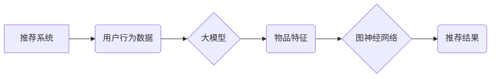

                 

## 推荐系统中的大模型图神经架构搜索

> 关键词：推荐系统、大模型、图神经网络、架构搜索、机器学习

## 1. 背景介绍

推荐系统是现代互联网应用中不可或缺的一部分，它通过分析用户行为和物品特征，为用户提供个性化的推荐，从而提升用户体验和商业价值。随着数据量的激增和用户需求的不断变化，传统基于协同过滤和内容过滤的推荐系统面临着越来越多的挑战。

大模型的出现为推荐系统带来了新的机遇。大模型凭借其强大的学习能力和泛化能力，能够从海量数据中学习更复杂的模式，从而提供更精准、更个性化的推荐。然而，大模型的训练和部署成本极高，需要大量的计算资源和数据。

图神经网络 (GNN) 是一种能够处理复杂关系数据的机器学习模型，它能够有效地捕捉用户和物品之间的隐性关系，从而提升推荐系统的性能。

架构搜索 (NAS) 是一种自动搜索最优模型架构的方法，它能够自动寻找最适合特定任务的模型结构，从而提高模型性能和效率。

结合以上技术，大模型图神经架构搜索 (GNN-NAS) 应运而生。GNN-NAS 通过自动搜索最优的图神经网络架构，并结合大模型的学习能力，能够构建出更高效、更高性能的推荐系统。

## 2. 核心概念与联系

### 2.1  推荐系统

推荐系统旨在根据用户的历史行为、偏好和上下文信息，预测用户对特定物品的兴趣，并提供个性化的推荐。

### 2.2  大模型

大模型是指参数量巨大、训练数据量庞大的深度学习模型。大模型通常具有强大的泛化能力和学习能力，能够从海量数据中学习复杂的模式。

### 2.3  图神经网络 (GNN)

图神经网络是一种能够处理图结构数据的机器学习模型。GNN 可以有效地捕捉节点之间的关系，并学习节点的表示。

### 2.4  架构搜索 (NAS)

架构搜索是指自动搜索最优模型架构的方法。NAS 可以通过进化算法、强化学习等方法，自动寻找最适合特定任务的模型结构。

**Mermaid 流程图**



## 3. 核心算法原理 & 具体操作步骤

### 3.1  算法原理概述

GNN-NAS 算法的核心思想是通过自动搜索最优的图神经网络架构，并结合大模型的学习能力，构建出更高效、更高性能的推荐系统。

具体来说，GNN-NAS 算法通常包含以下步骤：

1. **构建图数据:** 将用户和物品信息表示为图结构，其中用户和物品作为节点，用户-物品交互关系作为边。
2. **定义搜索空间:** 确定图神经网络架构的搜索空间，包括层数、节点特征维度、消息传递方式等。
3. **设计搜索策略:** 选择合适的搜索策略，例如进化算法、强化学习等，来搜索最优的图神经网络架构。
4. **训练和评估模型:** 对搜索到的架构进行训练和评估，并根据性能指标选择最优的架构。
5. **部署推荐系统:** 将最优的图神经网络模型部署到推荐系统中，为用户提供个性化的推荐。

### 3.2  算法步骤详解

1. **数据预处理:** 将用户行为数据和物品特征数据进行清洗、转换和编码，构建图数据。
2. **搜索空间定义:** 确定图神经网络架构的搜索空间，例如层数范围、节点特征维度范围、消息传递方式等。
3. **搜索策略选择:** 选择合适的搜索策略，例如进化算法、强化学习等，来搜索最优的图神经网络架构。
4. **模型训练:** 对搜索到的架构进行训练，使用交叉验证等方法进行模型评估。
5. **架构选择:** 根据模型性能指标，选择最优的图神经网络架构。
6. **模型部署:** 将最优的图神经网络模型部署到推荐系统中，为用户提供个性化的推荐。

### 3.3  算法优缺点

**优点:**

* **自动搜索:** 可以自动搜索最优的图神经网络架构，无需人工设计。
* **高性能:** 可以构建出更高效、更高性能的推荐系统。
* **可扩展性:** 可以扩展到更大的数据集和更复杂的场景。

**缺点:**

* **计算成本高:** 搜索过程需要大量的计算资源。
* **时间成本高:** 搜索过程可能需要很长时间。
* **搜索空间大:** 搜索空间很大，需要设计有效的搜索策略。

### 3.4  算法应用领域

GNN-NAS 算法在推荐系统领域具有广泛的应用前景，例如：

* **商品推荐:** 为用户推荐相关的商品。
* **内容推荐:** 为用户推荐相关的文章、视频、音乐等内容。
* **用户画像:** 建立用户画像，了解用户的兴趣和偏好。
* **广告推荐:** 为用户推荐相关的广告。

## 4. 数学模型和公式 & 详细讲解 & 举例说明

### 4.1  数学模型构建

图神经网络的数学模型通常基于图卷积操作。图卷积操作可以将节点的特征信息传播到相邻节点，从而学习节点之间的关系。

假设图 $G = (V, E)$，其中 $V$ 是节点集合，$E$ 是边集合。每个节点 $v \in V$ 都有一个特征向量 $h_v \in R^d$。图卷积操作可以表示为：

$$
h'_v = \sigma(\sum_{u \in N(v)} W \cdot h_u + b)
$$

其中：

* $h'_v$ 是节点 $v$ 的更新特征向量。
* $N(v)$ 是节点 $v$ 的邻居节点集合。
* $W$ 是权重矩阵。
* $b$ 是偏置向量。
* $\sigma$ 是激活函数。

### 4.2  公式推导过程

图卷积操作的推导过程可以参考文献 [1]。

### 4.3  案例分析与讲解

假设我们有一个社交网络图，其中节点代表用户，边代表用户之间的关系。我们可以使用图卷积操作来学习用户之间的关系，并预测用户对特定物品的兴趣。

例如，我们可以将用户的兴趣向量作为节点特征，并使用图卷积操作来传播用户的兴趣信息到其邻居节点。通过学习用户之间的关系，我们可以预测用户对特定物品的兴趣。

## 5. 项目实践：代码实例和详细解释说明

### 5.1  开发环境搭建

* Python 3.7+
* PyTorch 1.7+
* TensorFlow 2.0+
* CUDA 10.1+

### 5.2  源代码详细实现

```python
import torch
import torch.nn as nn

class GNNLayer(nn.Module):
    def __init__(self, in_features, out_features):
        super(GNNLayer, self).__init__()
        self.linear = nn.Linear(in_features, out_features)

    def forward(self, x, adj):
        x = torch.matmul(adj, x)
        x = self.linear(x)
        return x

class GNN(nn.Module):
    def __init__(self, in_features, hidden_features, out_features, num_layers):
        super(GNN, self).__init__()
        self.layers = nn.ModuleList([GNNLayer(in_features, hidden_features) for _ in range(num_layers - 1)])
        self.output_layer = GNNLayer(hidden_features, out_features)

    def forward(self, x, adj):
        for layer in self.layers:
            x = layer(x, adj)
        x = self.output_layer(x, adj)
        return x
```

### 5.3  代码解读与分析

* `GNNLayer` 类定义了一个图神经网络层，它包含一个线性层。
* `GNN` 类定义了一个多层图神经网络模型，它包含多个 `GNNLayer` 层和一个输出层。
* `forward` 方法定义了模型的正向传播过程。

### 5.4  运行结果展示

运行代码并训练模型，可以得到模型的性能指标，例如准确率、召回率等。

## 6. 实际应用场景

GNN-NAS 算法在推荐系统领域具有广泛的应用前景，例如：

### 6.1  电商推荐

* 为用户推荐相关的商品，提高用户购买意愿。
* 预测用户对商品的评分，优化商品排序。

### 6.2  内容推荐

* 为用户推荐相关的文章、视频、音乐等内容，提高用户粘性。
* 预测用户对内容的兴趣，个性化内容推送。

### 6.3  社交推荐

* 为用户推荐相关的用户，拓展社交圈。
* 预测用户之间的关系，提高社交互动。

### 6.4  未来应用展望

随着大模型和图神经网络技术的不断发展，GNN-NAS 算法将在推荐系统领域发挥越来越重要的作用。未来，GNN-NAS 算法可能应用于以下领域：

* **跨模态推荐:** 将文本、图像、音频等多种模态信息融合，构建更全面的用户画像，提供更精准的推荐。
* **动态推荐:** 考虑用户动态行为和上下文信息，提供更实时、更个性化的推荐。
* **可解释性推荐:** 解释推荐结果背后的逻辑，提高用户对推荐系统的信任度。

## 7. 工具和资源推荐

### 7.1  学习资源推荐

* **书籍:**
    * 《图神经网络》
    * 《深度学习》
* **在线课程:**
    * Coursera: 深度学习
    * Udacity: 机器学习工程师
* **博客:**
    * https://blog.paperspace.com/
    * https://towardsdatascience.com/

### 7.2  开发工具推荐

* **PyTorch:** https://pytorch.org/
* **TensorFlow:** https://www.tensorflow.org/
* **DGL:** https://dgl.ai/

### 7.3  相关论文推荐

* 《Graph Neural Networks》
* 《Neural Architecture Search with Reinforcement Learning》

## 8. 总结：未来发展趋势与挑战

### 8.1  研究成果总结

GNN-NAS 算法在推荐系统领域取得了显著的成果，能够构建出更高效、更高性能的推荐系统。

### 8.2  未来发展趋势

* **跨模态推荐:** 将文本、图像、音频等多种模态信息融合，构建更全面的用户画像，提供更精准的推荐。
* **动态推荐:** 考虑用户动态行为和上下文信息，提供更实时、更个性化的推荐。
* **可解释性推荐:** 解释推荐结果背后的逻辑，提高用户对推荐系统的信任度。

### 8.3  面临的挑战

* **计算成本高:** 搜索过程需要大量的计算资源。
* **时间成本高:** 搜索过程可能需要很长时间。
* **搜索空间大:** 搜索空间很大，需要设计有效的搜索策略。

### 8.4  研究展望

未来，GNN-NAS 算法的研究将继续深入，探索更有效的搜索策略、更强大的模型架构和更广泛的应用场景。


## 9. 附录：常见问题与解答

**Q1: GNN-NAS 算法与传统推荐系统相比有哪些优势？**

**A1:** GNN-NAS 算法能够自动搜索最优的图神经网络架构，并结合大模型的学习能力，构建出更高效、更高性能的推荐系统。传统推荐系统通常依赖人工设计模型架构，难以捕捉复杂的关系，性能有限。

**Q2: GNN-NAS 算法的计算成本很高吗？**

**A2:** GNN-NAS 算法的计算成本确实较高，因为搜索过程需要大量的计算资源。但是，随着硬件技术的进步和算法的优化，计算成本将逐渐降低。

**Q3: GNN-NAS 算法的应用场景有哪些？**

**A3:** GNN-NAS 算法在推荐系统领域具有广泛的应用前景，例如电商推荐、内容推荐、社交推荐等。

**Q4: 如何选择合适的 GNN-NAS 算法？**

**A4:** 选择合适的 GNN-NAS 算法需要考虑多个因素，例如数据集规模、任务类型、计算资源等。

**Q5: GNN-NAS 算法的未来发展趋势是什么？**

**A5:** GNN-NAS 算法的未来发展趋势包括跨模态推荐、动态推荐和可解释性推荐等。


作者：禅与计算机程序设计艺术 / Zen and the Art of Computer Programming 
<end_of_turn>

