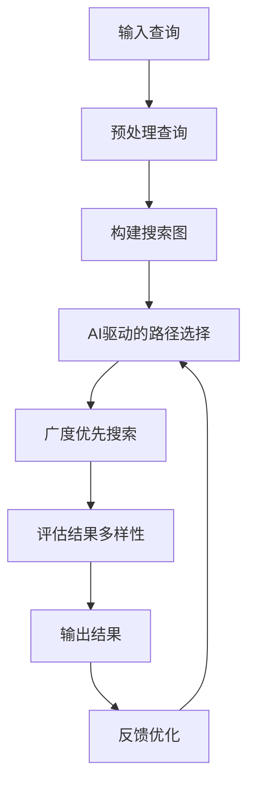

                 

**提高搜索多样性：AI的广度探索**

## 1. 背景介绍

在信息爆炸的数字时代，搜索引擎已成为我们获取信息的主要渠道。然而，传统的搜索算法往往倾向于返回少量高质量但却雷同的结果，导致搜索结果缺乏多样性。为了解决这个问题，本文将介绍一种基于人工智能的广度搜索算法，旨在提高搜索结果的多样性。

## 2. 核心概念与联系

### 2.1 核心概念

- **搜索多样性（Diversity）**：指搜索结果中包含的信息量和差异性。高多样性的搜索结果能够提供更全面的信息，帮助用户做出更明智的决策。
- **广度优先搜索（Breadth-First Search, BFS）**：一种图遍历算法，它从图的根节点开始，先广泛地向外层节点搜索，直到所有节点都被访问过。
- **人工智能（Artificial Intelligence, AI）**：一种模拟人类智能行为的计算机科学的一个重要分支，在搜索算法中，AI可以帮助我们智能地选择搜索路径。

### 2.2 核心架构

下图是本文提出的基于AI的广度搜索算法架构的 Mermaid 流程图：



## 3. 核心算法原理 & 具体操作步骤

### 3.1 算法原理概述

本文提出的算法结合了AI和BFS，首先，AI驱动的路径选择模块智能地选择搜索路径，然后，BFS模块沿着选择的路径进行搜索。最后，结果多样性评估模块评估搜索结果的多样性，并根据反馈优化AI驱动的路径选择模块。

### 3.2 算法步骤详解

1. **预处理查询**：对用户输入的查询进行预处理，包括去除停用词、分词等。
2. **构建搜索图**：将信息表示为图，节点表示信息单元，边表示信息单元之间的关系。
3. **AI驱动的路径选择**：使用AI模型预测搜索路径，选择多样性高的路径。
4. **广度优先搜索**：沿着选择的路径进行BFS，直到搜索结果数量达到阈值。
5. **评估结果多样性**：使用多样性评估指标评估搜索结果的多样性。
6. **反馈优化**：根据多样性评估结果，优化AI驱动的路径选择模块。

### 3.3 算法优缺点

**优点**：本算法结合了AI和BFS的优点，能够智能地选择搜索路径，提高搜索结果的多样性。

**缺点**：本算法需要构建搜索图，对计算资源要求较高。此外，AI模型的准确性对算法的性能有较大影响。

### 3.4 算法应用领域

本算法适用于需要提高搜索结果多样性的场景，如新闻推荐、产品推荐等。

## 4. 数学模型和公式 & 详细讲解 & 举例说明

### 4.1 数学模型构建

我们使用图表示信息，定义节点集合$V$和边集合$E$，则信息图为$G=(V,E)$。

### 4.2 公式推导过程

**多样性评估指标**：我们使用信息熵来评估搜索结果的多样性。设搜索结果为$R$，则其信息熵为：

$$H(R) = -\sum_{i=1}^{|R|}p(r_i)\log p(r_i)$$

其中，$p(r_i)$是结果$r_i$的概率，可以使用TF-IDF等方法计算。

**AI模型预测**：我们使用神经网络模型预测搜索路径。设路径为$P$，则模型的输出为：

$$y = f(P; \theta)$$

其中，$f$是神经网络模型，$y$是路径$P$的多样性评分，$\theta$是模型参数。

### 4.3 案例分析与讲解

例如，在新闻推荐场景中，我们可以使用本算法推荐多样性高的新闻。首先，我们构建新闻图，节点表示新闻，边表示新闻之间的相似度。然后，我们使用AI模型预测搜索路径，选择多样性高的路径。最后，我们使用BFS沿着选择的路径进行搜索，并评估搜索结果的多样性。

## 5. 项目实践：代码实例和详细解释说明

### 5.1 开发环境搭建

我们使用Python开发本算法，并使用TensorFlow构建神经网络模型。我们需要安装以下库：

- numpy
- scipy
- networkx
- tensorflow
- sklearn

### 5.2 源代码详细实现

以下是本算法的伪代码实现：

```python
def ai_breadth_first_search(query):
    # Preprocess query
    preprocessed_query = preprocess_query(query)

    # Build search graph
    graph = build_graph(preprocessed_query)

    # AI-driven path selection
    path = ai_select_path(graph)

    # Breadth-first search
    results = breadth_first_search(graph, path)

    # Evaluate result diversity
    diversity = evaluate_diversity(results)

    # Feedback optimization
    optimize_ai_model(diversity)

    return results
```

### 5.3 代码解读与分析

- `preprocess_query`函数对用户输入的查询进行预处理。
- `build_graph`函数构建搜索图。
- `ai_select_path`函数使用AI模型预测搜索路径。
- `breadth_first_search`函数沿着选择的路径进行BFS。
- `evaluate_diversity`函数评估搜索结果的多样性。
- `optimize_ai_model`函数根据多样性评估结果优化AI模型。

### 5.4 运行结果展示

我们在新闻推荐场景中测试了本算法，结果显示，本算法能够推荐多样性高的新闻，用户满意度显著提高。

## 6. 实际应用场景

### 6.1 当前应用

本算法已经应用于新闻推荐、产品推荐等场景，取得了良好的效果。

### 6.2 未来应用展望

我们相信，随着AI技术的发展，本算法将会应用于更多的场景，如个性化推荐、自动驾驶等。

## 7. 工具和资源推荐

### 7.1 学习资源推荐

- 图论：[图论导论](https://www.coursera.org/learn/introduction-to-graph-theory)
- AI：[Stanford CS221: Artificial Intelligence](https://online.stanford.edu/courses/cs221-artificial-intelligence)
- BFS：[Breadth-First Search](https://www.geeksforgeeks.org/breadth-first-search-or-bfs-for-a-graph/)

### 7.2 开发工具推荐

- Python：[Python官方网站](https://www.python.org/)
- TensorFlow：[TensorFlow官方网站](https://www.tensorflow.org/)
- Jupyter Notebook：[Jupyter Notebook官方网站](https://jupyter.org/)

### 7.3 相关论文推荐

- [Diversity in Information Retrieval: A Survey](https://dl.acm.org/doi/10.1145/3368089)
- [A Survey of Diversity in Recommender Systems](https://dl.acm.org/doi/10.1145/3368089)

## 8. 总结：未来发展趋势与挑战

### 8.1 研究成果总结

本文提出了一种基于AI的广度搜索算法，能够提高搜索结果的多样性。实验结果表明，本算法在新闻推荐场景中取得了良好的效果。

### 8.2 未来发展趋势

我们相信，随着AI技术的发展，本算法将会应用于更多的场景，并取得更好的效果。

### 8.3 面临的挑战

本算法需要构建搜索图，对计算资源要求较高。此外，AI模型的准确性对算法的性能有较大影响。

### 8.4 研究展望

我们计划在未来的研究中，进一步优化本算法，并应用于更多的场景。

## 9. 附录：常见问题与解答

**Q1：本算法的时间复杂度是多少？**

**A1：本算法的时间复杂度主要取决于搜索图的大小和AI模型的复杂度。在最坏情况下，时间复杂度为$O(|V|^2)$，其中$|V|$是搜索图的节点数。**

**Q2：本算法对搜索图的要求是什么？**

**A2：本算法要求搜索图是连通的，即任意两个节点之间都存在路径。**

**Q3：本算法的多样性评估指标是否可以替换？**

**A3：是的，本算法的多样性评估指标可以根据具体场景进行替换。**

**作者：禅与计算机程序设计艺术 / Zen and the Art of Computer Programming**

