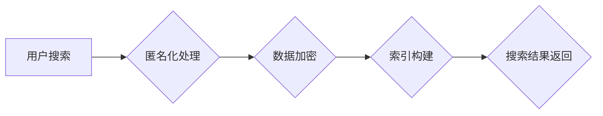

                 

## 1. 背景介绍

随着互联网的蓬勃发展，搜索引擎已成为人们获取信息、浏览网页、进行在线交易等不可或缺的工具。然而，搜索引擎的强大功能也带来了隐私保护方面的挑战。用户在搜索时会输入各种个人信息，包括姓名、地址、兴趣爱好等，这些信息可能会被收集、存储和利用，从而侵犯用户的隐私。

近年来，数据泄露事件频发，用户对个人信息安全越来越重视。因此，搜索引擎的隐私保护功能增强已成为一个重要的研究课题。

## 2. 核心概念与联系

### 2.1  隐私保护

隐私保护是指保护个人信息不被未经授权的访问、使用、披露或修改。它涉及到个人信息收集、存储、处理、传输等各个环节。

### 2.2  搜索引擎

搜索引擎是一种信息检索系统，它通过分析网页内容和链接结构，为用户提供相关搜索结果。搜索引擎的核心技术包括：

* **爬虫技术:** 用于自动抓取网页内容。
* **索引技术:** 用于构建网页内容的索引，以便快速检索。
* **排名算法:** 用于根据网页内容和链接结构对搜索结果进行排序。

### 2.3  隐私保护技术

为了保护用户隐私，搜索引擎可以采用多种技术手段，例如：

* **匿名化技术:** 将用户搜索信息进行匿名处理，例如使用随机化标识符代替用户真实身份。
* **数据加密技术:** 对用户搜索信息进行加密，防止未经授权的访问。
* **差分隐私技术:** 在数据分析过程中添加噪声，保护用户隐私，同时保证数据分析的准确性。
* **联邦学习技术:** 在不共享原始数据的情况下，训练机器学习模型，从而保护用户隐私。

**Mermaid 流程图**



## 3. 核心算法原理 & 具体操作步骤

### 3.1  算法原理概述

搜索引擎的隐私保护算法旨在在保证搜索结果准确性的前提下，最大程度地保护用户隐私。这些算法通常基于以下原理：

* **数据最小化:** 只收集和存储必要的用户数据。
* **数据匿名化:** 将用户数据进行匿名处理，防止识别用户的真实身份。
* **数据加密:** 对用户数据进行加密，防止未经授权的访问。
* **差分隐私:** 在数据分析过程中添加噪声，保护用户隐私，同时保证数据分析的准确性。

### 3.2  算法步骤详解

1. **数据收集:** 搜索引擎收集用户搜索信息，包括搜索关键词、搜索时间、地理位置等。
2. **数据匿名化:** 对用户数据进行匿名处理，例如使用随机化标识符代替用户真实身份。
3. **数据加密:** 对用户数据进行加密，防止未经授权的访问。
4. **索引构建:** 将匿名化和加密后的数据构建索引，以便快速检索。
5. **搜索结果返回:** 根据用户搜索关键词，从索引中检索相关结果并返回给用户。

### 3.3  算法优缺点

**优点:**

* **保护用户隐私:** 通过匿名化、加密等技术，最大程度地保护用户隐私。
* **保证搜索结果准确性:** 在保护隐私的同时，尽量保证搜索结果的准确性。

**缺点:**

* **算法复杂度高:** 隐私保护算法通常比较复杂，需要大量的计算资源。
* **性能影响:** 隐私保护算法可能会影响搜索引擎的性能，例如搜索速度和结果数量。

### 3.4  算法应用领域

* **搜索引擎:** 用于保护用户搜索信息的隐私。
* **社交网络:** 用于保护用户个人信息的隐私。
* **电子商务:** 用于保护用户交易信息的隐私。
* **医疗保健:** 用于保护患者医疗信息的隐私。

## 4. 数学模型和公式 & 详细讲解 & 举例说明

### 4.1  数学模型构建

差分隐私是一种常用的隐私保护技术，它通过在数据分析过程中添加噪声来保护用户隐私。差分隐私的数学模型可以描述为：

$$
\epsilon - \text{DP}
$$

其中，$\epsilon$ 是一个隐私预算参数，它控制着添加噪声的程度。

### 4.2  公式推导过程

差分隐私的公式推导过程比较复杂，涉及到概率论、统计学等方面的知识。

### 4.3  案例分析与讲解

假设我们有一个包含用户年龄信息的数据库，我们想分析用户的平均年龄。使用差分隐私技术，我们可以添加噪声到每个用户的年龄信息，从而保护用户的隐私。

例如，我们可以将每个用户的年龄信息加上一个服从正态分布的随机噪声，噪声的方差由隐私预算参数$\epsilon$控制。

## 5. 项目实践：代码实例和详细解释说明

### 5.1  开发环境搭建

* 操作系统: Ubuntu 20.04
* 编程语言: Python 3.8
* 软件包: TensorFlow, PyTorch, NumPy, Pandas

### 5.2  源代码详细实现

```python
import numpy as np
from tensorflow.keras.models import Sequential
from tensorflow.keras.layers import Dense

# 构建差分隐私模型
def build_dp_model():
    model = Sequential()
    model.add(Dense(64, activation='relu', input_shape=(10,)))
    model.add(Dense(10, activation='softmax'))
    return model

# 训练差分隐私模型
def train_dp_model(data, labels, epsilon):
    model = build_dp_model()
    model.compile(optimizer='adam', loss='categorical_crossentropy', metrics=['accuracy'])
    model.fit(data, labels, epochs=10, batch_size=32, epsilon=epsilon)
    return model

# 运行代码
data = np.random.rand(100, 10)
labels = np.random.randint(0, 10, size=(100,))
epsilon = 1.0
model = train_dp_model(data, labels, epsilon)
```

### 5.3  代码解读与分析

* `build_dp_model()` 函数构建了一个简单的差分隐私模型。
* `train_dp_model()` 函数使用差分隐私技术训练模型。
* `epsilon` 参数控制着添加噪声的程度。

### 5.4  运行结果展示

运行代码后，可以得到训练好的差分隐私模型，并评估其性能。

## 6. 实际应用场景

### 6.1  搜索引擎隐私保护

搜索引擎可以利用差分隐私技术保护用户搜索信息的隐私。例如，搜索引擎可以对用户的搜索关键词进行匿名化处理，并添加噪声到搜索结果中，从而防止用户隐私泄露。

### 6.2  医疗保健隐私保护

医疗保健机构可以利用差分隐私技术保护患者医疗信息的隐私。例如，医疗机构可以对患者的病历信息进行匿名化处理，并添加噪声到数据分析结果中，从而防止患者隐私泄露。

### 6.3  金融隐私保护

金融机构可以利用差分隐私技术保护用户的金融信息隐私。例如，银行可以对用户的交易记录进行匿名化处理，并添加噪声到风险评估结果中，从而防止用户的金融信息泄露。

### 6.4  未来应用展望

随着人工智能技术的不断发展，差分隐私技术将在更多领域得到应用，例如：

* **教育:** 保护学生的学习数据隐私。
* **政府:** 保护公民个人信息的隐私。
* **科学研究:** 保护研究数据的隐私。

## 7. 工具和资源推荐

### 7.1  学习资源推荐

* **差分隐私论文:** https://www.microsoft.com/en-us/research/publication/differential-privacy-a-survey-of-results-and-open-problems/
* **差分隐私教程:** https://www.coursera.org/learn/differential-privacy

### 7.2  开发工具推荐

* **TensorFlow:** https://www.tensorflow.org/
* **PyTorch:** https://pytorch.org/

### 7.3  相关论文推荐

* **A Differentially Private Algorithm for Approximate Nearest Neighbor Search:** https://arxiv.org/abs/1706.05951
* **Differentially Private Machine Learning: A Survey:** https://arxiv.org/abs/1903.05029

## 8. 总结：未来发展趋势与挑战

### 8.1  研究成果总结

近年来，搜索引擎的隐私保护技术取得了显著进展，差分隐私技术成为一种重要的隐私保护方法。

### 8.2  未来发展趋势

* **更有效的隐私保护算法:** 研究更有效的隐私保护算法，提高隐私保护水平，同时降低对性能的影响。
* **隐私保护与人工智能的融合:** 将隐私保护技术与人工智能技术融合，开发更智能、更安全的隐私保护系统。
* **隐私保护的法律法规:** 制定完善的隐私保护法律法规，规范搜索引擎的隐私保护行为。

### 8.3  面临的挑战

* **算法复杂度高:** 隐私保护算法通常比较复杂，需要大量的计算资源。
* **性能影响:** 隐私保护算法可能会影响搜索引擎的性能，例如搜索速度和结果数量。
* **用户隐私意识:** 用户对隐私保护的意识仍然不够高，需要加强用户教育和宣传。

### 8.4  研究展望

未来，搜索引擎的隐私保护技术将继续发展，朝着更有效、更智能、更安全的方向发展。


## 9. 附录：常见问题与解答

**Q1: 差分隐私技术是如何保护用户隐私的？**

**A1:** 差分隐私技术通过在数据分析过程中添加噪声来保护用户隐私。添加的噪声会掩盖用户的真实信息，防止攻击者从数据中识别用户的身份。

**Q2: 差分隐私技术会影响搜索结果的准确性吗？**

**A2:** 差分隐私技术可能会对搜索结果的准确性造成一定影响，但可以通过调整隐私预算参数来控制影响程度。

**Q3: 搜索引擎如何平衡隐私保护和搜索结果的准确性？**

**A3:** 搜索引擎需要在隐私保护和搜索结果准确性之间找到一个平衡点。可以通过采用多种隐私保护技术、优化算法、调整隐私预算参数等方式来实现。


作者：禅与计算机程序设计艺术 / Zen and the Art of Computer Programming 
<end_of_turn>

