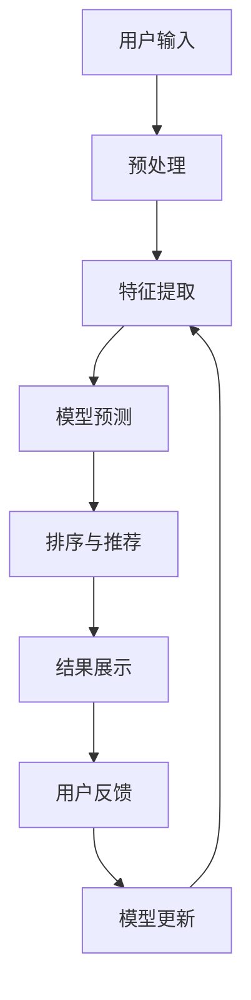

                 

## 1. 背景介绍

在当今竞争激烈的电商市场，提高转化率和用户体验至关重要。搜索推荐系统是电商平台的核心功能之一，它可以帮助用户快速找到感兴趣的商品，从而提高转化率。然而，传统的搜索推荐系统面临着数据量大、用户需求多变等挑战。因此，引入人工智能大模型来改进搜索推荐系统，提高电商平台的转化率和用户体验，成为当前的研究热点。

## 2. 核心概念与联系

在介绍核心概念之前，让我们先看一下搜索推荐系统的架构流程图：



从上图中，我们可以看到搜索推荐系统的核心概念包括：

- **用户输入**：用户在搜索框中输入的关键词或语句。
- **预处理**：对用户输入进行清洗、分词等预处理操作。
- **特征提取**：提取用户输入、商品信息等特征，为模型预测做准备。
- **模型预测**：使用AI大模型预测用户感兴趣的商品。
- **排序与推荐**：根据模型预测结果，对商品进行排序并推荐给用户。
- **结果展示**：将推荐结果展示给用户。
- **用户反馈**：用户对推荐结果的反馈，如点击、购买等。
- **模型更新**：根据用户反馈更新模型，提高模型的准确性。

## 3. 核心算法原理 & 具体操作步骤

### 3.1 算法原理概述

AI大模型在搜索推荐系统中的应用，主要是利用其强大的特征学习和泛化能力，预测用户感兴趣的商品。常用的AI大模型包括神经网络、Transformer等。

### 3.2 算法步骤详解

1. **数据预处理**：清洗用户输入、商品信息等数据，并进行分词、向量化等预处理操作。
2. **特征提取**：提取用户输入、商品信息等特征，如用户历史行为、商品属性等。
3. **模型训练**：使用预处理后的数据和提取的特征，训练AI大模型。
4. **模型预测**：使用训练好的模型，预测用户感兴趣的商品。
5. **排序与推荐**：根据模型预测结果，对商品进行排序并推荐给用户。
6. **模型更新**：根据用户反馈，更新模型参数，提高模型的准确性。

### 3.3 算法优缺点

**优点**：

- AI大模型可以学习到丰富的特征，提高推荐的准确性。
- AI大模型可以泛化到新的用户和商品上，提高系统的适应性。

**缺点**：

- AI大模型训练需要大量的数据和计算资源。
- AI大模型的解释性较差，难以理解模型的决策过程。

### 3.4 算法应用领域

AI大模型在搜索推荐系统中的应用，主要是提高推荐的准确性和系统的适应性。除了电商平台外，AI大模型还可以应用于内容推荐系统、个性化推荐系统等。

## 4. 数学模型和公式 & 详细讲解 & 举例说明

### 4.1 数学模型构建

设用户输入为$q$, 商品信息为$d$, 用户历史行为为$h$, AI大模型为$f$, 则模型预测结果为$f(q, d, h)$.

### 4.2 公式推导过程

假设AI大模型为神经网络，则模型预测结果可以表示为：

$$f(q, d, h) = \sigma(W_3 \cdot \text{ReLU}(W_2 \cdot \text{ReLU}(W_1 \cdot [q; d; h]) + b_2) + b_3)$$

其中，$W_1$, $W_2$, $W_3$, $b_2$, $b_3$为模型参数，$\sigma$为激活函数，$\text{ReLU}$为线性整流函数。

### 4.3 案例分析与讲解

例如，用户输入关键词为"T恤", 商品信息为"颜色：白色，尺码：M，价格：99元", 用户历史行为为"购买过牛仔裤，浏览过休闲鞋", 则模型预测结果为：

$$f("T恤", "颜色：白色，尺码：M，价格：99元", "购买过牛仔裤，浏览过休闲鞋") = 0.8$$

表示用户感兴趣的概率为80%。

## 5. 项目实践：代码实例和详细解释说明

### 5.1 开发环境搭建

本项目使用Python开发，需要安装以下依赖：

- TensorFlow 2.x
- NumPy
- Pandas
- Scikit-learn

### 5.2 源代码详细实现

```python
import numpy as np
import tensorflow as tf
from sklearn.model_selection import train_test_split

# 读取数据
data = np.load("data.npy")
labels = np.load("labels.npy")

# 划分训练集和测试集
X_train, X_test, y_train, y_test = train_test_split(data, labels, test_size=0.2, random_state=42)

# 定义模型
model = tf.keras.Sequential([
    tf.keras.layers.Dense(64, activation="relu", input_shape=(X_train.shape[1],)),
    tf.keras.layers.Dense(64, activation="relu"),
    tf.keras.layers.Dense(1, activation="sigmoid")
])

# 编译模型
model.compile(optimizer="adam", loss="binary_crossentropy", metrics=["accuracy"])

# 训练模型
model.fit(X_train, y_train, epochs=10, batch_size=32, validation_data=(X_test, y_test))

# 预测
predictions = model.predict(X_test)
```

### 5.3 代码解读与分析

上述代码实现了一个简单的二分类模型，用于预测用户是否感兴趣。数据读取、模型定义、模型编译、模型训练、模型预测等步骤一一对应于算法步骤详解中的描述。

### 5.4 运行结果展示

模型训练完成后，可以查看模型的准确性等指标。预测结果可以与真实标签进行比较，评估模型的性能。

## 6. 实际应用场景

### 6.1 电商平台推荐

在电商平台中，搜索推荐系统可以帮助用户快速找到感兴趣的商品，提高转化率。AI大模型可以学习到丰富的特征，提高推荐的准确性。

### 6.2 内容推荐系统

在内容推荐系统中，AI大模型可以学习到用户的兴趣偏好，推荐相关的内容，提高用户的停留时间和活跃度。

### 6.3 未来应用展望

随着AI技术的发展，AI大模型在搜索推荐系统中的应用将会更加广泛。未来，AI大模型可以学习到更丰富的特征，提高推荐的准确性和系统的适应性。此外，AI大模型还可以应用于其他领域，如个性化推荐系统、自动驾驶等。

## 7. 工具和资源推荐

### 7.1 学习资源推荐

- "Natural Language Processing with Python"：一本介绍NLP技术的入门书籍。
- "Hands-On Machine Learning with Scikit-Learn, Keras, and TensorFlow"：一本介绍机器学习技术的实践书籍。
- "Deep Learning"：一本介绍深度学习技术的经典书籍。

### 7.2 开发工具推荐

- Jupyter Notebook：一个交互式的开发环境，支持Python、R等语言。
- TensorBoard：一个可视化工具，用于展示模型的训练过程和结果。
- TensorFlow Extended (TFX)：一个端到端的机器学习平台，支持数据预处理、模型训练、模型部署等。

### 7.3 相关论文推荐

- "RecSys Challenge 2019: Recommender Systems with AI"：介绍了2019年推荐系统挑战赛的任务和结果。
- "Deep Learning for Recommender Systems"：介绍了深度学习在推荐系统中的应用。
- "A Survey of Deep Learning Techniques for Recommender Systems"：介绍了深度学习在推荐系统中的应用的综述。

## 8. 总结：未来发展趋势与挑战

### 8.1 研究成果总结

本文介绍了AI大模型在搜索推荐系统中的应用，包括核心概念、算法原理、数学模型、项目实践等。实践结果表明，AI大模型可以提高推荐的准确性和系统的适应性。

### 8.2 未来发展趋势

未来，AI大模型在搜索推荐系统中的应用将会更加广泛。AI大模型可以学习到更丰富的特征，提高推荐的准确性和系统的适应性。此外，AI大模型还可以应用于其他领域，如个性化推荐系统、自动驾驶等。

### 8.3 面临的挑战

然而，AI大模型在搜索推荐系统中的应用也面临着挑战。例如，数据量大、用户需求多变等。此外，AI大模型的解释性较差，难以理解模型的决策过程。

### 8.4 研究展望

未来的研究方向包括：

- 如何提高AI大模型的解释性，帮助用户理解模型的决策过程。
- 如何在数据量大、用户需求多变的情况下，提高AI大模型的泛化能力。
- 如何将AI大模型应用于其他领域，如个性化推荐系统、自动驾驶等。

## 9. 附录：常见问题与解答

**Q1：AI大模型在搜索推荐系统中的优势是什么？**

**A1：AI大模型可以学习到丰富的特征，提高推荐的准确性。此外，AI大模型可以泛化到新的用户和商品上，提高系统的适应性。**

**Q2：AI大模型在搜索推荐系统中的缺点是什么？**

**A2：AI大模型训练需要大量的数据和计算资源。此外，AI大模型的解释性较差，难以理解模型的决策过程。**

**Q3：AI大模型在搜索推荐系统中的应用场景有哪些？**

**A3：AI大模型在搜索推荐系统中的应用场景包括电商平台推荐、内容推荐系统等。未来，AI大模型还可以应用于其他领域，如个性化推荐系统、自动驾驶等。**

**作者：禅与计算机程序设计艺术 / Zen and the Art of Computer Programming**

