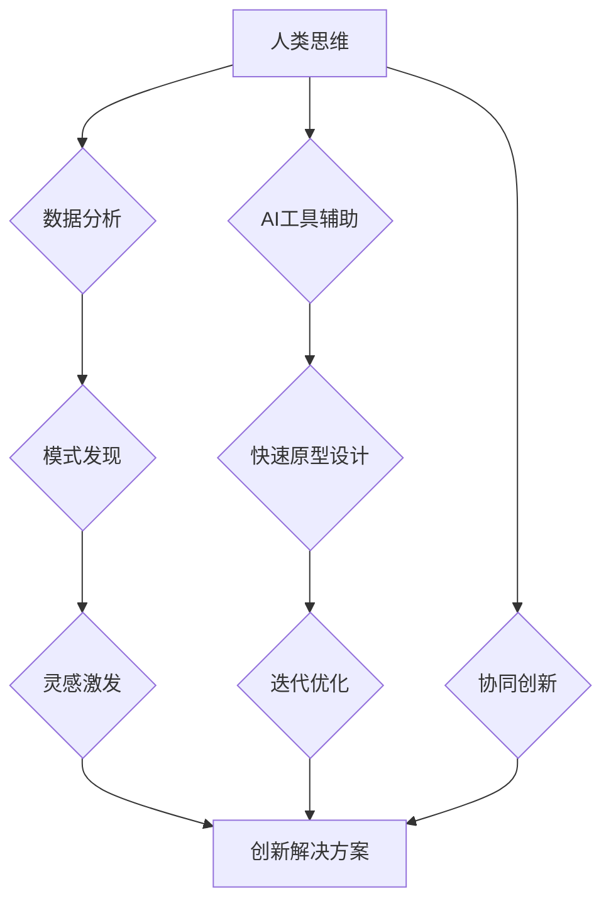

                 

## 数字创造力激发器：AI驱动的创新思维培养

> 关键词：人工智能、创新思维、算法、数学模型、代码实践、应用场景、未来趋势

## 1. 背景介绍

在当今科技飞速发展的时代，人工智能（AI）正以惊人的速度改变着我们生活的方方面面。从自动驾驶汽车到个性化医疗，从智能家居到虚拟助手，AI技术的应用无处不在。然而，AI技术的进步不仅仅体现在功能的强大，更重要的是它对人类思维方式和创造力的深刻影响。

传统的创新思维往往依赖于人类的经验、直觉和灵感，而AI技术的出现为我们提供了一种全新的视角和工具，能够激发和增强人类的创造力。AI算法能够分析海量数据，发现隐藏的模式和趋势，为人类提供新的灵感和创意。同时，AI技术也能够帮助人类快速原型设计、迭代优化，加速创新成果的落地。

## 2. 核心概念与联系

### 2.1  创新思维

创新思维是指能够产生新颖、独特、有价值的思想和解决方案的能力。它需要具备以下特征：

* **开放性:** 愿意接受新的信息和观点，打破固有的思维模式。
* **好奇心:** 对未知事物充满兴趣，不断探索和求知。
* **联想能力:** 能够将不同的事物联系起来，发现新的关联和可能性。
* **批判性思维:** 能够对信息进行分析和评估，识别问题和提出解决方案。

### 2.2  人工智能

人工智能是指模拟人类智能行为的计算机系统。它涵盖了多个领域，包括机器学习、深度学习、自然语言处理、计算机视觉等。

### 2.3  AI驱动的创新思维

AI驱动的创新思维是指利用人工智能技术来激发和增强人类的创造力。它通过以下方式实现：

* **数据驱动:** AI算法能够分析海量数据，发现隐藏的模式和趋势，为人类提供新的灵感和创意。
* **智能辅助:** AI工具能够帮助人类快速原型设计、迭代优化，加速创新成果的落地。
* **协同创新:** 人工智能可以与人类协同工作，共同解决复杂问题，促进创新突破。

**Mermaid 流程图**



## 3. 核心算法原理 & 具体操作步骤

### 3.1  算法原理概述

AI驱动的创新思维主要依赖于以下核心算法：

* **机器学习:**  通过训练数据，让算法自动学习并发现模式。
* **深度学习:**  利用多层神经网络，模拟人类大脑的学习过程，实现更复杂的模式识别和预测。
* **自然语言处理:**  使计算机能够理解和处理人类语言，例如文本生成、翻译、问答等。
* **计算机视觉:**  使计算机能够“看”图像和视频，例如图像识别、物体检测、场景理解等。

### 3.2  算法步骤详解

以机器学习为例，其核心步骤包括：

1. **数据收集:** 收集与目标任务相关的海量数据。
2. **数据预处理:** 对数据进行清洗、转换、特征提取等处理，使其适合算法训练。
3. **模型选择:** 根据任务需求选择合适的机器学习算法模型。
4. **模型训练:** 利用训练数据，调整模型参数，使其能够准确预测或分类。
5. **模型评估:** 使用测试数据评估模型的性能，并进行调优。
6. **模型部署:** 将训练好的模型部署到实际应用场景中。

### 3.3  算法优缺点

**优点:**

* **自动化:**  能够自动学习和发现模式，减少人工干预。
* **精准度:**  能够实现高精度预测和分类，提高决策效率。
* **可扩展性:**  能够处理海量数据，满足大规模应用需求。

**缺点:**

* **数据依赖:**  算法性能依赖于训练数据的质量和数量。
* **黑盒效应:**  一些算法的决策过程难以解释，缺乏透明度。
* **伦理问题:**  算法可能存在偏见和歧视，需要谨慎应用。

### 3.4  算法应用领域

AI算法广泛应用于各个领域，例如：

* **医疗保健:**  疾病诊断、药物研发、个性化治疗。
* **金融科技:**  风险评估、欺诈检测、投资决策。
* **制造业:**  智能制造、质量控制、预测维护。
* **零售业:**  个性化推荐、库存管理、客户服务。

## 4. 数学模型和公式 & 详细讲解 & 举例说明

### 4.1  数学模型构建

AI算法的数学模型通常基于概率论、统计学和线性代数等数学基础。例如，机器学习中的线性回归模型可以表示为：

$$y = w_0 + w_1x_1 + w_2x_2 + ... + w_nx_n + \epsilon$$

其中：

* $y$ 是预测结果
* $w_0, w_1, w_2, ..., w_n$ 是模型参数
* $x_1, x_2, ..., x_n$ 是输入特征
* $\epsilon$ 是误差项

### 4.2  公式推导过程

模型参数的学习过程通常使用梯度下降算法，其核心思想是通过不断调整参数，使模型预测结果与实际结果之间的误差最小化。梯度下降算法的公式如下：

$$w_i = w_i - \alpha \frac{\partial Loss}{\partial w_i}$$

其中：

* $w_i$ 是模型参数
* $\alpha$ 是学习率
* $Loss$ 是损失函数，用于衡量模型预测结果与实际结果之间的误差
* $\frac{\partial Loss}{\partial w_i}$ 是损失函数对参数 $w_i$ 的梯度

### 4.3  案例分析与讲解

例如，在图像分类任务中，我们可以使用卷积神经网络（CNN）模型。CNN模型利用卷积操作和池化操作来提取图像特征，并通过全连接层进行分类。

CNN模型的数学模型非常复杂，涉及到大量的矩阵运算和激活函数。通过训练大量的图像数据，CNN模型能够学习到图像特征的表示，并实现高精度的图像分类。

## 5. 项目实践：代码实例和详细解释说明

### 5.1  开发环境搭建

为了实现AI驱动的创新思维，我们需要搭建一个合适的开发环境。常用的开发环境包括：

* **Python:**  Python是一种流行的编程语言，拥有丰富的AI库和工具，例如TensorFlow、PyTorch、Scikit-learn等。
* **Jupyter Notebook:**  Jupyter Notebook是一种交互式编程环境，方便进行代码编写、调试和可视化。
* **云计算平台:**  例如AWS、Azure、Google Cloud等，提供强大的计算资源和AI服务。

### 5.2  源代码详细实现

以下是一个简单的机器学习代码实例，用于预测房价：

```python
import pandas as pd
from sklearn.model_selection import train_test_split
from sklearn.linear_model import LinearRegression
from sklearn.metrics import mean_squared_error

# 加载房价数据
data = pd.read_csv('house_price.csv')

# 选择特征和目标变量
features = ['size', 'location', 'bedrooms']
target = 'price'

# 将数据分为训练集和测试集
X_train, X_test, y_train, y_test = train_test_split(data[features], data[target], test_size=0.2)

# 创建线性回归模型
model = LinearRegression()

# 训练模型
model.fit(X_train, y_train)

# 预测测试集数据
y_pred = model.predict(X_test)

# 计算模型性能
mse = mean_squared_error(y_test, y_pred)
print(f'Mean Squared Error: {mse}')
```

### 5.3  代码解读与分析

这段代码首先加载房价数据，然后选择特征和目标变量。接着，将数据分为训练集和测试集，用于训练和评估模型。

代码创建了一个线性回归模型，并使用训练集数据进行训练。训练完成后，模型能够预测新的房价数据。最后，代码计算了模型的性能指标，即均方误差（MSE）。

### 5.4  运行结果展示

运行这段代码后，会输出模型的均方误差值。MSE值越小，模型的预测精度越高。

## 6. 实际应用场景

AI驱动的创新思维已经应用于各个领域，例如：

### 6.1  药物研发

AI算法能够分析大量的生物数据，发现潜在的药物靶点和候选药物，加速药物研发过程。

### 6.2  材料科学

AI算法能够模拟材料的性能，预测材料的结构和性质，帮助科学家设计新型材料。

### 6.3  艺术创作

AI算法能够生成音乐、绘画、诗歌等艺术作品，激发人类的艺术灵感。

### 6.4  未来应用展望

未来，AI驱动的创新思维将更加深入地融入到人类生活的各个方面，例如：

* **个性化教育:**  AI算法能够根据学生的学习情况，提供个性化的学习方案和辅导。
* **智能家居:**  AI算法能够理解用户的需求，自动控制家居环境，提高生活舒适度。
* **自动驾驶:**  AI算法能够帮助汽车自主驾驶，提高交通安全和效率。

## 7. 工具和资源推荐

### 7.1  学习资源推荐

* **在线课程:**  Coursera、edX、Udacity等平台提供丰富的AI课程。
* **书籍:**  《深度学习》、《机器学习实战》等书籍是学习AI的基础。
* **开源项目:**  TensorFlow、PyTorch等开源项目提供了丰富的代码示例和学习资源。

### 7.2  开发工具推荐

* **Python:**  Python是一种流行的编程语言，拥有丰富的AI库和工具。
* **Jupyter Notebook:**  Jupyter Notebook是一种交互式编程环境，方便进行代码编写、调试和可视化。
* **云计算平台:**  例如AWS、Azure、Google Cloud等，提供强大的计算资源和AI服务。

### 7.3  相关论文推荐

* **《ImageNet Classification with Deep Convolutional Neural Networks》**
* **《Attention Is All You Need》**
* **《BERT: Pre-training of Deep Bidirectional Transformers for Language Understanding》**

## 8. 总结：未来发展趋势与挑战

### 8.1  研究成果总结

AI驱动的创新思维已经取得了显著的成果，在各个领域都展现出巨大的潜力。

### 8.2  未来发展趋势

未来，AI驱动的创新思维将朝着以下方向发展：

* **更强大的算法:**  研究更强大的AI算法，例如通用人工智能（AGI）。
* **更广泛的应用:**  将AI技术应用到更多领域，例如教育、医疗、艺术等。
* **更人性化的交互:**  开发更人性化的AI交互方式，例如自然语言交互、情感识别等。

### 8.3  面临的挑战

AI驱动的创新思维也面临着一些挑战：

* **数据安全:**  保护AI算法训练数据和模型的安全。
* **算法偏见:**  解决AI算法中的偏见问题，确保公平公正。
* **伦理问题:**  探讨AI技术的伦理问题，例如责任归属、隐私保护等。

### 8.4  研究展望

未来，我们需要继续加强对AI技术的研发和应用，并积极应对AI带来的挑战，推动AI技术更好地服务于人类社会。

## 9. 附录：常见问题与解答

**Q1:  AI驱动的创新思维需要哪些技术基础？**

**A1:**  AI驱动的创新思维需要掌握以下技术基础：

* **编程语言:**  例如Python
* **机器学习算法:**  例如线性回归、决策树、支持向量机等
* **数据处理:**  例如数据清洗、特征提取等
* **数学基础:**  例如线性代数、概率论等

**Q2:  如何评估AI驱动的创新思维的有效性？**

**A2:**  评估AI驱动的创新思维的有效性可以从以下几个方面考虑：

* **创新成果的数量和质量:**  AI技术是否能够帮助产生新的想法和解决方案。
* **创新成果的落地情况:**  AI技术是否能够帮助将创新成果转化为实际应用。
* **创新过程的效率:**  AI技术是否能够加速创新过程。


作者：禅与计算机程序设计艺术 / Zen and the Art of Computer Programming 
<end_of_turn>

