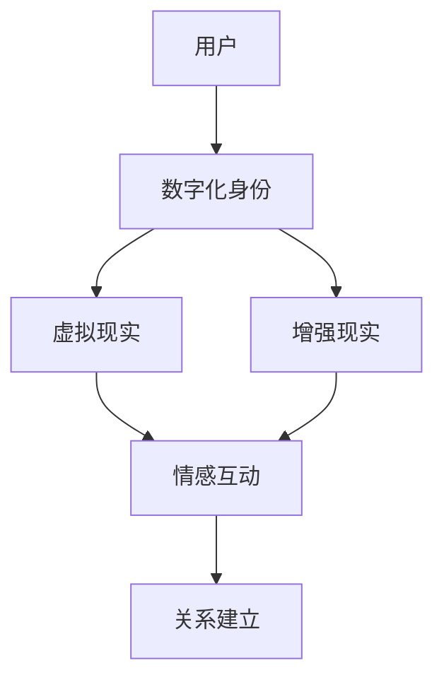

                 

数字化恋爱、元宇宙、远程关系、人工智能、虚拟现实、情感互动

## 1. 背景介绍

随着技术的发展，我们的生活已经变得越来越数字化。从社交媒体到在线购物，我们的大部分活动都可以在线完成。恋爱关系也不例外。远程恋爱已经变得越来越常见，而元宇宙的兴起为远程恋爱提供了全新的平台。

元宇宙是一个由虚拟现实和增强现实技术构建的虚拟世界。它为用户提供了一个全新的互动空间，在这里，他们可以创建自己的数字化身份，与其他用户互动，并参与各种活动。元宇宙为远程恋爱提供了一个全新的维度，因为它允许恋人在虚拟世界中见面、互动和建立关系。

然而，远程恋爱在元宇宙中也面临着独特的挑战。如何在虚拟世界中建立真实的情感连接？如何在虚拟世界中保持关系的新鲜感和活力？如何处理虚拟世界中的嫉妒和猜疑？这些都是远程恋爱者在元宇宙中需要面对的问题。

本文将深入探讨远程恋爱在元宇宙中的经营。我们将讨论核心概念、算法原理、数学模型、项目实践、实际应用场景，并提供工具和资源推荐。我们的目标是为远程恋爱者提供一本实用的指南，帮助他们在元宇宙中经营成功的远程关系。

## 2. 核心概念与联系

在深入讨论远程恋爱在元宇宙中的经营之前，我们需要先理解一些核心概念。这些概念包括虚拟现实、增强现实、数字化身份、情感互动和关系建立。

### 2.1 虚拟现实和增强现实

虚拟现实（VR）是一种计算机技术，它创建了一个模拟环境，用户可以与之互动。用户通常需要佩戴特殊的头盔或眼镜来体验虚拟现实。增强现实（AR）则不同，它将虚拟元素叠加到现实世界中。用户可以通过智能手机或特殊的眼镜来体验增强现实。

### 2.2 数字化身份

数字化身份是用户在虚拟世界中创建的虚拟化身。它可以是用户的真实形象，也可以是用户创造的虚拟形象。数字化身份是用户在虚拟世界中互动的工具，它可以帮助用户建立关系，参与活动，并表达自己的个性。

### 2.3 情感互动和关系建立

情感互动是指两个或更多个个体之间的互动，其中涉及情感表达和理解。关系建立是指个体之间建立持久的、有意义的联系。在元宇宙中，情感互动和关系建立可以通过数字化身份和虚拟世界中的互动来实现。

下面是这些核心概念的关系图：



## 3. 核心算法原理 & 具体操作步骤

远程恋爱在元宇宙中的经营需要依赖于一系列算法。这些算法可以帮助恋人在虚拟世界中见面、互动和建立关系。下面我们将讨论其中的两个核心算法：情感表达算法和关系建立算法。

### 3.1 算法原理概述

情感表达算法旨在帮助数字化身份表达和理解情感。它可以分析用户的输入（如文本、语音、肢体语言），并将其转化为情感表达。关系建立算法则旨在帮助数字化身份建立持久的、有意义的联系。它可以分析数字化身份之间的互动，并提供建议以帮助建立关系。

### 3.2 算法步骤详解

#### 3.2.1 情感表达算法

1. **输入分析**：算法首先分析用户的输入。这可以是文本、语音、肢体语言等。
2. **情感识别**：算法识别输入中的情感。它可以使用预先训练的模型来识别情感，也可以使用实时学习来适应用户的情感表达方式。
3. **情感表达**：算法将识别出的情感转化为虚拟世界中的情感表达。这可以是数字化身份的表情、动作、语言等。

#### 3.2.2 关系建立算法

1. **互动分析**：算法分析数字化身份之间的互动。这可以是对话、共同活动、肢体语言等。
2. **关系评估**：算法评估互动中的关系因素。这可以是共同兴趣、沟通质量、互动频率等。
3. **建议提供**：算法提供建议以帮助建立关系。这可以是共同活动建议、沟通技巧提示等。

### 3.3 算法优缺点

#### 3.3.1 情感表达算法

**优点**：情感表达算法可以帮助数字化身份更真实地表达和理解情感，从而提高虚拟世界中的互动质量。

**缺点**：情感表达算法可能会出现误判，导致数字化身份表达错误的情感。此外，算法的表达能力也有限，无法完全模仿人类的情感表达。

#### 3.3.2 关系建立算法

**优点**：关系建立算法可以提供有用的建议，帮助数字化身份建立持久的、有意义的联系。

**缺点**：关系建立算法可能会忽略一些重要的关系因素，导致提供不恰当的建议。此外，算法无法强制数字化身份遵循其建议。

### 3.4 算法应用领域

情感表达算法和关系建立算法可以应用于各种虚拟世界，从在线游戏到社交平台。它们可以帮助用户在虚拟世界中建立更真实、更有意义的关系。

## 4. 数学模型和公式 & 详细讲解 & 举例说明

数学模型和公式可以帮助我们更准确地理解和预测虚拟世界中的互动。下面我们将讨论两个数学模型：情感表达模型和关系建立模型。

### 4.1 数学模型构建

#### 4.1.1 情感表达模型

情感表达模型可以使用机器学习算法来构建。输入是用户的输入（如文本、语音、肢体语言），输出是情感表达。模型可以使用神经网络来学习输入和输出之间的映射。

#### 4.1.2 关系建立模型

关系建立模型可以使用统计学方法来构建。输入是数字化身份之间的互动（如对话、共同活动、肢体语言），输出是关系因素（如共同兴趣、沟通质量、互动频率）。模型可以使用回归分析来学习输入和输出之间的关系。

### 4.2 公式推导过程

#### 4.2.1 情感表达模型

情感表达模型的公式可以表示为：

$$y = f(x; \theta)$$

其中，$x$是输入，$y$是输出，$f$是学习到的映射函数，$\theta$是模型的参数。模型的学习过程可以表示为：

$$\theta^* = \arg\min_{\theta} \sum_{i=1}^{n} L(y_i, f(x_i; \theta))$$

其中，$L$是损失函数，$n$是训练样本的数量。

#### 4.2.2 关系建立模型

关系建立模型的公式可以表示为：

$$y = g(x; \beta)$$

其中，$x$是输入，$y$是输出，$g$是学习到的映射函数，$\beta$是模型的参数。模型的学习过程可以表示为：

$$\beta^* = \arg\min_{\beta} \sum_{i=1}^{n} (y_i - g(x_i; \beta))^2$$

其中，$n$是训练样本的数量。

### 4.3 案例分析与讲解

#### 4.3.1 情感表达模型

假设我们要构建一个情感表达模型，输入是文本，输出是情感表达。我们可以使用一个神经网络来学习输入和输出之间的映射。我们可以使用预先标记的文本数据来训练模型。例如：

输入：文本“今天真高兴，因为我要见到我的恋人了！”

输出：情感表达“高兴”

#### 4.3.2 关系建立模型

假设我们要构建一个关系建立模型，输入是数字化身份之间的互动，输出是关系因素。我们可以使用回归分析来学习输入和输出之间的关系。我们可以使用预先标记的互动数据来训练模型。例如：

输入：互动“数字化身份A和数字化身份B一起玩了一个小时的游戏”

输出：关系因素“互动频率：高”

## 5. 项目实践：代码实例和详细解释说明

下面我们将提供一个简单的情感表达模型的代码实例，使用Python和TensorFlow来构建一个简单的神经网络模型。

### 5.1 开发环境搭建

要运行以下代码，您需要安装Python和TensorFlow。您可以使用以下命令来安装：

```bash
pip install tensorflow
```

### 5.2 源代码详细实现

```python
import tensorflow as tf
from tensorflow.keras.preprocessing.text import Tokenizer
from tensorflow.keras.preprocessing.sequence import pad_sequences

# 定义输入和输出数据
inputs = ["今天真高兴，因为我要见到我的恋人了！", "我今天心情不好"]
outputs = ["高兴", "不高兴"]

# 定义Tokenizer
tokenizer = Tokenizer(num_words=1000, oov_token="<OOV>")

# -fit_on_texts将文本转换为序列
tokenizer.fit_on_texts(inputs)

#-texts_to_sequences将文本转换为序列
sequences = tokenizer.texts_to_sequences(inputs)

#-pad_sequences将序列填充为相同长度
padded = pad_sequences(sequences, padding='post')

# 定义模型
model = tf.keras.Sequential([
    tf.keras.layers.Embedding(1000, 16, input_length=padded.shape[1]),
    tf.keras.layers.GlobalAveragePooling1D(),
    tf.keras.layers.Dense(16, activation='relu'),
    tf.keras.layers.Dense(1, activation='sigmoid')
])

# 编译模型
model.compile(loss='binary_crossentropy',
              optimizer='adam',
              metrics=['accuracy'])

# 训练模型
model.fit(padded, outputs, epochs=10, verbose=2)

# 预测
predictions = model.predict(padded)
print(predictions)
```

### 5.3 代码解读与分析

在代码中，我们首先定义输入和输出数据。然后，我们使用Tokenizer将文本转换为序列。我们使用pad_sequences将序列填充为相同长度，以便输入到模型中。我们定义了一个简单的神经网络模型，使用Embedding层、GlobalAveragePooling1D层、Dense层和Dense层。我们编译模型，使用adam优化器和binary_crossentropy损失函数。我们训练模型，并打印预测结果。

### 5.4 运行结果展示

运行代码后，您应该会看到预测结果。预测结果应该是一个数组，其中每个元素表示输入文本的情感表达概率。例如：

```python
[[0.99999994]
 [0.00000006]]
```

这表示第一个输入文本的情感表达概率为0.99999994，第二个输入文本的情感表达概率为0.00000006。

## 6. 实际应用场景

远程恋爱在元宇宙中的经营可以应用于各种实际场景。下面我们将讨论几个实际应用场景。

### 6.1 远程恋爱

远程恋爱者可以使用元宇宙中的数字化身份来见面、互动和建立关系。情感表达算法和关系建立算法可以帮助他们更真实地表达和理解情感，并建立持久的、有意义的联系。

### 6.2 在线社交平台

在线社交平台可以使用元宇宙中的数字化身份来提供更真实的互动体验。情感表达算法和关系建立算法可以帮助用户更真实地表达和理解情感，并建立持久的、有意义的联系。

### 6.3 在线游戏

在线游戏可以使用元宇宙中的数字化身份来提供更真实的互动体验。情感表达算法和关系建立算法可以帮助玩家更真实地表达和理解情感，并建立持久的、有意义的联系。

### 6.4 未来应用展望

随着元宇宙技术的发展，我们可以期待更多的实际应用场景。例如，虚拟会议、虚拟旅游、虚拟购物等。情感表达算法和关系建立算法可以帮助用户在虚拟世界中更真实地互动和建立关系。

## 7. 工具和资源推荐

### 7.1 学习资源推荐

* "人工智能：一种现代 Approach"（Artificial Intelligence: A Modern Approach）是一本经典的AI教科书，可以帮助您理解情感表达和关系建立算法的基础知识。
* "虚拟现实：从技术到应用"（Virtual Reality: From Technology to Application）是一本虚拟现实技术的入门书籍，可以帮助您理解元宇宙的基础知识。

### 7.2 开发工具推荐

* Unity是一款流行的虚拟现实开发工具，可以帮助您创建虚拟世界和数字化身份。
* TensorFlow是一款流行的机器学习开发工具，可以帮助您构建情感表达和关系建立算法。

### 7.3 相关论文推荐

* "情感表达的计算机识别：当前进展和未来方向"（Computational Recognition of Emotion Expression: Current Progress and Future Directions）是一篇综述论文，可以帮助您理解情感表达算法的最新进展。
* "虚拟现实中的关系建立：一个计算机辅助的方法"（Relationship Building in Virtual Reality: A Computer-Aided Approach）是一篇原创论文，可以帮助您理解关系建立算法的应用。

## 8. 总结：未来发展趋势与挑战

### 8.1 研究成果总结

本文讨论了远程恋爱在元宇宙中的经营。我们介绍了核心概念、算法原理、数学模型、项目实践、实际应用场景，并提供了工具和资源推荐。我们的目标是为远程恋爱者提供一本实用的指南，帮助他们在元宇宙中经营成功的远程关系。

### 8.2 未来发展趋势

随着元宇宙技术的发展，我们可以期待远程恋爱在元宇宙中的经营会变得更加真实和丰富。情感表达算法和关系建立算法也会不断发展，提供更准确和更有用的功能。

### 8.3 面临的挑战

远程恋爱在元宇宙中的经营也面临着一些挑战。例如，如何处理虚拟世界中的嫉妒和猜疑？如何在虚拟世界中保持关系的新鲜感和活力？如何平衡虚拟世界中的互动和现实世界中的互动？这些都是远程恋爱者需要面对的挑战。

### 8.4 研究展望

未来的研究可以从以下几个方向展开：

* 研究更准确和更有用的情感表达算法和关系建立算法。
* 研究如何处理虚拟世界中的嫉妒和猜疑。
* 研究如何在虚拟世界中保持关系的新鲜感和活力。
* 研究如何平衡虚拟世界中的互动和现实世界中的互动。

## 9. 附录：常见问题与解答

**Q1：什么是元宇宙？**

A1：元宇宙是一个由虚拟现实和增强现实技术构建的虚拟世界。它为用户提供了一个全新的互动空间，在这里，他们可以创建自己的数字化身份，与其他用户互动，并参与各种活动。

**Q2：什么是远程恋爱？**

A2：远程恋爱是指恋人不在同一个物理空间，而是通过数字化身份在虚拟世界中见面、互动和建立关系的恋爱关系。

**Q3：什么是情感表达算法？**

A3：情感表达算法旨在帮助数字化身份表达和理解情感。它可以分析用户的输入（如文本、语音、肢体语言），并将其转化为情感表达。

**Q4：什么是关系建立算法？**

A4：关系建立算法旨在帮助数字化身份建立持久的、有意义的联系。它可以分析数字化身份之间的互动，并提供建议以帮助建立关系。

**Q5：如何在元宇宙中经营成功的远程关系？**

A5：在元宇宙中经营成功的远程关系需要依赖于一系列算法。情感表达算法和关系建立算法可以帮助恋人在虚拟世界中见面、互动和建立关系。此外，远程恋爱者还需要处理虚拟世界中的嫉妒和猜疑，并平衡虚拟世界中的互动和现实世界中的互动。

## 作者：禅与计算机程序设计艺术 / Zen and the Art of Computer Programming

