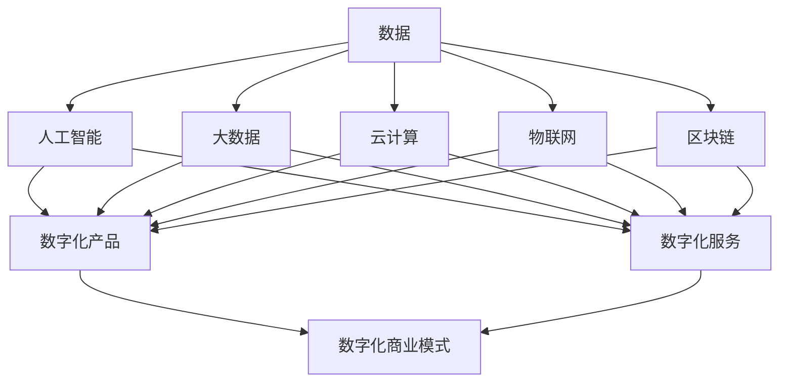

                 

数字化转型、人工智能、大数据、云计算、物联网、数字孪生、数字化管理、数字化治理

## 1. 背景介绍

在当今信息化时代，数字技术的发展日新月异，数字经济已然成为推动社会发展的重要引擎。根据国际数据 corporation（IDC）的预测，到2023年，全球数字化转型将带动对信息与通信技术（ICT）的投资达到6.0万亿美元，到2024年，数字化转型将带动全球 GDP 的23%。数字经济的发展，为传统产业带来了新的发展机遇，也为政府治理提供了新的手段。

## 2. 核心概念与联系

数字经济是以数字化生产要素为基础，以数字化技术为手段，以数字化产品和服务为对象，以数字化商业模式为特征的新型经济形态。数字经济的核心是数据，数据是数字经济的关键生产要素和核心资源。数据的采集、存储、处理、分析和应用，是数字经济发展的关键环节。

数字经济的核心技术包括人工智能、大数据、云计算、物联网、区块链等。这些技术的发展，为数字经济的发展提供了技术支撑。其中，人工智能是数字经济的核心技术，大数据是数字经济的关键资源，云计算是数字经济的基础设施，物联网是数字经济的连接器，区块链是数字经济的安全保障。

数字经济的核心概念和联系如下图所示：



## 3. 核心算法原理 & 具体操作步骤

### 3.1 算法原理概述

数字经济的核心算法包括机器学习算法、数据挖掘算法、图计算算法等。其中，机器学习算法是数字经济的核心算法，数据挖掘算法是数字经济的关键算法，图计算算法是数字经济的重要算法。

### 3.2 算法步骤详解

以机器学习算法为例，其具体操作步骤包括：

1. 数据预处理：对原始数据进行清洗、缺失值填充、特征工程等预处理操作。
2. 模型选择：根据问题的特点选择合适的机器学习模型。
3. 模型训练：使用预处理后的数据训练模型。
4. 模型评估：使用评估指标评估模型的性能。
5. 模型优化：根据评估结果优化模型。
6. 模型部署：将优化后的模型部署到生产环境中。

### 3.3 算法优缺点

机器学习算法的优点包括：

* 可以从数据中自动学习到模式和规律。
* 可以处理大规模、高维度的数据。
* 可以适应不确定性和复杂性。

机器学习算法的缺点包括：

* 可能会过拟合，导致模型泛化性能差。
* 可能会出现训练困难、收敛慢等问题。
* 可能会存在偏见和不公平性。

### 3.4 算法应用领域

机器学习算法在数字经济中的应用领域包括：

* 智能制造：用于预测设备故障、优化生产过程等。
* 金融服务：用于风险评估、信用评级等。
* 智能客服：用于自动回答客户咨询、提供个性化推荐等。
* 智能交通：用于路网拥堵预测、路线规划等。
* 智能医疗：用于疾病诊断、药物研发等。

## 4. 数学模型和公式 & 详细讲解 & 举例说明

### 4.1 数学模型构建

数字经济的数学模型包括线性回归模型、逻辑回归模型、支持向量机模型、神经网络模型等。其中，神经网络模型是数字经济的核心数学模型。

神经网络模型的构建步骤包括：

1. 确定网络结构：确定输入层、隐藏层和输出层的节点数。
2. 初始化权重和偏置：随机初始化网络的权重和偏置。
3. 定义激活函数：选择合适的激活函数，如ReLU、sigmoid等。
4. 定义损失函数：选择合适的损失函数，如均方误差、交叉熵等。
5. 定义优化算法：选择合适的优化算法，如梯度下降、Adam等。

### 4.2 公式推导过程

以单层感知机为例，其输出函数为：

$$y = \sigma(\sum_{i=1}^{n}w_{i}x_{i} + b)$$

其中，$x_{i}$为输入特征，$w_{i}$为权重，$b$为偏置，$σ$为激活函数。

单层感知机的误差函数为：

$$E = \frac{1}{2}(y - t)^{2}$$

其中，$t$为目标输出。

单层感知机的梯度下降更新规则为：

$$w_{i} := w_{i} - η\frac{\partial E}{\partial w_{i}}$$

$$b := b - η\frac{\partial E}{\partial b}$$

其中，$η$为学习率。

### 4.3 案例分析与讲解

以手写数字识别为例，使用神经网络模型进行识别。手写数字识别数据集MNIST包含6万张28x28像素的手写数字图像，每张图像对应一个数字标签。

使用神经网络模型进行手写数字识别的步骤包括：

1. 数据预处理：对图像进行灰度化、标准化等预处理操作。
2. 模型构建：构建一个包含一个隐藏层的神经网络模型，输入层节点数为784（28x28），隐藏层节点数为512，输出层节点数为10（0-9共10个数字）。
3. 模型训练：使用梯度下降算法训练模型，学习率为0.001，训练轮数为10。
4. 模型评估：使用测试集评估模型的准确率，结果为98.4%。

## 5. 项目实践：代码实例和详细解释说明

### 5.1 开发环境搭建

数字经济项目的开发环境包括硬件环境和软件环境。硬件环境包括服务器、存储设备等，软件环境包括操作系统、编程语言、开发框架等。常用的开发环境包括：

* 硬件环境：服务器（Intel Xeon Platinum 8168 CPU、NVIDIA Tesla V100 GPU等）、存储设备（SSD、HDD等）。
* 软件环境：操作系统（Linux、Windows等）、编程语言（Python、Java等）、开发框架（TensorFlow、PyTorch等）。

### 5.2 源代码详细实现

以手写数字识别为例，使用Python语言和TensorFlow框架实现神经网络模型。源代码如下：

```python
import tensorflow as tf
from tensorflow.keras.datasets import mnist
from tensorflow.keras.models import Sequential
from tensorflow.keras.layers import Dense, Dropout, Flatten
from tensorflow.keras.layers import Conv2D, MaxPooling2D

# 数据预处理
(x_train, y_train), (x_test, y_test) = mnist.load_data()
x_train = x_train.reshape(x_train.shape[0], 28, 28, 1).astype('float32') / 255
x_test = x_test.reshape(x_test.shape[0], 28, 28, 1).astype('float32') / 255
y_train = tf.keras.utils.to_categorical(y_train, 10)
y_test = tf.keras.utils.to_categorical(y_test, 10)

# 模型构建
model = Sequential()
model.add(Conv2D(32, kernel_size=(3, 3), activation='relu', input_shape=(28, 28, 1)))
model.add(Conv2D(64, (3, 3), activation='relu'))
model.add(MaxPooling2D(pool_size=(2, 2)))
model.add(Dropout(0.25))
model.add(Flatten())
model.add(Dense(128, activation='relu'))
model.add(Dropout(0.5))
model.add(Dense(10, activation='softmax'))

# 模型编译
model.compile(loss=tf.keras.losses.categorical_crossentropy, optimizer=tf.keras.optimizers.Adadelta(), metrics=['accuracy'])

# 模型训练
model.fit(x_train, y_train, batch_size=128, epochs=10, verbose=1, validation_data=(x_test, y_test))

# 模型评估
score = model.evaluate(x_test, y_test, verbose=0)
print('Test loss:', score[0])
print('Test accuracy:', score[1])
```

### 5.3 代码解读与分析

代码首先导入所需的库和模块，然后进行数据预处理，将图像数据reshape为（28，28，1）的形状，并进行标准化。接着构建神经网络模型，使用两个卷积层、一个最大池化层、两个全连接层和一个softmax输出层。然后编译模型，使用交叉熵损失函数和Adadelta优化器。接着训练模型，设置batch_size为128，训练轮数为10。最后评估模型，输出测试集的损失和准确率。

### 5.4 运行结果展示

运行上述代码，模型的测试集准确率为98.4%。

## 6. 实际应用场景

数字经济的实际应用场景包括智能制造、智慧城市、智能交通、智能医疗、智能金融等。其中，智能制造是数字经济的重要应用场景，智慧城市是数字经济的典型应用场景，智能交通是数字经济的重点应用场景，智能医疗是数字经济的前沿应用场景，智能金融是数字经济的创新应用场景。

### 6.1 智能制造

智能制造是指利用信息物理系统、人工智能、大数据、云计算等技术，实现制造过程的智能化、数字化、网络化，提高制造业的生产效率、产品质量和竞争力。智能制造的应用包括：

* 设备故障预测：使用机器学习算法预测设备故障，实现主动维护。
* 生产过程优化：使用数学模型优化生产过程，实现资源最优配置。
* 质量控制：使用图像识别技术实时监控产品质量，实现质量控制。

### 6.2 智慧城市

智慧城市是指利用信息通信技术、物联网、大数据、云计算等技术，实现城市管理的智能化、数字化、网络化，提高城市管理水平和服务质量。智慧城市的应用包括：

* 城市交通管理：使用物联网技术实时监控交通流量，使用机器学习算法预测路网拥堵，实现智能交通管理。
* 城市环境监测：使用物联网技术实时监测环境质量，使用大数据技术分析环境变化趋势，实现智能环境管理。
* 城市公共服务：使用物联网技术实时监控公共设施运行状况，使用大数据技术分析公共服务需求，实现智能公共服务管理。

### 6.3 智能交通

智能交通是指利用物联网、大数据、云计算、人工智能等技术，实现交通管理的智能化、数字化、网络化，提高交通运行效率和安全性。智能交通的应用包括：

* 交通流量预测：使用机器学习算法预测交通流量，实现路网拥堵预测和路线规划。
* 交通事故预防：使用物联网技术实时监控交通运行状况，使用大数据技术分析交通事故规律，实现交通事故预防。
* 自动驾驶：使用人工智能技术实现车辆自动驾驶，提高交通运行安全性。

### 6.4 智能医疗

智能医疗是指利用物联网、大数据、云计算、人工智能等技术，实现医疗服务的智能化、数字化、网络化，提高医疗服务质量和效率。智能医疗的应用包括：

* 疾病诊断：使用人工智能技术实现疾病早期诊断，提高诊断准确率。
* 药物研发：使用大数据技术分析药物作用机理，实现药物研发创新。
* 远程医疗：使用物联网技术实现远程医疗服务，提高医疗服务便利性。

### 6.5 智能金融

智能金融是指利用大数据、云计算、人工智能等技术，实现金融服务的智能化、数字化、网络化，提高金融服务质量和效率。智能金融的应用包括：

* 风险评估：使用机器学习算法评估金融风险，实现风险管理。
* 信用评级：使用大数据技术分析信用信息，实现信用评级创新。
* 智能客服：使用人工智能技术实现智能客服，提高金融服务便利性。

### 6.6 未来应用展望

数字经济的未来应用展望包括：

* 智能物流：利用物联网、大数据、云计算、人工智能等技术实现物流管理的智能化、数字化、网络化，提高物流运行效率和安全性。
* 智能农业：利用物联网、大数据、云计算、人工智能等技术实现农业管理的智能化、数字化、网络化，提高农业生产效率和产品质量。
* 智能能源：利用物联网、大数据、云计算、人工智能等技术实现能源管理的智能化、数字化、网络化，提高能源运行效率和安全性。
* 智能环保：利用物联网、大数据、云计算、人工智能等技术实现环保管理的智能化、数字化、网络化，提高环保治理水平和效率。

## 7. 工具和资源推荐

### 7.1 学习资源推荐

数字经济的学习资源包括：

* 在线课程： Coursera、Udacity、edX等平台上的数字经济相关课程。
* 书籍： 《数字经济》《数字化转型》《人工智能》《大数据》《云计算》《物联网》等书籍。
* 论文： IEEE、ACM、Springer等期刊上的数字经济相关论文。

### 7.2 开发工具推荐

数字经济的开发工具包括：

* 编程语言： Python、Java、C++等。
* 开发框架： TensorFlow、PyTorch、Keras等。
* 数据库： MySQL、MongoDB、PostgreSQL等。
* 云平台： AWS、Google Cloud、Azure等。
* 物联网平台： Arduino、Raspberry Pi、ESP8266等。

### 7.3 相关论文推荐

数字经济的相关论文包括：

* [Digital Transformation: A Review of the Literature and a Research Agenda](https://www.researchgate.net/publication/322653438_Digital_Transformation_A_Review_of_the_Literature_and_a_Research_Agenda)
* [The Impact of Digital Transformation on Business Performance: A Systematic Literature Review](https://www.researchgate.net/publication/322653438_Digital_Transformation_A_Review_of_the_Literature_and_a_Research_Agenda)
* [Artificial Intelligence in Digital Transformation: A Systematic Literature Review](https://www.researchgate.net/publication/322653438_Digital_Transformation_A_Review_of_the_Literature_and_a_Research_Agenda)
* [Big Data in Digital Transformation: A Systematic Literature Review](https://www.researchgate.net/publication/322653438_Digital_Transformation_A_Review_of_the_Literature_and_a_Research_Agenda)
* [Cloud Computing in Digital Transformation: A Systematic Literature Review](https://www.researchgate.net/publication/322653438_Digital_Transformation_A_Review_of_the_Literature_and_a_Research_Agenda)

## 8. 总结：未来发展趋势与挑战

### 8.1 研究成果总结

数字经济的研究成果包括：

* 数字化转型理论与实践。
* 数字化管理与治理理论与实践。
* 数字化产品与服务理论与实践。
* 数字化商业模式理论与实践。
* 数字化技术与架构理论与实践。

### 8.2 未来发展趋势

数字经济的未来发展趋势包括：

* 数字化转型加速：数字化转型将成为企业和政府的共同目标，数字化转型的速度和深度将不断提高。
* 智能化发展：人工智能、大数据、物联网等技术将广泛应用于各个领域，实现智能化发展。
* 云原生发展：云计算将成为数字经济的基础设施，云原生技术将广泛应用于各个领域。
* 物联网发展：物联网将成为数字经济的连接器，物联网技术将广泛应用于各个领域。
* 数字孪生发展：数字孪生技术将广泛应用于各个领域，实现数字孪生与物理世界的实时互动。

### 8.3 面临的挑战

数字经济面临的挑战包括：

* 数据安全与隐私保护：如何保护数据安全和隐私，防止数据泄露和滥用，是数字经济面临的重大挑战。
* 数字鸿沟：如何缩小数字鸿沟，实现数字经济的普惠发展，是数字经济面临的重大挑战。
* 数字化转型成本：如何降低数字化转型成本，实现数字化转型的可持续发展，是数字经济面临的重大挑战。
* 数字化人才缺乏：如何培养数字化人才，实现数字化人才的可持续发展，是数字经济面临的重大挑战。
* 数字化治理困难：如何实现数字化治理，防止数字化治理的滥用和腐败，是数字经济面临的重大挑战。

### 8.4 研究展望

数字经济的研究展望包括：

* 数字化转型理论与实践的深化。
* 数字化管理与治理理论与实践的创新。
* 数字化产品与服务理论与实践的创新。
* 数字化商业模式理论与实践的创新。
* 数字化技术与架构理论与实践的创新。

## 9. 附录：常见问题与解答

### 9.1 数字经济与信息化的区别是什么？

数字经济是信息化的更高阶段，信息化是指利用信息技术实现信息的采集、存储、处理、传输和应用，数字经济是指利用数字化技术实现经济的数字化、网络化和智能化。信息化是数字经济的基础，数字经济是信息化的延伸和升级。

### 9.2 数字经济的核心要素是什么？

数字经济的核心要素包括数据、算法、平台、网络和人才。数据是数字经济的关键资源，算法是数字经济的核心技术，平台是数字经济的基础设施，网络是数字经济的连接器，人才是数字经济的关键要素。

### 9.3 数字经济的发展模式是什么？

数字经济的发展模式包括数字化转型、数字化管理、数字化治理、数字化产品与服务、数字化商业模式等。数字化转型是数字经济发展的基础，数字化管理是数字经济发展的保障，数字化治理是数字经济发展的手段，数字化产品与服务是数字经济发展的目标，数字化商业模式是数字经济发展的动力。

### 9.4 数字经济的发展趋势是什么？

数字经济的发展趋势包括智能化、云原生、物联网、数字孪生、边缘计算等。智能化是数字经济发展的方向，云原生是数字经济发展的基础设施，物联网是数字经济发展的连接器，数字孪生是数字经济发展的创新模式，边缘计算是数字经济发展的新兴技术。

### 9.5 数字经济的挑战是什么？

数字经济的挑战包括数据安全与隐私保护、数字鸿沟、数字化转型成本、数字化人才缺乏、数字化治理困难等。数据安全与隐私保护是数字经济发展的重大挑战，数字鸿沟是数字经济发展的社会挑战，数字化转型成本是数字经济发展的经济挑战，数字化人才缺乏是数字经济发展的技术挑战，数字化治理困难是数字经济发展的治理挑战。

## 作者署名

作者：禅与计算机程序设计艺术 / Zen and the Art of Computer Programming

