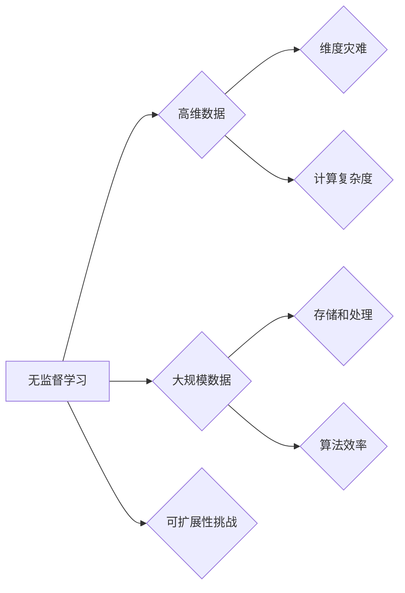

                 

## 无监督学习的可扩展性挑战:高维数据和大规模数据

> 关键词：无监督学习、高维数据、大规模数据、可扩展性、算法效率、数据降维、聚类、异常检测

## 1. 背景介绍

无监督学习作为机器学习的重要分支，旨在从未标记的数据中学习数据内在的结构和规律。它在数据挖掘、模式识别、图像处理等领域有着广泛的应用。然而，随着数据规模和维度不断增长，无监督学习算法的可扩展性面临着严峻的挑战。

高维数据是指数据维度非常高的场景，例如文本数据、图像数据、基因组数据等。高维数据带来的挑战主要体现在以下几个方面：

* **“维度灾难”**: 随着维度增加，数据点之间的距离变得更加相似，算法难以有效地区分数据点之间的差异。
* **计算复杂度**: 高维数据需要更多的计算资源和时间来进行处理和分析。
* **过拟合**: 高维数据容易导致模型过拟合，即模型在训练数据上表现良好，但在测试数据上表现较差。

大规模数据是指数据量非常庞大的场景，例如社交网络数据、传感器数据、电子商务数据等。大规模数据带来的挑战主要体现在以下几个方面：

* **存储和处理**: 大规模数据需要大量的存储空间和计算能力来进行处理和分析。
* **算法效率**: 传统的无监督学习算法在处理大规模数据时效率低下，难以满足实时处理的需求。
* **数据质量**: 大规模数据中可能包含大量的噪声和错误数据，需要进行数据清洗和预处理。

## 2. 核心概念与联系

无监督学习的核心目标是发现数据中的潜在结构和规律，而高维数据和大规模数据的存在使得这一目标更加复杂。

**2.1 无监督学习算法**

无监督学习算法主要包括以下几种：

* **聚类**: 将数据点按照相似性进行分组。
* **降维**: 将高维数据映射到低维空间，同时保留数据的关键信息。
* **异常检测**: 识别数据集中与众不同的数据点。

**2.2 高维数据和大规模数据的影响**

高维数据和大规模数据对无监督学习算法的影响主要体现在以下几个方面：

* **计算复杂度**: 高维数据和大规模数据都会增加算法的计算复杂度，降低算法的效率。
* **数据稀疏性**: 高维数据往往具有数据稀疏性，即数据点之间的距离非常远，导致算法难以发现数据中的潜在结构。
* **过拟合**: 高维数据容易导致模型过拟合，大规模数据也可能导致模型过拟合。

**2.3 Mermaid 流程图**



## 3. 核心算法原理 & 具体操作步骤

### 3.1  算法原理概述

为了应对高维数据和大规模数据的挑战，需要开发出高效可扩展的无监督学习算法。一些常用的算法包括：

* **k-means聚类**: 是一种基于距离的聚类算法，将数据点划分为k个簇。
* **主成分分析(PCA)**: 是一种降维算法，通过线性变换将高维数据映射到低维空间。
* **t-SNE**: 是一种非线性降维算法，能够更好地保留数据的局部结构。
* **随机森林**: 是一种基于决策树的算法，可以用于聚类、降维和异常检测。

### 3.2  算法步骤详解

以k-means聚类为例，详细说明其算法步骤：

1. **初始化**: 随机选择k个数据点作为初始聚类中心。
2. **分配**: 将每个数据点分配到距离其最近的聚类中心所属的簇。
3. **更新**: 计算每个簇的均值，并将均值作为新的聚类中心。
4. **重复**: 重复步骤2和步骤3，直到聚类中心不再发生变化或达到最大迭代次数。

### 3.3  算法优缺点

不同的无监督学习算法具有不同的优缺点，需要根据具体应用场景选择合适的算法。

* **k-means聚类**: 优点：简单易实现，计算效率高。缺点：对初始聚类中心的选择敏感，难以处理非球形簇。
* **PCA**: 优点：能够有效地降维，保留数据的关键信息。缺点：只能处理线性关系的数据。
* **t-SNE**: 优点：能够更好地保留数据的局部结构。缺点：计算复杂度高，难以处理大规模数据。
* **随机森林**: 优点：能够处理高维数据和非线性关系的数据。缺点：训练时间长，难以解释模型的决策过程。

### 3.4  算法应用领域

无监督学习算法在各个领域都有广泛的应用，例如：

* **图像识别**: 使用聚类算法将图像分割成不同的区域，识别图像中的物体。
* **文本挖掘**: 使用降维算法将文本数据降维，提取文本中的主题和关键词。
* **异常检测**: 使用异常检测算法识别网络攻击、欺诈行为等异常数据。

## 4. 数学模型和公式 & 详细讲解 & 举例说明

### 4.1  数学模型构建

**4.1.1 k-means聚类数学模型**

k-means聚类算法的目标是找到k个聚类中心，使得每个数据点到其所属聚类中心的距离最小。

**4.1.2 PCA数学模型**

PCA算法的目标是找到数据中方差最大的方向，并沿着这些方向投影数据，从而实现降维。

**4.1.3 t-SNE数学模型**

t-SNE算法使用高维空间中的数据点之间的相似度，在低维空间中构建数据点之间的相似度，从而实现降维。

### 4.2  公式推导过程

**4.2.1 k-means聚类公式推导**

* 距离公式：$d(x, c) = \sqrt{\sum_{i=1}^{d}(x_i - c_i)^2}$

* 聚类中心更新公式：$c_j = \frac{1}{n_j}\sum_{x_i \in C_j} x_i$

**4.2.2 PCA公式推导**

* 协方差矩阵：$C = \frac{1}{n-1}\sum_{i=1}^{n}(x_i - \bar{x})(x_i - \bar{x})^T$

* 特征值和特征向量：$C\mathbf{v} = \lambda \mathbf{v}$

* 主成分：$\mathbf{w} = \mathbf{v}_1$

**4.2.3 t-SNE公式推导**

* 高维空间相似度：$p_{ij} = \frac{exp(-||x_i - x_j||^2 / 2\sigma^2)}{\sum_{k \neq l} exp(-||x_i - x_k||^2 / 2\sigma^2)}$

* 低维空间相似度：$q_{ij} = \frac{exp(-||y_i - y_j||^2 / 2\tau^2)}{\sum_{k \neq l} exp(-||y_i - y_k||^2 / 2\tau^2)}$

* 目标函数：$KL(P||Q) = \sum_{i,j} p_{ij}log\frac{p_{ij}}{q_{ij}}$

### 4.3  案例分析与讲解

**4.3.1 k-means聚类案例分析**

将客户数据进行聚类，可以将客户分为不同的群体，以便针对不同的群体进行营销策略。

**4.3.2 PCA案例分析**

将图像数据进行降维，可以减少图像数据的大小，同时保留图像的关键信息，从而提高图像处理的效率。

**4.3.3 t-SNE案例分析**

将高维文本数据进行降维，可以将文本数据可视化，从而更容易地发现文本数据的潜在结构和规律。

## 5. 项目实践：代码实例和详细解释说明

### 5.1  开发环境搭建

* Python 3.x
* scikit-learn

### 5.2  源代码详细实现

```python
from sklearn.cluster import KMeans
from sklearn.datasets import make_blobs

# 生成高维数据
X, y_true = make_blobs(n_samples=300, centers=4, random_state=0)

# 使用KMeans算法进行聚类
kmeans = KMeans(n_clusters=4, random_state=0)
kmeans.fit(X)

# 获取聚类结果
labels = kmeans.labels_

# 可视化聚类结果
import matplotlib.pyplot as plt
plt.scatter(X[:, 0], X[:, 1], c=labels)
plt.show()
```

### 5.3  代码解读与分析

* 使用`make_blobs`函数生成高维数据，其中`n_samples`表示数据点的数量，`centers`表示聚类中心的个数，`random_state`用于设置随机种子。
* 使用`KMeans`类进行聚类，其中`n_clusters`表示聚类中心的个数，`random_state`用于设置随机种子。
* 使用`fit`方法训练模型，并将聚类结果存储在`labels`变量中。
* 使用`matplotlib.pyplot`库可视化聚类结果。

### 5.4  运行结果展示

运行代码后，会生成一个散点图，其中每个数据点用不同的颜色表示其所属的聚类中心。

## 6. 实际应用场景

### 6.1  图像识别

无监督学习算法可以用于图像识别，例如将图像分割成不同的区域，识别图像中的物体。

### 6.2  文本挖掘

无监督学习算法可以用于文本挖掘，例如提取文本中的主题和关键词，进行文本分类和聚类。

### 6.3  异常检测

无监督学习算法可以用于异常检测，例如识别网络攻击、欺诈行为等异常数据。

### 6.4  未来应用展望

随着数据规模和维度不断增长，无监督学习算法将在更多领域得到应用，例如：

* **个性化推荐**: 根据用户的行为数据，推荐个性化的商品和服务。
* **医疗诊断**: 从患者的医疗数据中识别潜在的疾病风险。
* **金融风险管理**: 从金融数据的异常行为中识别潜在的金融风险。

## 7. 工具和资源推荐

### 7.1  学习资源推荐

* **书籍**:
    * The Elements of Statistical Learning
    * Pattern Recognition and Machine Learning
* **在线课程**:
    * Coursera: Machine Learning
    * edX: Introduction to Artificial Intelligence

### 7.2  开发工具推荐

* **Python**: 
    * scikit-learn
    * TensorFlow
    * PyTorch

### 7.3  相关论文推荐

* **k-means聚类**:
    * Lloyd, S. (1982). Least squares quantization in PCM. IEEE Transactions on Information Theory, 28(4), 40-48.
* **PCA**:
    * Pearson, K. (1901). On lines and planes of closest fit to systems of points in space. Philosophical Magazine, 2(11), 559-572.
* **t-SNE**:
    * Van der Maaten, L., & Hinton, G. (2008). Visualizing data using t-SNE. Journal of Machine Learning Research, 9, 2579-2605.

## 8. 总结：未来发展趋势与挑战

### 8.1  研究成果总结

近年来，无监督学习算法取得了显著的进展，例如：

* **深度学习**: 深度学习算法能够处理高维数据和复杂数据结构，在图像识别、自然语言处理等领域取得了突破性进展。
* **自监督学习**: 自监督学习算法能够利用无标签数据进行预训练，提高模型的泛化能力。

### 8.2  未来发展趋势

* **更高效的算法**: 随着数据规模和维度不断增长，需要开发出更高效的无监督学习算法，能够有效处理大规模数据。
* **更强大的解释性**: 需要开发出能够解释模型决策过程的无监督学习算法，提高模型的可解释性和可信度。
* **跨模态学习**: 需要开发出能够处理不同模态数据的无监督学习算法，例如图像、文本、音频等。

### 8.3  面临的挑战

* **数据质量**: 大规模数据中可能包含大量的噪声和错误数据，需要进行数据清洗和预处理。
* **算法可解释性**: 许多无监督学习算法的决策过程难以解释，这限制了模型的应用场景。
* **计算资源**: 训练大型无监督学习模型需要大量的计算资源，这对于资源有限的机构和个人来说是一个挑战。

### 8.4  研究展望

未来，无监督学习领域的研究将继续朝着更高效、更强大、更可解释的方向发展。随着人工智能技术的不断发展，无监督学习将发挥越来越重要的作用，为我们提供更深入的洞察力和更智能的解决方案。

## 9. 附录：常见问题与解答

### 9.1  Q1: 如何选择合适的无监督学习算法？

**A1:** 选择合适的无监督学习算法需要根据具体应用场景和数据特点进行考虑。例如，如果需要将数据进行聚类，可以考虑使用k-means算法；如果需要降维，可以考虑使用PCA算法；如果需要识别异常数据，可以考虑使用异常检测算法。

### 9.2  Q2: 如何评估无监督学习算法的性能？

**A2:** 评估无监督学习算法的性能通常使用内部指标和外部指标。内部指标包括聚类指标（例如Silhouette score）、降维指标（例如Reconstruction error）。外部指标需要与已知标签的数据进行比较，例如准确率、召回率、F1-score。

### 9.3  Q3: 如何处理高维数据中的维度灾难？

**A3:** 处理高维数据中的维度灾难可以使用降维技术，例如PCA、t-SNE等，将高维数据映射到低维空间，同时保留数据的关键信息。

### 9.4  Q4: 如何处理大规模数据的计算复杂度？

**A4:** 处理大规模数据的计算复杂度可以使用分布式计算框架，例如Spark、Hadoop等，将数据分片处理，提高计算效率。

### 9.5  Q5: 如何提高无监督学习算法的可解释性？

**A5:** 提高无监督学习算法的可解释性可以使用可解释机器学习方法，例如LIME、SHAP等，解释模型的决策过程。


作者：禅与计算机程序设计艺术 / Zen and the Art of Computer Programming<end_of_turn>

