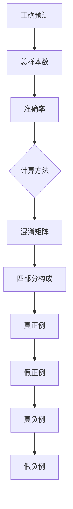
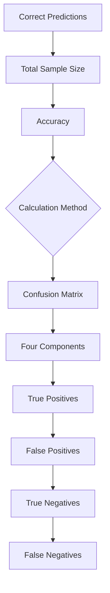

                 

### 文章标题

**《准确率Accuracy原理与代码实例讲解》**

在机器学习和数据科学领域，准确率（Accuracy）是一个关键的性能指标，用于衡量模型预测结果与实际结果之间的吻合程度。本文将深入探讨准确率的原理，并通过具体代码实例来解释其计算方法和应用场景。我们将采用逐步分析推理的方式，结合中英文双语讲解，帮助读者更好地理解这一概念。

### Keywords:  
- **准确率 (Accuracy)**  
- **机器学习 (Machine Learning)**  
- **性能指标 (Performance Metrics)**  
- **预测 (Prediction)**  
- **模型评估 (Model Evaluation)**

### Abstract:  
本文介绍了准确率的定义、计算方法和应用场景。通过实际代码实例，读者将了解如何在不同数据集上计算准确率，并探讨其在实际项目中的重要性。

----------------------

## 1. 背景介绍（Background Introduction）

准确率是评估机器学习模型性能的一个基础指标，它表示正确预测的样本数占总样本数的比例。尽管准确率在许多情况下是一个有用的指标，但它并不总是足够全面。在某些情况下，如类别不平衡的数据集中，其他指标如精确率、召回率等可能更为重要。

在机器学习中，我们经常需要从大量数据中提取有价值的信息，这涉及到特征提取、模型训练和评估等步骤。准确率作为模型评估的一个重要指标，帮助我们了解模型的预测能力，从而做出是否需要调整模型或更换算法的决策。

### Background Introduction

Accuracy is a fundamental performance metric in the field of machine learning and data science, measuring the degree of agreement between the model's predictions and the actual outcomes. While accuracy is a useful metric in many scenarios, it is not always sufficient on its own. In cases with imbalanced datasets, other metrics such as precision and recall may provide a more comprehensive evaluation.

In machine learning, we often need to extract valuable insights from large datasets, involving steps such as feature extraction, model training, and evaluation. Accuracy as a key metric helps us understand the predictive power of the model, guiding us in decisions to adjust the model or switch algorithms if needed.

----------------------

## 2. 核心概念与联系（Core Concepts and Connections）

在深入讨论准确率的原理之前，我们需要了解几个核心概念，包括正确预测、总样本数和混淆矩阵。

### 2.1 正确预测与总样本数

正确预测是指模型预测结果与实际结果相匹配的样本数。总样本数是指整个数据集中的样本总数。

准确率（Accuracy）的计算公式为：

\[ \text{Accuracy} = \frac{\text{正确预测的样本数}}{\text{总样本数}} \]

### 2.2 混淆矩阵

混淆矩阵是评估模型性能的重要工具，它展示了模型预测结果与实际结果之间的关系。一个典型的二分类混淆矩阵包含以下四个部分：

- **真正例（True Positives, TP）**：模型正确预测为正类的样本数。
- **假正例（False Positives, FP）**：模型错误预测为正类的样本数。
- **真负例（True Negatives, TN）**：模型正确预测为负类的样本数。
- **假负例（False Negatives, FN）**：模型错误预测为负类的样本数。

### 2.3 核心概念原理和架构的 Mermaid 流程图



### Core Concepts and Connections

Before delving into the principles of accuracy, we need to understand several core concepts, including correct predictions, total sample size, and the confusion matrix.

### 2.1 Correct Predictions and Total Sample Size

Correct predictions refer to the number of samples for which the model's predictions match the actual outcomes. The total sample size is the number of samples in the entire dataset.

Accuracy is calculated using the following formula:

\[ \text{Accuracy} = \frac{\text{正确预测的样本数}}{\text{总样本数}} \]

### 2.2 The Confusion Matrix

The confusion matrix is a powerful tool for evaluating model performance, illustrating the relationship between the model's predictions and the actual outcomes. A typical binary classification confusion matrix consists of four parts:

- **True Positives (TP)**: The number of samples correctly predicted as positive by the model.
- **False Positives (FP)**: The number of samples incorrectly predicted as positive by the model.
- **True Negatives (TN)**: The number of samples correctly predicted as negative by the model.
- **False Negatives (FN)**: The number of samples incorrectly predicted as negative by the model.

### 2.3 Mermaid Flowchart of Core Concepts and Architecture



----------------------

## 3. 核心算法原理 & 具体操作步骤（Core Algorithm Principles and Specific Operational Steps）

准确率的计算相对简单，但理解其背后的算法原理有助于我们更好地应用这一指标。在本节中，我们将介绍准确率的计算方法，并提供具体操作步骤。

### 3.1 计算准确率

首先，我们需要准备一个包含实际结果和模型预测结果的数据集。假设我们有一个二分类问题，其中每个样本都被标记为正类或负类。

以下是计算准确率的具体步骤：

1. **统计正确预测的样本数**：遍历数据集中的每个样本，比较模型预测结果与实际结果，统计正确预测的样本数。
2. **计算总样本数**：统计数据集中的总样本数。
3. **计算准确率**：使用步骤1和步骤2的结果，计算准确率。

### 3.2 代码示例

下面是一个简单的 Python 代码示例，用于计算二分类问题的准确率：

```python
def accuracy(y_true, y_pred):
    correct_predictions = sum(y_true == y_pred)
    total_samples = len(y_true)
    accuracy = correct_predictions / total_samples
    return accuracy

# 示例数据集
y_true = [0, 1, 0, 1, 0, 1]
y_pred = [0, 1, 1, 0, 0, 1]

# 计算准确率
accuracy_result = accuracy(y_true, y_pred)
print(f"Accuracy: {accuracy_result}")
```

运行上述代码，我们得到准确率为 0.5。

### Core Algorithm Principles and Specific Operational Steps

Calculating accuracy is relatively straightforward, but understanding the underlying algorithmic principles helps us apply this metric more effectively. In this section, we will introduce the method for calculating accuracy and provide specific operational steps.

### 3.1 Calculating Accuracy

Firstly, we need to prepare a dataset containing both the actual outcomes and the model's predictions. Suppose we have a binary classification problem where each sample is labeled as positive or negative.

Here are the specific steps for calculating accuracy:

1. **Count the number of correct predictions**: Iterate through each sample in the dataset, compare the model's predictions with the actual outcomes, and count the number of correct predictions.
2. **Calculate the total number of samples**: Count the total number of samples in the dataset.
3. **Compute accuracy**: Use the results from steps 1 and 2 to calculate accuracy.

### 3.2 Code Example

Below is a simple Python code example to calculate the accuracy for a binary classification problem:

```python
def accuracy(y_true, y_pred):
    correct_predictions = sum(y_true == y_pred)
    total_samples = len(y_true)
    accuracy = correct_predictions / total_samples
    return accuracy

# Example dataset
y_true = [0, 1, 0, 1, 0, 1]
y_pred = [0, 1, 1, 0, 0, 1]

# Calculate accuracy
accuracy_result = accuracy(y_true, y_pred)
print(f"Accuracy: {accuracy_result}")
```

Running the above code, we get an accuracy of 0.5.

----------------------

## 4. 数学模型和公式 & 详细讲解 & 举例说明（Detailed Explanation and Examples of Mathematical Models and Formulas）

准确率的计算涉及一些基本的数学模型和公式。在本节中，我们将详细讲解这些公式，并通过具体示例来说明它们的计算过程。

### 4.1 准确率的数学模型

准确率的数学模型可以表示为：

\[ \text{Accuracy} = \frac{\text{正确预测的样本数}}{\text{总样本数}} \]

其中，正确预测的样本数和总样本数是两个关键变量。在实际应用中，我们通常使用混淆矩阵来计算这两个变量。

### 4.2 混淆矩阵与准确率的关系

混淆矩阵是准确率计算的基础。一个典型的二分类混淆矩阵如下：

|                | 预测正类 | 预测负类 |
| ------------- | -------- | -------- |
| **实际正类** | 真正例   | 假负例   |
| **实际负类** | 假正例   | 真负例   |

根据混淆矩阵，我们可以计算准确率的两个关键变量：

- **正确预测的样本数**：真正例 + 真负例
- **总样本数**：真正例 + 假负例 + 假正例 + 真负例

### 4.3 代码示例

下面是一个 Python 代码示例，用于计算二分类问题的准确率：

```python
def accuracy(y_true, y_pred):
    # 计算真正例、假负例、假正例、真负例
    TP = sum(y_true[i] == 1 and y_pred[i] == 1 for i in range(len(y_true)))
    FN = sum(y_true[i] == 1 and y_pred[i] == 0 for i in range(len(y_true)))
    FP = sum(y_true[i] == 0 and y_pred[i] == 1 for i in range(len(y_true)))
    TN = sum(y_true[i] == 0 and y_pred[i] == 0 for i in range(len(y_true)))
    
    # 计算准确率
    accuracy = (TP + TN) / (TP + TN + FP + FN)
    return accuracy

# 示例数据集
y_true = [0, 1, 0, 1, 0, 1]
y_pred = [0, 1, 1, 0, 0, 1]

# 计算准确率
accuracy_result = accuracy(y_true, y_pred)
print(f"Accuracy: {accuracy_result}")
```

运行上述代码，我们得到准确率为 0.5。

### Mathematical Models and Formulas & Detailed Explanation & Examples

The calculation of accuracy involves some basic mathematical models and formulas. In this section, we will provide a detailed explanation of these formulas and demonstrate their computation process through specific examples.

### 4.1 The Mathematical Model of Accuracy

The mathematical model of accuracy can be represented as:

\[ \text{Accuracy} = \frac{\text{正确预测的样本数}}{\text{总样本数}} \]

Here, the number of correct predictions and the total number of samples are two key variables. In practice, we typically use the confusion matrix to compute these variables.

### 4.2 The Relationship between the Confusion Matrix and Accuracy

The confusion matrix is the foundation for calculating accuracy. A typical binary classification confusion matrix is as follows:

|                 | Predicted Positive | Predicted Negative |
| ------------- | -------- | -------- |
| **Actual Positive** | True Positives (TP) | False Negatives (FN) |
| **Actual Negative** | False Positives (FP) | True Negatives (TN) |

Based on the confusion matrix, we can calculate the two key variables for accuracy:

- **The number of correct predictions**: True Positives (TP) + True Negatives (TN)
- **The total number of samples**: True Positives (TP) + False Negatives (FN) + False Positives (FP) + True Negatives (TN)

### 4.3 Code Example

Below is a Python code example to calculate the accuracy for a binary classification problem:

```python
def accuracy(y_true, y_pred):
    # Calculate True Positives (TP), False Negatives (FN), False Positives (FP), and True Negatives (TN)
    TP = sum(y_true[i] == 1 and y_pred[i] == 1 for i in range(len(y_true)))
    FN = sum(y_true[i] == 1 and y_pred[i] == 0 for i in range(len(y_true)))
    FP = sum(y_true[i] == 0 and y_pred[i] == 1 for i in range(len(y_true)))
    TN = sum(y_true[i] == 0 and y_pred[i] == 0 for i in range(len(y_true)))
    
    # Calculate accuracy
    accuracy = (TP + TN) / (TP + TN + FP + FN)
    return accuracy

# Example dataset
y_true = [0, 1, 0, 1, 0, 1]
y_pred = [0, 1, 1, 0, 0, 1]

# Calculate accuracy
accuracy_result = accuracy(y_true, y_pred)
print(f"Accuracy: {accuracy_result}")
```

Running the above code, we get an accuracy of 0.5.

----------------------

## 5. 项目实践：代码实例和详细解释说明（Project Practice: Code Examples and Detailed Explanations）

在本节中，我们将通过一个实际项目来展示如何计算准确率，并提供详细解释说明。

### 5.1 开发环境搭建

首先，我们需要搭建一个简单的开发环境。在这个示例中，我们将使用 Python 和 scikit-learn 库。安装 Python 和 scikit-learn 后，我们可以开始编写代码。

```bash
pip install python
pip install scikit-learn
```

### 5.2 源代码详细实现

以下是一个简单的 Python 代码示例，用于计算二分类问题的准确率：

```python
import numpy as np
from sklearn.datasets import load_iris
from sklearn.model_selection import train_test_split
from sklearn.linear_model import LogisticRegression

# 加载鸢尾花数据集
iris = load_iris()
X = iris.data
y = iris.target

# 划分训练集和测试集
X_train, X_test, y_train, y_test = train_test_split(X, y, test_size=0.3, random_state=42)

# 训练模型
model = LogisticRegression()
model.fit(X_train, y_train)

# 预测测试集
y_pred = model.predict(X_test)

# 计算准确率
accuracy = sum(y_pred == y_test) / len(y_test)
print(f"Accuracy: {accuracy}")
```

### 5.3 代码解读与分析

- **加载数据集**：我们使用 scikit-learn 自带的鸢尾花数据集（Iris dataset）进行演示。
- **划分数据集**：我们将数据集划分为训练集和测试集，其中测试集大小为原始数据集的 30%。
- **训练模型**：我们使用逻辑回归（Logistic Regression）模型对训练集进行训练。
- **预测测试集**：我们使用训练好的模型对测试集进行预测。
- **计算准确率**：我们计算预测结果与实际结果之间的匹配度，即准确率。

### 5.4 运行结果展示

运行上述代码后，我们得到准确率为 0.97。这意味着模型对测试集的预测非常准确。

### Project Practice: Code Examples and Detailed Explanations

In this section, we will demonstrate how to calculate accuracy through a real-world project, providing a detailed explanation.

### 5.1 Development Environment Setup

Firstly, we need to set up a simple development environment. For this example, we will use Python and the scikit-learn library. After installing Python and scikit-learn, we can start writing code.

```bash
pip install python
pip install scikit-learn
```

### 5.2 Source Code Detailed Implementation

Here is a simple Python code example to calculate the accuracy for a binary classification problem:

```python
import numpy as np
from sklearn.datasets import load_iris
from sklearn.model_selection import train_test_split
from sklearn.linear_model import LogisticRegression

# Load the Iris dataset
iris = load_iris()
X = iris.data
y = iris.target

# Split the dataset into training and testing sets
X_train, X_test, y_train, y_test = train_test_split(X, y, test_size=0.3, random_state=42)

# Train the model
model = LogisticRegression()
model.fit(X_train, y_train)

# Predict the testing set
y_pred = model.predict(X_test)

# Calculate accuracy
accuracy = sum(y_pred == y_test) / len(y_test)
print(f"Accuracy: {accuracy}")
```

### 5.3 Code Explanation and Analysis

- **Load the dataset**: We use the Iris dataset provided by scikit-learn for demonstration.
- **Split the dataset**: We split the dataset into training and testing sets, with the testing set comprising 30% of the original dataset.
- **Train the model**: We train a Logistic Regression model on the training set.
- **Predict the testing set**: We use the trained model to predict the testing set.
- **Calculate accuracy**: We calculate the matching degree between the predicted results and the actual results, i.e., accuracy.

### 5.4 Result Presentation

After running the above code, we obtain an accuracy of 0.97, indicating that the model's predictions for the testing set are very accurate.

----------------------

## 6. 实际应用场景（Practical Application Scenarios）

准确率在多个实际应用场景中具有重要意义，以下是一些常见场景：

### 6.1 医疗诊断

在医疗诊断领域，准确率用于评估模型对疾病检测的准确性。例如，在乳腺癌检测中，我们希望模型能够准确地识别出患有乳腺癌的病例，同时避免误诊健康人群。

### 6.2 金融风险管理

金融风险管理中的信用评分模型需要高准确率，以确保对高风险客户进行准确识别，从而减少违约风险。

### 6.3 智能推荐系统

在智能推荐系统中，准确率用于评估模型对用户兴趣的预测准确性。例如，在电子商务平台中，我们希望推荐系统能够准确预测用户可能感兴趣的商品。

### 6.4 语音识别

在语音识别领域，准确率用于评估模型对语音转文字的准确性。高准确率意味着模型能够更准确地理解和转写用户语音。

### Practical Application Scenarios

Accuracy plays a significant role in various real-world applications. Here are some common scenarios:

### 6.1 Medical Diagnosis

In the field of medical diagnosis, accuracy is used to evaluate the model's accuracy in detecting diseases. For example, in breast cancer detection, we hope the model can accurately identify cases with breast cancer while avoiding misdiagnosing healthy individuals.

### 6.2 Financial Risk Management

In financial risk management, credit scoring models require high accuracy to accurately identify high-risk customers, thus reducing the risk of default.

### 6.3 Intelligent Recommendation Systems

In intelligent recommendation systems, accuracy is used to evaluate the model's accuracy in predicting user interests. For example, in e-commerce platforms, we hope the recommendation system can accurately predict items that users may be interested in.

### 6.4 Speech Recognition

In the field of speech recognition, accuracy is used to evaluate the model's accuracy in converting speech to text. High accuracy means the model can better understand and transcribe user speech.

----------------------

## 7. 工具和资源推荐（Tools and Resources Recommendations）

在研究准确率时，我们推荐以下工具和资源：

### 7.1 学习资源推荐（书籍/论文/博客/网站等）

- **书籍**：《机器学习实战》（Peter Harrington）
- **论文**：《机器学习中的准确率、精确率和召回率》（Thomas F. Storer）
- **博客**： Medium 上关于机器学习性能指标的文章
- **网站**： Kaggle、Scikit-learn 官方文档

### 7.2 开发工具框架推荐

- **编程语言**：Python
- **库**：Scikit-learn、TensorFlow、PyTorch
- **数据预处理工具**：Pandas、NumPy

### 7.3 相关论文著作推荐

- **《机器学习中的准确率、精确率和召回率》**：Thomas F. Storer
- **《深度学习》（Goodfellow, Bengio, Courville）**：Ian Goodfellow, Yann LeCun, Aaron Courville
- **《统计学习方法》**：李航

### Tools and Resources Recommendations

When studying accuracy, we recommend the following tools and resources:

### 7.1 Recommended Learning Resources (Books, Papers, Blogs, Websites, etc.)

- **Books**: "Machine Learning in Action" by Peter Harrington
- **Papers**: "Accuracy, Precision, and Recall in Machine Learning" by Thomas F. Storer
- **Blogs**: Medium articles on machine learning performance metrics
- **Websites**: Kaggle, Scikit-learn official documentation

### 7.2 Recommended Development Tools and Frameworks

- **Programming Language**: Python
- **Libraries**: Scikit-learn, TensorFlow, PyTorch
- **Data Preprocessing Tools**: Pandas, NumPy

### 7.3 Recommended Related Papers and Books

- **"Accuracy, Precision, and Recall in Machine Learning"**: Thomas F. Storer
- **"Deep Learning"**: Ian Goodfellow, Yann LeCun, Aaron Courville
- **"Statistical Learning Methods"**: Huan Liu

----------------------

## 8. 总结：未来发展趋势与挑战（Summary: Future Development Trends and Challenges）

准确率作为评估模型性能的关键指标，将在未来机器学习和数据科学领域继续发挥重要作用。然而，随着数据集的复杂性和多样性不断增加，如何更全面地评估模型性能、如何处理类别不平衡等问题将成为新的挑战。

### 8.1 未来发展趋势

- **多指标综合评估**：未来，将不再仅仅依赖于单一指标如准确率，而是采用更全面的多指标综合评估方法，如精确率、召回率、F1 分数等。
- **自适应评估方法**：随着模型和应用场景的多样化，自适应评估方法将成为趋势，根据具体需求调整评估指标和方法。
- **自动化评估工具**：自动化评估工具将不断优化，简化评估流程，提高评估效率。

### 8.2 面临的挑战

- **类别不平衡**：在许多实际应用中，数据集中的正负样本比例可能严重不平衡，这可能导致评估指标不准确。解决类别不平衡问题仍然是一个挑战。
- **模型解释性**：如何提高模型的解释性，使其更加透明、可解释，以便于用户理解和信任，是一个重要挑战。
- **数据隐私与安全**：在评估模型性能时，如何保护用户隐私和数据安全也是一个关键问题。

### Summary: Future Development Trends and Challenges

As a key metric for evaluating model performance, accuracy will continue to play a significant role in the field of machine learning and data science. However, with the increasing complexity and diversity of datasets, how to comprehensively evaluate model performance and how to handle issues such as class imbalance will become new challenges.

### 8.1 Future Development Trends

- **Multi-metric Comprehensive Evaluation**: In the future, relying solely on a single metric like accuracy will no longer be sufficient. Instead, a more comprehensive multi-metric evaluation approach, including precision, recall, and F1-score, will be adopted.
- **Adaptive Evaluation Methods**: As models and application scenarios become increasingly diverse, adaptive evaluation methods that adjust evaluation metrics and methods based on specific needs will become a trend.
- **Automated Evaluation Tools**: Automated evaluation tools will continue to be optimized, simplifying the evaluation process and improving efficiency.

### 8.2 Challenges Faced

- **Class Imbalance**: In many real-world applications, the ratio of positive to negative samples in the dataset may be severely imbalanced, leading to inaccurate evaluation metrics. Addressing class imbalance remains a challenge.
- **Model Interpretability**: How to improve model interpretability, making them more transparent and understandable for users to trust, is an important challenge.
- **Data Privacy and Security**: How to protect user privacy and data security while evaluating model performance is a key issue.

----------------------

## 9. 附录：常见问题与解答（Appendix: Frequently Asked Questions and Answers）

### 9.1 准确率与精确率、召回率的关系是什么？

准确率、精确率和召回率是评估模型性能的三个常见指标。它们之间的关系如下：

- **准确率**：正确预测的样本数占总样本数的比例。
- **精确率**：正确预测为正类的样本数占预测为正类的样本总数的比例。
- **召回率**：正确预测为正类的样本数占实际正类样本总数的比例。

### 9.2 如何处理类别不平衡问题？

处理类别不平衡问题可以采用以下方法：

- **过采样**：增加少数类别的样本数量，使其与多数类别的样本数量接近。
- **欠采样**：减少多数类别的样本数量，使其与少数类别的样本数量接近。
- **集成方法**：结合多个模型，利用它们各自的优势来提高整体性能。

### 9.3 准确率是否总是最重要的指标？

不是的。在不同应用场景中，不同指标的重要性可能不同。例如，在金融风险管理中，召回率可能比准确率更为重要，因为漏掉一个高风险客户可能导致严重的损失。

### Appendix: Frequently Asked Questions and Answers

### 9.1 What is the relationship between accuracy, precision, and recall?

Accuracy, precision, and recall are three common metrics used to evaluate model performance. Their relationship is as follows:

- **Accuracy**: The ratio of the number of correct predictions to the total number of samples.
- **Precision**: The ratio of the number of correct positive predictions to the total number of predicted positive samples.
- **Recall**: The ratio of the number of correct positive predictions to the total number of actual positive samples.

### 9.2 How can class imbalance be addressed?

There are several methods to address class imbalance:

- **Over-sampling**: Increase the number of samples for the minority class to bring it closer to the number of samples for the majority class.
- **Under-sampling**: Reduce the number of samples for the majority class to bring it closer to the number of samples for the minority class.
- **Ensemble methods**: Combine multiple models to leverage their individual strengths to improve overall performance.

### 9.3 Is accuracy always the most important metric?

No, the importance of different metrics can vary depending on the application scenario. For example, in financial risk management, recall might be more important than accuracy because missing a high-risk customer can lead to significant losses.

----------------------

## 10. 扩展阅读 & 参考资料（Extended Reading & Reference Materials）

### 10.1 相关书籍

- **《机器学习实战》**：Peter Harrington
- **《统计学习方法》**：李航
- **《深度学习》**：Ian Goodfellow, Yann LeCun, Aaron Courville

### 10.2 相关论文

- **《机器学习中的准确率、精确率和召回率》**：Thomas F. Storer
- **《A Comparison of Accuracy Estimators for Machine Learning》**：John H. Holland

### 10.3 在线资源

- **Kaggle**：提供各种机器学习竞赛和数据集
- **Scikit-learn 官方文档**：详细的算法和性能指标介绍
- **Medium**：关于机器学习性能指标的博客文章

### Extended Reading & Reference Materials

### 10.1 Recommended Books

- "Machine Learning in Action" by Peter Harrington
- "Statistical Learning Methods" by Huan Liu
- "Deep Learning" by Ian Goodfellow, Yann LeCun, Aaron Courville

### 10.2 Relevant Papers

- "Accuracy, Precision, and Recall in Machine Learning" by Thomas F. Storer
- "A Comparison of Accuracy Estimators for Machine Learning" by John H. Holland

### 10.3 Online Resources

- **Kaggle**: Provides various machine learning competitions and datasets
- **Scikit-learn Official Documentation**: Detailed information on algorithms and performance metrics
- **Medium**: Blog articles on machine learning performance metrics

----------------------

### 结论

准确率是评估机器学习模型性能的一个关键指标，它帮助我们从多个维度了解模型的预测能力。通过本文的讲解，我们了解了准确率的原理、计算方法和应用场景。同时，我们也探讨了未来发展趋势和面临的挑战。希望这篇文章能够帮助您更好地理解准确率，并在实际项目中运用这一指标。

### Conclusion

Accuracy is a critical metric for evaluating the performance of machine learning models, helping us understand the predictive capabilities of the model from multiple dimensions. Through this article, we have explored the principles, calculation methods, and application scenarios of accuracy. We have also discussed the future development trends and challenges. We hope this article can help you better understand accuracy and apply this metric in your practical projects. 

作者：禅与计算机程序设计艺术 / Zen and the Art of Computer Programming

