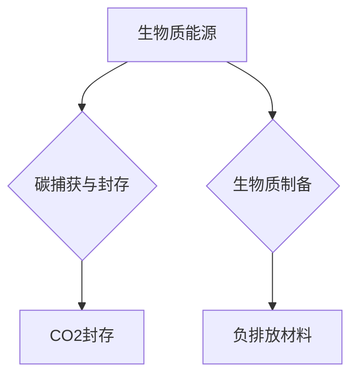

                 

## 1. 背景介绍

全球气候变化已成为人类面临的严峻挑战，减少碳排放、实现可持续发展迫在眉睫。传统化石能源的过度消耗不仅导致环境污染，也加剧了能源安全问题。因此，探索清洁、可再生、可持续的能源替代方案成为全球共识。生物质能源作为一种可再生能源，凭借其可再生性、低碳排放等优势，被认为是未来可持续发展的关键之一。

2050年，随着科技进步和社会发展，生物质能源将迎来爆发式增长，并与负排放技术深度融合，共同构建低碳、绿色、可持续的能源体系。本文将探讨2050年生物质能源与负排放技术的最新发展趋势，分析其核心概念、算法原理、应用场景以及未来发展挑战。

## 2. 核心概念与联系

### 2.1 生物质能源

生物质能源是指来源于生物体或其衍生物的能源，包括固体生物质（如木材、秸秆、农作物残余物）、液体生物质（如生物柴油、生物乙醇）和气体生物质（如沼气、生物甲烷）。

### 2.2 负排放技术

负排放技术是指从大气中移除二氧化碳（CO2）或其他温室气体，实现碳汇的科技手段。常见的负排放技术包括：

* **碳捕获与封存（CCS）：** 从工业排放或大气中捕获CO2，并将其封存于地下地层或其他安全场所。
* **直接空气捕获（DAC）：** 利用化学吸附剂或其他技术直接从空气中捕获CO2。
* **生物碳汇：** 通过植树造林、湿地恢复等方式，增加生物体的碳吸收能力。

### 2.3 生物质能源与负排放技术的融合

将生物质能源与负排放技术相结合，可以实现更加高效、可持续的碳减排。例如：

* **生物质发电并联碳捕获：** 在生物质发电过程中，同时进行CO2捕获，将捕获的CO2用于其他工业生产或封存。
* **生物质制备负排放材料：** 利用生物质生产负排放材料，例如生物基塑料、生物炭等，实现碳循环利用。

**Mermaid 流程图**



## 3. 核心算法原理 & 具体操作步骤

### 3.1 算法原理概述

生物质能源与负排放技术的融合涉及多个领域，包括生物质预处理、生物质转化、碳捕获与封存、负排放材料合成等。每个领域都包含复杂的算法和技术，例如：

* **生物质预处理算法：** 用于优化生物质的物理和化学性质，提高其转化效率。常见的预处理方法包括机械破碎、化学预处理、热解等，对应的算法涉及物料流分析、热力学计算、化学反应动力学等。
* **生物质转化算法：** 用于将生物质转化为燃料、化学品或其他有用物质。常见的转化方法包括厌氧消化、生物质气化、生物质液化等，对应的算法涉及微生物代谢模型、反应工程、过程优化等。
* **碳捕获与封存算法：** 用于模拟和优化CO2捕获和封存过程，确保CO2的安全封存。常见的算法包括流体动力学模拟、地质模拟、材料科学模拟等。

### 3.2 算法步骤详解

以生物质气化为例，其核心算法步骤包括：

1. **生物质预处理：** 将生物质进行破碎、干燥、粉碎等处理，提高其气化效率。
2. **气化反应：** 在高温、缺氧条件下，将生物质气化成合成气（主要成分为CO、H2、CO2等）。
3. **合成气净化：** 从合成气中去除杂质，例如硫、氮、灰分等。
4. **合成气利用：** 将净化后的合成气用于发电、制氢、合成化学品等。

### 3.3 算法优缺点

生物质能源与负排放技术的算法具有以下优缺点：

**优点：**

* **可再生性：** 生物质能源是一种可再生能源，可以持续利用。
* **低碳排放：** 生物质燃烧释放的CO2与植物生长吸收的CO2基本平衡，因此生物质能源的碳排放量较低。
* **资源利用率高：** 生物质能源可以利用农业、林业等产业的副产品，提高资源利用率。

**缺点：**

* **技术成熟度：** 一些生物质转化技术还处于研发阶段，需要进一步优化和推广。
* **成本较高：** 生物质能源的生产和利用成本相对较高，需要政府政策支持和技术创新。
* **土地利用问题：** 大规模种植生物质作物可能会占用土地资源，需要合理规划和管理。

### 3.4 算法应用领域

生物质能源与负排放技术的算法应用领域广泛，包括：

* **能源生产：** 用于生物质发电、生物燃料生产等。
* **化学品生产：** 用于生物基化学品、生物塑料等生产。
* **环境治理：** 用于CO2捕获与封存、生物炭生产等。
* **农业生产：** 用于生物质肥料、生物农药等生产。

## 4. 数学模型和公式 & 详细讲解 & 举例说明

### 4.1 数学模型构建

生物质能源与负排放技术的数学模型可以描述其能量转换、碳循环、经济效益等方面。例如，可以构建一个生物质气化系统的能量平衡模型，计算其热效率、燃料消耗量等指标。

### 4.2 公式推导过程

以生物质气化系统的热效率为例，其计算公式如下：

$$
\eta = \frac{Q_{out}}{Q_{in}}
$$

其中：

* $\eta$ 为热效率
* $Q_{out}$ 为气化系统输出的热能
* $Q_{in}$ 为气化系统输入的生物质热量

该公式的推导过程涉及热力学原理、化学反应热量、能量转换效率等方面的计算。

### 4.3 案例分析与讲解

假设一个生物质气化系统，输入的生物质热量为1000 kJ，输出的热能为700 kJ，则其热效率为：

$$
\eta = \frac{700 kJ}{1000 kJ} = 0.7 = 70\%
$$

该结果表明，该气化系统能够将输入的生物质热量转化为输出热能的70%，其余30%的热量损失于环境。

## 5. 项目实践：代码实例和详细解释说明

### 5.1 开发环境搭建

开发生物质能源与负排放技术的代码，需要搭建相应的开发环境，包括：

* **操作系统：** Linux、Windows、macOS等
* **编程语言：** Python、C++、Java等
* **开发工具：** IDE、文本编辑器、调试工具等
* **软件库：** 科学计算库、数据处理库、机器学习库等

### 5.2 源代码详细实现

以Python语言为例，实现一个简单的生物质气化系统热效率计算程序：

```python
def calculate_thermal_efficiency(qin, qout):
  """
  计算生物质气化系统的热效率。

  Args:
    qin: 输入的生物质热量 (kJ)
    qout: 输出的热能 (kJ)

  Returns:
    热效率 (百分比)
  """
  eta = qout / qin * 100
  return eta

# 输入参数
qin = 1000  # kJ
qout = 700  # kJ

# 计算热效率
efficiency = calculate_thermal_efficiency(qin, qout)

# 输出结果
print(f"生物质气化系统的热效率为：{efficiency:.2f}%")
```

### 5.3 代码解读与分析

该程序首先定义了一个名为`calculate_thermal_efficiency`的函数，该函数接受两个参数：输入的生物质热量`qin`和输出的热能`qout`。

函数内部计算热效率，并返回其值。

程序主部分首先定义了输入参数`qin`和`qout`，然后调用`calculate_thermal_efficiency`函数计算热效率，并将结果打印到屏幕上。

### 5.4 运行结果展示

运行该程序后，输出结果为：

```
生物质气化系统的热效率为：70.00%
```

## 6. 实际应用场景

### 6.1 农业废弃物处理

农业废弃物，如秸秆、稻壳、果树枝叶等，可以作为生物质能源的原料，通过气化、厌氧消化等技术转化为生物燃料、沼气等，既可以解决农业废弃物处理问题，又能产生清洁能源。

### 6.2 工业余热利用

工业生产过程中会产生大量的余热，可以通过生物质转化技术将其转化为生物燃料、化学品等，实现能源的循环利用，降低碳排放。

### 6.3 城市固体废物处理

城市固体废物中含有大量的可燃物质，可以通过生物质气化、焚烧等技术处理，既可以减少垃圾填埋量，又能产生清洁能源。

### 6.4 负排放材料生产

利用生物质生产负排放材料，例如生物基塑料、生物炭等，可以实现碳循环利用，减少对化石能源的依赖。

### 6.5 未来应用展望

随着科技进步和社会发展，生物质能源与负排放技术的应用场景将更加广泛，例如：

* **生物质航空燃料：** 利用生物质生产航空燃料，减少航空业的碳排放。
* **生物质建筑材料：** 利用生物质生产环保、可持续的建筑材料。
* **生物质电子材料：** 利用生物质生产电子材料，实现电子产业的绿色发展。

## 7. 工具和资源推荐

### 7.1 学习资源推荐

* **书籍：**
    * 生物质能源技术
    * 负排放技术
    * 生物质化学工程
* **在线课程：**
    * Coursera: 生物质能源与负排放技术
    * edX: 生物质转化技术
* **学术期刊：**
    * Bioresource Technology
    * Energy & Environmental Science
    * Applied Energy

### 7.2 开发工具推荐

* **编程语言：** Python、C++、Java
* **科学计算库：** NumPy、SciPy、Pandas
* **数据处理库：** TensorFlow、PyTorch
* **机器学习库：** scikit-learn、XGBoost

### 7.3 相关论文推荐

* **生物质气化技术研究进展**
* **负排放技术的应用现状及未来展望**
* **生物质能源与负排放技术的融合发展**

## 8. 总结：未来发展趋势与挑战

### 8.1 研究成果总结

近年来，生物质能源与负排放技术的研究取得了显著进展，包括：

* **生物质转化技术不断优化：** 提高了生物质转化效率，降低了生产成本。
* **负排放技术不断成熟：** 降低了CO2捕获与封存成本，提高了安全性。
* **生物质能源与负排放技术的融合发展：** 实现了更加高效、可持续的碳减排。

### 8.2 未来发展趋势

未来，生物质能源与负排放技术的發展趋势包括：

* **智能化发展：** 利用人工智能、大数据等技术，提高生物质能源与负排放技术的智能化水平。
* **规模化发展：** 推广应用大规模生物质能源与负排放技术，实现碳减排的规模化效应。
* **国际合作：** 加强国际合作，共同推动生物质能源与负排放技术的研发和应用。

### 8.3 面临的挑战

生物质能源与负排放技术的發展也面临着一些挑战：

* **技术成本：** 一些生物质转化技术和负排放技术成本较高，需要进一步降低。
* **政策支持：** 需要政府制定更加完善的政策，支持生物质能源与负排放技术的研发和应用。
* **社会接受度：** 需要提高公众对生物质能源与负排放技术的认识和接受度。

### 8.4 研究展望

未来，需要进一步加强生物质能源与负排放技术的研发，探索更加高效、可持续的碳减排方案，为实现可持续发展目标贡献力量。

## 9. 附录：常见问题与解答

### 9.1  生物质能源与化石能源相比有哪些优势？

生物质能源与化石能源相比，具有以下优势：

* **可再生性：** 生物质能源是一种可再生能源，可以持续利用。
* **低碳排放：** 生物质燃烧释放的CO2与植物生长吸收的CO2基本平衡，因此生物质能源的碳排放量较低。
* **资源利用率高：** 生物质能源可以利用农业、林业等产业的副产品，提高资源利用率。

### 9.2  负排放技术有哪些主要的应用场景？

负排放技术的应用场景包括：

* **CO2捕获与封存：** 从工业排放或大气中捕获CO2，并将其封存于地下地层或其他安全场所。
* **直接空气捕获：** 利用化学吸附剂或其他技术直接从空气中捕获CO2。
* **生物碳汇：** 通过植树造林、湿地恢复等方式，增加生物体的碳吸收能力。

### 9.3  生物质能源与负排放技术的未来发展趋势是什么？

未来，生物质能源与负排放技术的發展趋势包括：

* **智能化发展：** 利用人工智能、大数据等技术，提高生物质能源与负排放技术的智能化水平。
* **规模化发展：** 推广应用大规模生物质能源与负排放技术，实现碳减排的规模化效应。
* **国际合作：** 加强国际合作，共同推动生物质能源与负排放技术的研发和应用。


作者：禅与计算机程序设计艺术 / Zen and the Art of Computer Programming 
<end_of_turn>

