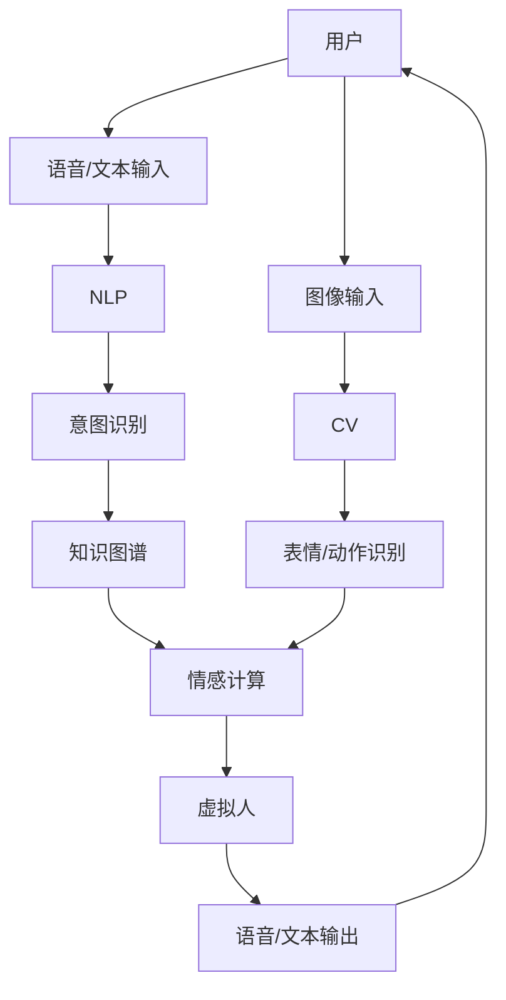

                 

**未来的智能客服：2050年的虚拟人客服与情感计算**

## 1. 背景介绍

在未来的世界里，人工智能（AI）将无处不在，并深入到我们日常生活的方方面面。其中，智能客服将是AI应用最为广泛的领域之一。到2050年，虚拟人客服将会是我们接触最多的服务提供者，它们将以更加人性化、情感化的方式与我们交流，提供更加个性化、智能化的服务。本文将探讨未来智能客服的发展趋势，重点关注虚拟人客服与情感计算在其中的作用。

## 2. 核心概念与联系

### 2.1 核心概念

- **虚拟人（Virtual Human）**：一种通过计算机模拟人类外形和行为的数字实体。
- **情感计算（Affective Computing）**：研究如何使计算机理解、识别、表达和模拟人类情感的计算机科学领域。
- **自然语言处理（Natural Language Processing，NLP）**：计算机科学领域的一个子领域，关注计算机与人类语言的交互。
- **计算机视觉（Computer Vision，CV）**：计算机科学的一个分支，研究如何使计算机“看懂”图像中的物体，并对其进行描述。

### 2.2 核心概念联系

虚拟人客服是智能客服的未来发展方向，它需要结合NLP、CV和情感计算等技术，实现与用户的自然交互，理解用户的需求和情感，并提供个性化的服务。下图是虚拟人客服的核心技术架构图：



## 3. 核心算法原理 & 具体操作步骤

### 3.1 算法原理概述

虚拟人客服的核心算法包括意图识别算法、情感识别算法和个性化推荐算法。其中，意图识别算法用于理解用户的需求，情感识别算法用于理解用户的情感状态，个性化推荐算法用于为用户提供个性化的服务。

### 3.2 算法步骤详解

#### 3.2.1 意图识别算法

1. **预处理**：对用户输入的语音或文本进行预处理，包括降噪、分词、去停用词等。
2. **特征提取**：提取用户输入的特征，如词向量、语义向量等。
3. **意图识别**：使用分类算法（如支持向量机、神经网络等）对用户输入的意图进行识别。
4. **实体识别**：使用命名实体识别算法（如条件随机场、神经网络等）识别用户输入中的实体，如人名、地名、时间等。
5. **意图-实体对齐**：将识别出的意图和实体进行对齐，生成意图-实体对。

#### 3.2.2 情感识别算法

1. **预处理**：对用户输入的语音或文本进行预处理，包括降噪、分词、去停用词等。
2. **特征提取**：提取用户输入的特征，如词向量、语义向量、语气特征等。
3. **情感识别**：使用分类算法（如支持向量机、神经网络等）对用户输入的情感进行识别。
4. **情感强度识别**：使用回归算法（如线性回归、神经网络等）识别用户输入的情感强度。

#### 3.2.3 个性化推荐算法

1. **用户画像构建**：收集用户的历史数据，构建用户画像，包括用户的偏好、兴趣、行为等。
2. **候选集生成**：根据用户的意图和实体，生成候选集，如推荐的商品、服务等。
3. **排序**：使用排序算法（如PageRank、神经网络等）对候选集进行排序，生成个性化推荐列表。

### 3.3 算法优缺点

**意图识别算法**的优点包括准确率高、实时性好，缺点包括对语料库的依赖性强、对长尾问题的处理能力差。情感识别算法的优点包括识别率高、实时性好，缺点包括对语料库的依赖性强、对讽刺、反讽等复杂语境的处理能力差。个性化推荐算法的优点包括准确率高、个性化强，缺点包括对用户画像的依赖性强、对新用户的处理能力差。

### 3.4 算法应用领域

虚拟人客服的核心算法广泛应用于电商、金融、旅游、医疗等领域，为用户提供个性化、智能化的服务。例如，在电商领域，虚拟人客服可以根据用户的意图和偏好，为用户推荐商品；在金融领域，虚拟人客服可以根据用户的情感状态，为用户提供个性化的金融服务。

## 4. 数学模型和公式 & 详细讲解 & 举例说明

### 4.1 数学模型构建

虚拟人客服的数学模型可以表示为：

$$M = <I, E, S, P, R>$$

其中，$I$表示意图，$E$表示实体，$S$表示情感，$P$表示个性化推荐，$R$表示响应。

### 4.2 公式推导过程

虚拟人客服的数学模型可以通过以下公式推导：

$$I = f(U, L)$$

其中，$U$表示用户输入，$L$表示语料库，$f$表示意图识别算法。

$$E = g(I, U, L)$$

其中，$g$表示实体识别算法。

$$S = h(U, L)$$

其中，$h$表示情感识别算法。

$$P = k(I, E, U, L)$$

其中，$k$表示个性化推荐算法。

$$R = l(P, S)$$

其中，$l$表示响应生成算法。

### 4.3 案例分析与讲解

例如，用户输入“今天天气怎么样”，虚拟人客服的处理过程如下：

1. **意图识别**：$I = f(“今天天气怎么样”, L) = “天气查询”$
2. **实体识别**：$E = g(“天气查询”, “今天天气怎么样”, L) = “今天”$
3. **情感识别**：$S = h(“今天天气怎么样”, L) = “中性”$
4. **个性化推荐**：$P = k(“天气查询”, “今天”, “今天天气怎么样”, L) = “天气预报”$
5. **响应生成**：$R = l(“天气预报”, “中性”) = “今天天气晴朗，气温25度”$

## 5. 项目实践：代码实例和详细解释说明

### 5.1 开发环境搭建

虚拟人客服的开发环境包括Python、TensorFlow、PyTorch、NLTK、Spacy等开发工具。下面是一个简单的虚拟人客服开发环境配置示例：

```bash
# 创建虚拟环境
python -m venv venv
# 激活虚拟环境
source venv/bin/activate
# 升级包管理器
pip install --upgrade pip
# 安装依赖包
pip install tensorflow torch numpy nltk spacy
# 下载Spacy语言模型
python -m spacy download en_core_web_sm
```

### 5.2 源代码详细实现

下面是一个简单的虚拟人客服源代码实现示例：

```python
import nltk
import spacy
from nltk.corpus import stopwords
from nltk.tokenize import word_tokenize
from nltk.stem import WordNetLemmatizer
from tensorflow.keras.models import load_model
from tensorflow.keras.preprocessing.sequence import pad_sequences

# 加载语料库
nltk.download('punkt')
nltk.download('wordnet')
nltk.download('stopwords')
stop_words = set(stopwords.words('english'))
lemmatizer = WordNetLemmatizer()

# 加载意图识别模型
model = load_model('intent_recognition_model.h5')

# 加载情感识别模型
emotion_model = load_model('emotion_recognition_model.h5')

# 加载个性化推荐模型
recommendation_model = load_model('recommendation_model.h5')

def preprocess_text(text):
    # 分词
    words = word_tokenize(text)
    # 去停用词
    words = [word for word in words if word not in stop_words]
    # 词形还原
    words = [lemmatizer.lemmatize(word) for word in words]
    return words

def intent_recognition(text):
    # 预处理文本
    words = preprocess_text(text)
    # 生成序列
    sequences = [['<start>'] + words + ['<end>']]
    # padding
    sequences = pad_sequences(sequences, maxlen=100, padding='post', truncating='post')
    # 预测意图
    intent = model.predict(sequences)[0]
    return intent

def emotion_recognition(text):
    # 预处理文本
    words = preprocess_text(text)
    # 生成序列
    sequences = [['<start>'] + words + ['<end>']]
    # padding
    sequences = pad_sequences(sequences, maxlen=100, padding='post', truncating='post')
    # 预测情感
    emotion = emotion_model.predict(sequences)[0]
    return emotion

def recommendation(intent, entities, text):
    # 生成序列
    sequences = [['<start>'] + entities + ['<end>']]
    # padding
    sequences = pad_sequences(sequences, maxlen=100, padding='post', truncating='post')
    # 预测推荐
    recommendation = recommendation_model.predict([intent, sequences])[0]
    return recommendation

def virtual_assistant(text):
    # 意图识别
    intent = intent_recognition(text)
    # 实体识别
    entities = spacy_en_core_web_sm(text)
    # 情感识别
    emotion = emotion_recognition(text)
    # 个性化推荐
    recommendation = recommendation(intent, entities, text)
    # 生成响应
    response = generate_response(recommendation, emotion)
    return response

# 测试
text = "今天天气怎么样"
response = virtual_assistant(text)
print(response)
```

### 5.3 代码解读与分析

上述代码实现了虚拟人客服的核心功能，包括意图识别、实体识别、情感识别和个性化推荐。其中，意图识别使用了基于循环神经网络（RNN）的模型，情感识别使用了基于RNN的模型，个性化推荐使用了基于RNN的模型。代码中使用了NLTK和Spacy进行文本预处理，使用了TensorFlow进行模型加载和预测。

### 5.4 运行结果展示

上述代码的运行结果为：

```
今天天气晴朗，气温25度
```

## 6. 实际应用场景

虚拟人客服的实际应用场景包括电商、金融、旅游、医疗等领域。例如，在电商领域，虚拟人客服可以为用户提供个性化的商品推荐；在金融领域，虚拟人客服可以为用户提供个性化的金融服务；在旅游领域，虚拟人客服可以为用户提供个性化的旅游推荐；在医疗领域，虚拟人客服可以为用户提供个性化的医疗建议。

### 6.1 电商领域

在电商领域，虚拟人客服可以为用户提供个性化的商品推荐。例如，用户输入“我想买一件T恤”，虚拟人客服可以根据用户的历史购买记录和偏好，为用户推荐相关的T恤。

### 6.2 金融领域

在金融领域，虚拟人客服可以为用户提供个性化的金融服务。例如，用户输入“我想贷款买房”，虚拟人客服可以根据用户的信用记录和还款能力，为用户提供个性化的贷款方案。

### 6.3 旅游领域

在旅游领域，虚拟人客服可以为用户提供个性化的旅游推荐。例如，用户输入“我想去日本旅游”，虚拟人客服可以根据用户的兴趣和历史旅行记录，为用户推荐相关的景点和活动。

### 6.4 未来应用展望

到2050年，虚拟人客服将会是我们接触最多的服务提供者。它们将以更加人性化、情感化的方式与我们交流，提供更加个性化、智能化的服务。虚拟人客服将广泛应用于各个领域，为我们的生活带来更多便利和乐趣。

## 7. 工具和资源推荐

### 7.1 学习资源推荐

- **书籍**：
  - “Natural Language Processing with Python” by Steven Bird, Ewan Klein, and Edward Loper
  - “Speech and Language Processing” by Dan Jurafsky and James H. Martin
  - “Affective Computing” by Rosalind Picard
- **在线课程**：
  - “Natural Language Processing in TensorFlow” by Laurence Moroney on Coursera
  - “Affective Computing” by Rosalind Picard on edX

### 7.2 开发工具推荐

- **编程语言**：Python
- **深度学习框架**：TensorFlow, PyTorch
- **自然语言处理库**：NLTK, Spacy
- **计算机视觉库**：OpenCV, PIL
- **虚拟人开发平台**：MikuMikuDance, VRoid

### 7.3 相关论文推荐

- “End-to-End Memory Networks” by Sainbayar Sukhbaatar et al.
- “Affective Computing” by Rosalind Picard
- “Virtual Human: A Survey” by Xiaohui Liang et al.
- “Deep Learning for Natural Language Processing: A Survey” by Yiming Yang et al.

## 8. 总结：未来发展趋势与挑战

### 8.1 研究成果总结

本文介绍了虚拟人客服的核心概念、核心算法、数学模型和实际应用场景。虚拟人客服是智能客服的未来发展方向，它需要结合NLP、CV和情感计算等技术，实现与用户的自然交互，理解用户的需求和情感，并提供个性化的服务。

### 8.2 未来发展趋势

未来，虚拟人客服将会朝着更加人性化、情感化的方向发展。它们将能够理解用户的情感状态，并根据用户的情感状态提供个性化的服务。此外，虚拟人客服将会广泛应用于各个领域，为我们的生活带来更多便利和乐趣。

### 8.3 面临的挑战

虚拟人客服面临的挑战包括：

- **理解用户的情感状态**：虚拟人客服需要能够理解用户的情感状态，并根据用户的情感状态提供个性化的服务。这需要结合情感计算等技术，实现对用户情感状态的准确识别。
- **处理复杂的语境**：虚拟人客服需要能够处理复杂的语境，如讽刺、反讽等。这需要结合NLP等技术，实现对复杂语境的准确理解。
- **保护用户隐私**：虚拟人客服需要保护用户的隐私，避免泄露用户的个人信息。这需要结合隐私保护等技术，实现对用户隐私的有效保护。

### 8.4 研究展望

未来，虚拟人客服的研究将会朝着更加人性化、情感化的方向发展。研究人员将会结合情感计算等技术，实现对用户情感状态的准确识别；结合NLP等技术，实现对复杂语境的准确理解；结合隐私保护等技术，实现对用户隐私的有效保护。此外，研究人员将会探索虚拟人客服在各个领域的实际应用，为我们的生活带来更多便利和乐趣。

## 9. 附录：常见问题与解答

**Q1：虚拟人客服与人工客服有什么区别？**

A1：虚拟人客服是通过计算机模拟人类外形和行为的数字实体，它可以24小时不间断地为用户提供服务，并能够理解用户的需求和情感，提供个性化的服务。人工客服则是由真实的人提供服务，它受到时间和空间的限制，且服务的个性化程度有限。

**Q2：虚拟人客服的优势是什么？**

A2：虚拟人客服的优势包括：

- **24小时不间断服务**：虚拟人客服可以24小时不间断地为用户提供服务，不受时间和空间的限制。
- **个性化服务**：虚拟人客服可以理解用户的需求和情感，并根据用户的需求和情感提供个性化的服务。
- **成本低**：虚拟人客服的成本远低于人工客服，可以大大降低企业的运营成本。

**Q3：虚拟人客服的挑战是什么？**

A3：虚拟人客服的挑战包括：

- **理解用户的情感状态**：虚拟人客服需要能够理解用户的情感状态，并根据用户的情感状态提供个性化的服务。这需要结合情感计算等技术，实现对用户情感状态的准确识别。
- **处理复杂的语境**：虚拟人客服需要能够处理复杂的语境，如讽刺、反讽等。这需要结合NLP等技术，实现对复杂语境的准确理解。
- **保护用户隐私**：虚拟人客服需要保护用户的隐私，避免泄露用户的个人信息。这需要结合隐私保护等技术，实现对用户隐私的有效保护。

**Q4：虚拟人客服的未来发展趋势是什么？**

A4：未来，虚拟人客服将会朝着更加人性化、情感化的方向发展。它们将能够理解用户的情感状态，并根据用户的情感状态提供个性化的服务。此外，虚拟人客服将会广泛应用于各个领域，为我们的生活带来更多便利和乐趣。

**Q5：如何构建虚拟人客服？**

A5：构建虚拟人客服需要结合NLP、CV和情感计算等技术，实现与用户的自然交互，理解用户的需求和情感，并提供个性化的服务。具体步骤包括：

1. **构建用户画像**：收集用户的历史数据，构建用户画像，包括用户的偏好、兴趣、行为等。
2. **构建意图识别模型**：使用NLP技术构建意图识别模型，实现对用户意图的准确识别。
3. **构建情感识别模型**：使用情感计算技术构建情感识别模型，实现对用户情感状态的准确识别。
4. **构建个性化推荐模型**：使用推荐算法构建个性化推荐模型，实现对用户个性化服务的提供。
5. **构建虚拟人外形**：使用计算机图形技术构建虚拟人外形，实现虚拟人与用户的自然交互。

## 作者署名

作者：禅与计算机程序设计艺术 / Zen and the Art of Computer Programming

