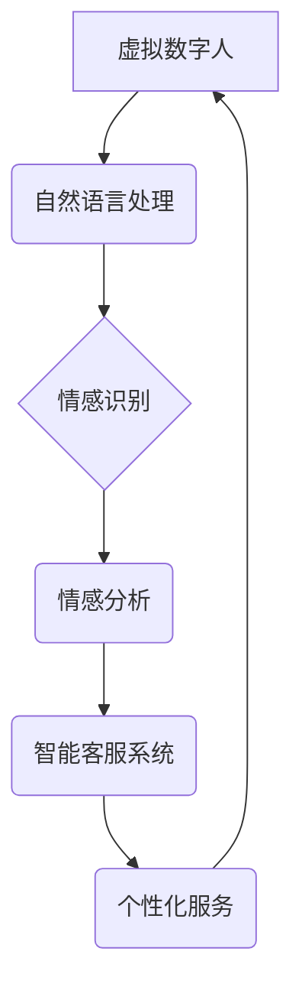

                 

## 未来的智能客服：2050年的虚拟数字人与情感计算

> 关键词：虚拟数字人、情感计算、智能客服、自然语言处理、机器学习、深度学习、人机交互、未来趋势

## 1. 背景介绍

随着人工智能技术的飞速发展，智能客服已经成为各行各业数字化转型的重要组成部分。传统的客服模式面临着效率低下、成本高昂、客户体验差等问题。而智能客服，凭借其强大的自动化能力、24/7小时在线服务和个性化体验，正在逐渐取代传统客服，成为未来客服发展的主流趋势。

2050年，智能客服将迎来更加革命性的变革。虚拟数字人将成为智能客服的全新形态，它们将拥有逼真的外形、自然流畅的语言表达能力和高度的智能化。通过情感计算技术，虚拟数字人能够理解和回应客户的情绪，提供更加人性化、贴心的服务体验。

## 2. 核心概念与联系

### 2.1 虚拟数字人

虚拟数字人是指利用计算机图形学、人工智能等技术创建的虚拟形象，能够模拟人类的语言、表情、动作等行为。

### 2.2 情感计算

情感计算是指通过计算机技术识别、理解和模拟人类的情感。它涉及到自然语言处理、机器学习、心理学等多个领域。

### 2.3 智能客服

智能客服是指利用人工智能技术，自动处理客户咨询、服务请求等任务的系统。它可以提供24/7小时在线服务，并根据客户的需求提供个性化的解决方案。

**核心概念与联系流程图**



## 3. 核心算法原理 & 具体操作步骤

### 3.1 算法原理概述

虚拟数字人与情感计算的核心算法主要包括：

* **自然语言处理 (NLP)**：用于理解和处理人类语言，包括文本分析、语音识别、机器翻译等。
* **情感识别**：通过分析文本、语音或图像等数据，识别用户的正面、负面或中性情绪。
* **情感分析**：对情感识别结果进行深入分析，理解用户的意图和需求。
* **对话系统**：构建虚拟数字人与用户进行自然流畅对话的系统。

### 3.2 算法步骤详解

**情感识别算法步骤：**

1. **数据预处理**: 对输入数据进行清洗、格式化等处理，去除噪声和无关信息。
2. **特征提取**: 从文本、语音或图像中提取情感相关的特征，例如关键词、情感词、语气、表情等。
3. **情感分类**: 利用机器学习算法，将提取的特征映射到不同的情感类别，例如快乐、悲伤、愤怒等。
4. **结果输出**: 输出情感分类结果，并可根据需要进行进一步的分析和处理。

**对话系统算法步骤：**

1. **意图识别**: 识别用户对话中的意图，例如查询信息、投诉问题、预约服务等。
2. **实体识别**: 从用户对话中提取关键信息，例如时间、地点、产品名称等。
3. **对话管理**: 根据用户意图和实体信息，选择合适的回复内容，并引导对话流程。
4. **自然语言生成**: 生成自然流畅的回复文本，并根据情境选择合适的语气和表达方式。

### 3.3 算法优缺点

**优点:**

* **自动化**: 智能客服能够自动处理客户咨询，提高服务效率。
* **24/7小时在线**: 智能客服可以随时随地提供服务，满足客户多样化的需求。
* **个性化**: 智能客服可以根据客户的历史数据和行为习惯，提供个性化的服务体验。

**缺点:**

* **情感理解能力有限**: 当前的情感计算技术还无法完全理解人类的情感，可能会导致服务体验不佳。
* **缺乏灵活性**: 智能客服的回复内容通常是预先设定的，难以应对复杂或突发情况。
* **技术成本高**: 开发和维护智能客服系统需要投入大量的技术资源。

### 3.4 算法应用领域

* **电商**: 提供在线购物咨询、订单跟踪、退换货服务等。
* **金融**: 处理客户账户查询、理财咨询、贷款申请等服务。
* **医疗**: 提供预约挂号、病情咨询、药品信息查询等服务。
* **教育**: 提供在线学习辅导、答疑解惑、课程推荐等服务。

## 4. 数学模型和公式 & 详细讲解 & 举例说明

### 4.1 数学模型构建

情感计算中常用的数学模型包括：

* **朴素贝叶斯模型**: 基于贝叶斯定理，通过计算单词在不同情感类别下的概率，预测文本的情感类别。
* **支持向量机 (SVM)**: 通过寻找最佳的分隔超平面，将不同情感类别的数据点分开。
* **深度学习模型**: 例如循环神经网络 (RNN) 和卷积神经网络 (CNN)，能够学习更复杂的文本特征，提高情感识别精度。

### 4.2 公式推导过程

**朴素贝叶斯模型的概率计算公式**:

$$P(C|D) = \frac{P(D|C)P(C)}{P(D)}$$

其中：

* $P(C|D)$: 文本D属于情感类别C的概率。
* $P(D|C)$: 情感类别C下，文本D出现的概率。
* $P(C)$: 情感类别C出现的概率。
* $P(D)$: 文本D出现的概率。

### 4.3 案例分析与讲解

**举例说明**:

假设我们有一个文本“今天天气真好”，我们要预测它的情感类别。

* $P(开心|“今天天气真好”)$: 我们需要计算文本“今天天气真好”属于情感类别“开心”的概率。
* $P(“今天天气真好”|开心)$: 我们需要计算在“开心”的情感类别下，文本“今天天气真好”出现的概率。
* $P(开心)$: 我们需要计算“开心”情感类别出现的概率。
* $P(“今天天气真好”)$: 我们需要计算文本“今天天气真好”出现的概率。

通过以上概率的计算，我们可以得到文本“今天天气真好”属于情感类别“开心”的概率。

## 5. 项目实践：代码实例和详细解释说明

### 5.1 开发环境搭建

* **操作系统**: Windows/macOS/Linux
* **编程语言**: Python
* **库依赖**: NLTK, SpaCy, TensorFlow, PyTorch

### 5.2 源代码详细实现

```python
# 情感识别示例代码 (使用 NLTK 库)

import nltk
from nltk.sentiment import SentimentIntensityAnalyzer

nltk.download('vader_lexicon')

analyzer = SentimentIntensityAnalyzer()

text = "今天天气真好"

scores = analyzer.polarity_scores(text)

print(scores)
```

### 5.3 代码解读与分析

* **导入库**: 导入 NLTK 和 SentimentIntensityAnalyzer 库。
* **下载词典**: 下载 VADER 词典，用于情感分析。
* **实例化分析器**: 创建 SentimentIntensityAnalyzer 对象。
* **分析文本**: 使用 analyzer.polarity_scores() 函数分析文本，得到情感得分。
* **输出结果**: 打印情感得分。

### 5.4 运行结果展示

```
{'neg': 0.0, 'neu': 0.408, 'pos': 0.592, 'compound': 0.8947}
```

结果表明，文本“今天天气真好”的情感倾向为正面。

## 6. 实际应用场景

### 6.1 电商客服

虚拟数字人可以作为电商平台的智能客服，帮助客户查询商品信息、下单购买、退换货等。通过情感计算，虚拟数字人可以识别客户的情绪，并提供更加人性化的服务体验。

### 6.2 金融客服

虚拟数字人可以作为银行、保险等金融机构的智能客服，帮助客户办理账户查询、理财咨询、贷款申请等服务。通过情感计算，虚拟数字人可以识别客户的金融需求，并提供更加精准的解决方案。

### 6.3 医疗客服

虚拟数字人可以作为医院、诊所的智能客服，帮助客户预约挂号、查询病情、获取药品信息等。通过情感计算，虚拟数字人可以识别客户的健康状况，并提供更加贴心的医疗服务。

### 6.4 未来应用展望

未来，虚拟数字人与情感计算将应用于更广泛的领域，例如教育、娱乐、社交等。虚拟数字人将成为我们生活中不可或缺的一部分，为我们提供更加智能、便捷、人性化的服务体验。

## 7. 工具和资源推荐

### 7.1 学习资源推荐

* **书籍**:
    * 《深度学习》
    * 《自然语言处理》
    * 《情感计算》
* **在线课程**:
    * Coursera
    * edX
    * Udacity

### 7.2 开发工具推荐

* **Python**: 
    * TensorFlow
    * PyTorch
    * NLTK
    * SpaCy

* **虚拟数字人平台**:
    * Unity
    * Unreal Engine

### 7.3 相关论文推荐

* **ACL**: Association for Computational Linguistics
* **EMNLP**: Empirical Methods in Natural Language Processing
* **NAACL**: North American Chapter of the Association for Computational Linguistics

## 8. 总结：未来发展趋势与挑战

### 8.1 研究成果总结

虚拟数字人与情感计算技术取得了显著的进展，在智能客服、金融、医疗等领域取得了成功应用。

### 8.2 未来发展趋势

* **更逼真的虚拟数字人**: 利用更先进的图形学技术和人工智能算法，打造更加逼真、智能的虚拟数字人。
* **更精准的情感识别**: 开发更先进的情感识别算法，能够更准确地识别和理解人类的情感。
* **更个性化的服务体验**: 利用大数据分析和机器学习，为每个用户提供更加个性化的服务体验。
* **跨平台融合**: 将虚拟数字人与其他平台和设备融合，提供更加便捷、全面的服务体验。

### 8.3 面临的挑战

* **数据安全和隐私**: 虚拟数字人需要处理大量用户数据，如何保障数据安全和隐私是一个重要的挑战。
* **算法伦理**: 情感计算算法可能会存在偏见和歧视，需要进行伦理审查和规范。
* **技术成本**: 开发和维护虚拟数字人系统需要投入大量的技术资源，成本较高。

### 8.4 研究展望

未来，虚拟数字人与情感计算技术将继续发展，为我们带来更加智能、便捷、人性化的服务体验。我们需要加强对相关技术的研发和应用，并积极应对技术带来的挑战，确保其健康、可持续发展。

## 9. 附录：常见问题与解答

* **Q1**: 虚拟数字人与真人客服相比，有哪些优势？

* **A1**: 虚拟数字人可以24/7小时在线服务，处理大量客户咨询，提高服务效率；可以提供个性化的服务体验；成本相对较低。

* **Q2**: 情感计算技术是否能够完全理解人类的情感？

* **A2**: 目前的情感计算技术还无法完全理解人类的情感，但已经取得了显著的进展，能够识别和分析大部分情感表达。

* **Q3**: 虚拟数字人与情感计算技术会取代人类客服吗？

* **A3**: 虚拟数字人与情感计算技术可以辅助人类客服，提高客服效率和服务质量，但不会完全取代人类客服。人类客服仍然需要在复杂、需要情感支持的场景中发挥作用。


作者：禅与计算机程序设计艺术 / Zen and the Art of Computer Programming 
<end_of_turn>

