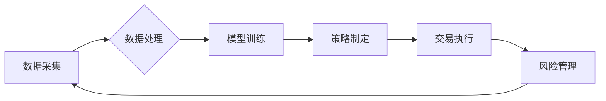

                 

## 未来的智能投资：2050年的智能投顾与资产配置

> 关键词：人工智能、智能投顾、资产配置、机器学习、深度学习、量化投资、风险管理、金融科技

## 1. 背景介绍

金融市场瞬息万变，投资决策需要综合考虑多方面因素，包括宏观经济趋势、市场情绪、公司财务状况等。传统投资方式往往依赖于人类经验和直觉，容易受到情绪影响，难以捕捉市场细微变化。随着人工智能技术的飞速发展，智能投顾（Robo-Advisor）应运而生，利用算法和数据分析，为投资者提供个性化投资建议和资产配置方案。

2050年，智能投顾将更加智能化、个性化和自动化。人工智能将深入金融领域，赋能智能投顾，使其具备更强大的分析能力、预测能力和决策能力。

## 2. 核心概念与联系

智能投顾的核心概念是利用人工智能技术，结合金融市场数据和投资策略，为投资者提供自动化、个性化的投资管理服务。其核心架构包括：

* **数据采集与处理:** 收集海量金融市场数据，包括股票、债券、期货、外汇等，并进行清洗、预处理和特征提取。
* **模型训练与优化:** 利用机器学习和深度学习算法，训练投资模型，预测市场趋势和资产价格走势。
* **策略制定与执行:** 根据模型预测和投资目标，制定个性化的投资策略，并自动执行交易指令。
* **风险管理与监控:** 实时监控投资组合风险，并根据市场变化调整策略，确保投资安全。

**核心概念架构流程图:**



## 3. 核心算法原理 & 具体操作步骤

### 3.1  算法原理概述

智能投顾的核心算法主要包括：

* **机器学习算法:** 用于从历史数据中学习投资规律，预测市场趋势和资产价格走势。常见的机器学习算法包括线性回归、逻辑回归、支持向量机、决策树、随机森林等。
* **深度学习算法:** 用于处理复杂数据，提取更深层次的特征，提高预测精度。常见的深度学习算法包括卷积神经网络、循环神经网络等。
* **强化学习算法:** 用于优化投资策略，通过不断学习和调整，最大化投资收益。

### 3.2  算法步骤详解

**以机器学习算法为例，其具体操作步骤如下:**

1. **数据收集:** 收集历史股票价格、交易量、公司财务数据等相关信息。
2. **数据预处理:** 清洗数据，处理缺失值，归一化数据，提取特征。
3. **模型选择:** 根据数据特点和投资目标，选择合适的机器学习算法。
4. **模型训练:** 利用训练数据，训练机器学习模型，调整模型参数，使其能够准确预测市场趋势。
5. **模型评估:** 利用测试数据，评估模型的预测精度，并进行模型调优。
6. **策略制定:** 根据模型预测，制定投资策略，例如买入、卖出、持有等。
7. **交易执行:** 自动执行交易指令，根据策略进行股票买卖。

### 3.3  算法优缺点

**优点:**

* **数据驱动:** 基于大量数据分析，决策更加客观理性。
* **自动化:** 自动化投资流程，节省时间和精力。
* **个性化:** 根据投资者风险承受能力和投资目标，提供个性化投资方案。

**缺点:**

* **数据依赖:** 模型预测精度依赖于数据质量和数量。
* **黑盒效应:** 部分机器学习算法难以解释其决策逻辑，缺乏透明度。
* **市场变化:** 模型需要不断更新和调整，以适应不断变化的市场环境。

### 3.4  算法应用领域

智能投顾算法广泛应用于以下领域:

* **股票投资:** 预测股票价格走势，制定股票投资策略。
* **基金投资:** 选择合适的基金，构建投资组合。
* **资产配置:** 根据投资者风险承受能力和投资目标，配置不同资产类别，优化投资组合收益。
* **风险管理:** 监控投资组合风险，及时调整策略，降低投资损失。

## 4. 数学模型和公式 & 详细讲解 & 举例说明

### 4.1  数学模型构建

智能投顾的数学模型主要用于预测市场趋势和资产价格走势。常见的数学模型包括：

* **时间序列模型:** 用于预测未来时间点的数据值，例如ARIMA模型、SARIMA模型等。
* **回归模型:** 用于建立变量之间的关系，例如线性回归、逻辑回归等。
* **神经网络模型:** 用于处理复杂数据，提取更深层次的特征，预测市场趋势。

### 4.2  公式推导过程

以ARIMA模型为例，其核心公式为：

$$
y_t = c + \sum_{i=1}^{p} \phi_i y_{t-i} + \sum_{j=1}^{q} \theta_j \epsilon_{t-j} + \epsilon_t
$$

其中：

* $y_t$ 表示时间t点的观测值。
* $c$ 表示截距项。
* $\phi_i$ 表示自回归系数。
* $p$ 表示自回归阶数。
* $\theta_j$ 表示移动平均系数。
* $q$ 表示移动平均阶数。
* $\epsilon_t$ 表示白噪声。

### 4.3  案例分析与讲解

假设我们想要预测某只股票未来一周的价格走势，可以使用ARIMA模型。首先，我们需要收集该股票的历史价格数据，并进行数据预处理。然后，选择合适的ARIMA模型参数，例如p、q值。最后，利用训练数据训练ARIMA模型，并利用测试数据评估模型的预测精度。

## 5. 项目实践：代码实例和详细解释说明

### 5.1  开发环境搭建

智能投顾项目开发环境通常包括：

* **操作系统:** Linux、Windows、macOS等。
* **编程语言:** Python、R、Java等。
* **机器学习库:** scikit-learn、TensorFlow、PyTorch等。
* **数据处理库:** Pandas、NumPy等。
* **数据库:** MySQL、PostgreSQL等。

### 5.2  源代码详细实现

以下是一个简单的Python代码示例，演示如何使用scikit-learn库训练一个线性回归模型，预测股票价格：

```python
import pandas as pd
from sklearn.linear_model import LinearRegression
from sklearn.model_selection import train_test_split

# 加载股票价格数据
data = pd.read_csv('stock_price.csv')

# 选择特征和目标变量
features = ['Open', 'High', 'Low', 'Volume']
target = 'Close'

# 将数据分割为训练集和测试集
X_train, X_test, y_train, y_test = train_test_split(data[features], data[target], test_size=0.2)

# 创建线性回归模型
model = LinearRegression()

# 训练模型
model.fit(X_train, y_train)

# 预测测试集数据
y_pred = model.predict(X_test)

# 评估模型性能
from sklearn.metrics import mean_squared_error
mse = mean_squared_error(y_test, y_pred)
print('Mean Squared Error:', mse)
```

### 5.3  代码解读与分析

这段代码首先加载股票价格数据，然后选择特征和目标变量。接着，将数据分割为训练集和测试集，用于训练和评估模型。

接下来，创建线性回归模型，并使用训练数据训练模型。最后，利用训练好的模型预测测试集数据，并评估模型性能。

### 5.4  运行结果展示

运行这段代码后，会输出测试集数据的预测结果和模型的均方误差（MSE）。MSE值越小，模型的预测精度越高。

## 6. 实际应用场景

智能投顾已在金融市场得到广泛应用，例如：

* **个人投资者:** 为个人投资者提供个性化投资建议和资产配置方案，帮助他们实现财富增值目标。
* **机构投资者:** 为机构投资者提供量化投资策略和风险管理工具，帮助他们优化投资组合收益。
* **财富管理平台:** 为财富管理平台提供智能投资引擎，提升客户体验和服务效率。

### 6.4  未来应用展望

未来，智能投顾将更加智能化、个性化和自动化。

* **更精准的预测:** 利用更先进的机器学习和深度学习算法，提高市场趋势和资产价格走势的预测精度。
* **更个性化的服务:** 根据投资者风险承受能力、投资目标、生活方式等多方面因素，提供更加个性化的投资建议和资产配置方案。
* **更全面的功能:** 不仅提供投资建议和资产配置，还提供理财规划、税务筹划、保险建议等全面的金融服务。

## 7. 工具和资源推荐

### 7.1  学习资源推荐

* **书籍:**
    * 《Python机器学习》
    * 《深度学习》
    * 《量化投资》
* **在线课程:**
    * Coursera
    * edX
    * Udemy

### 7.2  开发工具推荐

* **编程语言:** Python
* **机器学习库:** scikit-learn, TensorFlow, PyTorch
* **数据处理库:** Pandas, NumPy
* **数据库:** MySQL, PostgreSQL

### 7.3  相关论文推荐

* **AlphaGo论文:** https://arxiv.org/abs/1607.02886
* **BERT论文:** https://arxiv.org/abs/1810.04805
* **GAN论文:** https://arxiv.org/abs/1406.2661

## 8. 总结：未来发展趋势与挑战

### 8.1  研究成果总结

智能投顾技术取得了显著进展，能够提供更精准的投资建议和更个性化的服务。

### 8.2  未来发展趋势

未来，智能投顾将朝着以下方向发展:

* **更智能化:** 利用更先进的AI算法，提高预测精度和决策能力。
* **更个性化:** 根据投资者个人情况，提供更加定制化的投资方案。
* **更全面的服务:** 不仅提供投资建议，还提供理财规划、税务筹划等全面的金融服务。

### 8.3  面临的挑战

智能投顾技术也面临一些挑战:

* **数据安全:** 保护投资者隐私和数据安全。
* **算法透明度:** 提高算法的透明度，增强用户信任。
* **监管政策:** 适应不断变化的监管政策，确保合规运营。

### 8.4  研究展望

未来，我们需要继续研究更先进的AI算法，提高智能投顾的预测精度和决策能力。同时，还需要关注数据安全、算法透明度和监管政策等问题，推动智能投顾技术健康发展。

## 9. 附录：常见问题与解答

**常见问题:**

* 智能投顾是否会取代人类投资经理？
* 智能投顾的投资风险如何控制？
* 如何选择合适的智能投顾平台？

**解答:**

* 智能投顾可以辅助人类投资经理，提高投资效率，但不会完全取代人类投资经理。
* 智能投顾平台会采用多种风险管理措施，例如风险控制模型、止损策略等，来控制投资风险。
* 选择智能投顾平台时，需要考虑平台的信誉、算法能力、服务费用等因素。


作者：禅与计算机程序设计艺术 / Zen and the Art of Computer Programming 
<end_of_turn>

