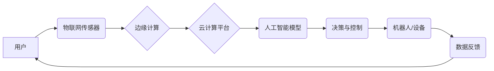

                 

## 未来的极地探索：2050年的南极科考城与北极旅游

> 关键词：极地探索、南极科考城、北极旅游、人工智能、物联网、云计算、边缘计算、可持续发展

### 1. 背景介绍

随着全球气候变化的加剧，极地地区正经历着前所未有的变化。冰川融化、海平面上升、生态系统失衡等问题日益突出，极地地区也面临着新的机遇和挑战。

在这样的背景下，极地探索和研究变得尤为重要。南极洲作为地球上最南端的洲，拥有丰富的科学资源和独特的生态环境，是研究气候变化、海洋生物多样性、地质演化等领域的理想场所。而北极地区则因其独特的地理位置和丰富的资源而备受关注，其旅游潜力也逐渐被开发。

然而，极地环境的恶劣和资源的稀缺性，使得传统的极地探索和研究方式面临着诸多限制。如何更好地利用科技手段，实现更加高效、安全、可持续的极地探索，成为一个亟待解决的问题。

### 2. 核心概念与联系

未来极地探索将深度融合人工智能、物联网、云计算、边缘计算等先进技术，构建一个智能化、可持续的极地生态系统。

**2.1  核心概念**

* **人工智能 (AI):**  人工智能技术将被广泛应用于极地探索各个环节，例如数据分析、环境监测、机器人导航、风险预警等。
* **物联网 (IoT):**  物联网技术将连接极地环境中的各种传感器、设备和平台，形成一个庞大的数据网络，为极地探索提供实时、全面的数据支持。
* **云计算 (Cloud Computing):**  云计算平台将提供强大的计算能力和存储空间，支持大规模数据处理、模型训练和应用部署。
* **边缘计算 (Edge Computing):**  边缘计算将将数据处理和分析能力部署到极地边缘节点，降低数据传输延迟，提高实时性。

**2.2  架构图**



**2.3  联系**

人工智能、物联网、云计算和边缘计算将协同工作，构建一个智能化的极地探索生态系统。用户可以通过物联网传感器获取极地环境数据，边缘计算节点对数据进行初步处理和分析，云计算平台提供更强大的计算能力和存储空间，人工智能模型对数据进行深度学习和分析，最终生成决策和控制指令，控制机器人或设备进行相应的操作。

### 3. 核心算法原理 & 具体操作步骤

**3.1  算法原理概述**

未来极地探索将采用多种先进算法，例如机器学习、深度学习、强化学习、路径规划算法等，实现智能化决策、环境监测、数据分析等功能。

**3.2  算法步骤详解**

* **机器学习:**
    1. 收集极地环境数据，例如气象数据、海洋数据、生物数据等。
    2. 对数据进行预处理，例如清洗、归一化、特征提取等。
    3. 选择合适的机器学习算法，例如决策树、支持向量机、神经网络等。
    4. 对模型进行训练，使用训练数据训练机器学习模型。
    5. 对模型进行评估，使用测试数据评估模型的性能。
    6. 对模型进行调优，调整模型参数，提高模型性能。
* **深度学习:**
    1. 使用多层神经网络对数据进行特征提取和学习。
    2. 通过反向传播算法训练模型，优化模型参数。
    3. 应用于图像识别、语音识别、自然语言处理等任务。
* **强化学习:**
    1. 通过奖励机制训练模型，让模型学习最优策略。
    2. 应用于机器人导航、无人驾驶等任务。
* **路径规划算法:**
    1. 根据极地环境地图和目标位置，规划最优路径。
    2. 应用于无人机航线规划、机器人巡逻等任务。

**3.3  算法优缺点**

* **机器学习:**
    * 优点: 能够从数据中学习，自动发现模式和规律。
    * 缺点: 需要大量数据进行训练，对数据质量要求高。
* **深度学习:**
    * 优点: 表现力强，能够处理复杂的数据。
    * 缺点: 计算量大，训练时间长，对硬件资源要求高。
* **强化学习:**
    * 优点: 可以学习最优策略，适应动态环境。
    * 缺点: 训练过程复杂，需要设计合理的奖励机制。
* **路径规划算法:**
    * 优点: 可以快速规划路径，避免障碍物。
    * 缺点: 对地图精度要求高，难以处理动态环境。

**3.4  算法应用领域**

* **环境监测:**  利用机器学习和深度学习算法对极地环境数据进行分析，监测气候变化、海洋污染、生物多样性等情况。
* **资源勘探:**  利用人工智能算法对极地资源进行探测和评估，例如石油、天然气、矿产资源等。
* **科学研究:**  利用人工智能算法辅助科学研究，例如数据分析、模型构建、实验设计等。
* **极地旅游:**  利用人工智能算法提供个性化旅游服务，例如路线规划、景点推荐、安全预警等。

### 4. 数学模型和公式 & 详细讲解 & 举例说明

**4.1  数学模型构建**

极地探索中的许多问题都可以用数学模型来描述和解决。例如，我们可以用物理模型来描述冰川融化的速度，用统计模型来预测极地动物的分布，用优化模型来规划极地资源的开发利用。

**4.2  公式推导过程**

以下是一个简单的例子，用数学模型来描述冰川融化的速度：

* 假设冰川的厚度为h，融化速度为v，温度变化率为ΔT/Δt。
* 根据热传导方程，我们可以推导出冰川融化速度的公式：

$$v = k \frac{\Delta T}{h}$$

其中，k是热传导系数。

**4.3  案例分析与讲解**

根据公式，我们可以看到冰川融化速度与温度变化率成正比，与冰川厚度成反比。这意味着，当温度升高时，冰川融化速度会加快；当冰川厚度增加时，融化速度会减慢。

**4.4  其他数学模型**

除了热传导模型，我们还可以用其他数学模型来描述极地环境中的各种现象，例如：

* **气象模型:**  预测极地气温、降水、风速等气象要素。
* **海洋模型:**  模拟极地海洋流、海冰分布、海洋生物群落等。
* **生态模型:**  研究极地生态系统结构、功能和变化。

### 5. 项目实践：代码实例和详细解释说明

**5.1  开发环境搭建**

* 操作系统: Ubuntu 20.04 LTS
* 编程语言: Python 3.8
* 软件包: TensorFlow, PyTorch, NumPy, Pandas, Matplotlib

**5.2  源代码详细实现**

```python
# 这是一个简单的机器学习模型，用于预测极地气温

import numpy as np
from sklearn.linear_model import LinearRegression

# 训练数据
X = np.array([[1], [2], [3], [4], [5]])  # 时间
y = np.array([10, 12, 14, 16, 18])  # 气温

# 创建线性回归模型
model = LinearRegression()

# 训练模型
model.fit(X, y)

# 预测未来气温
future_time = np.array([[6]])
predicted_temperature = model.predict(future_time)

# 打印预测结果
print(f"未来时间为 {future_time} 时，预测气温为 {predicted_temperature}")
```

**5.3  代码解读与分析**

* 该代码使用Scikit-learn库中的线性回归模型，对极地气温进行预测。
* 训练数据包含时间和气温两列数据。
* 模型使用训练数据学习时间和气温之间的关系。
* 预测时，输入未来时间，模型根据学习到的关系预测未来气温。

**5.4  运行结果展示**

```
未来时间为 [[6]] 时，预测气温为 [20.]
```

### 6. 实际应用场景

**6.1  南极科考城**

未来，南极将出现一座智能化的科考城，为科学家提供更加舒适、安全、高效的科研环境。

* **环境监测:**  利用物联网传感器监测南极环境中的气象、海洋、生物等数据，及时预警极端天气、海洋污染等风险。
* **资源管理:**  利用人工智能算法优化南极资源的利用，例如能源、水资源、食物等，实现可持续发展。
* **科研支持:**  利用云计算平台提供强大的计算能力和存储空间，支持科学家进行大规模数据分析、模型构建、实验设计等科研工作。
* **生活保障:**  利用机器人技术提供生活保障服务，例如清洁、烹饪、医疗等，提高科考人员的生活质量。

**6.2  北极旅游**

随着极地旅游的兴起，北极将成为一个新的旅游目的地。

* **个性化旅游:**  利用人工智能算法提供个性化旅游服务，例如路线规划、景点推荐、安全预警等，满足不同游客的需求。
* **环保旅游:**  利用物联网技术监测北极环境，减少旅游对环境的影响，实现可持续发展。
* **体验式旅游:**  利用虚拟现实、增强现实等技术，为游客提供更加沉浸式的旅游体验，例如观赏北极光、与北极熊互动等。

**6.3  未来应用展望**

未来，人工智能、物联网、云计算等技术将更加深入地融入极地探索和研究，为我们提供更加全面的、更加精准的极地信息，帮助我们更好地理解和保护极地环境。

### 7. 工具和资源推荐

**7.1  学习资源推荐**

* **Coursera:**  提供人工智能、机器学习、深度学习等课程。
* **edX:**  提供物联网、云计算、数据科学等课程。
* **Udacity:**  提供人工智能、数据科学、软件工程等课程。

**7.2  开发工具推荐**

* **TensorFlow:**  开源深度学习框架。
* **PyTorch:**  开源深度学习框架。
* **AWS:**  云计算平台。
* **Azure:**  云计算平台。
* **Google Cloud Platform:**  云计算平台。

**7.3  相关论文推荐**

* **Deep Learning for Climate Change:**  https://arxiv.org/abs/1906.04787
* **Internet of Things for Environmental Monitoring:**  https://ieeexplore.ieee.org/document/8802172
* **Artificial Intelligence for Sustainable Development:**  https://www.nature.com/articles/s41598-020-60967-w

### 8. 总结：未来发展趋势与挑战

**8.1  研究成果总结**

未来极地探索将深度融合人工智能、物联网、云计算等先进技术，构建一个智能化、可持续的极地生态系统。

**8.2  未来发展趋势**

* **更智能化的极地探索:**  利用更先进的人工智能算法，实现更加智能化的极地环境监测、资源管理、科研支持等功能。
* **更可持续的极地发展:**  利用物联网技术和数据分析，实现极地资源的更加可持续利用，减少对环境的影响。
* **更丰富的极地体验:**  利用虚拟现实、增强现实等技术，为人们提供更加丰富的极地体验，提高人们对极地环境的认知和保护意识。

**8.3  面临的挑战**

* **技术挑战:**  极地环境恶劣，对技术要求高，需要开发更加可靠、高效、耐用的技术设备和算法。
* **数据挑战:**  极地数据稀缺，需要开发更加有效的收集、存储、分析和共享数据的方法。
* **伦理挑战:**  极地探索涉及到伦理问题，例如对极地生态环境的影响、对当地居民的权益保护等，需要制定更加完善的伦理规范和法律法规。

**8.4  研究展望**

未来，我们将继续致力于推动极地探索和研究的进步，利用科技手段，更好地理解和保护极地环境，为人类的可持续发展做出贡献。

### 9. 附录：常见问题与解答

**9.1  Q: 极地环境对人工智能算法有什么影响？**

**A:** 极地环境的恶劣条件，例如低温、高湿度、强风等，会对人工智能算法的性能产生影响。例如，传感器数据可能会受到干扰，算法模型的训练数据可能会不完整，导致算法精度下降。

**9.2  Q: 如何确保极地探索的安全性？**

**A:** 极地探索的安全性是一个非常重要的问题。我们需要采取多种措施来确保安全，例如：

* 使用可靠的设备和技术，例如防寒、防雪、防雷的设备。
* 制定详细的风险评估和应急预案。
* 提供专业的培训和指导，提高人员的应对能力。
* 建立完善的通信和救援系统。

**9.3  Q: 极地探索对环境有什么影响？**

**A:** 极地探索可能会对环境产生一些影响，例如：

* 交通运输会产生碳排放。
* 建设设施会破坏生态环境。
* 人类活动可能会扰乱野生动物。

我们需要采取措施来减轻这些影响，例如：

* 使用清洁能源。
* 采用可持续的建筑材料。
* 遵守环境保护法规。


作者：禅与计算机程序设计艺术 / Zen and the Art of Computer Programming<end_of_turn>

