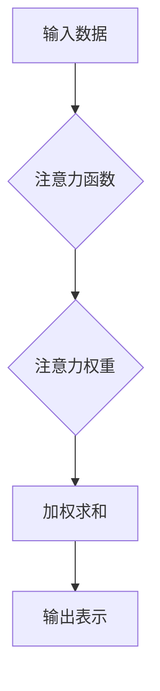

                 

## 1. 背景介绍

在当今信息爆炸的时代，我们每天都被来自各个方向的海量信息所包围。电子邮件、社交媒体、新闻推送、手机通知，无时无刻不在争夺着我们的注意力。这种持续不断的干扰使得专注力成为一种稀缺资源，也成为个人成长和发展的关键瓶颈。

注意力，是认知能力的核心，它指我们对特定信息或任务的集中和持续的关注。良好的注意力可以帮助我们更好地学习、工作、生活，提高效率和创造力。然而，现代社会的生活节奏和信息环境对我们的注意力构成巨大挑战。

## 2. 核心概念与联系

### 2.1 注意力机制

注意力机制是近年来深度学习领域取得突破性进展的重要组成部分。它模拟了人类大脑对重要信息进行筛选和聚焦的过程，赋予模型选择性地关注输入数据中的关键部分的能力。

**注意力机制的原理：**

1. **计算注意力权重：** 通过一个注意力函数，对输入数据中的每个元素计算其与目标输出的关联程度，得到每个元素的注意力权重。
2. **加权求和：** 将注意力权重与输入数据相乘，并求和，得到一个加权后的输出表示。

**注意力机制的架构：**



### 2.2 自我改善与注意力

自我改善是一个持续的过程，它需要我们不断地反思、学习和调整。注意力是自我改善的关键驱动力，它让我们能够专注于重要的目标，排除干扰，并持续地投入时间和精力。

**注意力与自我改善的关系：**

1. **目标设定：** 注意力可以帮助我们明确目标，并集中精力去实现它。
2. **学习与成长：** 注意力让我们能够专注于学习新知识和技能，并从中获得成长。
3. **情绪管理：** 注意力可以帮助我们识别和管理情绪，避免被负面情绪所左右。
4. **决策制定：** 注意力让我们能够理性地分析信息，做出明智的决策。

## 3. 核心算法原理 & 具体操作步骤

### 3.1 算法原理概述

注意力机制的算法原理主要基于以下几个方面：

1. **查询、键、值机制：** 将输入数据分解为查询 (query)、键 (key) 和值 (value) 三个部分，通过计算查询与键之间的相似度来确定注意力权重。
2. **注意力函数：** 使用不同的函数来计算查询与键之间的相似度，例如点积注意力、加性注意力等。
3. **软注意力：** 使用softmax函数将注意力权重归一化，得到每个元素的概率分布，从而选择性地关注输入数据中的关键部分。

### 3.2 算法步骤详解

1. **输入数据预处理：** 将输入数据转换为模型可处理的格式，例如向量化表示。
2. **查询、键、值计算：** 对输入数据分别计算查询、键和值向量。
3. **注意力权重计算：** 使用注意力函数计算查询与键之间的相似度，得到注意力权重。
4. **加权求和：** 将注意力权重与值向量相乘，并求和，得到加权后的输出表示。
5. **输出结果：** 将加权后的输出表示作为模型的输出。

### 3.3 算法优缺点

**优点：**

* 可以有效地捕捉输入数据中的长程依赖关系。
* 可以提高模型的表达能力和泛化能力。
* 可以减少模型参数的数量，提高训练效率。

**缺点：**

* 计算复杂度较高，训练时间较长。
* 对训练数据的质量要求较高。
* 难以解释注意力权重的含义。

### 3.4 算法应用领域

注意力机制在自然语言处理、计算机视觉、语音识别等领域都有广泛的应用。

* **机器翻译：** 使用注意力机制可以帮助模型更好地理解句子结构和语义，提高翻译质量。
* **文本摘要：** 使用注意力机制可以帮助模型识别文本中的关键信息，生成更准确的摘要。
* **图像识别：** 使用注意力机制可以帮助模型关注图像中的关键区域，提高识别准确率。

## 4. 数学模型和公式 & 详细讲解 & 举例说明

### 4.1 数学模型构建

注意力机制的数学模型可以表示为以下公式：

$$
\text{Attention}(Q, K, V) = \text{softmax}(\frac{Q K^T}{\sqrt{d_k}}) V
$$

其中：

* $Q$：查询向量
* $K$：键向量
* $V$：值向量
* $d_k$：键向量的维度
* $\text{softmax}$：softmax函数

### 4.2 公式推导过程

1. **计算查询与键之间的相似度：** 使用点积运算计算查询向量 $Q$ 与每个键向量 $K_i$ 之间的相似度，得到一个分数向量 $s$。

$$
s_i = Q K_i^T
$$

2. **归一化相似度：** 使用softmax函数对分数向量 $s$ 进行归一化，得到每个键向量的注意力权重 $a_i$。

$$
a_i = \frac{exp(s_i)}{\sum_{j=1}^{n} exp(s_j)}
$$

3. **加权求和：** 将注意力权重 $a_i$ 与值向量 $V_i$ 相乘，并求和，得到加权后的输出表示 $o$。

$$
o = \sum_{i=1}^{n} a_i V_i
$$

### 4.3 案例分析与讲解

假设我们有一个句子 "The cat sat on the mat"，我们想要使用注意力机制来识别句子中与 "sat" 这个词相关的关键信息。

1. 将句子中的每个词都转换为向量表示。
2. 计算查询向量与每个键向量的相似度。
3. 使用softmax函数对相似度进行归一化，得到每个词的注意力权重。
4. 将注意力权重与值向量相乘，并求和，得到与 "sat" 相关的加权后的输出表示。

通过分析加权后的输出表示，我们可以发现 "cat" 和 "mat" 两个词的注意力权重较高，说明它们与 "sat" 相关的关键信息。

## 5. 项目实践：代码实例和详细解释说明

### 5.1 开发环境搭建

* Python 3.6+
* TensorFlow 或 PyTorch 深度学习框架
* Jupyter Notebook 或 VS Code 代码编辑器

### 5.2 源代码详细实现

```python
import tensorflow as tf

# 定义注意力机制层
class AttentionLayer(tf.keras.layers.Layer):
    def __init__(self, units):
        super(AttentionLayer, self).__init__()
        self.Wq = tf.keras.layers.Dense(units)
        self.Wk = tf.keras.layers.Dense(units)
        self.Wv = tf.keras.layers.Dense(units)
        self.softmax = tf.keras.layers.Softmax()

    def call(self, query, key, value):
        # 计算注意力权重
        scores = tf.matmul(self.Wq(query), self.Wk(key), transpose_b=True)
        attention_weights = self.softmax(scores)

        # 加权求和
        context_vector = tf.matmul(attention_weights, self.Wv(value))
        return context_vector

# 示例使用
query = tf.random.normal((1, 5, 128))
key = tf.random.normal((1, 5, 128))
value = tf.random.normal((1, 5, 128))

attention_layer = AttentionLayer(units=64)
context_vector = attention_layer(query, key, value)
print(context_vector.shape)
```

### 5.3 代码解读与分析

* `AttentionLayer` 类定义了一个注意力机制层，包含三个稠密层 (`Wq`, `Wk`, `Wv`) 用于计算查询、键和值向量的线性变换，以及一个 `softmax` 函数用于计算注意力权重。
* `call` 方法实现注意力机制的计算过程，首先计算查询与键之间的相似度，然后使用 `softmax` 函数归一化相似度得到注意力权重，最后将注意力权重与值向量相乘，并求和得到加权后的输出表示。
* 示例代码演示了如何使用 `AttentionLayer` 层，并打印了加权后的输出表示的形状。

### 5.4 运行结果展示

运行代码后，会输出加权后的输出表示的形状，例如 `(1, 64)`。

## 6. 实际应用场景

### 6.1  注意力机制在自然语言处理中的应用

* **机器翻译：** 使用注意力机制可以帮助模型更好地理解句子结构和语义，提高翻译质量。例如，Google Translate 使用注意力机制来翻译不同语言的文本。
* **文本摘要：** 使用注意力机制可以帮助模型识别文本中的关键信息，生成更准确的摘要。例如，BART 模型使用注意力机制来生成文本摘要。
* **问答系统：** 使用注意力机制可以帮助模型定位问题和答案之间的相关信息，提高问答准确率。例如，BERT 模型使用注意力机制来构建问答系统。

### 6.2 注意力机制在计算机视觉中的应用

* **图像识别：** 使用注意力机制可以帮助模型关注图像中的关键区域，提高识别准确率。例如，ResNet 模型使用注意力机制来识别图像中的物体。
* **目标检测：** 使用注意力机制可以帮助模型定位图像中的目标，提高检测精度。例如，YOLOv3 模型使用注意力机制来检测图像中的目标。
* **图像分割：** 使用注意力机制可以帮助模型分割图像中的不同区域，提高分割精度。例如，U-Net 模型使用注意力机制来分割图像中的器官。

### 6.3  注意力机制在语音识别中的应用

* **语音识别：** 使用注意力机制可以帮助模型关注语音信号中的关键部分，提高识别准确率。例如，Transformer 模型使用注意力机制来识别语音信号中的单词。

### 6.4 未来应用展望

注意力机制在人工智能领域具有广阔的应用前景，未来可能会应用于更多领域，例如：

* **自动驾驶：** 使用注意力机制可以帮助自动驾驶系统关注道路上的关键信息，提高驾驶安全性。
* **医疗诊断：** 使用注意力机制可以帮助医生分析医学图像，提高诊断准确率。
* **金融预测：** 使用注意力机制可以帮助金融机构分析市场数据，提高预测准确率。

## 7. 工具和资源推荐

### 7.1 学习资源推荐

* **书籍：**
    * 《深度学习》 by Ian Goodfellow, Yoshua Bengio, and Aaron Courville
    * 《Attention Is All You Need》 by Vaswani et al.
* **在线课程：**
    * Coursera: Deep Learning Specialization
    * Udacity: Deep Learning Nanodegree
* **博客和网站：**
    * TensorFlow Blog: https://blog.tensorflow.org/
    * PyTorch Blog: https://pytorch.org/blog/

### 7.2 开发工具推荐

* **深度学习框架：** TensorFlow, PyTorch
* **代码编辑器：** Jupyter Notebook, VS Code
* **数据可视化工具：** Matplotlib, Seaborn

### 7.3 相关论文推荐

* **Attention Is All You Need:** https://arxiv.org/abs/1706.03762
* **BERT: Pre-training of Deep Bidirectional Transformers for Language Understanding:** https://arxiv.org/abs/1810.04805
* **Transformer-XL: Attentive Language Models Beyond a Fixed-Length Context:** https://arxiv.org/abs/1901.08316

## 8. 总结：未来发展趋势与挑战

### 8.1 研究成果总结

注意力机制在近年来取得了显著的进展，并在自然语言处理、计算机视觉等领域取得了突破性的成果。

### 8.2 未来发展趋势

* **更有效的注意力机制：** 研究更有效的注意力机制，例如自注意力机制、多头注意力机制等，提高模型的表达能力和泛化能力。
* **注意力机制的解释性：** 研究注意力机制的解释性，使得模型的决策过程更加透明和可理解。
* **注意力机制的应用扩展：** 将注意力机制应用于更多领域，例如自动驾驶、医疗诊断、金融预测等。

### 8.3 面临的挑战

* **计算复杂度：** 传统的注意力机制计算复杂度较高，难以应用于大规模数据和复杂任务。
* **数据依赖性：** 注意力机制的性能依赖于训练数据的质量，对于小规模数据或噪声数据，效果可能不佳。
* **可解释性：** 注意力机制的决策过程难以解释，这使得模型的应用受到限制。

### 8.4 研究展望

未来，注意力机制的研究将继续朝着更有效、更可解释、更广泛应用的方向发展。


## 9. 附录：常见问题与解答

**1. 注意力机制与卷积神经网络有什么区别？**

注意力机制和卷积神经网络都是深度学习中常用的架构，但它们的工作方式不同。卷积神经网络通过卷积核提取图像特征，而注意力机制通过计算查询、键和值之间的相似度来选择性地关注输入数据中的关键部分。

**2. 注意力机制的计算复杂度如何？**

传统的注意力机制计算复杂度较高，与输入数据的长度呈平方关系。然而，近年来出现了许多高效的注意力机制，例如线性注意力机制，可以降低计算复杂度。

**3. 注意力机制的应用领域有哪些？**

注意力机制在自然语言处理、计算机视觉、语音识别等领域都有广泛的应用。

**4. 如何解释注意力机制的输出？**

注意力机制的输出是一个加权后的向量，每个元素代表了输入数据中对应元素的重要性。可以通过可视化注意力权重来理解模型关注哪些部分。

**5. 注意力机制的未来发展趋势是什么？**

未来，注意力机制的研究将继续朝着更有效、更可解释、更广泛应用的方向发展。


作者：禅与计算机程序设计艺术 / Zen and the Art of Computer Programming<end_of_turn>

