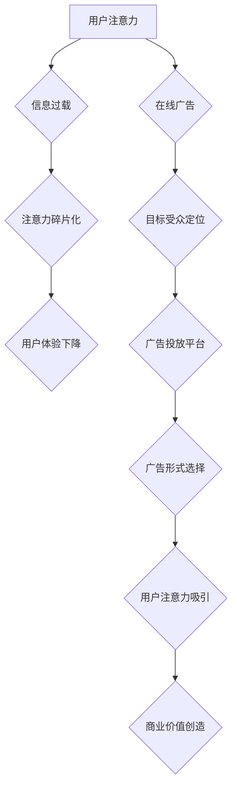

                 

##  注意力经济与在线广告目标：在不牺牲用户体验的情况下有效吸引受众

> 关键词：注意力经济、在线广告、用户体验、深度学习、推荐系统、个性化广告、隐私保护

## 1. 背景介绍

在数字时代，信息爆炸式增长，用户面临着来自各方信息的冲击。如何有效地吸引用户注意力，成为了企业和平台面临的共同挑战。注意力经济的概念应运而生，它强调了注意力是稀缺资源，而获取和利用用户注意力是商业成功的关键。

在线广告作为获取用户注意力的重要手段，在注意力经济中扮演着至关重要的角色。然而，传统的在线广告模式往往以其侵入性和干扰性损害用户体验，导致用户反感和广告屏蔽的现象日益普遍。因此，如何在不牺牲用户体验的情况下，有效地吸引用户注意力，成为了在线广告领域亟待解决的关键问题。

## 2. 核心概念与联系

### 2.1 注意力经济

注意力经济是指在信息过载的时代，注意力成为一种稀缺资源，而获取和利用用户注意力是商业成功的关键。

**核心概念：**

* **注意力：** 指用户对特定信息或内容的集中和投入。
* **稀缺性：** 用户的注意力有限，无法同时关注所有信息。
* **价值：** 用户的注意力具有价值，企业和平台可以通过获取和利用用户注意力来创造价值。

**注意力经济的挑战：**

* **信息过载：** 用户每天接触的信息量巨大，难以集中注意力。
* **注意力碎片化：** 用户的注意力容易被分散，难以保持长时间的集中。
* **用户隐私：** 获取用户注意力的过程中，需要收集和利用用户数据，引发了隐私保护的担忧。

### 2.2 在线广告

在线广告是指在互联网上投放广告，以吸引用户注意力并促成销售的一种营销方式。

**核心概念：**

* **目标受众：** 在线广告需要精准地定位目标受众，才能有效地吸引用户注意力。
* **广告投放平台：** 在线广告可以通过各种平台投放，例如搜索引擎、社交媒体、网站等。
* **广告形式：** 在线广告有多种形式，例如文字广告、图片广告、视频广告等。

**在线广告的挑战：**

* **广告屏蔽：** 用户越来越使用广告屏蔽软件，导致广告效果下降。
* **用户体验：** 过多的广告会干扰用户体验，导致用户反感。
* **广告欺诈：** 一些广告平台存在欺诈行为，例如虚假点击和流量造假。

### 2.3 用户体验

用户体验是指用户使用产品或服务时的感受和体验。

**核心概念：**

* **易用性：** 产品或服务易于理解和使用。
* **可用性：** 产品或服务能够满足用户的需求。
* **愉悦性：** 使用产品或服务能够带来愉悦的感受。

**用户体验的重要性：**

* **用户满意度：** 良好的用户体验可以提高用户满意度。
* **用户忠诚度：** 良好的用户体验可以提高用户忠诚度。
* **商业成功：** 良好的用户体验可以促进商业成功。

**Mermaid 流程图：注意力经济与在线广告目标的联系**



## 3. 核心算法原理 & 具体操作步骤

### 3.1 算法原理概述

在不牺牲用户体验的情况下，有效吸引用户注意力的核心算法主要基于以下几个方面：

* **深度学习：** 利用深度神经网络对用户行为和偏好进行分析，精准地预测用户感兴趣的内容。
* **推荐系统：** 基于用户的历史行为和偏好，推荐个性化的广告内容，提高用户点击率和转化率。
* **自然语言处理：** 对广告文案进行分析和优化，使其更符合用户搜索意图和阅读习惯。
* **用户画像：** 建立用户画像，了解用户的兴趣爱好、生活方式、消费习惯等信息，为广告投放提供更精准的目标群体。

### 3.2 算法步骤详解

1. **数据收集与预处理：** 收集用户行为数据，例如浏览历史、点击记录、购买行为等，并进行清洗、转换和特征提取。
2. **用户画像构建：** 利用机器学习算法，对用户行为数据进行分析，构建用户画像，包括用户兴趣、年龄、性别、地理位置等信息。
3. **广告内容匹配：** 根据用户画像，对广告内容进行匹配，选择与用户兴趣相符的广告。
4. **推荐排序：** 利用推荐算法，对匹配的广告进行排序，将最相关的广告展示给用户。
5. **广告投放与效果监测：** 将排序后的广告投放到合适的平台，并实时监测广告效果，例如点击率、转化率等。
6. **模型优化：** 根据广告效果数据，对模型进行优化，提高广告精准度和转化率。

### 3.3 算法优缺点

**优点：**

* **精准投放：** 基于用户画像和行为数据，可以精准地投放广告，提高广告效果。
* **个性化体验：** 提供个性化的广告推荐，提升用户体验。
* **数据驱动：** 通过数据分析和模型优化，不断提升广告精准度和转化率。

**缺点：**

* **数据依赖：** 需要大量的用户数据进行训练和分析，数据质量直接影响算法效果。
* **隐私保护：** 收集和利用用户数据需要谨慎处理，避免侵犯用户隐私。
* **算法偏差：** 算法模型可能存在偏差，导致广告投放不公平或歧视性。

### 3.4 算法应用领域

* **搜索引擎广告：** 根据用户搜索关键词，推荐相关的广告。
* **社交媒体广告：** 根据用户的兴趣爱好和社交关系，推荐个性化的广告。
* **电商平台广告：** 根据用户的浏览历史和购买记录，推荐相关的商品广告。
* **内容平台广告：** 根据用户的阅读习惯和兴趣，推荐相关的广告。

## 4. 数学模型和公式 & 详细讲解 & 举例说明

### 4.1 数学模型构建

**用户兴趣模型：**

假设用户对某个广告的兴趣可以用一个分数表示，该分数由用户对广告主题、内容、格式等方面的偏好决定。我们可以用一个线性模型来表示用户对广告的兴趣：

$$
Interest = w_1 * Topic + w_2 * Content + w_3 * Format + b
$$

其中：

* $Interest$：用户对广告的兴趣分数
* $Topic$：广告主题的特征向量
* $Content$：广告内容的特征向量
* $Format$：广告格式的特征向量
* $w_1$, $w_2$, $w_3$：权重系数，表示用户对不同特征的偏好程度
* $b$：偏置项

**广告推荐模型：**

我们可以利用协同过滤算法来构建广告推荐模型。协同过滤算法基于用户的历史行为数据，预测用户对某个广告的兴趣。

**例子：**

假设用户A喜欢观看科技类视频，用户B喜欢观看美食类视频。如果一个新的视频属于科技类，那么根据协同过滤算法，我们可能会推荐给用户A，并根据用户B的偏好，不推荐给用户B。

### 4.2 公式推导过程

协同过滤算法的推导过程比较复杂，涉及到矩阵分解、奇异值分解等数学方法。

### 4.3 案例分析与讲解

我们可以通过分析实际的广告投放数据，例如点击率、转化率等，来评估算法的性能，并进行模型优化。

## 5. 项目实践：代码实例和详细解释说明

### 5.1 开发环境搭建

* **操作系统：** Linux/macOS/Windows
* **编程语言：** Python
* **深度学习框架：** TensorFlow/PyTorch
* **数据处理工具：** Pandas/NumPy

### 5.2 源代码详细实现

```python
# 导入必要的库
import pandas as pd
from sklearn.model_selection import train_test_split
from tensorflow.keras.models import Sequential
from tensorflow.keras.layers import Dense

# 加载数据
data = pd.read_csv('advertising_data.csv')

# 数据预处理
# ...

# 将数据分为训练集和测试集
X_train, X_test, y_train, y_test = train_test_split(data[['feature1', 'feature2', ...]], data['target'], test_size=0.2)

# 建立深度学习模型
model = Sequential()
model.add(Dense(64, activation='relu', input_shape=(X_train.shape[1],)))
model.add(Dense(32, activation='relu'))
model.add(Dense(1, activation='sigmoid'))

# 编译模型
model.compile(optimizer='adam', loss='binary_crossentropy', metrics=['accuracy'])

# 训练模型
model.fit(X_train, y_train, epochs=10, batch_size=32)

# 评估模型
loss, accuracy = model.evaluate(X_test, y_test)
print('Loss:', loss)
print('Accuracy:', accuracy)
```

### 5.3 代码解读与分析

* **数据预处理：** 包括数据清洗、特征提取、数据标准化等步骤。
* **模型构建：** 使用深度学习框架构建一个多层感知机模型，用于预测用户对广告的兴趣。
* **模型训练：** 使用训练数据训练模型，并使用测试数据评估模型性能。
* **模型评估：** 使用损失函数和准确率等指标评估模型性能。

### 5.4 运行结果展示

运行代码后，可以得到模型的训练损失、测试损失、训练准确率和测试准确率等结果。

## 6. 实际应用场景

### 6.1 搜索引擎广告

搜索引擎广告是利用用户搜索关键词来推荐相关的广告。例如，当用户搜索“智能手机”时，搜索引擎会根据用户的搜索历史、地理位置等信息，推荐相关的智能手机广告。

### 6.2 社交媒体广告

社交媒体广告是利用用户的兴趣爱好和社交关系来推荐个性化的广告。例如，当用户在Facebook上关注某个科技品牌时，Facebook可能会推荐该品牌的广告给用户。

### 6.3 电商平台广告

电商平台广告是利用用户的浏览历史和购买记录来推荐相关的商品广告。例如，当用户在淘宝上浏览了某个品牌的衣服时，淘宝可能会推荐该品牌的其它商品广告给用户。

### 6.4 未来应用展望

随着人工智能技术的不断发展，在线广告将更加精准、个性化和智能化。未来，在线广告可能会更加注重用户体验，例如：

* **沉浸式广告：** 将广告融入到用户的体验场景中，例如虚拟现实广告、增强现实广告等。
* **互动式广告：** 鼓励用户与广告进行互动，例如游戏化广告、问答式广告等。
* **个性化内容推荐：** 基于用户的兴趣爱好和行为数据，推荐个性化的广告内容，例如视频广告、音频广告等。

## 7. 工具和资源推荐

### 7.1 学习资源推荐

* **书籍：**
    * 《深度学习》
    * 《机器学习》
    * 《推荐系统》
* **在线课程：**
    * Coursera
    * edX
    * Udacity

### 7.2 开发工具推荐

* **深度学习框架：** TensorFlow, PyTorch
* **数据处理工具：** Pandas, NumPy
* **云计算平台：** AWS, Azure, GCP

### 7.3 相关论文推荐

* **Attention Is All You Need**
* **BERT: Pre-training of Deep Bidirectional Transformers for Language Understanding**
* **Recurrent Neural Networks for Sequence Learning**

## 8. 总结：未来发展趋势与挑战

### 8.1 研究成果总结

在注意力经济背景下，在线广告的目标是吸引用户注意力，并将其转化为商业价值。深度学习、推荐系统、自然语言处理等技术为在线广告提供了强大的工具，使得广告更加精准、个性化和智能化。

### 8.2 未来发展趋势

* **更精准的广告投放：** 利用更先进的机器学习算法，对用户进行更精准的画像分析，并根据用户兴趣和行为进行个性化的广告投放。
* **更沉浸式的广告体验：** 将广告融入到用户的体验场景中，例如虚拟现实广告、增强现实广告等，提供更沉浸式的广告体验。
* **更注重用户隐私：** 在收集和利用用户数据时，更加注重用户隐私保护，并采用隐私保护技术，例如联邦学习、差分隐私等。

### 8.3 面临的挑战

* **算法偏差：** 算法模型可能存在偏差，导致广告投放不公平或歧视性。
* **数据安全：** 用户数据安全是一个重要的挑战，需要采取有效的措施保护用户数据免受泄露和滥用。
* **用户体验：** 需要不断改进广告形式和投放方式，避免干扰用户体验，并提供更优质的广告体验。

### 8.4 研究展望

未来，在线广告领域的研究将更加注重以下几个方面：

* **开发更公平、更透明的算法模型。**
* **探索更有效的隐私保护技术。**
* **设计更沉浸式、更个性化的广告体验。**


## 9. 附录：常见问题与解答

**问题：** 如何避免广告屏蔽对广告效果的影响？

**解答：**

* **提供优质的广告体验：** 避免过于侵入性的广告形式，并提供用户感兴趣的内容。
* **使用多种广告投放渠道：** 不依赖于单一平台，分散广告投放渠道，降低广告屏蔽的影响。
* **采用广告技术来绕过广告屏蔽：** 利用一些技术手段，例如动态广告、加密广告等，绕过广告屏蔽软件。

**问题：** 如何平衡广告精准度和用户隐私保护？

**解答：**

* **采用隐私保护技术：** 利用联邦学习、差分隐私等技术，保护用户数据隐私。
* **获得用户明确的同意：** 在收集和利用用户数据时，需要获得用户的明确同意。
* **最小化数据收集：** 只收集必要的用户数据，避免过度收集用户隐私信息。


作者：禅与计算机程序设计艺术 / Zen and the Art of Computer Programming<end_of_turn>

