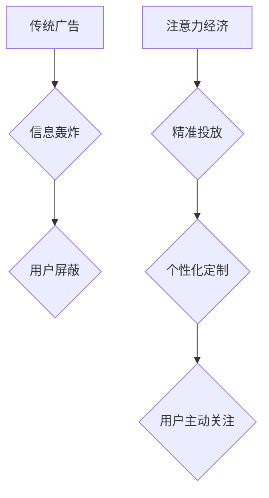

                 

## 1. 背景介绍

在数字时代，信息爆炸式增长，人们面临着前所未有的信息过载。传统广告在信息洪流中难以脱颖而出，其效果也日益下降。注意力，作为稀缺资源，成为企业争夺的焦点。注意力经济的兴起，深刻地改变了广告创意的创作理念和执行方式。

传统广告创意往往依赖于轰炸式投放，试图通过重复、强势的广告信息来吸引用户注意力。然而，这种方式在信息过载的时代显得越来越无效。用户已经习惯于屏蔽广告，并通过各种方式来避免广告的干扰。

注意力经济强调的是精准投放、个性化定制和用户体验。广告主需要深入了解用户的需求和兴趣，并根据用户的行为和偏好，提供个性化的广告内容，以吸引用户的主动关注。

## 2. 核心概念与联系

### 2.1 注意力经济

注意力经济是指在信息时代，注意力成为一种稀缺资源，并被商业化利用的经济模式。

**核心概念：**

* **注意力：** 指个体对特定信息或刺激的集中和持续的关注。
* **稀缺性：** 在信息爆炸的时代，注意力资源有限，竞争激烈。
* **商业化：** 企业通过提供优质内容、服务和体验，来获取用户的注意力，并以此获取商业价值。

**注意力经济与传统广告的关系：**

传统广告以信息轰炸为主要手段，试图通过重复、强势的广告信息来吸引用户注意力。而注意力经济则强调精准投放、个性化定制和用户体验，以吸引用户的主动关注。

**Mermaid 流程图：**



### 2.2  用户行为分析

用户行为分析是指通过收集和分析用户在使用产品或服务时的行为数据，来了解用户的需求、兴趣和偏好。

**核心概念：**

* **用户行为数据：** 用户在使用产品或服务时产生的各种数据，例如点击、浏览、购买等行为。
* **数据分析：** 利用统计学、机器学习等方法，对用户行为数据进行分析，提取有价值的信息。
* **用户画像：** 根据用户行为数据，构建用户画像，描述用户的特征和行为模式。

**用户行为分析与广告创意的关系：**

通过用户行为分析，广告主可以了解用户的兴趣和偏好，并根据用户的行为特征，定制个性化的广告内容，以提高广告的吸引力和转化率。

## 3. 核心算法原理 & 具体操作步骤

### 3.1  算法原理概述

注意力机制是一种模仿人类注意力机制的算法，它能够学习到输入数据中最重要的信息，并对这些信息进行重点处理。

**核心思想：**

* **注意力权重：** 为每个输入元素分配一个注意力权重，表示该元素对模型输出的重要性。
* **加权求和：** 根据注意力权重，对输入元素进行加权求和，得到模型的最终输出。

### 3.2  算法步骤详解

1. **输入数据：** 将输入数据（例如文本、图像）转换为模型可以理解的格式。
2. **编码器：** 使用编码器网络对输入数据进行编码，得到每个元素的特征表示。
3. **注意力计算：** 计算每个元素的注意力权重，表示该元素对模型输出的重要性。
4. **解码器：** 使用解码器网络对编码后的特征表示进行解码，生成模型的最终输出。

### 3.3  算法优缺点

**优点：**

* **提高模型性能：** 注意力机制能够学习到输入数据中最重要的信息，从而提高模型的准确性和效率。
* **解释性强：** 注意力权重可以直观地反映模型对输入数据的关注程度，提高模型的解释性。

**缺点：**

* **计算复杂度高：** 注意力机制的计算复杂度较高，需要更多的计算资源。
* **参数量大：** 注意力机制需要更多的参数，训练时间更长。

### 3.4  算法应用领域

注意力机制在自然语言处理、计算机视觉、机器翻译等领域都有广泛的应用。

## 4. 数学模型和公式 & 详细讲解 & 举例说明

### 4.1  数学模型构建

注意力机制的数学模型可以表示为以下公式：

$$
\text{Attention}(Q, K, V) = \text{softmax}\left(\frac{Q K^T}{\sqrt{d_k}}\right) V
$$

其中：

* $Q$：查询矩阵
* $K$：键矩阵
* $V$：值矩阵
* $d_k$：键向量的维度
* $\text{softmax}$：softmax函数

### 4.2  公式推导过程

公式推导过程如下：

1. 计算查询矩阵 $Q$ 和键矩阵 $K$ 的点积，并除以 $\sqrt{d_k}$。
2. 对点积结果应用 softmax 函数，得到注意力权重矩阵。
3. 将注意力权重矩阵与值矩阵 $V$ 进行加权求和，得到最终的注意力输出。

### 4.3  案例分析与讲解

**举例说明：**

假设我们有一个句子 "我爱学习编程"，我们想要计算每个单词对句子整体语义的注意力权重。

1. 将每个单词转换为向量表示，作为 $Q$、$K$ 和 $V$ 的输入。
2. 计算每个单词对每个单词的点积，并除以 $\sqrt{d_k}$。
3. 对点积结果应用 softmax 函数，得到每个单词对句子整体语义的注意力权重。
4. 将注意力权重与每个单词的向量表示进行加权求和，得到最终的句子表示。

## 5. 项目实践：代码实例和详细解释说明

### 5.1  开发环境搭建

* Python 3.6+
* TensorFlow 2.0+
* PyTorch 1.0+

### 5.2  源代码详细实现

```python
import tensorflow as tf

# 定义注意力机制
def attention_layer(query, key, value, mask=None):
    # 计算注意力权重
    scores = tf.matmul(query, key, transpose_b=True) / tf.math.sqrt(tf.cast(key.shape[-1], tf.float32))
    if mask is not None:
        scores += (mask * -1e9)
    attention_weights = tf.nn.softmax(scores, axis=-1)
    # 计算加权求和
    context_vector = tf.matmul(attention_weights, value)
    return context_vector, attention_weights

# 示例代码
query = tf.random.normal([3, 4, 64])
key = tf.random.normal([3, 4, 64])
value = tf.random.normal([3, 4, 64])

context_vector, attention_weights = attention_layer(query, key, value)

print(context_vector.shape)
print(attention_weights.shape)
```

### 5.3  代码解读与分析

* `attention_layer` 函数定义了注意力机制的计算过程。
* `scores` 计算了查询向量和键向量的点积，并进行归一化。
* `attention_weights` 使用 softmax 函数计算注意力权重。
* `context_vector` 通过对值向量进行加权求和，得到最终的上下文向量。

### 5.4  运行结果展示

运行代码后，会输出 `context_vector` 和 `attention_weights` 的形状。

## 6. 实际应用场景

### 6.1  个性化广告推荐

注意力机制可以用于分析用户的行为数据，并根据用户的兴趣和偏好，推荐个性化的广告内容。

### 6.2  内容摘要生成

注意力机制可以用于生成文章、新闻等内容的摘要，重点提取最重要的信息。

### 6.3  机器翻译

注意力机制可以用于机器翻译，提高翻译的准确性和流畅度。

### 6.4  未来应用展望

注意力机制在未来将有更广泛的应用，例如：

* **自动驾驶：** 注意力机制可以帮助自动驾驶系统识别道路上的重要信息，例如行人、车辆和交通信号。
* **医疗诊断：** 注意力机制可以帮助医生识别医学图像中的异常区域，提高诊断的准确性。
* **金融风险管理：** 注意力机制可以帮助金融机构识别潜在的风险，并进行风险控制。

## 7. 工具和资源推荐

### 7.1  学习资源推荐

* **书籍：**
    * 《深度学习》
    * 《自然语言处理》
* **在线课程：**
    * Coursera
    * edX
* **博客和网站：**
    * TensorFlow Blog
    * PyTorch Blog

### 7.2  开发工具推荐

* **TensorFlow：** 开源深度学习框架
* **PyTorch：** 开源深度学习框架
* **Keras：** 高级深度学习API

### 7.3  相关论文推荐

* **Attention Is All You Need**
* **BERT: Pre-training of Deep Bidirectional Transformers for Language Understanding**

## 8. 总结：未来发展趋势与挑战

### 8.1  研究成果总结

注意力机制在人工智能领域取得了显著的成果，并在多个应用场景中展现出强大的能力。

### 8.2  未来发展趋势

* **更强大的注意力机制：** 研究人员将继续探索更强大的注意力机制，例如自注意力机制、多头注意力机制等。
* **注意力机制的应用扩展：** 注意力机制将应用于更多领域，例如自动驾驶、医疗诊断、金融风险管理等。
* **注意力机制的解释性：** 研究人员将致力于提高注意力机制的解释性，使模型的决策过程更加透明。

### 8.3  面临的挑战

* **计算复杂度：** 注意力机制的计算复杂度较高，需要更多的计算资源。
* **参数量大：** 注意力机制需要更多的参数，训练时间更长。
* **数据依赖性：** 注意力机制依赖于大量的训练数据，缺乏数据会导致模型性能下降。

### 8.4  研究展望

未来，注意力机制的研究将继续深入，并与其他人工智能技术相结合，推动人工智能的更快发展。

## 9. 附录：常见问题与解答

* **Q：注意力机制的原理是什么？**

A：注意力机制模仿了人类的注意力机制，通过学习输入数据中最重要的信息，并对这些信息进行重点处理。

* **Q：注意力机制有哪些应用场景？**

A：注意力机制在自然语言处理、计算机视觉、机器翻译等领域都有广泛的应用。

* **Q：如何选择合适的注意力机制？**

A：选择合适的注意力机制需要根据具体的应用场景和数据特点进行选择。

作者：禅与计算机程序设计艺术 / Zen and the Art of Computer Programming


<end_of_turn>

