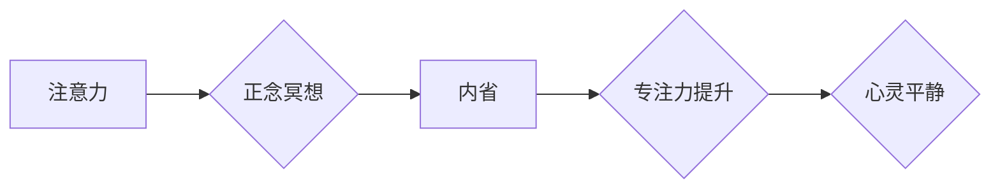

                 

## 注意力训练与正念冥想：如何通过内省增强专注力和心灵平静

> 关键词：注意力、正念冥想、内省、专注力、心灵平静、认知训练、神经科学、机器学习

## 1. 背景介绍

在当今信息爆炸的时代，我们面临着前所未有的信息冲击。来自手机、电脑、社交媒体的各种通知和信息不断地吸引着我们的注意力，使得我们难以集中精力完成任务，也难以获得心灵的平静。注意力力的下降和精神紧张已成为现代社会普遍存在的现象，严重影响着人们的工作效率、学习效果和生活质量。

正念冥想作为一种古老的修行方式，近年来在西方世界逐渐受到关注。研究表明，正念冥想能够有效地提升注意力、减轻压力、改善情绪，甚至还能改变大脑结构。它通过引导人们将注意力集中在当下，观察自己的呼吸、身体和思想，从而培养专注力和内省能力。

## 2. 核心概念与联系

### 2.1 注意力

注意力是指我们对特定信息或刺激的集中和选择性关注。它是一个复杂的认知过程，涉及到多个大脑区域的协同工作。注意力可以分为两种主要类型：

* **定向注意力:** 指的是将注意力集中在某个特定目标上，排除其他干扰。
* **分割注意力:** 指的是同时关注多个目标，并有效地切换注意力。

### 2.2 正念冥想

正念冥想是一种通过专注于当下体验来培养觉察力和专注力的练习。它强调对自身感受、思想和环境的非评判性观察。正念冥想可以帮助人们：

* **提升注意力:** 通过训练专注于当下，正念冥想可以增强我们的注意力能力，使我们能够更好地集中精力。
* **减轻压力:** 正念冥想可以帮助人们放松身心，减轻压力和焦虑。
* **改善情绪:** 正念冥想可以帮助人们更好地管理情绪，减少负面情绪的影响。
* **增强自我意识:** 正念冥想可以帮助人们更好地了解自己的内心世界，包括自己的想法、感受和行为模式。

### 2.3 内省

内省是指深入思考和分析自己的内心世界，包括自己的想法、感受、动机和行为。它是一种自我探索和认识的过程，可以帮助人们更好地理解自己，并做出更明智的决策。

**核心概念与联系流程图**



## 3. 核心算法原理 & 具体操作步骤

### 3.1 算法原理概述

正念冥想虽然是一种古老的修行方式，但其背后的原理与现代认知科学和神经科学的研究结果相吻合。

* **注意力训练:** 正念冥想通过反复地引导注意力回到当下，训练大脑的注意力机制，增强定向注意力和分割注意力的能力。
* **情绪调节:** 正念冥想通过观察和接纳自己的情绪，而非评判和抵抗，帮助人们更好地管理情绪，减少负面情绪的影响。
* **自我意识提升:** 正念冥想通过观察自己的思想和行为模式，帮助人们更好地了解自己，并做出更明智的决策。

### 3.2 算法步骤详解

正念冥想的基本步骤如下：

1. **找到一个安静舒适的环境:** 选择一个安静、舒适的环境，可以帮助你放松身心，不受干扰。
2. **采取舒适的坐姿:** 找个舒适的坐姿，保持背部挺直，但不要过于僵硬。
3. **专注于呼吸:** 将注意力集中在自己的呼吸上，观察呼吸的节奏和感受。
4. **观察思绪和感受:** 当你的注意力被其他思绪或感受吸引时，不要评判或抵抗，只是观察它们，然后轻轻地将注意力引导回到呼吸上。
5. **持续练习:** 每天练习正念冥想，每次至少10分钟，逐渐增加练习时间。

### 3.3 算法优缺点

**优点:**

* **简单易学:** 正念冥想不需要任何特殊的设备或技能，每个人都可以学习和练习。
* **安全有效:** 正念冥想是一种安全有效的练习，没有副作用。
* **广泛应用:** 正念冥想可以应用于各种场景，例如缓解压力、改善睡眠、提升专注力等。

**缺点:**

* **需要坚持练习:** 正念冥想需要持续的练习才能看到效果。
* **效果因人而异:** 不同的人对正念冥想的反应可能有所不同。

### 3.4 算法应用领域

正念冥想在以下领域有广泛的应用:

* **医疗保健:** 缓解压力、焦虑、抑郁等心理问题；帮助癌症患者减轻疼痛和焦虑；改善慢性疼痛的管理。
* **教育:** 提升学生的注意力、专注力和学习效率；帮助学生更好地管理情绪和压力。
* **企业:** 提高员工的工作效率、创造力和团队合作能力；减轻员工的压力和焦虑。
* **个人成长:** 提升自我意识、情绪管理和生活质量。

## 4. 数学模型和公式 & 详细讲解 & 举例说明

### 4.1 数学模型构建

正念冥想的核心机制可以抽象为一个动态系统模型，其中注意力是系统状态的变量，而正念冥想练习是系统输入的控制信号。

**状态方程:**

$$
\frac{dA}{dt} = f(A, u)
$$

其中:

* $A$ 代表注意力水平
* $t$ 代表时间
* $u$ 代表正念冥想练习强度

**函数 $f$** 描述了注意力水平随时间变化的规律，它受注意力水平本身和正念冥想练习强度的影响。

### 4.2 公式推导过程

由于正念冥想练习的复杂性，函数 $f$ 的具体形式难以精确描述。但我们可以通过神经科学研究和心理学实验获得一些启示。

例如，研究表明，正念冥想练习可以增强大脑前额叶皮层的活动，而前额叶皮层是控制注意力和认知功能的重要脑区。因此，我们可以假设函数 $f$ 包含一个正相关于正念冥想练习强度的项，表示练习强度增加可以增强前额叶皮层的活动，从而提升注意力水平。

### 4.3 案例分析与讲解

假设一个人的注意力水平初始值为 $A_0$，他每天进行 30 分钟的正念冥想练习，练习强度为 $u$。根据状态方程，我们可以推导出注意力水平随时间的变化趋势。

如果 $u$ 较大，则注意力水平会更快地提升，反之则会更慢。

## 5. 项目实践：代码实例和详细解释说明

### 5.1 开发环境搭建

为了实现正念冥想练习的自动化，我们可以使用 Python 语言开发一个简单的应用程序。

所需环境：

* Python 3.x
* Pygame 库

### 5.2 源代码详细实现

```python
import pygame

# 初始化 Pygame
pygame.init()

# 设置窗口大小
screen_width = 600
screen_height = 400
screen = pygame.display.set_mode((screen_width, screen_height))

# 设置标题
pygame.display.set_caption("正念冥想练习")

# 设置背景颜色
background_color = (0, 0, 0)

# 设置字体
font = pygame.font.Font(None, 36)

# 循环处理事件
running = True
while running:
    for event in pygame.event.get():
        if event.type == pygame.QUIT:
            running = False

    # 清空屏幕
    screen.fill(background_color)

    # 绘制文本
    text = font.render("专注于你的呼吸", True, (255, 255, 255))
    text_rect = text.get_rect(center=(screen_width // 2, screen_height // 2))
    screen.blit(text, text_rect)

    # 更新显示
    pygame.display.flip()

# 退出 Pygame
pygame.quit()
```

### 5.3 代码解读与分析

这段代码创建一个简单的正念冥想练习应用程序。

* 首先，它初始化 Pygame 库并设置窗口大小和标题。
* 然后，它创建一个黑色的背景和一个白色的文本，显示“专注于你的呼吸”。
* 最后，它进入一个事件循环，处理用户输入和更新屏幕显示。

### 5.4 运行结果展示

运行这段代码后，将会出现一个黑色的窗口，显示“专注于你的呼吸”的白色文本。

## 6. 实际应用场景

正念冥想在现实生活中有着广泛的应用场景：

### 6.1 工作场景

* **提高工作效率:** 正念冥想可以帮助人们集中注意力，减少分心，从而提高工作效率。
* **减轻工作压力:** 正念冥想可以帮助人们放松身心，减轻工作压力和焦虑。
* **增强团队合作:** 正念冥想可以帮助人们更好地理解和接纳彼此，从而增强团队合作能力。

### 6.2 学习场景

* **提升学习效率:** 正念冥想可以帮助学生集中注意力，更好地理解和记忆知识。
* **减轻学习压力:** 正念冥想可以帮助学生放松身心，减轻学习压力和焦虑。
* **培养专注力:** 正念冥想可以帮助学生培养专注力和毅力。

### 6.3 生活场景

* **改善睡眠质量:** 正念冥想可以帮助人们放松身心，减轻压力，从而改善睡眠质量。
* **缓解情绪波动:** 正念冥想可以帮助人们更好地管理情绪，减少负面情绪的影响。
* **提升幸福感:** 正念冥想可以帮助人们更好地了解自己，接纳自己，从而提升幸福感。

### 6.4 未来应用展望

随着正念冥想的普及，其应用场景将会更加广泛。例如，它可以被应用于：

* **虚拟现实训练:** 利用虚拟现实技术，创造沉浸式的正念冥想体验。
* **人工智能辅助:** 开发人工智能辅助正念冥想应用程序，提供个性化的指导和反馈。
* **医疗保健:** 将正念冥想与其他治疗方法结合，用于治疗各种心理和身体疾病。

## 7. 工具和资源推荐

### 7.1 学习资源推荐

* **书籍:**
    * 《正念：改变生活的八周冥想计划》
    * 《正念的力量》
    * 《正念冥想》
* **网站:**
    * Headspace
    * Calm
    * Insight Timer

### 7.2 开发工具推荐

* **Python:** 
    * Pygame
    * TensorFlow
    * Keras

### 7.3 相关论文推荐

* **正念冥想对注意力和认知功能的影响:**
    * https://www.ncbi.nlm.nih.gov/pubmed/23449569
* **正念冥想对情绪调节的影响:**
    * https://www.ncbi.nlm.nih.gov/pubmed/24193707

## 8. 总结：未来发展趋势与挑战

### 8.1 研究成果总结

近年来，正念冥想的研究取得了显著进展，证实了其对注意力、情绪、认知功能等方面的积极影响。

### 8.2 未来发展趋势

未来，正念冥想研究将朝着以下方向发展:

* **神经科学机制研究:** 进一步探索正念冥想对大脑结构和功能的影响。
* **个性化冥想训练:** 开发个性化的冥想训练方案，针对不同人群的需求。
* **技术应用:** 将正念冥想与人工智能、虚拟现实等技术结合，开发更便捷、更有效的冥想工具。

### 8.3 面临的挑战

正念冥想研究也面临着一些挑战:

* **研究方法的局限性:** 目前，正念冥想的研究主要依赖于自评量表和脑成像技术，存在一定的局限性。
* **个体差异:** 正念冥想的效果因人而异，需要进一步研究其影响因素。
* **推广普及:** 如何将正念冥想推广到更广泛的人群，使其成为一种普遍的健康生活方式，仍然是一个挑战。

### 8.4 研究展望

尽管面临挑战，但正念冥想研究的前景依然光明。随着研究的深入，我们相信正念冥想将为人们带来更多益处，帮助人们更好地生活、工作和学习。

## 9. 附录：常见问题与解答

### 9.1 如何开始正念冥想？

* 选择一个安静舒适的环境。
* 采取舒适的坐姿，保持背部挺直。
* 将注意力集中在自己的呼吸上，观察呼吸的节奏和感受。
* 当你的注意力被其他思绪或感受吸引时，不要评判或抵抗，只是观察它们，然后轻轻地将注意力引导回到呼吸上。
* 每天练习至少10分钟，逐渐增加练习时间。

### 9.2 正念冥想有什么好处？

正念冥想可以帮助人们:

* 提升注意力
* 减轻压力和焦虑
* 改善情绪
* 增强自我意识
* 提升睡眠质量
* 改善身体健康

### 9.3 正念冥想需要多长时间才能看到效果？

正念冥想的效果因人而异，有些人可能在几周内就能感受到效果，而有些人可能需要几个月甚至更长时间。关键是要坚持练习。

### 9.4 我在冥想时总是分心，怎么办？

分心是正常的，不要感到沮丧。当你的注意力被其他思绪或感受吸引时，不要评判或抵抗，只是观察它们，然后轻轻地将注意力引导回到呼吸上。随着练习的增加，你的注意力将会越来越集中。


作者：禅与计算机程序设计艺术 / Zen and the Art of Computer Programming 
<end_of_turn>

