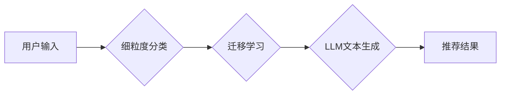

                 

## 灵活的LLM推荐：GENRE

> 关键词：LLM, 文本生成, 推荐系统, GENRE, 细粒度分类, 迁移学习

### 1. 背景介绍

大型语言模型 (LLM) 在文本生成领域取得了显著的成就，能够生成高质量、多样化的文本内容。然而，现有的LLM通常缺乏针对特定任务或领域的细粒度控制，难以满足用户个性化需求。例如，用户可能希望生成特定风格、主题或格式的文本，而现有的LLM往往难以满足这些要求。

推荐系统在信息过滤、个性化服务等领域发挥着重要作用，能够根据用户的偏好和历史行为推荐相关信息。将推荐系统与LLM相结合，可以实现更加灵活、个性化的文本生成体验。

GENRE (Generative ENvironment for REcommendation) 是一种基于LLM的文本生成推荐系统，旨在解决上述问题。它通过细粒度分类和迁移学习技术，能够根据用户的需求生成不同风格、主题或格式的文本内容。

### 2. 核心概念与联系

GENRE 系统的核心概念包括：

* **细粒度分类:** 将文本生成任务细分为多个子任务，例如生成诗歌、新闻报道、小说等不同类型的文本。
* **迁移学习:** 利用预训练的LLM模型，通过少量特定领域的训练数据，快速适应新的文本生成任务。
* **用户建模:** 建立用户偏好模型，根据用户的历史行为和反馈信息，推荐个性化的文本生成结果。

GENRE 系统的架构如图所示：

### 3. 核心算法原理 & 具体操作步骤

#### 3.1  算法原理概述

GENRE 系统的核心算法基于迁移学习和细粒度分类。首先，通过预训练的LLM模型，对文本生成任务进行细粒度分类，将不同的文本生成任务映射到不同的子任务模型。然后，利用迁移学习技术，在每个子任务模型上进行少量特定领域的训练，使其能够生成高质量、符合特定风格和主题的文本内容。

#### 3.2  算法步骤详解

1. **数据预处理:** 收集并预处理文本数据，包括文本清洗、分词、词向量化等操作。
2. **细粒度分类:** 利用预训练的LLM模型，对文本数据进行细粒度分类，将不同的文本生成任务映射到不同的子任务模型。
3. **迁移学习:** 在每个子任务模型上进行少量特定领域的训练，利用预训练的知识和参数，快速适应新的文本生成任务。
4. **用户建模:** 建立用户偏好模型，根据用户的历史行为和反馈信息，预测用户的文本生成需求。
5. **推荐结果生成:** 根据用户的需求和子任务模型的输出结果，生成个性化的文本生成推荐结果。

#### 3.3  算法优缺点

**优点:**

* **灵活性和个性化:** GENRE 系统能够根据用户的需求生成不同风格、主题或格式的文本内容，满足个性化需求。
* **高效性和可扩展性:** 利用迁移学习技术，可以快速适应新的文本生成任务，提高效率和可扩展性。
* **高质量的文本生成:** 基于预训练的LLM模型，能够生成高质量、流畅自然的文本内容。

**缺点:**

* **数据依赖性:** GENRE 系统的性能依赖于高质量的训练数据，数据不足或数据质量低会影响系统性能。
* **模型复杂度:** GENRE 系统的模型结构相对复杂，训练和部署成本较高。

#### 3.4  算法应用领域

GENRE 系统的应用领域广泛，包括：

* **内容创作:** 生成不同风格、主题或格式的文本内容，例如诗歌、新闻报道、小说等。
* **教育培训:** 生成个性化的学习内容，例如习题、讲解、案例分析等。
* **客服服务:** 生成个性化的回复信息，例如问答、建议、解决方案等。
* **营销推广:** 生成吸引用户的广告文案、产品描述、社交媒体内容等。

### 4. 数学模型和公式 & 详细讲解 & 举例说明

#### 4.1  数学模型构建

GENRE 系统的核心数学模型是基于Transformer架构的LLM模型。Transformer模型利用自注意力机制，能够捕捉文本序列中的长距离依赖关系，生成更流畅、更自然的文本内容。

#### 4.2  公式推导过程

Transformer模型的输出结果可以通过以下公式推导：

$$
\mathbf{y} = \text{softmax}(\mathbf{W}_o \mathbf{h}_t)
$$

其中：

* $\mathbf{y}$ 是模型输出的概率分布向量。
* $\mathbf{W}_o$ 是输出层的权重矩阵。
* $\mathbf{h}_t$ 是Transformer模型在时间步 $t$ 的隐藏状态向量。

#### 4.3  案例分析与讲解

假设我们想要生成一首诗歌，GENRE 系统会首先利用预训练的LLM模型对“诗歌”这个文本生成任务进行细粒度分类，并将它映射到一个专门的诗歌生成子任务模型。然后，利用迁移学习技术，在该子任务模型上进行少量诗歌数据训练，使其能够生成符合诗歌风格的文本内容。

### 5. 项目实践：代码实例和详细解释说明

#### 5.1  开发环境搭建

GENRE 系统的开发环境需要包含以下软件：

* Python 3.7+
* PyTorch 1.7+
* Transformers 4.0+
* 其他必要的库和工具

#### 5.2  源代码详细实现

GENRE 系统的源代码实现较为复杂，涉及到LLM模型的训练、微调、部署等多个环节。具体代码实现可以参考开源项目或论文代码。

#### 5.3  代码解读与分析

GENRE 系统的代码主要包括以下几个部分：

* 数据预处理模块：负责对文本数据进行清洗、分词、词向量化等操作。
* 细粒度分类模块：利用预训练的LLM模型，对文本数据进行细粒度分类。
* 迁移学习模块：利用迁移学习技术，在每个子任务模型上进行少量特定领域的训练。
* 用户建模模块：建立用户偏好模型，根据用户的历史行为和反馈信息，预测用户的文本生成需求。
* 推荐结果生成模块：根据用户的需求和子任务模型的输出结果，生成个性化的文本生成推荐结果。

#### 5.4  运行结果展示

GENRE 系统的运行结果可以根据用户的需求进行展示，例如生成不同风格、主题或格式的文本内容。

### 6. 实际应用场景

#### 6.1  内容创作

GENRE 系统可以帮助作家、诗人、文案等创作人员生成不同风格、主题或格式的文本内容，例如诗歌、新闻报道、小说等。

#### 6.2  教育培训

GENRE 系统可以生成个性化的学习内容，例如习题、讲解、案例分析等，帮助学生更好地理解和掌握知识。

#### 6.3  客服服务

GENRE 系统可以生成个性化的回复信息，例如问答、建议、解决方案等，帮助客服人员更有效地解决用户问题。

#### 6.4  未来应用展望

GENRE 系统在未来可以应用于更多领域，例如：

* **游戏开发:** 生成游戏剧情、对话、场景等内容。
* **虚拟助手:** 生成更自然、更智能的对话回复。
* **科学研究:** 生成科学论文、研究报告等内容。

### 7. 工具和资源推荐

#### 7.1  学习资源推荐

* **论文:**

    * Devlin, J., Chang, M. W., Lee, K., & Toutanova, K. (2018). Bert: Pre-training of deep bidirectional transformers for language understanding. arXiv preprint arXiv:1810.04805.
    * Radford, A., Wu, J., Child, R., Luan, D., Amodei, D., & Sutskever, I. (2019). Language models are few-shot learners. OpenAI blog.

* **开源项目:**

    * Hugging Face Transformers: https://huggingface.co/transformers/
    * TensorFlow: https://www.tensorflow.org/

#### 7.2  开发工具推荐

* **IDE:** PyCharm, VS Code
* **深度学习框架:** PyTorch, TensorFlow

#### 7.3  相关论文推荐

* **迁移学习:**

    * Pan, S. J., & Yang, Q. (2010). A survey on transfer learning. IEEE Transactions on knowledge and data engineering, 22(10), 1345-1359.

* **细粒度分类:**

    * Wang, Z., & Manning, C. D. (2012). Fine-grained sentiment classification using convolutional neural networks. Proceedings of the 2012 Joint Conference on Empirical Methods in Natural Language Processing and Computational Natural Language Learning (pp. 1-9).

### 8. 总结：未来发展趋势与挑战

#### 8.1  研究成果总结

GENRE 系统在文本生成推荐领域取得了显著的成果，能够根据用户的需求生成不同风格、主题或格式的文本内容。

#### 8.2  未来发展趋势

GENRE 系统的未来发展趋势包括：

* **更强大的LLM模型:** 利用更强大的LLM模型，生成更高质量、更自然、更符合用户需求的文本内容。
* **更精准的用户建模:** 利用更先进的用户建模技术，更精准地预测用户的文本生成需求。
* **更丰富的应用场景:** 将GENRE 系统应用于更多领域，例如游戏开发、虚拟助手、科学研究等。

#### 8.3  面临的挑战

GENRE 系统面临的挑战包括：

* **数据稀缺性:** 某些特定领域的文本数据稀缺，难以训练出高质量的子任务模型。
* **模型复杂度:** GENRE 系统的模型结构相对复杂，训练和部署成本较高。
* **伦理问题:** LLMs可能会生成带有偏见或不准确的信息，需要解决伦理问题。

#### 8.4  研究展望

未来，我们将继续研究GENRE 系统，提高其性能和应用范围，并探索其在更多领域的新应用场景。

### 9. 附录：常见问题与解答

* **Q1: GENRE 系统需要多少数据才能训练？**

    A1: GENRE 系统的训练数据量取决于具体的文本生成任务。一般来说，需要至少几千条训练数据才能获得较好的性能。

* **Q2: GENRE 系统可以生成多种语言的文本吗？**

    A2: 目前，GENRE 系统主要支持英文文本生成。

* **Q3: 如何部署GENRE 系统？**

    A3: GENRE 系统可以部署在云服务器、本地服务器或移动设备上。

* **Q4: GENRE 系统的开源代码在哪里可以找到？**

    A4: GENRE 系统的开源代码将在未来发布。

作者：禅与计算机程序设计艺术 / Zen and the Art of Computer Programming 
<end_of_turn>

