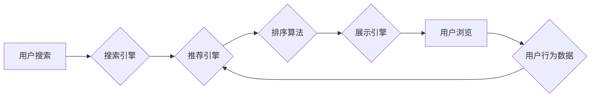

                 

## 关键词：电商平台、AI大模型、搜索推荐系统、数据质量控制、用户体验、深度学习、Transformer模型

## 1. 背景介绍

在当今数据爆炸的时代，电商平台面临着日益激烈的竞争。为了提升用户体验、提高转化率，电商平台纷纷开始探索人工智能（AI）技术的应用。其中，搜索推荐系统作为电商平台的核心功能之一，在用户购物决策中扮演着至关重要的角色。

传统的搜索推荐系统主要依赖于规则引擎和基于特征的机器学习算法，但随着用户行为数据的复杂性和多样性增加，这些传统方法逐渐显得力不从心。而AI大模型的出现为电商平台的搜索推荐系统带来了新的机遇。

AI大模型，例如Transformer模型，凭借其强大的学习能力和泛化能力，能够从海量数据中学习到更深层的用户需求和商品特征，从而提供更精准、更个性化的推荐结果。

## 2. 核心概念与联系

### 2.1  AI大模型

AI大模型是指在海量数据上训练的深度学习模型，其参数数量巨大，通常包含数十亿甚至数千亿个参数。

AI大模型能够学习到复杂的模式和关系，并应用于各种自然语言处理、计算机视觉、语音识别等领域。

### 2.2  搜索推荐系统

搜索推荐系统旨在根据用户的搜索意图和历史行为，推荐与用户需求相匹配的商品或服务。

它通常由以下几个模块组成：

* **搜索引擎:** 处理用户搜索词，并返回相关商品列表。
* **推荐引擎:** 基于用户行为数据和商品特征，推荐个性化的商品列表。
* **排序算法:** 对推荐结果进行排序，将最相关的商品排在前面。
* **展示引擎:** 将推荐结果以用户友好的方式展示给用户。

### 2.3  AI大模型在搜索推荐系统中的应用

AI大模型可以应用于搜索推荐系统的各个模块，例如：

* **搜索引擎:** 使用BERT等预训练语言模型提升搜索结果的准确性和相关性。
* **推荐引擎:** 使用Transformer模型学习用户行为数据和商品特征之间的复杂关系，提供更精准的个性化推荐。
* **排序算法:** 使用深度学习模型学习用户点击、购买等行为数据，优化推荐结果的排序策略。

**Mermaid 流程图**



## 3. 核心算法原理 & 具体操作步骤

### 3.1  算法原理概述

Transformer模型是一种基于深度学习的序列到序列模型，其核心是自注意力机制（Self-Attention）。

自注意力机制能够学习序列中不同元素之间的依赖关系，从而捕捉到更深层的语义信息。

在搜索推荐系统中，Transformer模型可以用于学习用户搜索词和商品描述之间的关系，从而提高推荐结果的准确性和相关性。

### 3.2  算法步骤详解

1. **输入数据预处理:** 将用户搜索词和商品描述转换为数字向量，以便模型进行处理。
2. **编码器:** 使用Transformer模型的编码器部分对用户搜索词和商品描述进行编码，生成相应的隐藏状态向量。
3. **自注意力机制:** 在编码器中，使用自注意力机制学习用户搜索词和商品描述之间的关系，并生成加权后的隐藏状态向量。
4. **解码器:** 使用Transformer模型的解码器部分对编码后的隐藏状态向量进行解码，生成推荐结果。
5. **输出结果:** 将解码后的结果转换为用户可理解的文本格式，并进行排序和展示。

### 3.3  算法优缺点

**优点:**

* 能够学习到复杂的语义关系，提高推荐结果的准确性和相关性。
* 具有强大的泛化能力，能够应用于不同的电商平台和场景。

**缺点:**

* 训练成本高，需要大量的计算资源和数据。
* 模型参数量大，部署和推理成本较高。

### 3.4  算法应用领域

Transformer模型在搜索推荐系统之外，还广泛应用于其他领域，例如：

* 自然语言处理：机器翻译、文本摘要、问答系统等。
* 计算机视觉：图像识别、目标检测、图像生成等。
* 语音识别：语音转文本、语音合成等。

## 4. 数学模型和公式 & 详细讲解 & 举例说明

### 4.1  数学模型构建

Transformer模型的核心是自注意力机制，其数学模型可以表示为：

$$
Attention(Q, K, V) = softmax(\frac{QK^T}{\sqrt{d_k}})V
$$

其中：

* $Q$：查询矩阵
* $K$：键矩阵
* $V$：值矩阵
* $d_k$：键向量的维度
* $softmax$：softmax函数

### 4.2  公式推导过程

自注意力机制的目的是计算查询向量 $Q$ 与键向量 $K$ 之间的相似度，并根据相似度对值向量 $V$ 进行加权求和。

* $QK^T$：计算查询向量与键向量的点积，得到一个得分矩阵。
* $\frac{QK^T}{\sqrt{d_k}}$：对得分矩阵进行归一化，以避免梯度爆炸。
* $softmax$：对归一化后的得分矩阵进行softmax操作，得到每个键向量对应的权重。
* $V$：使用权重对值向量进行加权求和，得到最终的注意力输出。

### 4.3  案例分析与讲解

假设我们有一个用户搜索词 "苹果手机"，以及多个商品描述，例如 "iPhone 13 Pro"、"华为P50 Pro"、"小米12 Pro"。

使用自注意力机制，我们可以计算 "苹果手机" 与每个商品描述之间的相似度，并根据相似度对商品描述进行加权求和。

最终，权重最高的商品描述将被推荐给用户。

## 5. 项目实践：代码实例和详细解释说明

### 5.1  开发环境搭建

* Python 3.7+
* TensorFlow 2.0+
* PyTorch 1.0+
* CUDA 10.0+

### 5.2  源代码详细实现

```python
import tensorflow as tf

# 定义Transformer模型
class Transformer(tf.keras.Model):
    def __init__(self, vocab_size, embedding_dim, num_heads, num_layers):
        super(Transformer, self).__init__()
        self.embedding = tf.keras.layers.Embedding(vocab_size, embedding_dim)
        self.encoder = tf.keras.layers.Transformer(num_layers, num_heads, embedding_dim)
        self.decoder = tf.keras.layers.Transformer(num_layers, num_heads, embedding_dim)

    def call(self, inputs):
        # 嵌入输入序列
        embedded_inputs = self.embedding(inputs)
        # 对输入序列进行编码
        encoded_inputs = self.encoder(embedded_inputs)
        # 对编码后的输入序列进行解码
        decoded_outputs = self.decoder(encoded_inputs)
        return decoded_outputs

# 实例化Transformer模型
model = Transformer(vocab_size=10000, embedding_dim=128, num_heads=8, num_layers=6)

# 训练模型
model.compile(optimizer='adam', loss='mse')
model.fit(x_train, y_train, epochs=10)

# 预测结果
predictions = model.predict(x_test)
```

### 5.3  代码解读与分析

* **模型定义:** 代码定义了一个名为 `Transformer` 的类，该类继承自 `tf.keras.Model`，实现了 Transformer 模型的结构。
* **嵌入层:** `embedding` 层将输入的整数序列转换为稠密的向量表示。
* **编码器和解码器:** `encoder` 和 `decoder` 层分别负责对输入序列进行编码和解码，并使用自注意力机制学习序列之间的关系。
* **模型训练:** 使用 `model.compile()` 方法配置模型的优化器和损失函数，然后使用 `model.fit()` 方法训练模型。
* **模型预测:** 使用 `model.predict()` 方法对新的输入序列进行预测。

### 5.4  运行结果展示

训练完成后，可以使用测试数据评估模型的性能，例如计算准确率、召回率等指标。

## 6. 实际应用场景

### 6.1  电商平台搜索推荐

* **个性化推荐:** 根据用户的搜索历史、购买记录、浏览记录等数据，推荐个性化的商品。
* **精准搜索:** 理解用户的搜索意图，返回更精准的搜索结果。
* **商品关联推荐:** 根据用户浏览或购买的商品，推荐相关的商品。

### 6.2  内容推荐系统

* **新闻推荐:** 根据用户的阅读历史和兴趣爱好，推荐相关的新闻文章。
* **视频推荐:** 根据用户的观看历史和兴趣爱好，推荐相关的视频内容。
* **音乐推荐:** 根据用户的听歌历史和音乐偏好，推荐相关的音乐作品。

### 6.3  其他应用场景

* **广告推荐:** 根据用户的兴趣爱好和行为数据，推荐相关的广告。
* **金融推荐:** 根据用户的财务状况和投资目标，推荐相关的金融产品。
* **医疗推荐:** 根据用户的病史和症状，推荐相关的医疗服务。

### 6.4  未来应用展望

随着AI技术的不断发展，AI大模型在搜索推荐系统中的应用将更加广泛和深入。

例如：

* **多模态推荐:** 将文本、图像、视频等多种数据类型融合在一起，提供更全面的推荐结果。
* **实时推荐:** 基于用户的实时行为数据，提供更精准的实时推荐。
* **个性化解释:** 为用户解释推荐结果背后的逻辑，提高用户对推荐结果的信任度。

## 7. 工具和资源推荐

### 7.1  学习资源推荐

* **书籍:**
    * 《深度学习》
    * 《Transformer模型详解》
* **在线课程:**
    * Coursera: 深度学习
    * Udacity: 自然语言处理
* **博客和论坛:**
    * TensorFlow博客
    * PyTorch博客
    * 知乎

### 7.2  开发工具推荐

* **TensorFlow:** 开源深度学习框架
* **PyTorch:** 开源深度学习框架
* **HuggingFace:** 提供预训练模型和工具

### 7.3  相关论文推荐

* 《Attention Is All You Need》
* 《BERT: Pre-training of Deep Bidirectional Transformers for Language Understanding》
* 《GPT-3: Language Models are Few-Shot Learners》

## 8. 总结：未来发展趋势与挑战

### 8.1  研究成果总结

AI大模型在搜索推荐系统中的应用取得了显著的成果，能够提升推荐结果的准确性和相关性，并提供更个性化的用户体验。

### 8.2  未来发展趋势

* **模型规模和能力的提升:** 未来，AI大模型的规模和能力将继续提升，能够学习到更深层的用户需求和商品特征。
* **多模态融合:** 将文本、图像、视频等多种数据类型融合在一起，提供更全面的推荐结果。
* **实时推荐:** 基于用户的实时行为数据，提供更精准的实时推荐。
* **个性化解释:** 为用户解释推荐结果背后的逻辑，提高用户对推荐结果的信任度。

### 8.3  面临的挑战

* **数据质量控制:** AI大模型的训练依赖于高质量的数据，数据质量问题会直接影响模型的性能。
* **模型解释性:** AI大模型的决策过程往往是复杂的，难以解释，这可能会导致用户对推荐结果的信任度降低。
* **模型部署和推理成本:** AI大模型的参数量大，部署和推理成本较高，这可能会限制其在实际应用中的推广。

### 8.4  研究展望

未来，研究者将继续探索AI大模型在搜索推荐系统中的应用，并致力于解决上述挑战，以推动AI技术在电商平台的更广泛和深入应用。

## 9. 附录：常见问题与解答

**Q1: 如何评估AI大模型在搜索推荐系统中的性能？**

**A1:** 可以使用多种指标来评估AI大模型在搜索推荐系统中的性能，例如准确率、召回率、点击率、转化率等。

**Q2: 如何解决AI大模型训练数据中的偏差问题？**

**A2:** 可以通过数据清洗、数据增强、对抗训练等方法来解决AI大模型训练数据中的偏差问题。

**Q3: 如何降低AI大模型的部署和推理成本？**

**A3:** 可以使用模型压缩、模型剪枝、模型量化等方法来降低AI大模型的部署和推理成本。


作者：禅与计算机程序设计艺术 / Zen and the Art of Computer Programming 
<end_of_turn>

