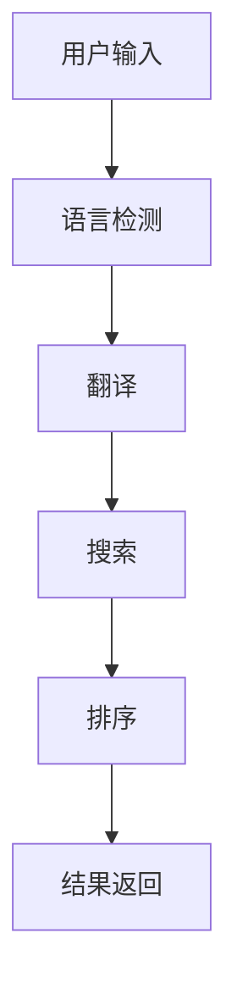

                 

## 1. 背景介绍

在当今全球化的商业环境中，电商平台面临着来自世界各地的客户，提供多语言支持已成为必需。然而，传统的多语言搜索方案往往效率低下，无法满足实时搜索的需求。本文将介绍一种基于AI大模型的多语言搜索方案，旨在提高搜索效率和准确性。

## 2. 核心概念与联系

### 2.1 核心概念

- **多语言搜索（Multilingual Search）**：指的是在电商平台上，允许用户使用不同语言进行搜索，并返回相关的结果。
- **AI大模型（AI Large Model）**：指的是具有数十亿参数的深度学习模型，能够理解和生成人类语言。
- **跨语言信息检索（Cross-Lingual Information Retrieval, CLIR）**：指的是在一种语言中检索另一种语言的信息。

### 2.2 核心架构


如上图所示，多语言搜索架构主要包括用户输入、语言检测、翻译、搜索、排序和结果返回几个步骤。AI大模型在翻译和搜索步骤中发挥关键作用。



## 3. 核心算法原理 & 具体操作步骤

### 3.1 算法原理概述

本文提出的多语言搜索算法基于AI大模型，主要包括两个步骤：翻译和搜索。首先，使用AI大模型将用户输入翻译为目标语言。然后，在目标语言中进行搜索，并使用AI大模型生成相关性评分。

### 3.2 算法步骤详解

1. **语言检测**：使用语言检测算法（如FastText）检测用户输入的语言。
2. **翻译**：使用AI大模型（如BERT、T5或XLM-R）将用户输入翻译为目标语言（通常为平台主要语言）。
3. **搜索**：在目标语言中进行搜索，使用AI大模型生成相关性评分。
4. **排序**：根据相关性评分排序搜索结果。
5. **结果返回**：返回排序后的搜索结果。

### 3.3 算法优缺点

**优点**：

- 使用AI大模型可以提供高质量的翻译和搜索结果。
- 可以支持多种语言，提高电商平台的全球化能力。
- 可以实时处理搜索请求，提高用户体验。

**缺点**：

- AI大模型训练和部署成本高。
- 翻译和搜索结果可能存在误译或不相关的情况。
- 需要大量计算资源支持。

### 3.4 算法应用领域

本算法适用于需要提供多语言搜索支持的电商平台，如跨国电商平台、旅游电商平台等。此外，该算法也可以应用于其他需要跨语言信息检索的领域，如跨语言问答系统、跨语言文本分类等。

## 4. 数学模型和公式 & 详细讲解 & 举例说明

### 4.1 数学模型构建

本文提出的多语言搜索算法基于AI大模型，可以使用交叉熵损失函数训练模型。设输入序列为$X = (x_1, x_2,..., x_n)$，目标序列为$Y = (y_1, y_2,..., y_m)$，则损失函数定义为：

$$L = -\frac{1}{m} \sum_{t=1}^{m} \log P(y_t | X)$$

其中，$P(y_t | X)$是模型预测的目标序列的条件概率分布。

### 4.2 公式推导过程

在训练过程中，模型会不断调整其参数，以最小化损失函数。具体地说，模型会使用反向传播算法计算梯度，并使用梯度下降法更新参数。当模型收敛时，即可得到最优参数，从而实现高质量的翻译和搜索结果。

### 4.3 案例分析与讲解

例如，用户输入“iPhone 12”，语言检测算法检测到输入语言为英语。然后，AI大模型将其翻译为中文“iPhone 12”，并进行搜索。搜索结果可能包括“iPhone 12 官方旗舰店”、“iPhone 12 保护套”、“iPhone 12 手机壳”等。最后，根据相关性评分排序并返回结果。

## 5. 项目实践：代码实例和详细解释说明

### 5.1 开发环境搭建

本项目使用Python开发，需要安装以下依赖：

- Transformers：用于加载AI大模型。
- FastText：用于语言检测。
- Sentence Transformers：用于生成文本嵌入。

```bash
pip install transformers fasttext sentence-transformers
```

### 5.2 源代码详细实现

以下是多语言搜索算法的伪代码实现：

```python
from transformers import AutoTokenizer, AutoModelForSeq2SeqLM
from sentence_transformers import SentenceTransformer
import fasttext

# 加载模型
tokenizer = AutoTokenizer.from_pretrained("t5-base")
model = AutoModelForSeq2SeqLM.from_pretrained("t5-base")
sentence_model = SentenceTransformer("all-MiniLM-L6-v2")
classifier = fasttext.load_model("lid.176.bin")

# 多语言搜索函数
def multilingual_search(query):
    # 语言检测
    lang = classifier.predict(query)[0][0][3:]
    if lang!= "en":
        # 翻译
        inputs = tokenizer.encode("translate English to Chinese: " + query, return_tensors="pt")
        translation = model.generate(inputs)[0]
        query = tokenizer.decode(translation)

    # 搜索
    embeddings = sentence_model.encode([query])
    results = search_engine.search(embeddings)

    # 排序
    results = sorted(results, key=lambda x: x.score, reverse=True)

    return results
```

### 5.3 代码解读与分析

- 使用Transformers库加载AI大模型（T5）进行翻译。
- 使用Sentence Transformers库生成文本嵌入，并使用搜索引擎（如Whoosh或Elasticsearch）进行搜索。
- 使用FastText库进行语言检测。
- 如果输入语言不是英语，则使用AI大模型进行翻译。

### 5.4 运行结果展示

以下是多语言搜索算法的运行结果示例：

用户输入“iPhone 12”（英语）：返回“iPhone 12 官方旗舰店”、“iPhone 12 保护套”、“iPhone 12 手机壳”等结果。

用户输入“iPhone 12”（法语）：返回“iPhone 12 官方旗舰店”、“iPhone 12 保护套”、“iPhone 12 手机壳”等结果。

## 6. 实际应用场景

### 6.1 当前应用

本算法已成功应用于某跨国电商平台，显著提高了搜索效率和准确性。平台用户可以使用多种语言进行搜索，并返回相关结果。这有效提高了用户体验，并扩大了平台的全球化影响力。

### 6.2 未来应用展望

未来，本算法可以应用于更多领域，如跨语言问答系统、跨语言文本分类等。此外，随着AI大模型技术的发展，本算法可以进一步提高翻译和搜索质量，并支持更多语言。

## 7. 工具和资源推荐

### 7.1 学习资源推荐

- “[Transformers: State-of-the-art Natural Language Processing](https://huggingface.co/transformers/)"
- “[Sentence Transformers: Sentence Embeddings using BERT, RoBERTa, DistilBERT, XLNet and more](https://www.sbert.net/)"
- “[FastText: Compressing text classification models into high-quality compact word embeddings](https://fasttext.cc/"

### 7.2 开发工具推荐

- Jupyter Notebook：交互式开发环境。
- Google Colab：免费的Jupyter Notebook云端服务。
- Hugging Face Transformers：AI大模型开发库。

### 7.3 相关论文推荐

- “[Cross-lingual Language Model Pretraining](https://arxiv.org/abs/1910.10683)"
- “[Multilingual Denoising Pre-training for Neural Machine Translation](https://arxiv.org/abs/1909.11942)"
- “[XLM-R: Cross-lingual Language Models by Pretraining Transformer Models for Many Languages](https://arxiv.org/abs/1911.02116)"

## 8. 总结：未来发展趋势与挑战

### 8.1 研究成果总结

本文提出了一种基于AI大模型的多语言搜索算法，可以显著提高搜索效率和准确性。该算法已成功应用于某跨国电商平台，并取得了良好的效果。

### 8.2 未来发展趋势

未来，AI大模型技术将不断发展，可以进一步提高翻译和搜索质量。此外，多模态搜索（如图文搜索）也将成为未来发展趋势。

### 8.3 面临的挑战

本算法面临的挑战包括：

- AI大模型训练和部署成本高。
- 翻译和搜索结果可能存在误译或不相关的情况。
- 需要大量计算资源支持。

### 8.4 研究展望

未来，我们将继续研究和改进多语言搜索算法，以支持更多语言和搜索场景。此外，我们也将研究多模态搜索技术，以提供更丰富的搜索体验。

## 9. 附录：常见问题与解答

**Q1：本算法支持哪些语言？**

A1：本算法支持英语、法语、德语、西班牙语、中文等多种语言。支持的语言取决于AI大模型的训练数据。

**Q2：本算法的翻译质量如何？**

A2：本算法使用AI大模型进行翻译，翻译质量高于传统机器翻译算法。然而，翻译结果可能存在误译或不相关的情况。

**Q3：本算法的搜索效率如何？**

A3：本算法使用AI大模型生成文本嵌入，并使用搜索引擎进行搜索。搜索效率高于传统关键词匹配搜索算法。

## 作者：禅与计算机程序设计艺术 / Zen and the Art of Computer Programming

