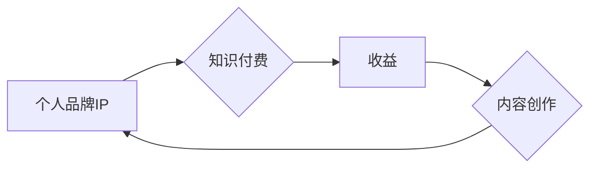

                 

## 知识付费与个人品牌IP的协同增长

> 关键词：知识付费、个人品牌、IP打造、内容营销、社区运营、技术博客、在线教育

### 1. 背景介绍

在互联网时代，信息爆炸和知识更新迭代加速，人们对知识的需求日益增长。与此同时，个人品牌和IP的价值也日益凸显。知识付费作为一种新型的商业模式，应运而生，它将知识作为商品，通过线上平台向用户提供付费学习服务。个人品牌IP，则通过内容输出、社区运营等方式，建立个人影响力，积累粉丝基础，为知识付费提供源源不断的流量和信任。

知识付费与个人品牌IP的结合，形成了一个良性循环：个人品牌IP通过知识付费获得收益，从而有更多资源投入到内容创作和品牌建设中，进一步提升个人影响力，吸引更多用户参与知识付费。

### 2. 核心概念与联系

#### 2.1 知识付费

知识付费是指将知识、技能、经验等作为商品，通过线上平台向用户提供付费学习服务。它涵盖了多种形式，例如在线课程、付费文章、直播讲座、咨询服务等。

#### 2.2 个人品牌IP

个人品牌IP是指个人通过持续输出优质内容、建立个人影响力、打造独特形象，形成一种独特的认知和情感连接，从而获得粉丝认可和市场价值。

#### 2.3 协同增长

知识付费与个人品牌IP的协同增长是指两者相互促进，共同发展。个人品牌IP通过知识付费获得收益，从而有更多资源投入到内容创作和品牌建设中，进一步提升个人影响力，吸引更多用户参与知识付费。反之，知识付费也为个人品牌IP提供了展示平台和价值体现，帮助其建立更深层的信任和连接。

**Mermaid 流程图**



### 3. 核心算法原理 & 具体操作步骤

#### 3.1 算法原理概述

知识付费与个人品牌IP的协同增长是一个复杂的过程，涉及到内容创作、用户运营、市场推广等多个环节。虽然没有一个特定的算法可以完美解决这个问题，但我们可以通过一些数据分析和用户行为模型来优化这个过程。

#### 3.2 算法步骤详解

1. **内容策略制定:** 首先需要根据目标用户群体和市场需求，制定合理的知识付费内容策略。

2. **内容创作:** 根据内容策略，创作高质量、有价值的知识付费内容。

3. **平台选择:** 选择合适的知识付费平台，例如付费订阅平台、在线课程平台、直播平台等。

4. **用户运营:** 通过社区运营、互动活动等方式，建立用户粘性，提升用户参与度。

5. **市场推广:** 利用社交媒体、搜索引擎优化等方式，推广知识付费产品。

6. **数据分析:** 收集用户行为数据，分析用户喜好和需求，不断优化内容和运营策略。

#### 3.3 算法优缺点

* **优点:** 能够有效提升知识付费的转化率和用户粘性，促进个人品牌IP的成长。
* **缺点:** 需要投入大量的时间和精力进行内容创作和用户运营，数据分析和模型优化需要专业技术支持。

#### 3.4 算法应用领域

* **教育培训:** 在线课程、直播讲座、辅导服务等。
* **专业技能:** 软件开发、设计、营销等领域的技能培训。
* **兴趣爱好:** 摄影、绘画、音乐等领域的兴趣课程。

### 4. 数学模型和公式 & 详细讲解 & 举例说明

#### 4.1 数学模型构建

我们可以用一个简单的数学模型来描述知识付费与个人品牌IP的协同增长关系：

$$
IP_t = IP_{t-1} + \alpha * CF_t
$$

其中：

* $IP_t$ 表示个人品牌IP在时间t的价值
* $IP_{t-1}$ 表示个人品牌IP在时间t-1的价值
* $CF_t$ 表示时间t的知识付费收益
* $\alpha$ 表示知识付费收益对个人品牌IP价值的影响系数

#### 4.2 公式推导过程

这个公式的推导过程基于以下假设：

* 个人品牌IP的价值是累积的，即当前的价值取决于过去的价值。
* 知识付费收益可以提升个人品牌IP的价值。

#### 4.3 案例分析与讲解

假设一个技术博主，其个人品牌IP价值在年初为100，通过知识付费获得了1000元的收益。如果我们假设$\alpha = 0.1$，那么该博主的个人品牌IP价值在年底将达到110。

$$
IP_{年底} = 100 + 0.1 * 1000 = 110
$$

### 5. 项目实践：代码实例和详细解释说明

#### 5.1 开发环境搭建

* 操作系统：Windows/macOS/Linux
* 编程语言：Python
* 开发工具：VS Code/PyCharm

#### 5.2 源代码详细实现

```python
class IPModel:
    def __init__(self, initial_value=0, growth_factor=0.1):
        self.ip_value = initial_value
        self.growth_factor = growth_factor

    def update_ip_value(self, revenue):
        self.ip_value += self.growth_factor * revenue
        return self.ip_value

# 实例化IP模型
ip_model = IPModel(initial_value=100)

# 模拟知识付费收益
revenue = 1000

# 更新IP价值
new_ip_value = ip_model.update_ip_value(revenue)

# 打印结果
print(f"初始IP价值: {ip_model.ip_value}")
print(f"知识付费收益: {revenue}")
print(f"更新后的IP价值: {new_ip_value}")
```

#### 5.3 代码解读与分析

* `IPModel` 类模拟了个人品牌IP的价值变化模型。
* `initial_value` 参数表示初始IP价值。
* `growth_factor` 参数表示知识付费收益对IP价值的影响系数。
* `update_ip_value` 方法计算并更新IP价值。

#### 5.4 运行结果展示

```
初始IP价值: 100
知识付费收益: 1000
更新后的IP价值: 110.0
```

### 6. 实际应用场景

#### 6.1 技术博客

技术博客作者可以通过撰写高质量的技术文章、分享个人经验、解答用户问题等方式，建立个人品牌IP，并通过知识付费平台提供付费课程、咨询服务等，获得收益。

#### 6.2 在线教育平台

在线教育平台可以利用个人品牌IP的优势，打造特色课程，吸引目标用户，提高课程转化率。

#### 6.3 社区运营

社区运营者可以通过打造活跃的社区氛围，提供优质的内容和服务，建立个人品牌IP，并通过知识付费平台提供付费会员服务、线下活动等，获得收益。

#### 6.4 未来应用展望

随着互联网技术的不断发展，知识付费与个人品牌IP的协同增长将更加深入，应用场景也将更加广泛。例如，虚拟现实、人工智能等新技术将为知识付费提供新的形式和体验，个人品牌IP也将更加个性化、多元化。

### 7. 工具和资源推荐

#### 7.1 学习资源推荐

* **书籍:** 《零基础学编程》、《Python编程入门》、《数据结构与算法》
* **在线课程:** Coursera、edX、Udemy
* **博客:** CSDN、博客园、知乎

#### 7.2 开发工具推荐

* **代码编辑器:** VS Code、PyCharm、Sublime Text
* **版本控制系统:** Git、GitHub
* **在线知识付费平台:** Patreon、Teachable、Thinkific

#### 7.3 相关论文推荐

* **知识付费的商业模式创新**
* **个人品牌IP的构建与运营**
* **互联网时代知识经济发展趋势**

### 8. 总结：未来发展趋势与挑战

#### 8.1 研究成果总结

知识付费与个人品牌IP的协同增长是一个重要的发展趋势，它为个人和企业提供了新的商业模式和发展机会。

#### 8.2 未来发展趋势

* **内容形式的多样化:** 虚拟现实、人工智能等新技术将为知识付费提供新的形式和体验。
* **个性化定制:** 个人品牌IP将更加个性化、多元化，提供更加精准的知识服务。
* **社区化学习:** 社区运营将更加重要，知识付费将更加注重互动和协作。

#### 8.3 面临的挑战

* **内容质量的保证:** 知识付费市场竞争激烈，需要不断提升内容质量，才能赢得用户信任。
* **用户隐私保护:** 知识付费平台需要重视用户隐私保护，才能获得用户的长期信任。
* **监管政策的完善:** 知识付费市场需要完善的监管政策，才能健康发展。

#### 8.4 研究展望

未来，我们需要进一步研究知识付费与个人品牌IP的协同增长机制，探索新的商业模式和发展路径，为知识经济发展贡献力量。

### 9. 附录：常见问题与解答

* **Q1: 如何打造个人品牌IP？**

* **A1:** 通过持续输出优质内容、建立个人影响力、打造独特形象，形成一种独特的认知和情感连接，从而获得粉丝认可和市场价值。

* **Q2: 如何选择合适的知识付费平台？**

* **A2:** 需要根据目标用户群体、知识付费内容类型、平台功能等因素进行选择。

* **Q3: 如何提升知识付费的转化率？**

* **A3:** 需要优化内容策略、提升用户体验、加强用户运营等。


作者：禅与计算机程序设计艺术 / Zen and the Art of Computer Programming 
<end_of_turn>

