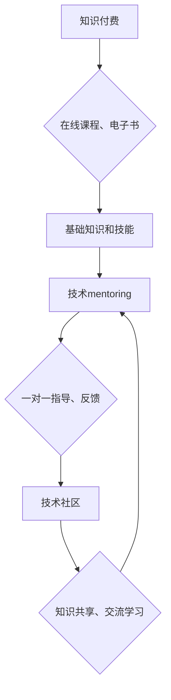

                 

## 知识付费与技术mentoring的结合模式

> 关键词：知识付费、技术mentoring、在线教育、技术社区、人才培养、技能提升、人工智能、机器学习

## 1. 背景介绍

在当今科技飞速发展的时代，技术人才的需求量持续增长，而传统的教育模式和培训方式难以满足这种快速变化的需求。知识付费和技术mentoring作为两种新兴的学习模式，逐渐成为解决这一问题的有效途径。

**1.1 知识付费的兴起**

知识付费是指通过付费的方式获取知识、技能和服务的商业模式。近年来，随着互联网技术的普及和移动互联网的兴起，知识付费市场蓬勃发展。在线课程、付费咨询、电子书等知识产品层出不穷，为用户提供了便捷、高效的学习方式。

**1.2 技术mentoring的价值**

技术mentoring是指经验丰富的技术专家为有学习需求的个人或团队提供一对一指导和帮助的模式。通过与导师的互动交流，学习者可以获得更深入的专业知识、技能指导和职业发展建议，从而更快地提升自身的技术水平。

**1.3 结合模式的优势**

将知识付费和技术mentoring相结合，可以充分发挥两种模式的优势，打造更加高效、个性化的学习体验。

* **知识付费提供基础知识和技能:** 在线课程、电子书等知识产品可以为学习者提供系统化的知识体系和基础技能，为技术mentoring打下坚实的基础。
* **技术mentoring提供个性化指导和反馈:** 导师可以根据学习者的实际情况和需求，提供个性化的指导和反馈，帮助学习者解决学习中的难题，提升学习效率。
* **构建技术社区，促进知识共享:** 将知识付费和技术mentoring融入技术社区，可以促进学习者之间互相交流学习，共同进步，形成良性循环。

## 2. 核心概念与联系

知识付费与技术mentoring的结合模式，本质上是一种以知识为核心，以指导为手段，以社区为平台的学习模式。



**2.1 知识付费的模式**

知识付费模式主要包括以下几种：

* **在线课程:** 通过视频、音频、文字等多种形式，提供系统化的知识学习内容。
* **付费咨询:** 用户可以付费咨询专家，获得针对性的专业解答和建议。
* **电子书:** 提供电子版本的书籍、教程、案例等知识资料。
* **会员体系:** 用户通过付费成为会员，可以获得更多学习资源和服务。

**2.2 技术mentoring的模式**

技术mentoring模式主要包括以下几种：

* **一对一指导:** 导师为单个学习者提供一对一的指导和帮助。
* **小组辅导:** 导师为多个学习者提供小组辅导，进行共同学习和讨论。
* **在线平台:** 通过在线平台，连接导师和学习者，提供远程指导和交流服务。

**2.3 结合模式的优势**

将知识付费和技术mentoring相结合，可以实现以下优势：

* **个性化学习:** 知识付费提供基础知识，技术mentoring提供个性化指导，满足不同学习者的需求。
* **提升学习效率:** 技术mentoring可以帮助学习者更快地解决问题，提升学习效率。
* **构建学习社区:** 技术社区可以促进学习者之间的交流学习，形成良性循环。

## 3. 核心算法原理 & 具体操作步骤

### 3.1 算法原理概述

知识付费与技术mentoring的结合模式，本质上是一种基于知识图谱和推荐算法的个性化学习系统。

* **知识图谱:** 建立知识图谱，将知识点、技能、导师信息等进行关联，构建知识网络。
* **推荐算法:** 基于用户学习历史、兴趣偏好、导师资质等信息，推荐合适的知识付费产品和技术mentoring服务。

### 3.2 算法步骤详解

1. **用户建模:** 收集用户学习历史、兴趣偏好、技能水平等信息，构建用户模型。
2. **知识图谱构建:** 收集知识点、技能、导师信息等，构建知识图谱。
3. **推荐算法训练:** 利用机器学习算法，训练推荐模型，预测用户对不同知识付费产品和技术mentoring服务的兴趣。
4. **个性化推荐:** 根据用户模型和推荐结果，为用户推荐个性化的学习路径和服务。
5. **学习反馈:** 收集用户学习反馈，更新用户模型和推荐算法，不断优化推荐效果。

### 3.3 算法优缺点

**优点:**

* **个性化学习:** 根据用户需求，提供个性化的学习路径和服务。
* **提升学习效率:** 推荐合适的学习资源，帮助用户更快地掌握知识和技能。
* **知识发现:** 通过知识图谱，帮助用户发现新的知识点和学习资源。

**缺点:**

* **数据依赖:** 推荐算法需要大量用户数据进行训练，数据质量直接影响推荐效果。
* **算法复杂度:** 建立知识图谱和训练推荐算法需要复杂的算法和技术。
* **用户隐私:** 收集用户数据需要考虑用户隐私保护问题。

### 3.4 算法应用领域

* **在线教育平台:** 为用户提供个性化的学习推荐和指导。
* **技术社区:** 连接导师和学习者，促进知识共享和交流学习。
* **企业培训:** 为员工提供个性化的技能培训和职业发展指导。

## 4. 数学模型和公式 & 详细讲解 & 举例说明

### 4.1 数学模型构建

知识推荐系统可以使用协同过滤算法，构建用户-项目评分矩阵，并利用矩阵分解技术进行推荐。

**用户-项目评分矩阵:**

$$
R = \begin{bmatrix}
r_{11} & r_{12} & \cdots & r_{1m} \\
r_{21} & r_{22} & \cdots & r_{2m} \\
\vdots & \vdots & \ddots & \vdots \\
r_{n1} & r_{n2} & \cdots & r_{nm}
\end{bmatrix}
$$

其中，$r_{ij}$ 表示用户 $i$ 对项目 $j$ 的评分，$n$ 为用户数量，$m$ 为项目数量。

**矩阵分解模型:**

$$
\hat{r}_{ij} = p_i^T q_j
$$

其中，$\hat{r}_{ij}$ 为预测评分，$p_i$ 为用户 $i$ 的隐向量，$q_j$ 为项目 $j$ 的隐向量。

### 4.2 公式推导过程

通过最小化预测评分与实际评分之间的误差，可以训练出用户和项目隐向量。常用的损失函数为均方误差 (MSE):

$$
L = \frac{1}{2} \sum_{i=1}^{n} \sum_{j=1}^{m} (r_{ij} - \hat{r}_{ij})^2
$$

利用梯度下降算法，可以迭代更新用户和项目隐向量，最小化损失函数。

### 4.3 案例分析与讲解

假设有一个用户-项目评分矩阵，其中用户 1 对项目 1 的评分为 5，用户 2 对项目 1 的评分为 3，用户 1 对项目 2 的评分为 4，用户 2 对项目 2 的评分为 2。

可以使用矩阵分解模型，预测用户 3 对项目 1 的评分。

通过训练模型，得到用户 1、用户 2、用户 3 的隐向量，以及项目 1、项目 2 的隐向量。

然后，使用公式 $\hat{r}_{ij} = p_i^T q_j$，计算用户 3 对项目 1 的预测评分。

## 5. 项目实践：代码实例和详细解释说明

### 5.1 开发环境搭建

* Python 3.x
* TensorFlow 或 PyTorch
* Jupyter Notebook

### 5.2 源代码详细实现

```python
import tensorflow as tf

# 定义用户-项目评分矩阵
ratings = tf.constant([[5, 4], [3, 2]])

# 定义用户和项目隐向量维度
latent_dim = 2

# 定义矩阵分解模型
class RecommenderModel(tf.keras.Model):
    def __init__(self, latent_dim):
        super(RecommenderModel, self).__init__()
        self.user_embeddings = tf.keras.layers.Embedding(input_dim=ratings.shape[0], output_dim=latent_dim)
        self.item_embeddings = tf.keras.layers.Embedding(input_dim=ratings.shape[1], output_dim=latent_dim)

    def call(self, user_ids, item_ids):
        user_embeddings = self.user_embeddings(user_ids)
        item_embeddings = self.item_embeddings(item_ids)
        return tf.reduce_sum(user_embeddings * item_embeddings, axis=1)

# 实例化模型
model = RecommenderModel(latent_dim)

# 定义损失函数和优化器
optimizer = tf.keras.optimizers.Adam()
loss_fn = tf.keras.losses.MeanSquaredError()

# 训练模型
for epoch in range(100):
    with tf.GradientTape() as tape:
        predictions = model(tf.range(ratings.shape[0]), tf.range(ratings.shape[1]))
        loss = loss_fn(ratings, predictions)
    gradients = tape.gradient(loss, model.trainable_variables)
    optimizer.apply_gradients(zip(gradients, model.trainable_variables))

# 预测用户 3 对项目 1 的评分
user_id = 2
item_id = 0
prediction = model(tf.constant([user_id]), tf.constant([item_id]))
print(f"预测评分: {prediction.numpy()[0]}")
```

### 5.3 代码解读与分析

* 代码首先定义了用户-项目评分矩阵和隐向量维度。
* 然后定义了矩阵分解模型，包含用户嵌入层和项目嵌入层。
* 使用 Adam 优化器和均方误差损失函数训练模型。
* 最后，使用训练好的模型预测用户 3 对项目 1 的评分。

### 5.4 运行结果展示

运行代码后，可以得到用户 3 对项目 1 的预测评分。

## 6. 实际应用场景

### 6.1 在线教育平台

* 为用户推荐个性化的在线课程和学习路径。
* 提供一对一技术mentoring服务，帮助用户解决学习难题。
* 建立技术社区，促进用户之间交流学习。

### 6.2 技术社区

* 连接导师和学习者，提供技术指导和交流平台。
* 推荐相关技术文档、开源项目和学习资源。
* 举办线上线下技术活动，促进技术交流和合作。

### 6.3 企业培训

* 为员工提供个性化的技能培训和职业发展指导。
* 帮助企业提升员工技能水平和工作效率。
* 建立企业内部技术社区，促进知识共享和协作。

### 6.4 未来应用展望

* **人工智能技术:** 利用人工智能技术，进一步提升推荐算法的准确性和个性化程度。
* **虚拟现实技术:** 将虚拟现实技术融入技术mentoring，提供更加沉浸式的学习体验。
* **元宇宙:** 在元宇宙环境中构建虚拟技术社区，提供更加丰富的学习资源和互动体验。

## 7. 工具和资源推荐

### 7.1 学习资源推荐

* **在线课程平台:** Coursera, edX, Udemy
* **技术社区:** Stack Overflow, GitHub, Reddit
* **书籍:** 《深度学习》、《机器学习》、《推荐系统》

### 7.2 开发工具推荐

* **Python:** TensorFlow, PyTorch, Scikit-learn
* **数据库:** MySQL, PostgreSQL
* **云平台:** AWS, Azure, Google Cloud

### 7.3 相关论文推荐

* **协同过滤算法:** "Collaborative Filtering: A User-Based Approach"
* **矩阵分解模型:** "Matrix Factorization Techniques for Recommender Systems"
* **深度学习推荐系统:** "Deep Learning for Recommender Systems"

## 8. 总结：未来发展趋势与挑战

### 8.1 研究成果总结

知识付费与技术mentoring的结合模式，为解决技术人才短缺问题提供了新的思路和方法。通过知识图谱和推荐算法，可以实现个性化学习和指导，提升学习效率和效果。

### 8.2 未来发展趋势

* **人工智能技术:** 利用人工智能技术，进一步提升推荐算法的准确性和个性化程度。
* **虚拟现实技术:** 将虚拟现实技术融入技术mentoring，提供更加沉浸式的学习体验。
* **元宇宙:** 在元宇宙环境中构建虚拟技术社区，提供更加丰富的学习资源和互动体验。

### 8.3 面临的挑战

* **数据质量:** 推荐算法需要大量高质量的数据进行训练，数据质量直接影响推荐效果。
* **算法复杂度:** 建立知识图谱和训练推荐算法需要复杂的算法和技术。
* **用户隐私:** 收集用户数据需要考虑用户隐私保护问题。

### 8.4 研究展望

未来，将继续研究知识付费与技术mentoring的结合模式，探索更有效的学习方法和技术，为技术人才培养和职业发展提供更优质的服务。

## 9. 附录：常见问题与解答

**1. 如何选择合适的导师？**

* 考虑导师的专业领域、经验水平、教学风格和评价。
* 可以参考导师的个人简介、案例作品和学员评价。
* 可以与导师进行沟通，了解他们的教学理念和辅导方式。

**2. 如何进行有效的技术mentoring？**

* 明确学习目标和需求。
* 积极主动地与导师沟通，提出问题和寻求帮助。
* 认真完成导师布置的任务，并及时反馈学习成果。
* 保持学习的热情和动力，不断提升自己的技能水平。


作者：禅与计算机程序设计艺术 / Zen and the Art of Computer Programming<end_of_turn>

