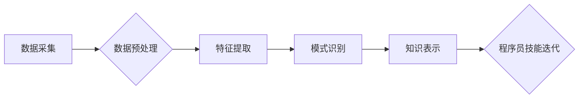

                 

## 知识发现引擎助力程序员技能迭代

> 关键词：知识发现引擎、程序员技能迭代、代码分析、机器学习、推荐系统、持续学习、编程实践

### 1. 背景介绍

在软件开发领域，程序员的技能迭代是保持竞争力的关键。随着技术日新月异，程序员需要不断学习新知识、掌握新技术，才能应对不断变化的市场需求。传统的学习方式，例如阅读书籍、参加培训课程，虽然有效，但效率有限，难以满足程序员快速学习的需求。

知识发现引擎 (Knowledge Discovery Engine，KDE) 作为一种数据挖掘技术，能够从海量数据中发现隐藏的知识和模式。近年来，KDE 在程序员技能迭代领域展现出巨大的潜力。通过对代码库、文档、论坛等数据进行分析，KDE 可以帮助程序员：

* **识别技能差距:** 分析程序员的代码风格、技术栈和项目经验，识别其技能的强项和弱项，明确需要提升的领域。
* **推荐个性化学习资源:** 根据程序员的技能特点和学习目标，推荐相关的书籍、教程、在线课程和开源项目，帮助程序员高效地学习新知识。
* **提供代码示例和最佳实践:** 通过分析优秀代码库，提取代码示例和最佳实践，帮助程序员提高代码质量和开发效率。
* **促进社区协作:** 建立程序员技能迭代平台，连接程序员、专家和开源项目，促进知识共享和协作学习。

### 2. 核心概念与联系

知识发现引擎的核心概念包括：数据采集、数据预处理、特征提取、模式识别和知识表示。

**数据采集:** 从代码库、文档、论坛等数据源中收集相关数据。

**数据预处理:** 对收集到的数据进行清洗、转换和格式化，使其适合后续分析。

**特征提取:** 从数据中提取有意义的特征，例如代码结构、语法、技术栈、评论等。

**模式识别:** 使用机器学习算法识别数据中的模式和关系，例如程序员技能之间的关联、代码风格的差异、技术趋势的变化等。

**知识表示:** 将识别的模式和关系转化为可理解的知识，例如技能树、知识图谱、代码示例库等。

**Mermaid 流程图:**



### 3. 核心算法原理 & 具体操作步骤

#### 3.1  算法原理概述

知识发现引擎通常采用机器学习算法来识别数据中的模式和关系。常见的算法包括：

* **聚类算法:** 将程序员根据其技能特征进行分组，识别不同类型的程序员。
* **关联规则挖掘算法:** 发现程序员技能之间的关联关系，例如哪些技能经常一起出现。
* **推荐系统算法:** 根据程序员的技能特点和学习目标，推荐相关的学习资源。

#### 3.2  算法步骤详解

以程序员技能聚类为例，其具体操作步骤如下：

1. **数据收集:** 从代码库、文档、论坛等数据源中收集程序员的代码风格、技术栈、项目经验等数据。
2. **数据预处理:** 对收集到的数据进行清洗、转换和格式化，例如去除噪声数据、标准化特征值等。
3. **特征提取:** 从数据中提取有意义的特征，例如代码行数、代码复杂度、使用技术栈等。
4. **聚类算法选择:** 选择合适的聚类算法，例如K-means、DBSCAN等。
5. **聚类模型训练:** 使用训练数据训练聚类模型，得到不同类型的程序员聚类结果。
6. **聚类结果评估:** 使用评估指标，例如Silhouette score、Dunn index等，评估聚类结果的质量。
7. **聚类结果可视化:** 将聚类结果可视化，例如使用散点图、层次聚类图等，帮助程序员理解不同类型的程序员。

#### 3.3  算法优缺点

**优点:**

* 可以自动识别程序员技能之间的关联关系。
* 可以根据程序员的技能特点推荐个性化的学习资源。
* 可以帮助程序员了解自身技能的强项和弱项，制定更有效的学习计划。

**缺点:**

* 需要大量的训练数据才能获得准确的聚类结果。
* 算法选择和参数设置对聚类结果有很大影响。
* 聚类结果的解释性需要进一步提升。

#### 3.4  算法应用领域

* **程序员技能评估:** 评估程序员的技能水平，为招聘、培训和晋升提供依据。
* **个性化学习推荐:** 根据程序员的技能特点和学习目标，推荐相关的学习资源。
* **代码质量提升:** 分析优秀代码库，提取代码示例和最佳实践，帮助程序员提高代码质量。
* **技术趋势分析:** 分析代码库和文档中的技术词汇和代码结构，识别技术趋势的变化。

### 4. 数学模型和公式 & 详细讲解 & 举例说明

#### 4.1  数学模型构建

在程序员技能聚类中，可以使用K-means算法构建数学模型。K-means算法的目标是将数据点划分为K个簇，每个簇的中心点称为聚类中心。

#### 4.2  公式推导过程

K-means算法的迭代过程如下：

1. **随机初始化K个聚类中心:**

$$
\mu_1, \mu_2, ..., \mu_K
$$

2. **计算每个数据点到每个聚类中心的距离:**

$$
d(x_i, \mu_j) = ||x_i - \mu_j||
$$

3. **将每个数据点分配到距离最近的聚类中心:**

$$
c_i = argmin_j d(x_i, \mu_j)
$$

4. **更新每个聚类中心的坐标:**

$$
\mu_j = \frac{1}{|C_j|} \sum_{x_i \in C_j} x_i
$$

5. **重复步骤2-4，直到聚类中心不再变化:**

#### 4.3  案例分析与讲解

假设我们有10个程序员的数据，需要将其聚类为2个簇。

1. 随机初始化两个聚类中心。
2. 计算每个程序员到两个聚类中心的距离。
3. 将每个程序员分配到距离最近的聚类中心。
4. 更新两个聚类中心的坐标。
5. 重复步骤2-4，直到聚类中心不再变化。

最终，我们将得到两个聚类，每个聚类包含5个程序员。

### 5. 项目实践：代码实例和详细解释说明

#### 5.1  开发环境搭建

* **操作系统:** Linux/macOS/Windows
* **编程语言:** Python
* **库依赖:** scikit-learn、pandas、numpy

#### 5.2  源代码详细实现

```python
from sklearn.cluster import KMeans
import pandas as pd

# 加载数据
data = pd.read_csv('programmers_data.csv')

# 选择特征
features = ['code_lines', 'code_complexity', 'tech_stack']
X = data[features]

# 确定聚类数量
k = 2

# 创建KMeans模型
kmeans = KMeans(n_clusters=k, random_state=0)

# 训练模型
kmeans.fit(X)

# 获取聚类标签
labels = kmeans.labels_

# 将聚类标签添加到数据中
data['cluster'] = labels

# 保存结果
data.to_csv('programmers_clusters.csv', index=False)
```

#### 5.3  代码解读与分析

* **数据加载:** 使用pandas库加载程序员数据。
* **特征选择:** 选择代码行数、代码复杂度和技术栈作为聚类特征。
* **聚类模型创建:** 使用scikit-learn库的KMeans算法创建聚类模型，指定聚类数量为2。
* **模型训练:** 使用训练数据训练KMeans模型。
* **聚类标签获取:** 获取每个程序员的聚类标签。
* **结果保存:** 将聚类标签添加到数据中，并保存结果到CSV文件。

#### 5.4  运行结果展示

运行代码后，将生成一个包含程序员数据和聚类标签的CSV文件。可以使用数据可视化工具，例如matplotlib或seaborn，将聚类结果可视化，例如使用散点图或层次聚类图。

### 6. 实际应用场景

#### 6.1  程序员技能评估

知识发现引擎可以帮助公司评估程序员的技能水平，为招聘、培训和晋升提供依据。例如，可以根据程序员的代码风格、技术栈和项目经验，将其划分为不同的技能等级，并提供个性化的学习建议。

#### 6.2  个性化学习推荐

知识发现引擎可以根据程序员的技能特点和学习目标，推荐相关的学习资源，例如书籍、教程、在线课程和开源项目。例如，如果程序员想要学习机器学习，知识发现引擎可以推荐相关的书籍、教程和开源项目，并根据程序员的学习进度和反馈，动态调整推荐内容。

#### 6.3  代码质量提升

知识发现引擎可以分析优秀代码库，提取代码示例和最佳实践，帮助程序员提高代码质量。例如，可以分析开源项目的代码风格和设计模式，并提供给程序员参考。

#### 6.4  未来应用展望

随着人工智能技术的不断发展，知识发现引擎在程序员技能迭代领域将发挥越来越重要的作用。未来，知识发现引擎可以：

* **更精准地识别程序员技能:** 利用更先进的机器学习算法和数据分析技术，更精准地识别程序员的技能特点和学习目标。
* **提供更个性化的学习建议:** 基于程序员的学习行为和反馈，提供更个性化的学习建议和学习路径。
* **构建更完善的程序员技能迭代平台:** 建立一个连接程序员、专家和开源项目的平台，促进知识共享和协作学习。

### 7. 工具和资源推荐

#### 7.1  学习资源推荐

* **机器学习课程:** Coursera、edX、Udacity等平台提供丰富的机器学习课程。
* **数据挖掘书籍:** 《数据挖掘：概念与技术》、《数据挖掘实战》等书籍介绍了数据挖掘的基本概念和技术。
* **开源工具:** scikit-learn、pandas、numpy等开源工具可以用于数据分析和机器学习。

#### 7.2  开发工具推荐

* **IDE:** VS Code、IntelliJ IDEA等IDE可以用于代码开发和调试。
* **版本控制系统:** Git可以用于代码管理和协作开发。
* **云平台:** AWS、Azure、GCP等云平台可以提供数据存储、计算和机器学习服务。

#### 7.3  相关论文推荐

* **K-means聚类算法:** MacQueen, J. (1967). Some methods for classification and analysis of multivariate observations.
* **关联规则挖掘算法:** Agrawal, R., Imielinski, T., & Swami, A. (1993). Mining association rules between sets of items in large databases.

### 8. 总结：未来发展趋势与挑战

#### 8.1  研究成果总结

知识发现引擎在程序员技能迭代领域取得了显著成果，能够帮助程序员识别技能差距、推荐个性化学习资源、提升代码质量。

#### 8.2  未来发展趋势

未来，知识发现引擎将朝着以下方向发展：

* **更精准的技能识别:** 利用更先进的机器学习算法和数据分析技术，更精准地识别程序员的技能特点和学习目标。
* **更个性化的学习建议:** 基于程序员的学习行为和反馈，提供更个性化的学习建议和学习路径。
* **更完善的技能迭代平台:** 建立一个连接程序员、专家和开源项目的平台，促进知识共享和协作学习。

#### 8.3  面临的挑战

知识发现引擎在实际应用中也面临一些挑战：

* **数据质量问题:** 知识发现引擎依赖于高质量的数据，而程序员数据往往存在噪声、不完整等问题。
* **算法选择和参数设置:** 不同的算法和参数设置会影响聚类结果的质量，需要根据实际情况进行选择和调整。
* **解释性问题:** 知识发现引擎的聚类结果往往难以解释，需要进一步提升结果的可解释性。

#### 8.4  研究展望

未来，需要进一步研究以下问题：

* 如何提高程序员数据的质量和可信度。
* 如何开发更鲁棒、更可解释的知识发现算法。
* 如何构建更完善的程序员技能迭代平台，促进知识共享和协作学习。


### 9. 附录：常见问题与解答

**Q1: 知识发现引擎需要多少数据才能有效工作？**

A1: 知识发现引擎需要足够多的数据才能有效工作。一般来说，需要至少几百条数据才能进行初步的聚类分析。

**Q2: 如何选择合适的聚类算法？**

A2: 选择合适的聚类算法需要根据实际情况进行考虑。常用的聚类算法包括K-means、DBSCAN、层次聚类等。

**Q3: 如何评估聚类结果的质量？**

A3: 可以使用Silhouette score、Dunn index等指标评估聚类结果的质量。

**作者：禅与计算机程序设计艺术 / Zen and the Art of Computer Programming**<end_of_turn>

