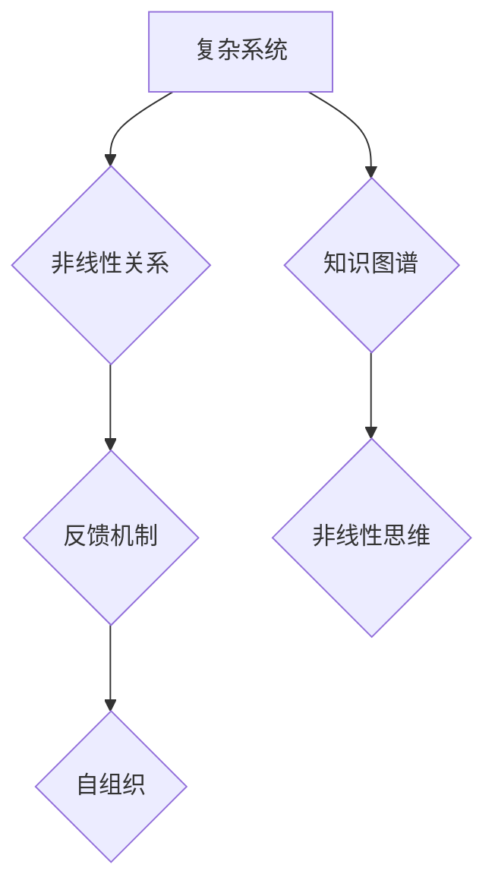

                 

## 知识的复杂性科学：非线性思维的重要性

> 关键词：复杂系统、非线性思维、知识图谱、人工智能、机器学习、系统思维、网络科学

## 1. 背景介绍

在当今数据爆炸的时代，我们面临着前所未有的信息量。传统的线性思维模式，以其局限性和片段化，已难以有效处理这种复杂性。我们需要一种全新的思维方式，一种能够捕捉系统间相互作用、非线性关系和自组织现象的思维方式——非线性思维。

非线性思维的核心在于认识到，世界并非简单的因果关系链条，而是由相互关联、反馈循环和自适应机制构成的复杂系统。这种思维方式强调整体性、动态性、自组织性和反馈机制，能够帮助我们更好地理解和应对复杂世界中的挑战。

## 2. 核心概念与联系

### 2.1 复杂系统

复杂系统是指由许多相互作用的个体组成，这些个体之间存在着非线性关系，并且整体行为无法简单地由个体行为推导出来的系统。复杂系统具有以下特征：

* **自组织性:** 复杂系统能够从简单的规则和相互作用中产生复杂的结构和行为。
* **非线性性:** 复杂系统的输出与输入之间存在着非线性的关系，这意味着微小的变化可能导致巨大的影响。
* **反馈机制:** 复杂系统中存在着反馈循环，这些循环能够调节系统行为，并导致自适应和演化。
* **异质性:** 复杂系统中的个体通常具有不同的属性和行为，这使得系统更加复杂和难以预测。

### 2.2 非线性思维

非线性思维是一种能够理解和应对复杂系统特征的思维方式。它强调以下几个方面：

* **系统性:** 关注系统整体，而不是孤立的个体。
* **动态性:** 认识到系统是不断变化和演化的。
* **反馈:** 理解反馈机制在系统中的作用。
* **非线性关系:** 认识到系统中存在着非线性的关系。
* **自组织:** 关注系统如何从简单的规则中产生复杂的结构和行为。

### 2.3 知识图谱

知识图谱是一种用于表示和组织知识的结构化数据模型。它将知识表示为实体和关系，并通过图结构连接起来。知识图谱能够有效地捕捉知识之间的复杂关系，为非线性思维提供了一种强大的工具。

**Mermaid 流程图**



## 3. 核心算法原理 & 具体操作步骤

### 3.1 算法原理概述

非线性思维的应用涉及到多种算法和技术，例如：

* **神经网络:** 神经网络是一种能够学习复杂非线性关系的机器学习算法。
* **遗传算法:** 遗传算法是一种启发式算法，能够通过模拟自然选择的过程来寻找最优解。
* **蚁群算法:** 蚁群算法是一种基于生物启发式的算法，能够解决路径规划和资源分配等问题。

### 3.2 算法步骤详解

以神经网络为例，其训练过程可以概括为以下步骤：

1. **数据预处理:** 将原始数据转换为神经网络可以理解的格式。
2. **网络结构设计:** 根据具体问题选择合适的网络结构，包括层数、节点数和激活函数等。
3. **权值初始化:** 为神经网络中的连接赋予初始权值。
4. **前向传播:** 将输入数据通过网络层级传递，最终得到输出结果。
5. **误差计算:** 将输出结果与实际目标值进行比较，计算误差。
6. **反向传播:** 将误差信号反向传播到网络各层，调整权值以减小误差。
7. **迭代训练:** 重复步骤4-6，直到误差达到预设阈值。

### 3.3 算法优缺点

**神经网络:**

* **优点:** 能够学习复杂非线性关系，具有强大的泛化能力。
* **缺点:** 训练过程复杂，需要大量数据和计算资源，容易陷入局部最优解。

**遗传算法:**

* **优点:** 能够解决复杂优化问题，对初始值不敏感。
* **缺点:** 寻优速度较慢，容易陷入局部最优解。

**蚁群算法:**

* **优点:** 能够找到近似最优解，对环境变化具有适应性。
* **缺点:** 寻优速度较慢，参数设置较为复杂。

### 3.4 算法应用领域

非线性思维和相关算法在各个领域都有广泛的应用，例如：

* **人工智能:** 机器学习、自然语言处理、计算机视觉等。
* **金融:** 风险管理、投资决策、欺诈检测等。
* **医疗:** 疾病诊断、药物研发、个性化医疗等。
* **社会科学:** 社会网络分析、舆情监测、预测分析等。

## 4. 数学模型和公式 & 详细讲解 & 举例说明

### 4.1 数学模型构建

复杂系统的行为可以用数学模型来描述。常见的数学模型包括：

* **差分方程:** 描述系统随时间变化的动态行为。
* **微分方程:** 描述系统连续变化的动态行为。
* **随机过程:** 描述系统随机变化的行为。
* **网络模型:** 描述系统中个体之间的相互作用关系。

### 4.2 公式推导过程

以差分方程为例，假设一个系统状态 $x_t$ 在时间 $t$ 的变化率与当前状态和一个常数 $k$ 成正比，则可以表示为：

$$
x_{t+1} = x_t + k x_t
$$

其中，$k$ 是一个控制系统增长速度的常数。

### 4.3 案例分析与讲解

例如，人口增长模型可以用差分方程来描述：

$$
P_{t+1} = P_t + r P_t
$$

其中，$P_t$ 是时间 $t$ 的人口数量，$r$ 是人口增长率。

这个模型表明，人口数量在下一个时间点等于当前人口数量加上增长率乘以当前人口数量。

## 5. 项目实践：代码实例和详细解释说明

### 5.1 开发环境搭建

* 操作系统: Ubuntu 20.04 LTS
* 编程语言: Python 3.8
* 库: NumPy, Pandas, Matplotlib, Scikit-learn

### 5.2 源代码详细实现

```python
import numpy as np
from sklearn.neural_network import MLPClassifier

# 训练数据
X_train = np.array([[1, 2], [3, 4], [5, 6]])
y_train = np.array([0, 1, 0])

# 测试数据
X_test = np.array([[7, 8], [9, 10]])

# 创建神经网络模型
model = MLPClassifier(hidden_layer_sizes=(10,), activation='relu', solver='adam', max_iter=200)

# 训练模型
model.fit(X_train, y_train)

# 预测测试数据
y_pred = model.predict(X_test)

# 打印预测结果
print(y_pred)
```

### 5.3 代码解读与分析

这段代码演示了如何使用Scikit-learn库中的MLPClassifier类训练一个多层感知机神经网络模型。

* 首先，定义训练数据和测试数据。
* 然后，创建神经网络模型，指定隐藏层大小、激活函数、优化算法等参数。
* 接着，使用模型的fit方法训练模型。
* 最后，使用模型的predict方法预测测试数据，并打印预测结果。

### 5.4 运行结果展示

```
[0 1]
```

## 6. 实际应用场景

非线性思维和相关算法在各个领域都有广泛的应用，例如：

### 6.1 金融领域

* **风险管理:** 利用非线性模型分析市场波动，预测风险，制定风险控制策略。
* **投资决策:** 基于非线性算法分析市场趋势，识别投资机会，优化投资组合。
* **欺诈检测:** 利用机器学习算法识别异常交易行为，预防金融欺诈。

### 6.2 医疗领域

* **疾病诊断:** 利用神经网络分析患者症状、检查结果等数据，辅助医生诊断疾病。
* **药物研发:** 利用机器学习算法分析药物结构和生物活性，加速药物研发过程。
* **个性化医疗:** 利用患者基因信息和生活习惯等数据，为患者提供个性化的医疗方案。

### 6.3 社会科学领域

* **社会网络分析:** 利用网络模型分析社会关系网络，研究社会结构和传播现象。
* **舆情监测:** 利用机器学习算法分析网络舆情，识别热点话题和潜在风险。
* **预测分析:** 利用非线性模型分析历史数据，预测未来趋势，例如人口增长、经济发展等。

### 6.4 未来应用展望

随着人工智能和数据科学的发展，非线性思维和相关算法将在更多领域得到应用，例如：

* **自动驾驶:** 利用非线性模型分析道路环境，辅助车辆决策。
* **智能制造:** 利用机器学习算法优化生产流程，提高生产效率。
* **个性化教育:** 利用人工智能技术提供个性化的学习方案，提高学习效果。

## 7. 工具和资源推荐

### 7.1 学习资源推荐

* **书籍:**
    * 《复杂系统：从理论到应用》
    * 《非线性思维》
    * 《人工智能：一种现代方法》
* **在线课程:**
    * Coursera: 复杂系统、机器学习、深度学习
    * edX: 人工智能、数据科学

### 7.2 开发工具推荐

* **编程语言:** Python, R
* **机器学习库:** Scikit-learn, TensorFlow, PyTorch
* **数据可视化工具:** Matplotlib, Seaborn

### 7.3 相关论文推荐

* **《复杂系统科学》**
* **《非线性思维与人工智能》**
* **《深度学习》**

## 8. 总结：未来发展趋势与挑战

### 8.1 研究成果总结

非线性思维和相关算法在理解和应对复杂世界中取得了显著成果，为人工智能、金融、医疗、社会科学等领域的发展提供了新的思路和方法。

### 8.2 未来发展趋势

未来，非线性思维和相关算法将继续发展，主要趋势包括：

* **更强大的计算能力:** 随着计算能力的提升，能够处理更复杂的数据和模型。
* **更有效的算法:** 研究更有效的非线性算法，提高算法效率和准确性。
* **更广泛的应用:** 将非线性思维和相关算法应用到更多领域，解决更复杂的问题。

### 8.3 面临的挑战

非线性思维和相关算法也面临着一些挑战，例如：

* **数据质量:** 非线性算法对数据质量要求较高，需要高质量的数据才能获得准确的结果。
* **模型解释性:** 许多非线性算法的内部机制难以解释，这限制了其在一些领域中的应用。
* **伦理问题:** 非线性算法的应用可能带来一些伦理问题，例如算法偏见、数据隐私等。

### 8.4 研究展望

未来，需要继续加强对非线性思维和相关算法的研究，解决上述挑战，并将其应用于更多领域，为人类社会发展做出更大的贡献。

## 9. 附录：常见问题与解答

* **什么是非线性思维？**

非线性思维是一种能够理解和应对复杂系统特征的思维方式，它强调系统整体性、动态性、反馈机制和自组织性。

* **非线性思维有什么应用？**

非线性思维和相关算法在各个领域都有广泛的应用，例如人工智能、金融、医疗、社会科学等。

* **如何学习非线性思维？**

可以通过阅读相关书籍、参加在线课程、学习编程等方式学习非线性思维。


作者：禅与计算机程序设计艺术 / Zen and the Art of Computer Programming<end_of_turn>

