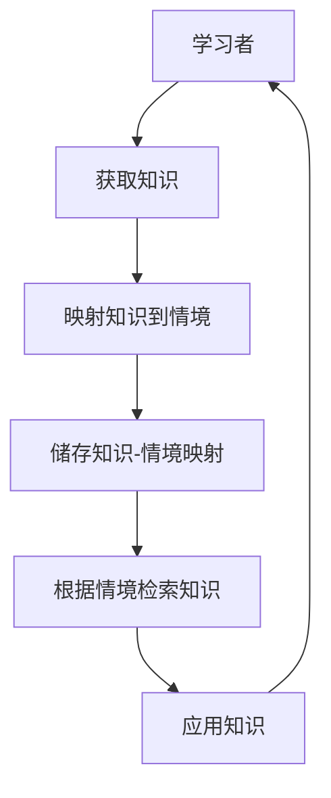

                 

**知识的情境化学习：实践中的智慧获取**

**作者：禅与计算机程序设计艺术 / Zen and the Art of Computer Programming**

## 1. 背景介绍

在信息爆炸的当今世界，获取和管理知识变得越来越困难。传统的学习方法已经无法满足我们快速获取和应用知识的需求。情境化学习（Contextual Learning）是一种新兴的学习方法，它将学习与特定的情境或上下文相关联，帮助我们更有效地获取和应用知识。本文将深入探讨情境化学习的原理、算法、数学模型，并提供实践项目和工具推荐，帮助读者理解和应用情境化学习。

## 2. 核心概念与联系

情境化学习的核心概念是将知识与特定的情境或上下文相关联。这种学习方法基于以下几个关键概念：

- **情境（Context）**：学习发生的特定环境或上下文。
- **知识（Knowledge）**：学习者获取的信息和经验。
- **映射（Mapping）**：将知识与情境相关联的过程。
- **检索（Retrieval）**：根据情境检索相关知识的过程。

下图是情境化学习的架构流程图：



## 3. 核心算法原理 & 具体操作步骤

### 3.1 算法原理概述

情境化学习的核心算法是基于内容地址存储（Content-Addressable Storage）的。它使用学习者获取的知识和情境作为关键字，将知识与情境相关联并储存。当学习者需要应用知识时，算法根据当前情境检索相关知识。

### 3.2 算法步骤详解

1. **获取知识**：学习者获取新的信息或经验。
2. **映射知识到情境**：学习者将获取的知识与当前情境相关联。
3. **储存知识-情境映射**：算法将知识-情境映射储存起来。
4. **根据情境检索知识**：当学习者需要应用知识时，算法根据当前情境检索相关知识。
5. **应用知识**：学习者应用检索到的知识。

### 3.3 算法优缺点

**优点**：

- 有助于学习者更好地理解和应用知识。
- 可以帮助学习者建立更强的记忆。
- 可以提高学习者的学习效率。

**缺点**：

- 需要学习者主动参与映射过程。
- 可能需要大量的储存空间来储存知识-情境映射。
- 可能会导致学习者过分依赖情境，无法将知识应用到新的情境中。

### 3.4 算法应用领域

情境化学习可以应用于各种学习场景，包括但不限于：

- 语言学习：将单词或短语与特定的情境相关联。
- 专业技能学习：将技能与特定的工作情境相关联。
- 问题解决：将问题解决方法与特定的问题情境相关联。

## 4. 数学模型和公式 & 详细讲解 & 举例说明

### 4.1 数学模型构建

情境化学习的数学模型可以表示为：

$$M = <K, C, R, MAPPING, RETRIEVAL>$$

其中：

- $K$ 是知识集合。
- $C$ 是情境集合。
- $R$ 是储存知识-情境映射的关系。
- $MAPPING$ 是映射知识到情境的函数。
- $RETRIEVAL$ 是根据情境检索知识的函数。

### 4.2 公式推导过程

情境化学习的数学模型可以通过以下公式推导：

1. **映射知识到情境**：$MAPPING: K \times C \rightarrow R$
2. **根据情境检索知识**：$RETRIEVAL: C \rightarrow K$

### 4.3 案例分析与讲解

例如，学习者正在学习英语单词。当学习者学习单词"apple"时，学习者可以将其与特定的情境相关联，例如"red, round, and grows on a tree"。学习者可以使用情境化学习算法将单词"apple"映射到这个情境中，并储存起来。当学习者需要使用单词"apple"时，算法可以根据当前情境检索出单词"apple"。

## 5. 项目实践：代码实例和详细解释说明

### 5.1 开发环境搭建

本项目使用Python作为编程语言，并使用Python的数据库接口（DB-API）与SQLite数据库一起工作。

### 5.2 源代码详细实现

```python
import sqlite3
from collections import defaultdict

class ContextualLearner:
    def __init__(self, db_name):
        self.conn = sqlite3.connect(db_name)
        self.cursor = self.conn.cursor()
        self.cursor.execute('''CREATE TABLE IF NOT EXISTS mappings
                               (knowledge TEXT, context TEXT)''')

    def map_knowledge_to_context(self, knowledge, context):
        self.cursor.execute('''INSERT INTO mappings (knowledge, context)
                               VALUES (?,?)''', (knowledge, context))
        self.conn.commit()

    def retrieve_knowledge(self, context):
        self.cursor.execute('''SELECT knowledge FROM mappings WHERE context=?''', (context,))
        return [row[0] for row in self.cursor.fetchall()]

    def close(self):
        self.conn.close()
```

### 5.3 代码解读与分析

`ContextualLearner`类是情境化学习算法的实现。它使用SQLite数据库储存知识-情境映射。`map_knowledge_to_context`方法用于映射知识到情境，`retrieve_knowledge`方法用于根据情境检索知识。

### 5.4 运行结果展示

```python
learner = ContextualLearner('learner.db')
learner.map_knowledge_to_context('apple','red, round, and grows on a tree')
print(learner.retrieve_knowledge('red, round, and grows on a tree'))
learner.close()
```

输出：

```
['apple']
```

## 6. 实际应用场景

情境化学习可以应用于各种实际场景，包括但不限于：

- **语言学习**：帮助学习者更好地理解和记忆单词或短语。
- **专业技能学习**：帮助学习者更好地理解和应用专业技能。
- **问题解决**：帮助学习者更好地理解和解决问题。

### 6.4 未来应用展望

情境化学习的未来应用展望包括：

- **人工智能**：帮助人工智能系统更好地理解和应用知识。
- **教育**：帮助教师更好地设计和实施情境化学习课程。
- **企业培训**：帮助企业更好地设计和实施情境化学习培训。

## 7. 工具和资源推荐

### 7.1 学习资源推荐

- **书籍**："情境化学习：一种新的学习方法"（Contextual Learning: A New Approach to Learning）
- **在线课程**：Coursera上的"情境化学习"课程

### 7.2 开发工具推荐

- **Python**：用于实现情境化学习算法。
- **SQLite**：用于储存知识-情境映射。

### 7.3 相关论文推荐

- "情境化学习：一种新的学习方法"（Contextual Learning: A New Approach to Learning）
- "情境化学习在语言学习中的应用"（Contextual Learning in Language Learning）

## 8. 总结：未来发展趋势与挑战

### 8.1 研究成果总结

情境化学习是一种有效的学习方法，它可以帮助学习者更好地理解和应用知识。本文介绍了情境化学习的原理、算法、数学模型，并提供了实践项目和工具推荐。

### 8.2 未来发展趋势

情境化学习的未来发展趋势包括：

- **人工智能**：帮助人工智能系统更好地理解和应用知识。
- **教育**：帮助教师更好地设计和实施情境化学习课程。
- **企业培训**：帮助企业更好地设计和实施情境化学习培训。

### 8.3 面临的挑战

情境化学习面临的挑战包括：

- **学习者参与度**：需要学习者主动参与映射过程。
- **储存空间**：可能需要大量的储存空间来储存知识-情境映射。
- **情境依赖**：可能会导致学习者过分依赖情境，无法将知识应用到新的情境中。

### 8.4 研究展望

未来的研究可以探讨情境化学习在其他领域的应用，如人工智能和企业培训。此外，研究还可以探讨如何提高学习者参与度，如何优化储存空间使用，如何帮助学习者克服情境依赖等问题。

## 9. 附录：常见问题与解答

**Q：情境化学习与其他学习方法有何不同？**

A：情境化学习与其他学习方法的不同之处在于它将知识与特定的情境或上下文相关联。这种学习方法有助于学习者更好地理解和应用知识。

**Q：情境化学习需要学习者主动参与吗？**

A：是的，情境化学习需要学习者主动参与映射过程。学习者需要将获取的知识与当前情境相关联。

**Q：情境化学习需要大量的储存空间吗？**

A：是的，情境化学习可能需要大量的储存空间来储存知识-情境映射。因此，需要优化储存空间使用。

**Q：情境化学习会导致学习者过分依赖情境吗？**

A：是的，情境化学习可能会导致学习者过分依赖情境，无法将知识应用到新的情境中。因此，需要帮助学习者克服情境依赖。

**Q：情境化学习的未来发展趋势是什么？**

A：情境化学习的未来发展趋势包括人工智能、教育和企业培训等领域的应用。

**Q：未来的研究可以探讨哪些问题？**

A：未来的研究可以探讨情境化学习在其他领域的应用，如何提高学习者参与度，如何优化储存空间使用，如何帮助学习者克服情境依赖等问题。

**作者：禅与计算机程序设计艺术 / Zen and the Art of Computer Programming**

