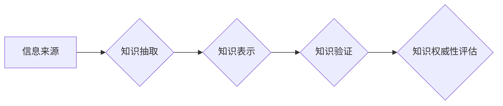

                 

## 知识的权威性：如何辨别真伪

> 关键词：人工智能、知识图谱、知识验证、真伪判断、数据可靠性

## 1. 背景介绍

在信息爆炸的时代，我们每天都被海量的信息淹没。从新闻报道到社交媒体，从学术论文到在线论坛，各种信息源源不断地涌入我们的视野。然而，这些信息并非都可靠，许多信息存在着虚假、误导或偏颇的可能性。如何辨别真伪，获取可靠的知识，已成为当今社会面临的重要挑战。

人工智能技术的快速发展为解决这一问题提供了新的思路。人工智能算法能够从海量数据中学习模式，识别异常和潜在的虚假信息。知识图谱技术则可以构建知识网络，将不同信息点连接起来，帮助我们更好地理解和验证信息。

## 2. 核心概念与联系

**2.1 知识图谱**

知识图谱是一种数据结构，它以实体和关系为基本单元，将知识表示为一个网络结构。实体代表现实世界中的事物，关系则描述实体之间的联系。例如，在知识图谱中，“张三”是一个实体，“是”是关系，“中国公民”也是一个实体。我们可以构建出如下的知识三元组：

(张三, 是, 中国公民)

知识图谱能够有效地存储、组织和检索知识，并支持复杂的知识推理和查询。

**2.2 知识验证**

知识验证是指通过多种手段对知识的真实性、准确性和完整性进行评估的过程。它涉及到多个方面，包括：

* **数据来源的可靠性:** 评估信息来源的信誉度和可信度。
* **信息内容的逻辑一致性:** 检查信息是否符合已知事实和知识规律。
* **信息内容的客观性和中立性:** 识别信息中的潜在偏见和误导性。

**2.3 核心概念联系**

知识图谱和知识验证相互关联，可以协同作用以提高知识的权威性。

* 知识图谱可以提供一个结构化的知识框架，帮助我们更好地理解和组织信息。
* 知识验证算法可以利用知识图谱中的知识关系进行推理和验证，提高对信息的判断准确性。

**Mermaid 流程图**



## 3. 核心算法原理 & 具体操作步骤

**3.1 算法原理概述**

知识验证算法通常基于以下原理：

* **逻辑推理:** 利用知识图谱中的知识关系进行逻辑推理，判断信息是否符合已知事实。
* **统计分析:** 分析信息在不同来源中的出现频率和分布，识别潜在的虚假信息。
* **机器学习:** 利用机器学习模型对已知真假信息的特征进行学习，识别新的信息是否可信。

**3.2 算法步骤详解**

1. **信息收集:** 从各种信息源收集相关信息。
2. **知识抽取:** 利用自然语言处理技术从文本中提取实体和关系，构建知识三元组。
3. **知识表示:** 将提取的知识三元组存储在知识图谱中。
4. **知识验证:** 利用逻辑推理、统计分析或机器学习算法对信息进行验证。
5. **权威性评估:** 根据验证结果对信息的权威性进行评估，并给出相应的置信度分数。

**3.3 算法优缺点**

**优点:**

* 可以有效地识别虚假信息和误导性信息。
* 可以提高对信息的判断准确性。
* 可以帮助我们更好地理解和掌握知识。

**缺点:**

* 算法的准确性依赖于知识图谱的质量和完善程度。
* 算法可能无法识别所有类型的虚假信息，例如巧妙伪造的信息。
* 算法需要大量的训练数据和计算资源。

**3.4 算法应用领域**

* **新闻媒体:** 识别虚假新闻和谣言。
* **社交媒体:** 过滤垃圾信息和恶意内容。
* **学术研究:** 验证研究成果的可靠性。
* **医疗保健:** 识别医疗信息中的错误和误导。

## 4. 数学模型和公式 & 详细讲解 & 举例说明

**4.1 数学模型构建**

知识验证可以建模为一个分类问题，目标是判断信息是否真实。我们可以使用以下数学模型：

* **逻辑回归:** 

$$
P(y=1|x) = \frac{1}{1 + e^{-(w^T x + b)}}
$$

其中：

* $P(y=1|x)$ 是信息真实性的概率。
* $x$ 是信息的特征向量。
* $w$ 是权重向量。
* $b$ 是偏置项。

* **支持向量机:** 支持向量机是一种基于间隔最大化的分类算法，可以有效地解决高维数据分类问题。

**4.2 公式推导过程**

逻辑回归的公式推导过程基于最大似然估计，目标是找到最优的权重向量 $w$ 和偏置项 $b$，使得模型能够最大化真实信息的概率。

支持向量机的公式推导过程基于间隔最大化原理，目标是找到一个超平面，使得真实信息和虚假信息之间具有最大的间隔。

**4.3 案例分析与讲解**

假设我们想要验证一条新闻信息是否真实。我们可以提取新闻信息的特征，例如：

* 发布来源的信誉度
* 文章内容的逻辑一致性
* 文章内容中出现的关键词
* 文章内容的引用来源

将这些特征作为输入，输入到逻辑回归模型中，模型可以输出新闻信息的真实性概率。如果概率高于某个阈值，则认为该新闻信息是真实的。

## 5. 项目实践：代码实例和详细解释说明

**5.1 开发环境搭建**

* Python 3.x
* TensorFlow 或 PyTorch
* NLTK 或 spaCy

**5.2 源代码详细实现**

```python
import tensorflow as tf

# 定义模型结构
model = tf.keras.models.Sequential([
    tf.keras.layers.Embedding(input_dim=vocab_size, output_dim=embedding_dim),
    tf.keras.layers.LSTM(units=128),
    tf.keras.layers.Dense(units=1, activation='sigmoid')
])

# 编译模型
model.compile(optimizer='adam', loss='binary_crossentropy', metrics=['accuracy'])

# 训练模型
model.fit(x_train, y_train, epochs=10)

# 评估模型
loss, accuracy = model.evaluate(x_test, y_test)
print('Loss:', loss)
print('Accuracy:', accuracy)
```

**5.3 代码解读与分析**

* 该代码示例使用 TensorFlow 库构建了一个基于 LSTM 的文本分类模型。
* 模型输入是文本序列的嵌入向量，输出是真实性概率。
* 模型使用 Adam 优化器，损失函数为二元交叉熵，评价指标为准确率。

**5.4 运行结果展示**

训练完成后，我们可以使用模型对新的文本信息进行预测，并获得其真实性概率。

## 6. 实际应用场景

**6.1 新闻媒体**

* 识别虚假新闻和谣言，提高新闻的真实性和可靠性。
* 帮助用户辨别真伪，避免被虚假信息误导。

**6.2 社交媒体**

* 过滤垃圾信息和恶意内容，营造健康和谐的网络环境。
* 识别网络欺诈和身份盗窃行为，保护用户隐私和安全。

**6.3 学术研究**

* 验证研究成果的可靠性，提高学术研究的质量和信誉度。
* 识别学术抄袭和数据造假行为，维护学术道德。

**6.4 未来应用展望**

随着人工智能技术的不断发展，知识验证技术将得到更广泛的应用，例如：

* 在医疗保健领域，帮助医生识别虚假医疗信息，提高诊断准确性。
* 在法律领域，帮助律师识别虚假证据，提高案件的公正性。
* 在金融领域，帮助金融机构识别欺诈交易，降低金融风险。

## 7. 工具和资源推荐

**7.1 学习资源推荐**

* **Stanford CS224N: Natural Language Processing with Deep Learning:** https://web.stanford.edu/class/cs224n/
* **Deep Learning Specialization by Andrew Ng:** https://www.deeplearning.ai/

**7.2 开发工具推荐**

* **TensorFlow:** https://www.tensorflow.org/
* **PyTorch:** https://pytorch.org/

**7.3 相关论文推荐**

* **BERT: Pre-training of Deep Bidirectional Transformers for Language Understanding:** https://arxiv.org/abs/1810.04805
* **XLNet: Generalized Autoregressive Pretraining for Language Understanding:** https://arxiv.org/abs/1906.08237

## 8. 总结：未来发展趋势与挑战

**8.1 研究成果总结**

近年来，人工智能技术在知识验证领域取得了显著进展，例如：

* 自然语言处理技术的发展使得我们可以更有效地从文本中提取知识。
* 深度学习算法的应用提高了知识验证的准确性。
* 知识图谱技术为知识验证提供了新的思路和方法。

**8.2 未来发展趋势**

* **多模态知识验证:** 将文本、图像、音频等多种数据类型融合起来进行知识验证。
* **联邦学习:** 利用联邦学习技术，在不泄露原始数据的情况下进行知识验证。
* **可解释性:** 研究知识验证算法的可解释性，帮助用户理解算法的决策过程。

**8.3 面临的挑战**

* **数据质量:** 知识验证算法的准确性依赖于知识图谱的质量和完善程度。
* **对抗样本:** 恶意攻击者可能会生成对抗样本，欺骗知识验证算法。
* **伦理问题:** 知识验证技术可能会被用于审查和控制信息，需要谨慎考虑其伦理问题。

**8.4 研究展望**

未来，知识验证技术将继续朝着更智能、更可靠、更可解释的方向发展，为我们提供更准确、更可靠的知识。


## 9. 附录：常见问题与解答

**9.1 如何评估知识图谱的质量？**

知识图谱的质量可以从以下几个方面进行评估：

* **完整性:** 知识图谱是否包含了足够多的知识？
* **准确性:** 知识图谱中的信息是否准确？
* **一致性:** 知识图谱中的信息是否一致？
* **可维护性:** 知识图谱是否易于维护和更新？

**9.2 如何应对对抗样本？**

对抗样本是一种经过精心设计的数据，能够欺骗机器学习模型。应对对抗样本的方法包括：

* 使用更鲁棒的机器学习算法。
* 使用对抗训练技术，训练模型对对抗样本具有抵抗力。
* 使用知识图谱中的知识进行辅助验证，提高对对抗样本的识别能力。


作者：禅与计算机程序设计艺术 / Zen and the Art of Computer Programming 
<end_of_turn>

