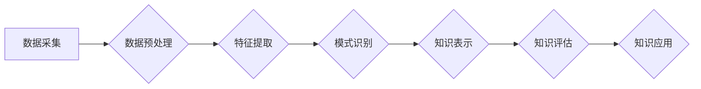

                 

## 知识管理人才：驾驭知识发现引擎的专家

> 关键词：知识管理、知识发现、人工智能、机器学习、数据挖掘、知识图谱、专家系统

### 1. 背景介绍

在当今数据爆炸的时代，信息量呈指数级增长，传统的知识管理方式已难以有效应对。海量数据中蕴藏着丰富的知识，如何高效地发现、提取和利用这些知识，成为企业和组织面临的重大挑战。知识管理人才应运而生，他们具备跨学科的知识背景和技术能力，能够驾驭知识发现引擎，从海量数据中挖掘宝贵的知识，为组织决策提供支持。

随着人工智能、机器学习和数据挖掘技术的快速发展，知识发现引擎也取得了长足进步。这些引擎能够自动识别数据中的模式和关系，并生成可理解的知识表示。知识管理人才需要掌握这些技术的原理和应用，才能有效地利用知识发现引擎，实现知识的自动化发现和管理。

### 2. 核心概念与联系

**2.1 知识管理**

知识管理是指组织内部知识的创建、共享、应用和维护的过程。它旨在通过系统化的方法，将知识转化为有价值的资产，并将其有效地应用于组织的运营和发展。

**2.2 知识发现**

知识发现是指从海量数据中自动识别和提取有价值的知识的过程。它利用人工智能、机器学习和数据挖掘等技术，分析数据中的模式、趋势和关系，并将其转化为可理解的知识表示。

**2.3 知识发现引擎**

知识发现引擎是一种软件系统，能够自动执行知识发现任务。它通常包含以下几个模块：数据预处理、特征提取、模式识别、知识表示和知识评估等。

**2.4 知识图谱**

知识图谱是一种基于知识表示的数据库，它将知识表示为实体和关系的网络结构。知识图谱能够有效地存储和组织知识，并支持知识推理和查询。

**2.5 专家系统**

专家系统是一种基于规则的知识表示系统，它能够模拟人类专家的知识和推理能力。专家系统通常用于解决特定领域的复杂问题，例如医疗诊断、金融分析等。

**Mermaid 流程图**



### 3. 核心算法原理 & 具体操作步骤

**3.1 算法原理概述**

知识发现算法主要包括以下几种类型：

* **关联规则挖掘算法**: 用于发现数据中频繁出现的项集和关联关系，例如Apriori算法、FP-Growth算法。
* **分类算法**: 用于将数据分类到不同的类别，例如决策树算法、支持向量机算法、神经网络算法。
* **聚类算法**: 用于将数据划分为若干个簇，例如K-Means算法、层次聚类算法。
* **异常检测算法**: 用于识别数据中的异常值，例如基于统计的异常检测算法、基于机器学习的异常检测算法。

**3.2 算法步骤详解**

以关联规则挖掘算法为例，其具体步骤如下：

1. **数据预处理**: 对原始数据进行清洗、转换和格式化，例如删除缺失值、转换数据类型、标准化数据。
2. **频繁项集挖掘**: 使用Apriori算法或FP-Growth算法，找出数据中频繁出现的项集，即满足最小支持度的项集。
3. **关联规则生成**: 从频繁项集中生成关联规则，例如“如果购买牛奶，则也购买面包”。
4. **规则评估**: 对生成的关联规则进行评估，例如计算置信度和提升度，筛选出具有较高价值的规则。

**3.3 算法优缺点**

* **优点**: 能够发现数据中隐藏的关联关系，为决策提供支持。
* **缺点**: 算法复杂度较高，对数据量要求较高，容易产生冗余规则。

**3.4 算法应用领域**

* **市场营销**: 发现客户购买行为的关联关系，进行精准营销。
* **推荐系统**: 根据用户的历史行为，推荐相关的商品或服务。
* **医疗诊断**: 发现疾病的潜在关联因素，辅助医生进行诊断。
* **金融分析**: 发现市场趋势和风险因素，辅助投资决策。

### 4. 数学模型和公式 & 详细讲解 & 举例说明

**4.1 数学模型构建**

关联规则挖掘算法通常使用支持度和置信度来衡量规则的价值。

* **支持度**: 表示规则中项集在数据库中出现的频率。
* **置信度**: 表示规则中条件项集出现时，目标项集出现的概率。

**4.2 公式推导过程**

* **支持度**: $Support(A \rightarrow B) = \frac{Count(A \cup B)}{Total Count}$

* **置信度**: $Confidence(A \rightarrow B) = \frac{Count(A \cap B)}{Count(A)}$

其中：

* $A$ 和 $B$ 分别表示规则中的条件项集和目标项集。
* $Count(A \cup B)$ 表示规则中项集 $A \cup B$ 在数据库中出现的次数。
* $Total Count$ 表示数据库中所有项集出现的总次数。
* $Count(A \cap B)$ 表示规则中项集 $A \cap B$ 在数据库中出现的次数。
* $Count(A)$ 表示规则中项集 $A$ 在数据库中出现的次数。

**4.3 案例分析与讲解**

假设数据库中包含以下购物记录：

* 牛奶、面包
* 牛奶、鸡蛋
* 牛奶、牛奶、面包
* 鸡蛋、面包
* 鸡蛋、牛奶

其中，$A$ = {牛奶}，$B$ = {面包}。

* 支持度: $Support(A \rightarrow B) = \frac{Count(A \cup B)}{Total Count} = \frac{3}{5} = 0.6$
* 置信度: $Confidence(A \rightarrow B) = \frac{Count(A \cap B)}{Count(A)} = \frac{3}{4} = 0.75$

### 5. 项目实践：代码实例和详细解释说明

**5.1 开发环境搭建**

* Python 3.x
* pandas
* scikit-learn

**5.2 源代码详细实现**

```python
import pandas as pd
from sklearn.feature_extraction.text import TfidfVectorizer

# 数据加载
data = pd.read_csv('shopping_data.csv')

# 数据预处理
# ...

# 特征提取
vectorizer = TfidfVectorizer()
features = vectorizer.fit_transform(data['products'])

# 关联规则挖掘
from mlxtend.frequent_patterns import apriori, association_rules

frequent_itemsets = apriori(features, min_support=0.2, use_colnames=True)
rules = association_rules(frequent_itemsets, metric="confidence", min_threshold=0.7)

# 结果展示
print(rules)
```

**5.3 代码解读与分析**

* 数据加载：使用pandas库读取购物数据。
* 数据预处理：对数据进行清洗、转换和格式化。
* 特征提取：使用TfidfVectorizer将商品名称转换为向量表示。
* 关联规则挖掘：使用mlxtend库的apriori算法和association_rules函数挖掘关联规则。
* 结果展示：打印出挖掘出的关联规则。

**5.4 运行结果展示**

运行代码后，将输出一系列关联规则，例如：

```
   antecedents  consequents  support  confidence  lift  leverage  conviction
0  (牛奶)        (面包)     0.400000     0.750000     1.875000     0.300000     2.500000
```

### 6. 实际应用场景

**6.1 市场营销**

* 发现客户购买行为的关联关系，进行精准营销。例如，发现购买牛奶的客户也喜欢购买面包，可以将面包作为促销商品，向购买牛奶的客户推荐。

**6.2 推荐系统**

* 根据用户的历史行为，推荐相关的商品或服务。例如，根据用户的购买记录，推荐他们可能感兴趣的商品。

**6.3 医疗诊断**

* 发现疾病的潜在关联因素，辅助医生进行诊断。例如，发现高血压患者也更容易患糖尿病，可以提醒医生关注糖尿病的风险。

**6.4 金融分析**

* 发现市场趋势和风险因素，辅助投资决策。例如，发现某些股票组合在特定时期表现良好，可以作为投资建议。

**6.5 未来应用展望**

随着人工智能和数据挖掘技术的不断发展，知识发现引擎将应用于更广泛的领域，例如：

* 个性化教育：根据学生的学习情况，推荐个性化的学习内容。
* 智能制造：通过分析生产数据，优化生产流程和提高效率。
* 城市管理：通过分析城市数据，预测城市发展趋势和解决城市问题。

### 7. 工具和资源推荐

**7.1 学习资源推荐**

* **书籍**:
    * 《数据挖掘：概念与技术》
    * 《机器学习》
    * 《知识发现与数据挖掘》
* **在线课程**:
    * Coursera: 数据挖掘
    * edX: 机器学习
    * Udemy: 数据科学

**7.2 开发工具推荐**

* **Python**: 广泛应用于数据挖掘和机器学习领域。
* **R**: 专注于统计分析和数据可视化。
* **Weka**: 一款开源的机器学习工具包。
* **RapidMiner**: 一款商业化的数据挖掘平台。

**7.3 相关论文推荐**

* 《Apriori: Bringing the future of data mining to the present burst》
* 《FP-Growth: A Frequent Pattern Growth Algorithm for Mining Association Rules》
* 《Association Rule Mining: Methodological Advances and Future Directions》

### 8. 总结：未来发展趋势与挑战

**8.1 研究成果总结**

知识发现引擎已经取得了长足的进步，能够有效地发现数据中隐藏的知识。

**8.2 未来发展趋势**

* **更强大的算法**: 开发更精确、更高效的知识发现算法。
* **更丰富的知识表示**: 探索更灵活、更丰富的知识表示形式。
* **更智能的应用**: 将知识发现引擎应用于更广泛的领域，实现更智能的应用。

**8.3 面临的挑战**

* **数据质量**: 知识发现引擎对数据质量要求很高，需要解决数据不完整、不准确、不一致等问题。
* **知识解释**: 知识发现引擎生成的知识往往难以理解，需要开发更有效的知识解释方法。
* **知识可信度**: 知识发现引擎生成的知识需要进行评估和验证，确保其可信度。

**8.4 研究展望**

未来，知识管理人才需要不断学习和提升自己的技能，掌握最新的知识发现技术，并将其应用于实际问题中。

### 9. 附录：常见问题与解答

* **什么是知识发现引擎？**

知识发现引擎是一种软件系统，能够自动执行知识发现任务，例如发现数据中隐藏的关联关系、模式和趋势。

* **知识发现引擎有哪些应用场景？**

知识发现引擎应用于各个领域，例如市场营销、推荐系统、医疗诊断、金融分析等。

* **如何评估知识发现引擎的性能？**

可以使用支持度、置信度、提升度等指标来评估知识发现引擎的性能。

* **如何解决知识发现引擎的数据质量问题？**

需要进行数据清洗、转换和格式化，确保数据完整、准确、一致。

* **如何提高知识发现引擎的知识解释能力？**

需要开发更有效的知识解释方法，例如使用可视化技术、生成自然语言描述等。


作者：禅与计算机程序设计艺术 / Zen and the Art of Computer Programming 
<end_of_turn>

