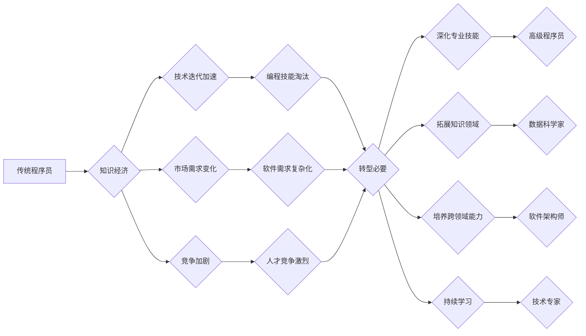

                 

## 知识经济下程序员的职业转型策略与方向

> 关键词：知识经济、程序员转型、职业发展、技术趋势、人工智能、数据科学、云计算、软件架构、持续学习

### 1. 背景介绍

随着全球经济结构的不断调整，知识经济逐渐成为主导力量。在知识经济时代，知识、技术和创新成为重要的生产要素，对人才的需求也发生了深刻变化。程序员作为软件开发的核心力量，在知识经济中扮演着越来越重要的角色。然而，随着技术的快速发展和市场竞争的加剧，程序员面临着前所未有的职业转型压力。

传统程序员的工作内容主要集中在代码编写、软件测试和维护等方面。但随着人工智能、云计算、大数据等新兴技术的兴起，程序员的技能需求也发生了转变。传统的编程技能不再是唯一的优势，程序员需要具备更广泛的知识和技能，才能在知识经济中保持竞争力。

### 2. 核心概念与联系

**2.1 知识经济的本质**

知识经济是指以知识、信息和技术为主要生产要素的经济形态。其核心特征是：

* **知识是核心生产要素：** 知识的创造、传播和应用成为经济增长的主要动力。
* **信息技术是基础设施：** 信息技术为知识的获取、处理和应用提供了基础支撑。
* **创新是关键驱动力：** 知识经济强调创新，不断开发新的知识、技术和产品。

**2.2 程序员在知识经济中的角色**

在知识经济中，程序员的角色发生了转变，不再仅仅是代码编写者，而是：

* **技术创新者：** 参与新技术的研究开发，推动软件行业的创新发展。
* **数据分析师：** 利用数据分析技术，挖掘数据中的价值，为企业决策提供支持。
* **系统架构师：** 设计和构建复杂软件系统，满足企业对软件的需求。
* **产品经理：** 结合用户需求和市场趋势，定义软件产品的功能和方向。

**2.3 程序员职业转型的必要性**

随着技术的不断发展和市场竞争的加剧，程序员需要不断学习和提升自己的技能，才能适应新的工作环境和需求。

* **技术迭代速度加快：** 新技术不断涌现，传统的编程技能很快就会被淘汰。
* **市场需求变化：** 企业对软件的需求越来越复杂，需要程序员具备更广泛的技能。
* **竞争加剧：** 程序员的竞争越来越激烈，需要不断提升自己的竞争力。

**2.4 转型方向与策略**

程序员职业转型需要根据自身情况和市场需求选择合适的方向和策略。

* **深化专业技能：** 掌握更先进的编程语言、框架和工具，提升代码编写和软件开发能力。
* **拓展知识领域：** 学习数据科学、人工智能、云计算等新兴技术，拓宽职业发展空间。
* **培养跨领域能力：** 提升沟通、协作、项目管理等跨领域能力，适应团队合作和项目管理的需求。
* **持续学习：** 保持对新技术的关注和学习，不断提升自己的竞争力。

**2.5 Mermaid 流程图**



### 3. 核心算法原理 & 具体操作步骤

**3.1 算法原理概述**

在知识经济时代，程序员需要掌握各种算法和数据结构，才能高效地解决问题。例如，排序算法、搜索算法、图算法等都是程序员常用的算法。

**3.2 算法步骤详解**

以排序算法为例，常见的排序算法包括冒泡排序、插入排序、快速排序、归并排序等。

* **冒泡排序：** 比较相邻的两个元素，如果顺序错误则交换位置，重复此过程直到整个数组有序。
* **插入排序：** 将数组中的每个元素插入到已经排序的部分中，直到整个数组有序。
* **快速排序：** 选择一个元素作为基准，将小于基准的元素放在左边，大于基准的元素放在右边，递归地对左右子数组进行排序。
* **归并排序：** 将数组分成两半，递归地对两半进行排序，然后将两半有序的数组合并成一个有序数组。

**3.3 算法优缺点**

不同的排序算法具有不同的时间复杂度和空间复杂度。

* **冒泡排序：** 时间复杂度为 O(n^2)，空间复杂度为 O(1)。简单易懂，但效率较低。
* **插入排序：** 时间复杂度为 O(n^2)，空间复杂度为 O(1)。适用于小规模数组，效率较低。
* **快速排序：** 平均时间复杂度为 O(n log n)，空间复杂度为 O(log n)。效率较高，但最坏情况时间复杂度为 O(n^2)。
* **归并排序：** 时间复杂度为 O(n log n)，空间复杂度为 O(n)。效率较高，稳定性好。

**3.4 算法应用领域**

排序算法广泛应用于各种领域，例如：

* **数据库管理：** 用于对数据进行排序，提高查询效率。
* **搜索引擎：** 用于对网页进行排序，提高搜索结果的 relevance。
* **图像处理：** 用于对图像进行排序，例如根据颜色或大小进行排序。
* **机器学习：** 用于对数据进行排序，例如对训练数据进行排序，提高模型的训练效率。

### 4. 数学模型和公式 & 详细讲解 & 举例说明

**4.1 数学模型构建**

在知识经济时代，程序员需要掌握一些数学模型，例如线性回归模型、逻辑回归模型、决策树模型等。这些模型可以帮助程序员分析数据、预测趋势、做出决策。

**4.2 公式推导过程**

以线性回归模型为例，其目标是找到一条直线，使得这条直线与数据点之间的距离最小。

线性回归模型的公式为：

$$y = mx + c$$

其中：

* $y$ 是预测值
* $x$ 是输入值
* $m$ 是斜率
* $c$ 是截距

**4.3 案例分析与讲解**

假设我们有一组数据，记录了房屋面积和房屋价格的关系。我们可以使用线性回归模型来预测房屋价格。

* 输入值 $x$ 为房屋面积
* 输出值 $y$ 为房屋价格

通过对数据进行拟合，我们可以得到线性回归模型的方程。然后，我们可以使用这个方程来预测其他房屋的价格。

### 5. 项目实践：代码实例和详细解释说明

**5.1 开发环境搭建**

程序员需要选择合适的开发环境，例如：

* **操作系统：** Windows、macOS、Linux
* **编程语言：** Python、Java、C++
* **IDE：** Eclipse、IntelliJ IDEA、Visual Studio Code

**5.2 源代码详细实现**

以Python为例，我们可以使用Scikit-Learn库来实现线性回归模型。

```python
from sklearn.linear_model import LinearRegression
from sklearn.model_selection import train_test_split
import numpy as np

# 生成示例数据
np.random.seed(0)
X = np.random.rand(100, 1) * 100
y = 2 * X + 1 + np.random.randn(100, 1)

# 将数据分成训练集和测试集
X_train, X_test, y_train, y_test = train_test_split(X, y, test_size=0.2)

# 创建线性回归模型
model = LinearRegression()

# 训练模型
model.fit(X_train, y_train)

# 预测测试集数据
y_pred = model.predict(X_test)

# 评估模型性能
from sklearn.metrics import mean_squared_error
mse = mean_squared_error(y_test, y_pred)
print(f"Mean Squared Error: {mse}")
```

**5.3 代码解读与分析**

这段代码首先生成了一些示例数据，然后将数据分成训练集和测试集。接着，创建了一个线性回归模型，并使用训练集数据训练模型。最后，使用测试集数据预测结果，并评估模型的性能。

**5.4 运行结果展示**

运行这段代码后，会输出模型的平均平方误差（MSE）值。MSE值越小，模型的预测性能越好。

### 6. 实际应用场景

**6.1 数据分析与挖掘**

程序员可以利用数据分析和挖掘技术，从海量数据中提取有价值的信息，为企业决策提供支持。例如，电商平台可以利用用户购买数据，分析用户行为，推荐个性化商品。

**6.2 机器学习与人工智能**

程序员可以利用机器学习和人工智能技术，开发智能应用，例如语音识别、图像识别、自然语言处理等。这些应用可以提高效率，改善用户体验。

**6.3 云计算与大数据**

程序员可以利用云计算和大数据技术，构建大规模分布式系统，处理海量数据，满足企业对计算资源和存储资源的需求。

**6.4 未来应用展望**

随着技术的不断发展，程序员的职业发展空间将更加广阔。例如，量子计算、区块链技术等新兴技术将为程序员带来新的机遇。

### 7. 工具和资源推荐

**7.1 学习资源推荐**

* **在线课程平台：** Coursera、edX、Udacity
* **编程书籍：** 《Python编程：从入门到实践》、《Java编程思想》
* **技术博客：** Hacker News、Medium、Stack Overflow

**7.2 开发工具推荐**

* **版本控制系统：** Git
* **代码编辑器：** Visual Studio Code、Sublime Text
* **云平台：** AWS、Azure、GCP

**7.3 相关论文推荐**

* **深度学习：** 《ImageNet Classification with Deep Convolutional Neural Networks》
* **自然语言处理：** 《Attention Is All You Need》
* **云计算：** 《The Cloud Computing Paradigm》

### 8. 总结：未来发展趋势与挑战

**8.1 研究成果总结**

在知识经济时代，程序员的职业转型已经成为必然趋势。通过学习新技术、拓展知识领域、培养跨领域能力、持续学习，程序员可以适应新的工作环境和需求，保持竞争力。

**8.2 未来发展趋势**

未来，程序员的职业发展将更加多元化，更加注重跨学科融合。例如，程序员需要具备数据分析、人工智能、云计算等方面的知识和技能。

**8.3 面临的挑战**

程序员职业转型也面临着一些挑战，例如：

* **技术迭代速度加快：** 程序员需要不断学习新技术，才能跟上时代的步伐。
* **竞争加剧：** 程序员的竞争越来越激烈，需要不断提升自己的技能和竞争力。
* **学习成本高：** 学习新技术需要投入时间和精力，学习成本较高。

**8.4 研究展望**

未来，我们需要更加重视程序员的职业发展，提供更多学习和培训机会，帮助程序员适应知识经济的挑战。

### 9. 附录：常见问题与解答

**9.1 如何选择合适的转型方向？**

选择转型方向需要根据自身情况和市场需求进行综合考虑。可以参考以下因素：

* **个人兴趣和技能：** 选择自己感兴趣和擅长的领域。
* **市场需求：** 选择市场需求旺盛的领域。
* **学习成本：** 选择学习成本相对较低的领域。

**9.2 如何提升自己的竞争力？**

提升竞争力需要不断学习和实践。可以参考以下建议：

* **学习新技术：** 关注新兴技术的发展趋势，学习新的编程语言、框架和工具。
* **参加项目实践：** 通过参与项目实践，积累经验，提升技能。
* **建立人脉关系：** 参加行业活动，结识同行，拓展人脉关系。


作者：禅与计算机程序设计艺术 / Zen and the Art of Computer Programming 
<end_of_turn>

