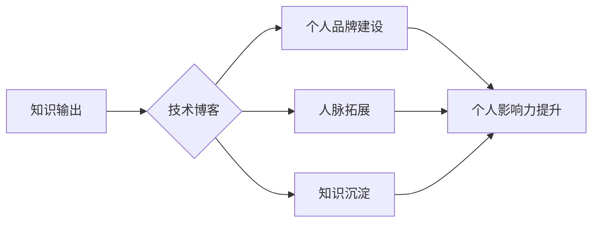

                 

## 知识输出与管理者个人影响力的提升

> 关键词：知识管理、个人影响力、知识输出、领导力、沟通技巧、数据驱动、技术博客

## 1. 背景介绍

在当今瞬息万变的科技时代，知识已成为企业和个人竞争的核心驱动力。管理者作为组织的领导者，需要具备强大的知识输出能力，才能有效地传达信息、激发团队活力、推动决策和实现战略目标。然而，许多管理者在知识输出方面存在着诸多挑战，例如缺乏清晰的知识体系、沟通表达能力不足、难以量化知识价值等。

随着互联网和数字化技术的飞速发展，知识管理和个人影响力提升已成为管理者必备的技能。技术博客作为一种新型的知识输出平台，为管理者提供了展示专业知识、建立个人品牌、拓展人脉和提升影响力的重要途径。

## 2. 核心概念与联系

### 2.1 知识输出

知识输出是指将个人或团队掌握的知识以可理解、可应用的方式传递给他人。它涵盖了多种形式，例如：

* **写作：**撰写技术博客文章、报告、论文等。
* **演讲：**参加会议、研讨会、培训等，进行知识分享。
* **教学：**指导团队成员、学生等，传授知识和技能。
* **咨询：**为他人提供专业建议和解决方案。

### 2.2 个人影响力

个人影响力是指一个人在特定领域或群体中能够影响他人的能力。它取决于个人的专业知识、沟通技巧、领导力、人脉关系等多方面因素。

### 2.3 技术博客

技术博客是一种以技术主题为中心的在线平台，用于分享知识、观点和经验。它可以帮助管理者：

* **建立个人品牌：**展示专业知识和技能，提升个人知名度。
* **拓展人脉：**与同行、专家和潜在客户建立联系。
* **获取反馈：**通过评论和讨论，了解他人对知识的理解和反馈。
* **积累知识：**整理和归纳知识，促进知识沉淀和积累。

**Mermaid 流程图**



## 3. 核心算法原理 & 具体操作步骤

### 3.1 算法原理概述

知识输出的本质是信息传递和价值创造。有效的知识输出需要遵循一定的算法原理，例如：

* **清晰简洁：**信息表达要清晰易懂，避免使用过于专业的术语和复杂的逻辑结构。
* **结构化组织：**知识要按照逻辑顺序进行组织，使用标题、列表、图表等方式进行分层和分类。
* **数据驱动：**使用数据和案例来支持观点和论证，增强知识的可信度和说服力。
* **互动式交流：**鼓励读者参与讨论和提问，促进知识的传播和理解。

### 3.2 算法步骤详解

1. **确定目标受众：**明确目标受众的背景、需求和兴趣，以便针对性地进行知识输出。
2. **选择合适的平台：**根据目标受众和知识类型，选择合适的知识输出平台，例如技术博客、社交媒体、在线课程等。
3. **规划内容结构：**根据知识主题，规划内容结构，确定标题、章节、子标题等，确保内容逻辑清晰。
4. **撰写高质量内容：**使用简洁明了的语言，结合数据和案例，撰写高质量的知识输出内容。
5. **进行内容优化：**使用关键词、标签等方式进行内容优化，提高内容的搜索排名和可发现性。
6. **推广和分享：**通过社交媒体、邮件营销等方式推广和分享知识输出内容，扩大影响力。
7. **收集反馈和改进：**收集读者反馈，不断改进知识输出内容和方式。

### 3.3 算法优缺点

**优点：**

* **可量化：**可以通过阅读量、评论数、分享量等指标来量化知识输出的影响力。
* **可持续：**技术博客等平台可以长期保存知识内容，实现知识的持续输出和传播。
* **可扩展：**可以通过合作、转载等方式，扩大知识输出的范围和影响力。

**缺点：**

* **时间成本高：**撰写高质量的知识输出内容需要投入大量的时间和精力。
* **平台竞争激烈：**技术博客等平台竞争激烈，需要不断努力才能获得关注和认可。
* **知识价值难以量化：**知识的价值往往难以用数据直接量化，需要结合实际应用和反馈进行评估。

### 3.4 算法应用领域

* **技术行业：**技术博客可以帮助工程师、程序员、产品经理等技术人员展示专业知识、建立个人品牌、拓展人脉。
* **管理咨询：**管理咨询师可以通过技术博客分享行业经验、观点和案例，提升个人影响力和客户信任度。
* **教育培训：**教育机构和个人可以通过技术博客发布教学内容、课程笔记、学习资源等，提供在线教育服务。

## 4. 数学模型和公式 & 详细讲解 & 举例说明

### 4.1 数学模型构建

知识输出的影响力可以看作是一个复杂的系统，可以利用数学模型进行分析和预测。例如，我们可以构建一个基于网络分析的知识输出影响力模型，其中：

* **节点：**代表知识输出者、读者、平台等主体。
* **边：**代表知识输出、阅读、评论、分享等交互行为。

通过分析节点之间的连接关系和交互行为频率，可以量化知识输出的影响力。

### 4.2 公式推导过程

我们可以使用 PageRank 算法来计算知识输出者的影响力得分。PageRank 算法的核心思想是：一个节点的影响力与其被其他节点引用的次数成正比。

$$PR(A) = (1-d) + d \sum_{i \in \text{in}(A)} \frac{PR(i)}{C(i)}$$

其中：

* $PR(A)$：节点 A 的 PageRank 值。
* $d$：阻尼因子，通常取值为 0.85。
* $in(A)$：指向节点 A 的所有入边。
* $PR(i)$：节点 i 的 PageRank 值。
* $C(i)$：节点 i 的出边总数。

### 4.3 案例分析与讲解

假设我们有一个技术博客平台，其中有三个作者 A、B、C。作者 A 的博客文章被作者 B 和 C 引用了，作者 B 的博客文章被作者 A 引用了，作者 C 的博客文章没有被其他作者引用。

根据 PageRank 算法，我们可以计算出三个作者的影响力得分：

* $PR(A) = (1-0.85) + 0.85 * (\frac{PR(B)}{C(B)} + \frac{PR(C)}{C(C)})$
* $PR(B) = (1-0.85) + 0.85 * (\frac{PR(A)}{C(A)})$
* $PR(C) = (1-0.85) $

通过迭代计算，我们可以得到三个作者的 PageRank 值，从而判断他们的影响力大小。

## 5. 项目实践：代码实例和详细解释说明

### 5.1 开发环境搭建

为了实现知识输出平台的功能，我们可以使用以下开发环境：

* **操作系统：**Linux、macOS 或 Windows
* **编程语言：**Python、Java 或 Node.js
* **框架：**Django、Spring Boot 或 Express.js
* **数据库：**MySQL、PostgreSQL 或 MongoDB

### 5.2 源代码详细实现

以下是一个使用 Python 和 Django 实现技术博客平台的简单代码示例：

```python
# models.py
from django.db import models

class Article(models.Model):
    title = models.CharField(max_length=200)
    content = models.TextField()
    created_at = models.DateTimeField(auto_now_add=True)

# views.py
from django.shortcuts import render
from .models import Article

def index(request):
    articles = Article.objects.all()
    return render(request, 'index.html', {'articles': articles})

# templates/index.html
<h1>技术博客</h1>
<ul>
    
        <li>
            <h2><a href="">{{ article.title }}</a></h2>
            <p>{{ article.created_at }}</p>
        </li>
    
</ul>
```

### 5.3 代码解读与分析

* **models.py:** 定义了文章模型，包含标题、内容和创建时间等字段。
* **views.py:** 定义了首页视图，获取所有文章并渲染到模板中。
* **templates/index.html:** 模板文件，展示文章列表。

### 5.4 运行结果展示

运行上述代码后，我们可以访问 localhost:8000/，看到一个技术博客首页，展示所有文章列表。

## 6. 实际应用场景

### 6.1 技术博客平台

技术博客平台可以帮助管理者：

* **分享技术经验：**记录工作中的技术难题和解决方案，帮助他人解决问题。
* **建立个人品牌：**展示专业知识和技能，提升个人知名度和影响力。
* **拓展人脉：**与同行、专家和潜在客户建立联系，拓展职业发展机会。

### 6.2 知识库建设

管理者可以利用技术博客平台构建知识库，将团队的知识和经验进行整理和归纳，方便团队成员查找和学习。

### 6.3 决策支持

技术博客平台可以收集和分析用户反馈，为管理者提供决策支持，帮助他们了解用户需求和市场趋势。

### 6.4 未来应用展望

随着人工智能和大数据技术的不断发展，技术博客平台将更加智能化和个性化。例如，平台可以根据用户的兴趣和需求，推荐相关内容；可以利用人工智能技术自动生成文章摘要和关键词；可以提供数据分析工具，帮助管理者了解知识输出的影响力。

## 7. 工具和资源推荐

### 7.1 学习资源推荐

* **书籍：**《写作的力量》、《高效沟通》、《影响力》
* **在线课程：**Coursera、Udemy、edX 等平台提供有关知识管理、沟通技巧和领导力的在线课程。
* **博客和网站：**Harvard Business Review、Forbes、TechCrunch 等网站提供有关管理和技术领域的最新资讯和观点。

### 7.2 开发工具推荐

* **博客平台：**WordPress、Medium、Ghost 等
* **内容管理系统：**Django、Spring Boot、Express.js 等
* **数据分析工具：**Google Analytics、Matomo 等

### 7.3 相关论文推荐

* **Knowledge Management:** Nonaka, I., & Takeuchi, H. (1995). The knowledge-creating company: How Japanese companies create the dynamics of innovation. Oxford University Press.
* **Personal Branding:**  Kaplan, A. M., & Haenlein, M. (2010). Users of the world, unite! The challenges and opportunities of social media. Business horizons, 53(1), 59-68.
* **Influence:** Cialdini, R. B. (2009). Influence: The psychology of persuasion. HarperCollins.

## 8. 总结：未来发展趋势与挑战

### 8.1 研究成果总结

本篇文章探讨了知识输出与管理者个人影响力提升之间的关系，并介绍了相关的算法原理、代码实例和实际应用场景。研究成果表明，有效的知识输出可以帮助管理者建立个人品牌、拓展人脉、提升决策能力，从而增强个人影响力。

### 8.2 未来发展趋势

未来，知识输出将更加智能化、个性化和数据驱动。人工智能技术将被广泛应用于知识推荐、内容生成和数据分析，为管理者提供更精准、高效的知识服务。

### 8.3 面临的挑战

知识输出也面临着一些挑战，例如：

* **内容质量控制：**确保知识输出内容的准确性、可靠性和实用性。
* **知识传播效率：**提高知识输出的传播速度和覆盖范围。
* **知识价值评估：**建立有效的知识价值评估体系，量化知识输出的影响力。

### 8.4 研究展望

未来研究将重点关注以下几个方面：

* **人工智能驱动的知识输出平台：**开发更智能、更个性化的知识输出平台，利用人工智能技术提高知识推荐、内容生成和数据分析的效率。
* **跨领域知识融合：**探索跨领域知识的融合和传播，促进知识的创新和应用。
* **知识输出的社会影响：**研究知识输出对社会发展和个人成长的影响，探讨知识输出的伦理和社会责任。

## 9. 附录：常见问题与解答

### 9.1 如何提高知识输出的质量？

* **深入研究主题：**对知识主题进行深入研究，确保内容的准确性和深度。
* **使用清晰简洁的语言：**避免使用过于专业的术语和复杂的逻辑结构，使用通俗易懂的语言表达知识。
* **结合数据和案例：**使用数据和案例来支持观点和论证，增强知识的可信度和说服力。
* **反复修改和完善：**多次修改和完善知识输出内容，确保其质量和可读性。

### 9.2 如何推广知识输出内容？

* **社交媒体推广：**在社交媒体平台上分享知识输出内容，吸引更多读者。
* **邮件营销：**建立邮件列表，定期发送知识输出内容和最新资讯。
* **合作推广：**与其他博主、专家或机构合作，推广知识输出内容。
* **参加活动：**参加行业会议、研讨会等活动，分享知识输出内容。

### 9.3 如何量化知识输出的影响力？

* **阅读量：**统计知识输出内容的阅读量，反映其受欢迎程度。
* **评论数：**统计知识输出内容的评论数，反映其引发讨论的程度。
* **分享量：**统计知识输出内容的分享量，反映其传播范围。
* **用户反馈：**收集用户反馈，了解其对知识输出内容的评价和建议。


作者：禅与计算机程序设计艺术 / Zen and the Art of Computer Programming 
<end_of_turn>

