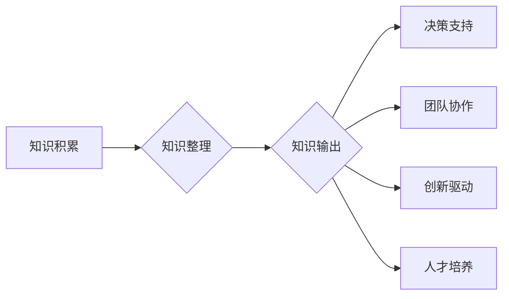

                 

## 知识输出对管理能力提升的作用

> 关键词：知识输出、管理能力、知识分享、团队协作、决策支持、创新驱动、数字化转型、人工智能、数据分析

## 1. 背景介绍

在当今瞬息万变的科技时代，信息爆炸和知识更新速度日益加快。管理者需要具备敏锐的洞察力、高效的决策能力和强大的执行力，才能带领团队在激烈的竞争中取得成功。知识输出作为一种重要的管理手段，在提升管理者能力、促进团队协作和推动组织创新方面发挥着越来越重要的作用。

传统的管理模式往往依赖于经验和直觉，而知识输出则强调将知识体系化、结构化，并通过多种形式进行传播和应用。随着数字化转型的加速，知识输出也得到了新的发展机遇，人工智能、大数据分析等技术为知识的获取、整理和传播提供了更强大的工具和手段。

## 2. 核心概念与联系

### 2.1 知识输出的概念

知识输出是指将个人或团队积累的知识、经验、技能等转化为可被他人理解、应用和共享的形式，并通过各种渠道进行传播和应用的过程。

### 2.2 知识输出与管理能力提升的联系

知识输出与管理能力提升之间存在着密切的联系。通过知识输出，管理者可以：

* **提升决策能力:** 知识输出可以帮助管理者收集和分析相关信息，形成更全面、更准确的决策依据。
* **增强团队协作:** 知识输出可以打破部门壁垒，促进团队成员之间信息共享和协作，提高团队效率。
* **促进创新驱动:** 知识输出可以激发团队成员的创造力，促进知识的碰撞和创新。
* **加强人才培养:** 知识输出可以帮助管理者将经验和技能传授给下一代人才，促进人才队伍的建设和发展。

**Mermaid 流程图**



## 3. 核心算法原理 & 具体操作步骤

### 3.1 算法原理概述

知识输出的核心算法原理是将知识转化为可被理解和应用的形式，并通过有效的传播机制进行传递。常见的知识输出算法包括：

* **知识图谱构建算法:** 将知识点和关系以图谱的形式进行表示，方便知识的检索和分析。
* **文本挖掘算法:** 从文本数据中提取关键信息和知识点，并进行分类和聚类。
* **知识推荐算法:** 根据用户的兴趣和需求，推荐相关的知识资源。

### 3.2 算法步骤详解

以知识图谱构建算法为例，其具体操作步骤如下：

1. **知识获取:** 从各种数据源中获取知识点和关系，例如书籍、文档、数据库、专家访谈等。
2. **知识清洗:** 对获取到的知识进行清洗和标准化，去除重复信息、错误信息和噪声数据。
3. **知识表示:** 将知识点和关系以节点和边的方式进行表示，构建知识图谱。
4. **知识推理:** 利用知识图谱进行推理和推导，发现新的知识和关系。
5. **知识输出:** 将构建好的知识图谱以可视化、可搜索、可交互的形式进行输出，方便用户访问和利用。

### 3.3 算法优缺点

**优点:**

* **知识可视化:** 知识图谱可以直观地展示知识结构，方便用户理解和记忆。
* **知识检索:** 知识图谱可以方便地进行知识检索，快速找到所需的信息。
* **知识推理:** 知识图谱可以进行知识推理，发现新的知识和关系。

**缺点:**

* **知识获取难度:** 获取高质量的知识数据是一个挑战。
* **知识表示复杂:** 如何准确地表示知识点和关系是一个复杂的问题。
* **知识更新困难:** 知识图谱需要定期更新，以保持其准确性和有效性。

### 3.4 算法应用领域

知识输出算法广泛应用于各个领域，例如：

* **教育:** 建立知识图谱，辅助教学和学习。
* **医疗:** 建立疾病知识图谱，辅助诊断和治疗。
* **金融:** 建立金融知识图谱，辅助风险管理和投资决策。
* **企业管理:** 建立企业知识库，促进知识共享和创新。

## 4. 数学模型和公式 & 详细讲解 & 举例说明

### 4.1 数学模型构建

知识输出可以抽象为一个信息传递模型，其中包括知识源、知识处理、知识传播和知识应用四个环节。

**知识源:** 包括个人经验、专业技能、文献资料、数据分析结果等。

**知识处理:** 包括知识提取、知识整理、知识结构化等过程。

**知识传播:** 包括知识分享、知识文档化、知识平台建设等方式。

**知识应用:** 包括知识决策、知识创新、知识培训等应用场景。

### 4.2 公式推导过程

我们可以用以下公式来描述知识输出的效率：

$$
Efficiency = \frac{Knowledge Applied}{Knowledge Output}
$$

其中：

* **Knowledge Applied:** 应用于实际决策、创新或培训等场景的知识量。
* **Knowledge Output:** 输出到团队或组织内的知识总量。

### 4.3 案例分析与讲解

假设一家公司建立了一个知识分享平台，平台上共有1000个知识文档被上传，其中500个文档被团队成员下载并应用于实际工作中。那么，该平台的知识输出效率为：

$$
Efficiency = \frac{500}{1000} = 0.5
$$

这表明该平台的知识输出效率为50%。

## 5. 项目实践：代码实例和详细解释说明

### 5.1 开发环境搭建

* 操作系统: Ubuntu 20.04 LTS
* 编程语言: Python 3.8
* 开发工具: Jupyter Notebook

### 5.2 源代码详细实现

```python
# 知识图谱构建示例代码

import networkx as nx

# 创建知识图谱
graph = nx.Graph()

# 添加知识点和关系
graph.add_node("知识点1")
graph.add_node("知识点2")
graph.add_node("知识点3")
graph.add_edge("知识点1", "知识点2", relation="包含")
graph.add_edge("知识点2", "知识点3", relation="依赖")

# 绘制知识图谱
nx.draw(graph, with_labels=True)
plt.show()
```

### 5.3 代码解读与分析

* 使用 `networkx` 库构建知识图谱。
* 添加知识点和关系，并指定关系类型。
* 使用 `nx.draw()` 函数绘制知识图谱。

### 5.4 运行结果展示

运行代码后，将生成一个包含三个知识点和两个关系的知识图谱。

## 6. 实际应用场景

### 6.1 企业知识管理

知识输出可以帮助企业建立完善的知识管理体系，将员工的经验和技能进行系统化整理和共享，提高企业知识的利用率和创新能力。

### 6.2 教育培训

知识输出可以帮助教育机构构建知识库，提供个性化的学习资源，提高教学效率和学习效果。

### 6.3 研究开发

知识输出可以帮助科研人员进行知识积累和分享，促进科研成果的转化和应用。

### 6.4 未来应用展望

随着人工智能、大数据分析等技术的不断发展，知识输出将更加智能化、个性化和自动化。未来，知识输出将更加深入地融入到各个领域，成为推动社会进步和人类发展的重要力量。

## 7. 工具和资源推荐

### 7.1 学习资源推荐

* **书籍:**
    * 《知识管理》
    * 《知识经济》
    * 《知识共享》
* **在线课程:**
    * Coursera: 知识管理
    * edX: 知识经济
    * Udemy: 知识共享

### 7.2 开发工具推荐

* **知识图谱构建工具:**
    * Neo4j
    * GraphDB
    * Stardog
* **知识管理平台:**
    * Confluence
    * Notion
    * SharePoint

### 7.3 相关论文推荐

* **知识图谱构建:**
    * "A Survey on Knowledge Graph Construction"
    * "Knowledge Graph Embedding Techniques"
* **知识输出:**
    * "Knowledge Sharing and Organizational Learning"
    * "The Impact of Knowledge Management on Organizational Performance"

## 8. 总结：未来发展趋势与挑战

### 8.1 研究成果总结

知识输出作为一种重要的管理手段，在提升管理者能力、促进团队协作和推动组织创新方面发挥着越来越重要的作用。随着数字化转型的加速，人工智能、大数据分析等技术为知识的获取、整理和传播提供了更强大的工具和手段。

### 8.2 未来发展趋势

* **智能化:** 利用人工智能技术，实现知识的自动提取、整理和推荐。
* **个性化:** 根据用户的需求和兴趣，提供个性化的知识输出。
* **协作化:** 促进团队成员之间的知识共享和协作。
* **跨领域融合:** 将知识输出与其他领域，例如医疗、金融、教育等进行融合，创造新的应用场景。

### 8.3 面临的挑战

* **知识获取的质量和效率:** 如何获取高质量的知识数据，并进行有效的整理和结构化是一个挑战。
* **知识表示的准确性和完整性:** 如何准确地表示知识点和关系，并保持知识图谱的完整性和一致性是一个难题。
* **知识更新的及时性和有效性:** 知识是动态的，需要定期更新，以保持其准确性和有效性。

### 8.4 研究展望

未来，我们将继续致力于研究知识输出的算法、模型和应用，推动知识输出技术的发展，并将其应用于各个领域，为人类社会创造更大的价值。

## 9. 附录：常见问题与解答

* **Q1: 知识输出的目的是什么？**

**A1:** 知识输出的目的是将个人或团队积累的知识、经验、技能等转化为可被他人理解、应用和共享的形式，并通过各种渠道进行传播和应用。

* **Q2: 知识输出有哪些方法？**

**A2:** 常见的知识输出方法包括知识分享、知识文档化、知识平台建设、知识图谱构建等。

* **Q3: 知识输出对管理者有什么帮助？**

**A3:** 知识输出可以帮助管理者提升决策能力、增强团队协作、促进创新驱动和加强人才培养。


作者：禅与计算机程序设计艺术 / Zen and the Art of Computer Programming 
<end_of_turn>

