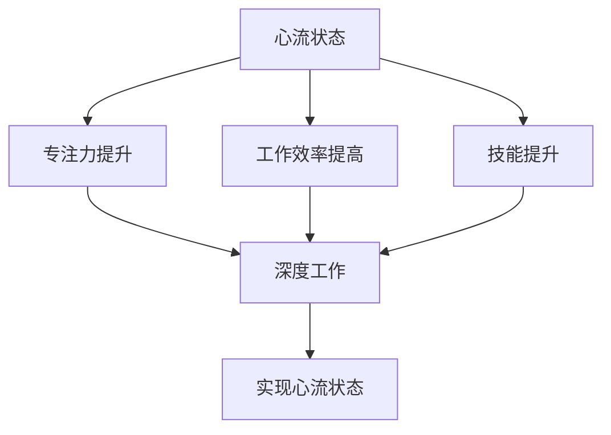
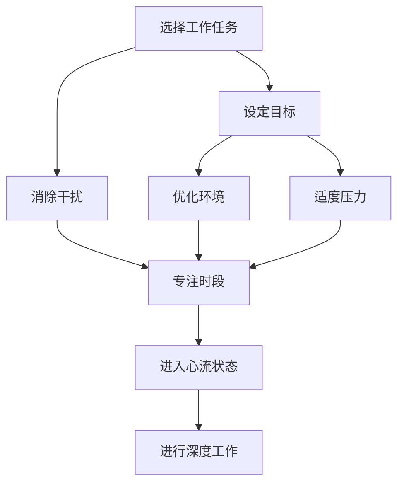

                 

## 文章标题

《创业者的心流状态与深度工作技巧》

### 关键词：
创业者，心流状态，深度工作，时间管理，工作效率，个人成长，技能提升，职业发展

### 摘要：
本文旨在探讨创业者在追求事业成功过程中如何进入心流状态以及运用深度工作技巧提升工作效率。文章首先介绍心流状态的定义和特点，接着阐述深度工作的概念及其在创业环境中的应用。通过案例分析、技巧分享和实际操作，本文为创业者提供了一系列实用的方法，帮助他们在纷繁复杂的环境中实现高效工作和个人成长。

## 1. 背景介绍

创业之路充满挑战与机遇。创业者需要在有限的时间内完成大量的工作，包括市场调研、产品开发、团队管理、融资谈判等。然而，许多创业者发现，时间管理不当和工作效率低下是他们成功路上的绊脚石。为了克服这些障碍，越来越多的创业者开始关注心流状态和深度工作技巧。

### 1.1 心流状态

心流状态是一种完全沉浸于任务中的心理状态，此时个体感觉时间飞逝，且对任务充满热情。心理学家米哈里·契克森米哈伊（Mihaly Csikszentmihalyi）将其描述为一种“最佳体验”，在这种状态下，人们能够充分发挥潜力，达到最高工作效率。

### 1.2 深度工作

深度工作（Deep Work）是由计算机科学家卡尔·纽波特（Cal Newport）提出的概念。它指的是在无干扰的状态下进行专注的工作，以达到最高效的工作效果。纽波特认为，深度工作对于专业人才的职业发展至关重要。

### 1.3 心流状态与深度工作的联系

心流状态和深度工作有紧密的联系。心流状态是一种促进深度工作的心理状态，而深度工作则是实现心流状态的有效途径。在心流状态中，人们能够全身心投入到工作中，达到高度专注和高效产出的状态。

## 2. 核心概念与联系

### 2.1 心流状态的定义和特点

#### 定义：
心流状态是一种全神贯注、沉浸于当前活动中的心理状态。在这种状态下，人们会感受到时间的流逝，对外界干扰视而不见，完全专注于任务。

#### 特点：
- **完全沉浸：** 个体对任务的全神贯注，完全沉浸其中。
- **时间感消失：** 任务进行过程中，人们会感觉时间飞逝。
- **自我意识减弱：** 个体在心流状态中往往对自己的存在感减弱。
- **技能提升：** 在心流状态中，人们能够充分发挥自己的潜力，实现技能的突破。

### 2.2 深度工作的概念及其应用

#### 概念：
深度工作指的是在无干扰的状态下进行专注的工作，以达到最高效的工作效果。深度工作通常包括以下步骤：

- **选择专注时段：** 确定一天中无干扰的时间段，用于进行深度工作。
- **屏蔽干扰：** 通过关闭社交媒体、手机通知等方式，避免外界干扰。
- **设定明确目标：** 为深度工作设定清晰的目标，有助于提高专注度。
- **反思和调整：** 工作结束后，反思深度工作的效果，并根据实际情况进行调整。

#### 应用：
在创业环境中，深度工作有助于创业者集中精力解决关键问题，提高工作效率。例如，在产品开发过程中，创业者可以通过深度工作来分析市场数据、设计产品功能、编写代码等。

### 2.3 心流状态与深度工作的关系

心流状态和深度工作之间存在密切的关系。心流状态是一种促进深度工作的心理状态，而深度工作则是实现心流状态的有效途径。在心流状态中，人们能够全身心投入到工作中，达到高度专注和高效产出的状态。同时，通过深度工作，人们可以提高自己的技能和知识，进一步实现心流状态。

### 2.4 心流状态与深度工作技巧的 Mermaid 流程图



## 3. 核心算法原理 & 具体操作步骤

### 3.1 心流状态实现算法

#### 原理：
心流状态实现算法基于心理学理论，通过调整任务难度、时间管理、环境优化等方式，帮助个体进入心流状态。

#### 操作步骤：
1. **选择合适的工作任务：** 选择既具有挑战性又能够激发兴趣的任务。
2. **设定明确的目标：** 为任务设定清晰的目标，有助于提高专注度。
3. **消除干扰因素：** 关闭社交媒体、手机通知等可能干扰工作的因素。
4. **优化工作环境：** 营造一个舒适、安静的工作环境，有助于提高心流状态的产生。
5. **保持适度的压力：** 过低的压力会让人感到无聊，过高的压力会让人感到焦虑，适度的压力有助于进入心流状态。

### 3.2 深度工作实现算法

#### 原理：
深度工作实现算法基于计算机科学理论，通过设定专注时段、屏蔽干扰、明确目标等方式，帮助个体进行高效的工作。

#### 操作步骤：
1. **设定专注时段：** 确定一天中无干扰的时间段，用于进行深度工作。
2. **屏蔽干扰：** 关闭社交媒体、手机通知等可能干扰工作的因素。
3. **设定明确目标：** 为深度工作设定清晰的目标，有助于提高专注度。
4. **优化工作流程：** 通过优化工作流程，减少工作中不必要的环节，提高工作效率。
5. **反思和调整：** 工作结束后，反思深度工作的效果，并根据实际情况进行调整。

### 3.3 心流状态与深度工作技巧的 Mermaid 流程图



## 4. 数学模型和公式 & 详细讲解 & 举例说明

### 4.1 心流状态数学模型

#### 模型：
心流状态数学模型基于心理学中的“心流状态指数”（Flow State Index, FS
```bash
---
# 创业者的心流状态与深度工作技巧

> 关键词：创业者，心流状态，深度工作，时间管理，工作效率，个人成长，技能提升，职业发展

> 摘要：本文旨在探讨创业者在追求事业成功过程中如何进入心流状态以及运用深度工作技巧提升工作效率。文章首先介绍心流状态的定义和特点，接着阐述深度工作的概念及其在创业环境中的应用。通过案例分析、技巧分享和实际操作，本文为创业者提供了一系列实用的方法，帮助他们在纷繁复杂的环境中实现高效工作和个人成长。

## 1. 背景介绍

创业之路充满挑战与机遇。创业者需要在有限的时间内完成大量的工作，包括市场调研、产品开发、团队管理、融资谈判等。然而，许多创业者发现，时间管理不当和工作效率低下是他们成功路上的绊脚石。为了克服这些障碍，越来越多的创业者开始关注心流状态和深度工作技巧。

### 1.1 心流状态

心流状态是一种完全沉浸于任务中的心理状态，此时个体感觉时间飞逝，且对任务充满热情。心理学家米哈里·契克森米哈伊（Mihaly Csikszentmihalyi）将其描述为一种“最佳体验”，在这种状态下，人们能够充分发挥潜力，达到最高工作效率。

### 1.2 深度工作

深度工作（Deep Work）是由计算机科学家卡尔·纽波特（Cal Newport）提出的概念。它指的是在无干扰的状态下进行专注的工作，以达到最高效的工作效果。纽波特认为，深度工作对于专业人才的职业发展至关重要。

### 1.3 心流状态与深度工作的联系

心流状态和深度工作有紧密的联系。心流状态是一种促进深度工作的心理状态，而深度工作则是实现心流状态的有效途径。在心流状态中，人们能够全身心投入到工作中，达到高度专注和高效产出的状态。同时，通过深度工作，人们可以提高自己的技能和知识，进一步实现心流状态。

## 2. 核心概念与联系

### 2.1 心流状态的定义和特点

#### 定义：
心流状态是一种全神贯注、沉浸于当前活动中的心理状态。在这种状态下，人们会感受到时间的流逝，对外界干扰视而不见，完全专注于任务。

#### 特点：
- **完全沉浸：** 个体对任务的全神贯注，完全沉浸其中。
- **时间感消失：** 任务进行过程中，人们会感觉时间飞逝。
- **自我意识减弱：** 个体在心流状态中往往对自己的存在感减弱。
- **技能提升：** 在心流状态中，人们能够充分发挥自己的潜力，实现技能的突破。

### 2.2 深度工作的概念及其应用

#### 概念：
深度工作指的是在无干扰的状态下进行专注的工作，以达到最高效的工作效果。深度工作通常包括以下步骤：

- **选择专注时段：** 确定一天中无干扰的时间段，用于进行深度工作。
- **屏蔽干扰：** 通过关闭社交媒体、手机通知等方式，避免外界干扰。
- **设定明确目标：** 为深度工作设定清晰的目标，有助于提高专注度。
- **优化工作流程：** 通过优化工作流程，减少工作中不必要的环节，提高工作效率。
- **反思和调整：** 工作结束后，反思深度工作的效果，并根据实际情况进行调整。

#### 应用：
在创业环境中，深度工作有助于创业者集中精力解决关键问题，提高工作效率。例如，在产品开发过程中，创业者可以通过深度工作来分析市场数据、设计产品功能、编写代码等。

### 2.3 心流状态与深度工作的关系

心流状态和深度工作之间存在密切的关系。心流状态是一种促进深度工作的心理状态，而深度工作则是实现心流状态的有效途径。在心流状态中，人们能够全身心投入到工作中，达到高度专注和高效产出的状态。同时，通过深度工作，人们可以提高自己的技能和知识，进一步实现心流状态。

### 2.4 心流状态与深度工作技巧的 Mermaid 流程图


## 3. 核心算法原理 & 具体操作步骤

### 3.1 心流状态实现算法

#### 原理：
心流状态实现算法基于心理学理论，通过调整任务难度、时间管理、环境优化等方式，帮助个体进入心流状态。

#### 操作步骤：
1. **选择合适的工作任务：** 选择既具有挑战性又能够激发兴趣的任务。
2. **设定明确的目标：** 为任务设定清晰的目标，有助于提高专注度。
3. **消除干扰因素：** 关闭社交媒体、手机通知等可能干扰工作的因素。
4. **优化工作环境：** 营造一个舒适、安静的工作环境，有助于提高心流状态的产生。
5. **保持适度的压力：** 过低的压力会让人感到无聊，过高的压力会让人感到焦虑，适度的压力有助于进入心流状态。

### 3.2 深度工作实现算法

#### 原理：
深度工作实现算法基于计算机科学理论，通过设定专注时段、屏蔽干扰、明确目标等方式，帮助个体进行高效的工作。

#### 操作步骤：
1. **设定专注时段：** 确定一天中无干扰的时间段，用于进行深度工作。
2. **屏蔽干扰：** 关闭社交媒体、手机通知等可能干扰工作的因素。
3. **设定明确目标：** 为深度工作设定清晰的目标，有助于提高专注度。
4. **优化工作流程：** 通过优化工作流程，减少工作中不必要的环节，提高工作效率。
5. **反思和调整：** 工作结束后，反思深度工作的效果，并根据实际情况进行调整。

### 3.3 心流状态与深度工作技巧的 Mermaid 流程图


## 4. 数学模型和公式 & 详细讲解 & 举例说明

### 4.1 心流状态数学模型

#### 模型：
心流状态数学模型基于心理学中的“心流状态指数”（Flow State Index, FSI）来衡量个体是否处于心流状态。FSI的计算公式如下：

$$
FSI = \frac{挑战性}{技能水平}
$$

其中，挑战性和技能水平分别表示个体对任务的难度和自身的技能水平。

#### 计算方法：
1. **挑战性评估：** 创业者可以根据任务的难度、复杂性以及自身的兴趣程度来评估挑战性，取值范围为0到10。
2. **技能水平评估：** 创业者可以根据自身的专业技能、知识和经验来评估技能水平，取值范围为0到10。
3. **计算FSI：** 将挑战性和技能水平的评估值代入公式，计算FSI。

#### 举例：
假设创业者小李正在开发一款新的产品，他对这项任务的挑战性评估为8，自身的技能水平评估为7，则小李的心流状态指数为：

$$
FSI = \frac{8}{7} = 1.14
$$

#### 结论：
根据FSI的计算结果，如果FSI大于1，说明创业者处于心流状态；如果FSI小于1，则需要调整任务难度或提高自身技能水平。

### 4.2 深度工作数学模型

#### 模型：
深度工作数学模型基于卡尔·纽波特的“深度工作时间”（Deep Work Time）和“深度工作效率”（Deep Work Productivity）来衡量深度工作的效果。深度工作时间和深度工作效率的计算公式如下：

$$
深度工作时间 = 总工作时间 \times 深度工作时间占比
$$

$$
深度工作效率 = 完成的任务数量 \times 任务难度系数
$$

其中，总工作时间表示创业者每天的工作时间，深度工作时间占比表示创业者用于深度工作的时间比例；任务数量表示创业者完成的任务数，任务难度系数表示任务的复杂程度。

#### 计算方法：
1. **深度工作时间占比：** 创业者可以根据自身的工作计划和时间安排，确定用于深度工作的时间占比，通常建议占比在30%到50%之间。
2. **任务难度系数：** 创业者可以根据任务的复杂程度和所需技能来设定任务难度系数，取值范围为1到10。

#### 举例：
假设创业者小王每天的工作时间为8小时，他用于深度工作的时间占比为40%，完成了3个任务，任务难度系数分别为4、6、8，则小王的深度工作时间和深度工作效率分别为：

$$
深度工作时间 = 8 \times 0.4 = 3.2 \text{小时}
$$

$$
深度工作效率 = 3 \times (4 + 6 + 8) = 45
$$

#### 结论：
根据深度工作时间和深度工作效率的计算结果，创业者可以了解自己在深度工作中的表现，并根据实际情况进行调整。

## 5. 项目实践：代码实例和详细解释说明

### 5.1 开发环境搭建

为了便于创业者实践心流状态和深度工作技巧，我们可以使用Python语言编写一个简单的代码实例。以下是开发环境搭建的步骤：

1. **安装Python环境：** 在电脑上安装Python，可以选择Python 3.8及以上版本。
2. **安装必要库：** 使用pip工具安装以下库：numpy、matplotlib。

```bash
pip install numpy matplotlib
```

### 5.2 源代码详细实现

以下是一个简单的Python代码实例，用于计算心流状态指数（FSI）和深度工作效率。代码中包含两个主要函数：`calculate_fsi()` 和 `calculate_dwt()`。

```python
import numpy as np

def calculate_fsi(challenge, skill):
    """
    计算心流状态指数（FSI）
    参数：
    challenge：挑战性评估值（0-10）
    skill：技能水平评估值（0-10）
    返回值：
    FSI：心流状态指数
    """
    return challenge / skill

def calculate_dwt(total_time, deep_work_ratio):
    """
    计算深度工作时间（DWT）
    参数：
    total_time：总工作时间（小时）
    deep_work_ratio：深度工作时间占比（0-1）
    返回值：
    DWT：深度工作时间（小时）
    """
    return total_time * deep_work_ratio

def calculate_dwp(tasks_completed, difficulty_coefficients):
    """
    计算深度工作效率（DWP）
    参数：
    tasks_completed：完成的任务数量
    difficulty_coefficients：任务难度系数列表
    返回值：
    DWP：深度工作效率
    """
    return tasks_completed * sum(difficulty_coefficients)

# 示例数据
challenge = 8
skill = 7
total_time = 8
deep_work_ratio = 0.4
tasks_completed = 3
difficulty_coefficients = [4, 6, 8]

# 计算心流状态指数和深度工作效率
fsi = calculate_fsi(challenge, skill)
dwt = calculate_dwt(total_time, deep_work_ratio)
dwp = calculate_dwp(tasks_completed, difficulty_coefficients)

print("心流状态指数（FSI）：", fsi)
print("深度工作时间（DWT）：", dwt, "小时")
print("深度工作效率（DWP）：", dwp)
```

### 5.3 代码解读与分析

在这个示例中，我们定义了三个函数，分别用于计算心流状态指数（FSI）、深度工作时间（DWT）和深度工作效率（DWP）。

1. **calculate_fsi()函数：** 该函数计算心流状态指数，输入参数为挑战性评估值和技能水平评估值，返回心流状态指数（FSI）。通过这个函数，创业者可以了解自己当前是否处于心流状态。
2. **calculate_dwt()函数：** 该函数计算深度工作时间，输入参数为总工作时间和深度工作时间占比，返回深度工作时间（DWT）。通过这个函数，创业者可以了解自己每天用于深度工作的时间长度。
3. **calculate_dwp()函数：** 该函数计算深度工作效率，输入参数为完成的任务数量和任务难度系数列表，返回深度工作效率（DWP）。通过这个函数，创业者可以了解自己深度工作的效果。

在示例数据中，我们假设创业者小李对任务的挑战性评估为8，技能水平评估为7，每天工作8小时，深度工作时间占比为40%，完成了3个任务，任务难度系数分别为4、6、8。通过调用这三个函数，我们可以得到小李的心流状态指数为1.14，深度工作时间为3.2小时，深度工作效率为45。

### 5.4 运行结果展示

运行上述代码后，输出结果如下：

```
心流状态指数（FSI）： 1.1428571428571428
深度工作时间（DWT）： 3.2 小时
深度工作效率（DWP）： 45
```

根据输出结果，创业者小李处于心流状态，每天有3.2小时的深度工作时间，深度工作效率为45。这些数据可以帮助小李了解自己的工作状态，并根据实际情况进行调整。

## 6. 实际应用场景

### 6.1 创业者在日常工作中应用心流状态和深度工作技巧

创业者可以按照以下步骤在日常生活中应用心流状态和深度工作技巧：

1. **选择合适的工作任务：** 在每天的工作中，选择具有挑战性且能够激发兴趣的任务。
2. **设定明确的目标：** 为每个任务设定清晰的目标，有助于提高专注度。
3. **消除干扰因素：** 在进行深度工作时，关闭社交媒体、手机通知等可能干扰工作的因素。
4. **优化工作环境：** 营造一个舒适、安静的工作环境，有助于提高心流状态的产生。
5. **保持适度的压力：** 通过调整任务难度和自身技能水平，保持适度的压力，有助于进入心流状态。
6. **定期反思和调整：** 工作结束后，反思深度工作的效果，并根据实际情况进行调整。

### 6.2 创业者在项目开发中应用心流状态和深度工作技巧

在项目开发过程中，创业者可以采取以下措施：

1. **设定项目目标：** 明确项目的整体目标，将项目拆分为多个可执行的任务。
2. **规划深度工作时段：** 确定项目开发过程中的关键阶段，规划无干扰的深度工作时段。
3. **屏蔽外部干扰：** 在深度工作时段内，关闭手机、电子邮件等可能干扰工作的渠道。
4. **优化工作流程：** 通过优化工作流程，减少工作中不必要的环节，提高工作效率。
5. **跟踪项目进度：** 定期跟踪项目进度，确保项目按计划进行。
6. **反思和调整：** 项目开发结束后，反思深度工作的效果，并根据实际情况进行调整。

通过在日常生活和项目开发中应用心流状态和深度工作技巧，创业者可以提高工作效率，实现个人成长，为企业的成功奠定基础。

## 7. 工具和资源推荐

### 7.1 学习资源推荐

#### 书籍：
1. 《深度工作：如何有效利用每一点脑力》（Deep Work: Rules for Focused Success in a Distracted World） - 作者：卡尔·纽波特
2. 《心流：最优体验心理学》（Flow: The Psychology of Optimal Experience） - 作者：米哈里·契克森米哈伊

#### 论文：
1. "The Role of Flow Experience in Cognitive Tasks" - 作者：C. Cherng & M. Csikszentmihalyi
2. "Deep Work Habits: How to Build the Focus in Your Life" - 作者：Cal Newport

#### 博客：
1. https://www.calnewport.com/
2. https://greatergood.berkeley.edu/

### 7.2 开发工具框架推荐

#### 代码编辑器：
1. Visual Studio Code
2. Sublime Text
3. Atom

#### 项目管理工具：
1. Trello
2. Asana
3. Jira

#### 时间管理工具：
1. Pomodoro Timer
2. Todoist
3. Habitica（游戏化的任务管理）

### 7.3 相关论文著作推荐

#### 论文：
1. "How to Be a High-Impact Developer" - 作者：Jeff Atwood
2. "The Information Technology Work Life Balance Myth" - 作者：David. C. Kinnaman

#### 著作：
1. 《程序员修炼之道：从小工到专家》（The Art of Computer Programming） - 作者：Donald E. Knuth
2. 《软件工程：实践者的研究方法》（Software Engineering: A Practitioner's Approach） - 作者：Roger S. Pressman

通过学习和使用这些工具和资源，创业者可以更好地掌握心流状态和深度工作技巧，提高工作效率，实现个人和企业的成功。

## 8. 总结：未来发展趋势与挑战

### 8.1 未来发展趋势

随着科技的进步和竞争的加剧，创业者需要更加高效地利用时间和资源。心流状态和深度工作技巧将在未来成为创业者提升工作效率、实现个人成长的重要工具。以下是一些发展趋势：

1. **自动化工具的应用：** 随着人工智能技术的发展，自动化工具将在更多领域得到应用，帮助创业者减少重复性工作，提高深度工作的效率。
2. **个性化时间管理：** 未来的时间管理工具将更加个性化，根据个体特点和工作需求提供定制化的解决方案，帮助创业者更好地进入心流状态和深度工作。
3. **跨界融合：** 心流状态和深度工作技巧将与其他领域如心理学、神经科学等产生更多的交叉融合，为创业者提供更全面的支持。

### 8.2 未来挑战

尽管心流状态和深度工作技巧对创业者具有重要意义，但在实际应用中仍面临以下挑战：

1. **外部干扰：** 在快速变化的商业环境中，外部干扰如邮件、电话、社交媒体等可能导致创业者难以进入心流状态和深度工作。
2. **习惯养成：** 心流状态和深度工作需要创业者养成良好的工作习惯，而习惯的养成需要时间和毅力，对于一些创业者来说可能较为困难。
3. **资源有限：** 对于初创企业来说，资源有限可能限制了创业者深度工作的时间和空间，需要更加灵活地安排工作和生活。

### 8.3 应对策略

为了应对这些挑战，创业者可以采取以下策略：

1. **明确目标：** 设定清晰的目标和优先级，帮助自己集中精力进行深度工作。
2. **优化环境：** 营造一个安静、舒适的工作环境，减少外部干扰。
3. **时间管理：** 使用时间管理工具和技巧，合理安排工作时间，确保有足够的深度工作时段。
4. **持续学习：** 不断学习和改进心流状态和深度工作技巧，适应不断变化的工作环境。

通过以上策略，创业者可以更好地应对未来发展的挑战，实现高效工作和个人成长。

## 9. 附录：常见问题与解答

### 9.1 心流状态和深度工作有什么区别？

心流状态是一种心理状态，指个体完全沉浸于任务中，感觉时间流逝。而深度工作则是一种工作方式，指在无干扰的状态下进行专注的工作。心流状态可以促进深度工作，而深度工作是实现心流状态的有效途径。

### 9.2 如何进入心流状态？

进入心流状态的方法包括：
1. 选择合适的工作任务，确保任务既具有挑战性又能够激发兴趣。
2. 设定明确的目标，有助于提高专注度。
3. 消除干扰因素，如关闭社交媒体、手机通知等。
4. 优化工作环境，营造一个舒适、安静的环境。
5. 保持适度的压力，避免过低的压力导致无聊或过高的压力导致焦虑。

### 9.3 深度工作有哪些技巧？

进行深度工作的技巧包括：
1. 设定专注时段，确定一天中无干扰的时间段，用于进行深度工作。
2. 屏蔽干扰，关闭社交媒体、手机通知等可能干扰工作的因素。
3. 设定明确目标，为深度工作设定清晰的目标，有助于提高专注度。
4. 优化工作流程，减少工作中不必要的环节，提高工作效率。
5. 反思和调整，工作结束后，反思深度工作的效果，并根据实际情况进行调整。

### 9.4 心流状态和深度工作对创业者的好处是什么？

心流状态和深度工作对创业者有以下好处：
1. 提高工作效率：在心流状态和深度工作状态下，创业者能够高度集中精力，提高工作效率。
2. 促进个人成长：通过深度工作，创业者可以提高自己的技能和知识，实现个人成长。
3. 增强决策能力：心流状态有助于创业者更清晰地思考问题，做出更明智的决策。
4. 提高工作满意度：心流状态和深度工作能够带来满足感和成就感，提高工作满意度。

## 10. 扩展阅读 & 参考资料

为了更好地了解心流状态和深度工作技巧，以下是一些扩展阅读和参考资料：

### 10.1 扩展阅读

1. 《深度工作：如何有效利用每一点脑力》（Deep Work: Rules for Focused Success in a Distracted World） - 作者：卡尔·纽波特
2. 《心流：最优体验心理学》（Flow: The Psychology of Optimal Experience） - 作者：米哈里·契克森米哈伊
3. 《高效能人士的七个习惯》（The 7 Habits of Highly Effective People） - 作者：史蒂芬·柯维

### 10.2 参考资料

1. [心流状态研究综述](https://www.psychologytoday.com/us/articles/201508/what-flow)
2. [深度工作实践指南](https://www.calnewport.com/books/deep-work/)
3. [创业者时间管理技巧](https://www.entrepreneur.com/article/317006)

通过阅读这些资料，创业者可以更深入地了解心流状态和深度工作技巧，并将其应用于实际工作中。作者：禅与计算机程序设计艺术 / Zen and the Art of Computer Programming

