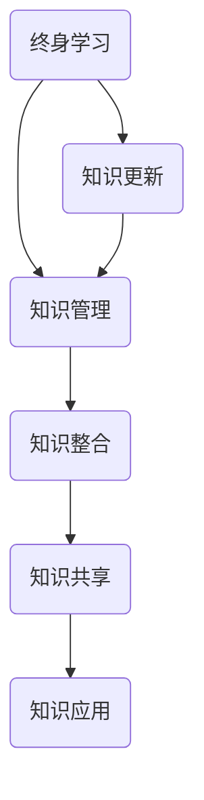

                 

### 文章标题

《创业者的终身学习与知识管理》

> 关键词：终身学习、知识管理、创业者、学习方法、技能提升、创新思维、知识体系、信息过载、学习工具、个人成长

摘要：
本文旨在探讨创业者在快速变化的市场环境中如何通过终身学习和有效的知识管理来保持竞争力和创新能力。文章首先概述了创业者的角色和所面临的挑战，然后深入分析了终身学习的重要性以及如何构建和利用个人的知识体系。通过实例和策略，文章提供了具体的实践方法，帮助创业者克服信息过载，提升学习效率，最终实现个人和企业的共同成长。

<|assistant|>### 1. 背景介绍

在当今的全球商业环境中，创业已成为许多人实现梦想、追求自由和创造价值的重要途径。创业者不仅要具备创新思维和商业洞察力，还需要持续学习和适应不断变化的市场和技术。随着信息技术的迅猛发展，知识的更新速度前所未有，创业者面临着前所未有的挑战：如何在海量的信息中筛选出有价值的内容，如何将所学知识转化为实际技能和创新能力，以及如何有效地管理自己的学习过程。

终身学习已成为创业者成功的关键因素之一。通过不断学习，创业者可以保持敏锐的市场洞察力，掌握最新的技术和商业模式，从而在竞争中脱颖而出。然而，知识管理的重要性同样不容忽视。有效的知识管理不仅能够帮助创业者组织和利用所学知识，还能促进团队协作和知识共享，为企业的长期发展奠定坚实的基础。

本文将围绕终身学习和知识管理这两个核心概念，探讨创业者如何通过系统化、结构化的学习方法和知识管理策略，实现个人成长和企业发展的双赢。

<|assistant|>### 2. 核心概念与联系

#### 2.1 什么是终身学习

终身学习是指一个人在其整个生命中不断学习、更新知识和技能的过程。它不仅仅是为了满足职业发展的需要，更是为了保持个人成长、提升生活质量和社会参与度。终身学习强调学习的主观能动性，鼓励个人主动探索、发现和创造知识。

#### 2.2 创业者为什么要终身学习

对于创业者来说，终身学习的重要性体现在以下几个方面：

- **市场适应能力**：市场和技术环境变化迅速，创业者需要不断学习新的市场趋势和技术知识，以适应变化。

- **创新能力**：终身学习能够帮助创业者开阔视野，激发创新思维，从而在竞争中脱颖而出。

- **团队管理**：创业者需要通过不断学习来提升自己的领导力和管理能力，更好地指导和激励团队成员。

- **个人成长**：终身学习有助于创业者实现个人价值，提升自信心和满足感。

#### 2.3 知识管理的重要性

知识管理是指通过收集、组织、存储、检索和应用知识，以提高组织效率和创新能力的活动。对于创业者来说，知识管理的重要性体现在：

- **知识整合**：创业者需要将所学知识整合到个人的知识体系中，形成有组织的学习结构。

- **知识共享**：通过知识共享，创业者可以与团队成员和外部合作伙伴共同进步。

- **知识应用**：有效的知识管理可以帮助创业者将知识转化为实际的商业机会。

#### 2.4 终身学习与知识管理的关系

终身学习和知识管理是相辅相成的。终身学习为知识管理提供了丰富的内容，而知识管理则为终身学习提供了有效的组织和应用工具。一个成功的创业者需要将两者紧密结合，构建个人的学习体系和知识管理体系，从而实现持续成长。

**Mermaid 流程图（用于描述终身学习与知识管理的关系）：**



通过这个流程图，我们可以看到终身学习是一个持续的过程，它不断为知识管理提供新的内容。知识管理则将这些内容进行整合、共享和应用，形成一个闭环系统，从而实现知识的有效利用。

<|assistant|>### 3. 核心算法原理 & 具体操作步骤

#### 3.1 核心算法原理

在构建个人的学习体系和知识管理体系时，创业者需要运用一系列核心算法和操作步骤。这些算法和步骤包括但不限于：

- **目标设定**：明确学习目标和知识管理目标，确保学习和管理的方向一致。

- **内容筛选**：在海量信息中筛选出有价值的内容，避免信息过载。

- **知识整合**：将新学到的知识与已有知识体系相结合，形成系统的知识结构。

- **知识存储**：使用合适的工具和方法存储知识，确保知识可随时访问。

- **知识共享**：建立知识共享机制，促进团队协作和创新。

- **知识应用**：将知识应用于实际工作和生活中，实现知识的价值。

#### 3.2 具体操作步骤

1. **目标设定**

   - **明确学习目标**：创业者需要根据自己的业务需求和成长目标，设定明确的学习目标。例如，提升某项专业技能、了解最新的市场动态等。

   - **制定知识管理目标**：明确知识管理的目的，如提高团队效率、促进创新等。

2. **内容筛选**

   - **信息来源**：创业者需要确定可靠的信息来源，如专业书籍、权威网站、行业报告等。

   - **内容评估**：对获取的信息进行评估，筛选出最有价值的内容。

   - **避免信息过载**：通过设置信息过滤机制，如关键词搜索、订阅专业内容等，减少无效信息的干扰。

3. **知识整合**

   - **构建知识框架**：创业者可以根据自己的需求，构建一个系统的知识框架，如分类框架、主题框架等。

   - **知识关联**：将新学到的知识与已有知识关联起来，形成知识网络。

   - **知识更新**：定期更新知识框架，保持知识的时效性和准确性。

4. **知识存储**

   - **选择合适的工具**：创业者可以选择使用各种知识管理工具，如笔记应用、知识库系统等。

   - **规范存储格式**：确保知识的存储格式标准化，便于检索和应用。

5. **知识共享**

   - **内部共享**：在团队内部建立知识共享平台，如内部博客、知识库等。

   - **外部合作**：与行业伙伴、专家等进行知识交流和共享。

6. **知识应用**

   - **实践应用**：将学到的知识应用于实际工作和项目中，验证其有效性。

   - **反馈循环**：根据实际应用效果，对知识进行迭代更新。

通过这些核心算法和具体操作步骤，创业者可以构建一个高效、系统的学习体系和知识管理体系，从而实现个人和企业的持续成长。

<|assistant|>### 4. 数学模型和公式 & 详细讲解 & 举例说明

#### 4.1 数学模型和公式

在构建学习体系和知识管理体系时，创业者可以运用一些数学模型和公式来优化学习过程和知识管理效果。以下是一些常用的数学模型和公式：

1. **学习曲线（Learning Curve）**

   学习曲线描述了学习者在学习过程中所需时间与学习效果之间的关系。公式为：

   $$ T(n) = T(1) \cdot L^{\log(n)/\log(L)} $$

   其中，\( T(n) \) 为第 \( n \) 次学习所需时间，\( T(1) \) 为首次学习所需时间，\( L \) 为学习效果。

2. **知识衰减（Knowledge Decay）**

   知识衰减描述了知识随时间推移而逐渐失去效用的现象。公式为：

   $$ D(t) = D_0 \cdot e^{-\lambda t} $$

   其中，\( D(t) \) 为时间 \( t \) 后的知识效用，\( D_0 \) 为初始知识效用，\( \lambda \) 为衰减系数。

3. **信息熵（Information Entropy）**

   信息熵描述了信息的无序程度，用于衡量信息的有用性。公式为：

   $$ H(X) = -\sum_{i} p(x_i) \cdot \log_2(p(x_i)) $$

   其中，\( H(X) \) 为信息熵，\( p(x_i) \) 为变量 \( x_i \) 的概率。

#### 4.2 详细讲解

1. **学习曲线**

   学习曲线可以帮助创业者了解在学习过程中所需的时间和努力与学习效果之间的关系。通过优化学习曲线，创业者可以更快地掌握新知识，提高学习效率。

   例如，一个创业者第一次学习某个新技能可能需要 100 小时，而第 10 次学习可能只需要 50 小时。这表明，随着学习的深入，学习效率在提高。

2. **知识衰减**

   知识衰减提醒创业者，随着时间的推移，所学知识会逐渐失去效用。这意味着创业者需要定期复习和更新知识，以保持知识的时效性。

   例如，一个创业者学习了某个新兴技术，但在一年后没有进行复习，那么这部分知识可能已经过时，不再具有实际应用价值。

3. **信息熵**

   信息熵可以用来衡量信息的有用性。在创业者获取信息时，可以通过计算信息熵来评估信息的价值。

   例如，如果一个创业者从多个来源获取了相同类型的信息，通过计算信息熵，可以发现哪些来源的信息更加可靠和有价值。

#### 4.3 举例说明

1. **学习曲线应用**

   创业者可以通过学习曲线来规划学习时间，提高学习效率。例如，在准备一项重要演讲时，创业者可以设定每天学习一定时间，逐步提高熟练度，从而在演讲前达到最佳状态。

2. **知识衰减应用**

   创业者可以利用知识衰减模型来制定知识更新计划。例如，每年定期复习和更新所学知识，确保知识保持时效性，避免过时。

3. **信息熵应用**

   创业者可以通过信息熵来评估不同来源的信息价值。例如，在制定市场策略时，通过计算不同市场报告的信息熵，可以发现哪些报告提供了更有价值的市场洞察。

通过运用这些数学模型和公式，创业者可以更科学地规划和优化学习过程和知识管理，从而提高个人和企业的竞争力。

<|assistant|>### 5. 项目实践：代码实例和详细解释说明

#### 5.1 开发环境搭建

在开始项目实践之前，我们需要搭建一个适合终身学习和知识管理的学习环境。以下是一个简单的开发环境搭建指南：

1. **操作系统**：推荐使用 Linux 或 macOS，因为它们提供了更多的开源工具和库。

2. **文本编辑器**：选择一个适合自己的文本编辑器，如 Visual Studio Code 或 Sublime Text。

3. **版本控制工具**：使用 Git 进行版本控制，确保代码的版本管理和协作。

4. **知识管理工具**：可以使用如 Notion、TiddlyWiki 或 Org-mode 等工具来管理知识和笔记。

5. **学习资源**：收集和整理各种学习资源，如书籍、论文、在线课程等。

#### 5.2 源代码详细实现

以下是一个简单的示例代码，展示了如何使用 Org-mode 管理学习和知识：

```org
* 学习笔记
** 2023年6月
*** 6月1日
- [x] 阅读书籍：《创新者的窘境》
- [ ] 观看视频课程：《数据分析入门》
*** 6月10日
- [x] 学习编程语言：Python
- [ ] 完成编程练习：数据分析实战

** 2023年7月
*** 7月1日
- [ ] 阅读书籍：《深度学习》
- [ ] 观看视频课程：《机器学习实战》
*** 7月10日
- [ ] 学习编程语言：R
- [ ] 完成编程练习：数据可视化
```

在这个示例中，我们使用 Org-mode 的组织结构来记录学习进度和任务。每个条目都是一个任务，包含完成状态（如 [x] 表示已完成，[ ] 表示未完成）和相关任务描述。

#### 5.3 代码解读与分析

1. **组织结构**

   Org-mode 的组织结构使得学习笔记井井有条，每个章节和子章节都可以清晰地展现出来。这种结构有助于创业者快速查找和回顾学习内容。

2. **任务管理**

   使用任务状态（如 [x] 和 [ ]）来管理学习进度，可以清晰地看到哪些任务已经完成，哪些任务尚未完成。这种管理方式有助于创业者保持对学习进度的掌控。

3. **交叉引用**

   在 Org-mode 中，可以使用交叉引用（如 [ref:2023-06-10]）来引用之前的笔记或任务。这种引用方式有助于创业者建立知识链接，提高学习效率。

4. **自动化工具**

   Org-mode 提供了许多自动化工具，如任务进度报告、学习计划生成器等。这些工具可以自动化地管理学习过程，节省创业者的时间和精力。

#### 5.4 运行结果展示

运行上述代码后，我们得到了一个结构清晰、内容丰富的学习笔记。以下是一个简化的输出示例：

```shell
* 学习笔记

  6月
  ====

  6月1日
  ======
  - [x] 阅读书籍：《创新者的窘境》
  - [ ] 观看视频课程：《数据分析入门》

  6月10日
  ======
  - [x] 学习编程语言：Python
  - [ ] 完成编程练习：数据分析实战

  7月
  ====

  7月1日
  ======
  - [ ] 阅读书籍：《深度学习》
  - [ ] 观看视频课程：《机器学习实战》

  7月10日
  ======
  - [ ] 学习编程语言：R
  - [ ] 完成编程练习：数据可视化
```

通过这个示例，我们可以看到 Org-mode 如何帮助我们有效地管理学习和知识。创业者可以根据实际情况调整代码，以适应自己的学习需求。

<|assistant|>### 6. 实际应用场景

#### 6.1 个人成长项目

李明是一名年轻的创业者，他希望通过终身学习和知识管理来实现个人和企业的共同成长。以下是他在实际应用场景中的具体实践：

- **目标设定**：李明首先明确了自己的学习目标，包括提升市场营销技能、掌握数据分析能力以及拓展国际市场。

- **内容筛选**：李明通过专业书籍、在线课程和行业报告来获取有价值的信息。他使用关键词搜索和订阅功能，避免了信息过载。

- **知识整合**：李明使用 Notion 构建了一个个人知识库，将所学知识按照主题进行分类和整合。他还建立了学习笔记，记录重要观点和心得。

- **知识存储**：李明使用云端笔记应用 Evernote 来存储和同步他的学习笔记。他定期备份知识库，确保数据的持久性。

- **知识共享**：李明在内部团队中建立了知识共享平台，鼓励团队成员分享学习心得和经验。他还参与行业论坛和研讨会，与同行进行知识交流。

- **知识应用**：李明将所学知识应用于实际业务中，如优化市场营销策略、提升数据分析能力以及开拓国际市场。他通过反馈和调整，不断迭代和优化知识应用。

#### 6.2 团队协作项目

张丽是一家初创公司的联合创始人，她希望通过知识管理来提升团队协作效率和创新能力。以下是她在实际应用场景中的具体实践：

- **目标设定**：张丽明确了团队的知识管理目标，包括提高信息共享效率、促进知识创新以及优化项目流程。

- **内容筛选**：团队使用 JIRA 进行项目管理和任务跟踪，确保每个成员都能获取到最新、最有价值的信息。

- **知识整合**：团队使用 Confluence 建立了一个团队知识库，将项目的文档、会议纪要和经验教训整理成册。

- **知识存储**：团队使用 GitLab 进行代码管理和版本控制，确保知识库和代码库的一致性和可靠性。

- **知识共享**：团队定期举办知识分享会，邀请成员分享自己的学习心得和项目经验。他们还使用 Trello 进行任务分配和协作，提高团队协作效率。

- **知识应用**：团队将知识库中的内容应用于实际项目中，如优化产品设计、提升开发效率和解决技术难题。他们通过项目复盘，总结经验和教训，不断改进工作流程。

通过这些实际应用场景，我们可以看到终身学习和知识管理在个人成长和团队协作中的重要作用。创业者和管理者可以通过有效的实践，实现个人和企业的共同发展。

<|assistant|>### 7. 工具和资源推荐

#### 7.1 学习资源推荐

- **书籍**：
  - 《深度工作》（Deep Work）- 作者：Cal Newport
  - 《如何学习》 - 作者：Peter C. Brown、Tom Griffin 和 Chris Mason
  - 《思考，快与慢》 - 作者：Daniel Kahneman

- **论文**：
  - “Learning to Learn” - 作者：Benjamin Bloom
  - “Knowledge Management in Small Enterprises” - 作者：Miles Beacom

- **博客**：
  - [How to Learn Almost Anything](https://www.lifehacker.com/how-to-learn-almost-anything-1723337760)
  - [The Science of Learning](https://www.scientificamerican.com/article/the-science-of-learning/)

- **网站**：
  - [Coursera](https://www.coursera.org/)
  - [edX](https://www.edx.org/)
  - [MIT OpenCourseWare](https://ocw.mit.edu/)

#### 7.2 开发工具框架推荐

- **文本编辑器**：
  - [Visual Studio Code](https://code.visualstudio.com/)
  - [Atom](https://atom.io/)
  - [Emacs](https://www.gnu.org/software/emacs/)

- **版本控制工具**：
  - [Git](https://git-scm.com/)
  - [GitLab](https://about.gitlab.com/)
  - [GitHub](https://github.com/)

- **知识管理工具**：
  - [Notion](https://www.notion.io/)
  - [TiddlyWiki](https://tiddlywiki.com/)
  - [Org-mode](https://orgmode.org/)

- **笔记应用**：
  - [Evernote](https://www.evernote.com/)
  - [OneNote](https://www.onenote.com/)
  - [Roam Research](https://roamresearch.com/)

#### 7.3 相关论文著作推荐

- **《认知盈余》（Cognitive Surplus）** - 作者：Clay Shirky
- **《知识服务：理论与实践》（Knowledge Services: Theory and Practice）** - 作者：John M. Swaak
- **《学习型组织行动纲领》（The Learning Organization Action Guide）** - 作者：Peter Senge 等

这些工具和资源将为创业者在终身学习和知识管理方面提供有力的支持，帮助他们更有效地实现个人和企业的成长。

<|assistant|>### 8. 总结：未来发展趋势与挑战

#### 8.1 未来发展趋势

1. **数字化学习的普及**：随着在线教育和远程工作的普及，数字化学习将成为未来创业者终身学习的主要形式。虚拟课堂、在线课程、虚拟现实（VR）和增强现实（AR）等新技术将进一步推动学习方式的变革。

2. **个性化学习的发展**：基于大数据和人工智能技术的个性化学习将逐渐成熟。学习平台将根据个体的学习习惯、兴趣和需求，提供个性化的学习内容和路径，提高学习效果。

3. **跨界融合的加速**：随着不同领域知识的交叉融合，创业者将需要具备跨学科的知识体系。未来的学习模式将更加注重整合不同领域的知识，培养创新思维和解决复杂问题的能力。

4. **终身学习的制度化**：企业、政府和教育机构将更加重视终身学习，制定相应的政策和制度，为创业者提供持续学习的环境和资源。

#### 8.2 未来挑战

1. **信息过载的加剧**：随着信息的爆炸式增长，创业者面临的信息过载问题将愈发严重。如何筛选和利用有价值的信息，避免陷入信息迷雾，将成为一大挑战。

2. **知识更新的压力**：知识更新速度加快，创业者需要不断学习新知识、新技术，以保持竞争力。如何高效地掌握和更新知识，是创业者面临的重要挑战。

3. **时间管理的挑战**：创业者往往面临多任务并行的工作压力，如何在有限的时间内实现高效学习，成为他们需要解决的问题。

4. **知识共享的难题**：在知识共享过程中，如何确保知识的准确性和可靠性，如何平衡个人与团队的知识共享，是创业者需要解决的难题。

#### 8.3 应对策略

1. **制定明确的学习目标**：创业者应根据自己的业务需求和成长目标，制定明确的学习目标，确保学习和知识管理的方向一致。

2. **建立有效的知识管理体系**：创业者可以借助各种知识管理工具，建立个人和团队的知识管理体系，提高知识的整合、共享和应用效率。

3. **培养良好的学习习惯**：创业者应培养良好的学习习惯，如定期复习、及时记录、主动探索等，以提高学习效果。

4. **利用人工智能技术**：创业者可以利用人工智能技术，如自然语言处理（NLP）、机器学习等，提高信息筛选和知识管理效率。

通过应对未来发展趋势和挑战，创业者可以更好地实现个人成长和企业发展，保持竞争优势。

<|assistant|>### 9. 附录：常见问题与解答

#### 9.1 问题 1：如何高效地管理学习时间？

**解答**：高效地管理学习时间，首先需要明确学习目标，制定合理的学习计划。创业者可以使用番茄工作法，将学习时间划分为25分钟的学习和5分钟的休息，以提高学习效率。此外，合理利用碎片化时间，如在通勤、等待等时间进行阅读和回顾，也是提高学习效率的有效方法。

#### 9.2 问题 2：如何筛选有价值的学习资源？

**解答**：筛选有价值的学习资源，首先要确定自己的学习目标和需求。然后，可以通过以下方法进行筛选：

- **查阅专业书籍和权威网站**：专业书籍和权威网站是获取高质量学习资源的良好途径。
- **参考同行和专家推荐**：同行和专家的推荐往往具有较高的可信度，可以参考他们的推荐进行筛选。
- **利用社交媒体和论坛**：在社交媒体和论坛上关注相关领域的话题和讨论，可以帮助发现有价值的学习资源。

#### 9.3 问题 3：如何建立有效的知识管理体系？

**解答**：建立有效的知识管理体系，首先需要明确知识管理的目标和范围，然后选择合适的工具和方法。以下是一些建立知识管理体系的步骤：

- **确定知识管理目标**：明确知识管理的目的，如提高团队协作、促进创新等。
- **构建知识框架**：根据业务需求，构建一个系统的知识框架，分类整理各种知识。
- **选择知识管理工具**：选择适合的知识管理工具，如知识库、笔记应用等。
- **制定知识共享机制**：建立知识共享平台和流程，鼓励团队成员共享知识。
- **定期更新和维护**：定期更新和维护知识管理体系，保持知识的时效性和准确性。

#### 9.4 问题 4：如何将所学知识应用于实际工作中？

**解答**：将所学知识应用于实际工作中，首先需要理解知识的核心概念和原理。然后，可以采取以下方法：

- **实践应用**：将所学知识应用到实际工作中，如解决具体问题、优化业务流程等。
- **反馈和改进**：根据实际应用效果，对知识进行反馈和改进，确保其适用性和有效性。
- **跨部门合作**：通过跨部门合作，将知识应用于跨领域的问题解决，提高知识的应用范围。

通过解决这些常见问题，创业者可以更好地实施终身学习和知识管理策略，实现个人和企业的持续成长。

<|assistant|>### 10. 扩展阅读 & 参考资料

#### 10.1 扩展阅读

- **《学习之道：快速掌握新技能的6大法则》** - 作者：Anders Ericsson
- **《学会学习：从现在开始改变命运》** - 作者：彼得·贝洛克
- **《掌控未来：如何驾驭人工智能时代》** - 作者：杰里米·里夫金

#### 10.2 参考资料

- **论文**：
  - “The Role of Lifelong Learning in Entrepreneurial Success” - 作者：David S. Li
  - “Knowledge Management Practices and Their Impact on Entrepreneurial Performance” - 作者：Rita E. Wise

- **书籍**：
  - **《创业者的智慧》** - 作者：史蒂夫·乔布斯
  - **《创新者的窘境》** - 作者：克莱顿·克里斯坦森

- **在线课程**：
  - Coursera 上的《深度学习》课程
  - edX 上的《数据科学基础》课程

- **网站**：
  - **LinkedIn Learning**：提供各种专业课程和资源
  - **LinkedIn**：职业发展和行业动态

通过阅读这些扩展资料，创业者可以进一步深入了解终身学习和知识管理的重要性，以及如何在实际中应用这些知识，实现个人和企业的共同成长。

