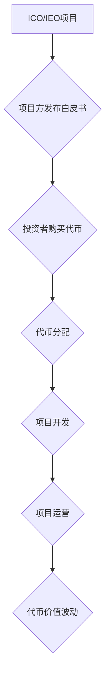

                 

## 程序员如何评估并参与ICO与IEO项目

> 关键词：ICO, IEO, 区块链, 代币, 风险评估, 项目分析, 技术架构, 合规性

## 1. 背景介绍

近年来，区块链技术蓬勃发展，其去中心化、透明和安全等特性吸引了众多开发者和投资者的目光。ICO（首次代币发行）和IEO（首次加密货币发行）作为区块链项目筹集资金的重要方式，也随之涌现。ICO允许项目方发行代币，通过出售代币筹集资金，而IEO则是在加密货币交易所的平台上进行代币发行。

对于程序员而言，参与ICO和IEO项目不仅可以获得潜在的财务回报，更重要的是可以参与到区块链技术的创新和发展中。然而，ICO和IEO市场也存在着一定的风险，例如项目方跑路、代币价格波动等。因此，程序员在参与ICO和IEO项目之前，需要进行充分的评估和分析，以降低风险并提高投资收益。

## 2. 核心概念与联系

### 2.1 ICO与IEO

ICO和IEO都是区块链项目筹集资金的方式，但两者在运作机制和风险控制方面存在着一些差异。

* **ICO (Initial Coin Offering)**：

ICO是指项目方直接发行代币，通过出售代币筹集资金。ICO通常在项目早期阶段进行，项目方会发布白皮书，详细介绍项目的愿景、技术方案和代币经济模型。投资者可以通过购买代币来支持项目的发展，并期待代币价格上涨获得收益。

* **IEO (Initial Exchange Offering)**：

IEO是指项目方在加密货币交易所的平台上发行代币。与ICO相比，IEO更加规范，交易所会对项目进行筛选和审核，降低项目方跑路和欺诈的风险。投资者可以通过在交易所平台上购买代币来支持项目的发展。

### 2.2 区块链技术

区块链技术是支撑ICO和IEO的基础。区块链是一种分布式账本技术，它可以记录和验证交易信息，并确保交易的不可篡改性。

* **分布式账本**: 区块链的账本由多个节点共同维护，而不是由单一机构控制。
* **不可篡改性**: 由于区块链的加密算法和共识机制，一旦交易信息被记录到区块链上，就无法被修改或删除。
* **透明性**: 区块链上的所有交易信息都是公开透明的，任何人都可以查看。

### 2.3 代币经济模型

代币经济模型是ICO和IEO项目的重要组成部分，它描述了代币在项目中的用途、发行量、分配机制等。

* **用途**: 代币可以用于支付项目服务、参与项目治理、获得项目收益等。
* **发行量**: 代币的总发行量决定了代币的稀缺性。
* **分配机制**: 代币的分配机制决定了不同群体获得代币的比例。

**Mermaid 流程图**

## 3. 核心算法原理 & 具体操作步骤

### 3.1 算法原理概述

ICO和IEO项目通常涉及到一些特定的算法，例如加密算法、共识机制、代币分配算法等。

* **加密算法**: 用于保护代币的安全性，防止伪造和盗窃。常见的加密算法包括ECC、RSA等。
* **共识机制**: 用于验证交易信息和达成共识，确保区块链的安全性。常见的共识机制包括PoW、PoS等。
* **代币分配算法**: 用于分配代币，确保公平性和透明性。常见的代币分配算法包括线性分配、时间锁仓等。

### 3.2 算法步骤详解

具体的操作步骤取决于不同的ICO和IEO项目，但一般来说，以下是一些常见的步骤：

1. **项目方发布白皮书**: 白皮书详细介绍了项目的愿景、技术方案、代币经济模型等。
2. **投资者购买代币**: 投资者可以通过购买代币来支持项目的发展。
3. **代币分配**: 项目方根据预设的分配机制，将代币分配给投资者。
4. **项目开发**: 项目方利用筹集的资金进行项目开发。
5. **项目运营**: 项目上线运营，代币开始发挥其功能。

### 3.3 算法优缺点

不同的算法具有不同的优缺点，项目方需要根据项目的具体需求选择合适的算法。

* **PoW**: 优点是安全性高，缺点是耗能大。
* **PoS**: 优点是耗能低，缺点是安全性相对较低。
* **线性分配**: 优点是简单易懂，缺点是分配不均衡。
* **时间锁仓**: 优点是激励长期持有，缺点是流动性较低。

### 3.4 算法应用领域

ICO和IEO项目涉及到多种算法，这些算法在其他领域也具有广泛的应用。

* **加密算法**: 用于网络安全、数据加密等领域。
* **共识机制**: 用于分布式系统、人工智能等领域。
* **代币分配算法**: 用于游戏、供应链管理等领域。

## 4. 数学模型和公式 & 详细讲解 & 举例说明

### 4.1 数学模型构建

ICO和IEO项目的代币经济模型可以抽象为数学模型，用于分析代币的价值和分配机制。

* **代币价值模型**: 可以使用供求关系模型、价值投资模型等来分析代币的价值。
* **代币分配模型**: 可以使用线性分配模型、时间锁仓模型等来分析代币的分配机制。

### 4.2 公式推导过程

例如，我们可以使用以下公式来推导代币的价值：

$$
V = \frac{D}{S}
$$

其中：

* $V$ 代表代币的价值
* $D$ 代表代币的总需求量
* $S$ 代表代币的总供应量

### 4.3 案例分析与讲解

假设一个ICO项目发行1000万个代币，总需求量为5000万个，则代币的价值为：

$$
V = \frac{5000万}{1000万} = 5
$$

这意味着每个代币的价值为5美元。

## 5. 项目实践：代码实例和详细解释说明

### 5.1 开发环境搭建

参与ICO和IEO项目需要搭建相应的开发环境，例如：

* **区块链开发工具**: truffle、web3.js等
* **编程语言**: Solidity、Python等
* **虚拟机**: Ganache、geth等

### 5.2 源代码详细实现

具体代码实现取决于项目的具体需求，但一般来说，需要实现以下功能：

* **代币合约**: 定义代币的属性和功能，例如代币名称、代币符号、发行量、转移规则等。
* **智能合约**: 实现项目的核心逻辑，例如投票机制、数据存储、智能合约调用等。
* **前端界面**: 提供用户交互界面，例如代币购买、代币管理、项目信息查看等。

### 5.3 代码解读与分析

需要对代码进行详细解读和分析，了解代码的功能、逻辑和安全性。

### 5.4 运行结果展示

需要运行代码并测试其功能，确保代码能够正常运行并达到预期效果。

## 6. 实际应用场景

ICO和IEO项目在各个领域都有着广泛的应用场景，例如：

* **去中心化金融 (DeFi)**: 构建去中心化的金融应用，例如借贷、保险、交易等。
* **游戏**: 开发去中心化的游戏，例如NFT游戏、游戏代币等。
* **供应链管理**: 实现供应链的透明化和可追溯性。
* **数据存储**: 提供去中心化的数据存储服务。

### 6.4 未来应用展望

ICO和IEO项目未来将继续发展，并应用于更多领域。例如：

* **元宇宙**: 构建元宇宙的虚拟经济和社会。
* **Web3**: 推动Web3的开发和应用。
* **人工智能**: 开发去中心化的AI应用。

## 7. 工具和资源推荐

### 7.1 学习资源推荐

* **书籍**: 《区块链技术入门》、《智能合约开发指南》
* **在线课程**: Coursera、Udemy等平台上的区块链课程
* **社区**: 区块链技术社区，例如Ethereum社区、Bitcoin社区

### 7.2 开发工具推荐

* **区块链开发工具**: truffle、web3.js、Remix等
* **编程语言**: Solidity、Python、JavaScript等
* **虚拟机**: Ganache、geth、Parity等

### 7.3 相关论文推荐

* **比特币白皮书**: https://bitcoin.org/bitcoin.pdf
* **以太坊白皮书**: https://ethereum.org/en/whitepaper/

## 8. 总结：未来发展趋势与挑战

### 8.1 研究成果总结

ICO和IEO项目已经取得了一定的发展成果，为区块链技术的应用提供了新的模式。

### 8.2 未来发展趋势

ICO和IEO项目未来将朝着更加规范、安全、透明的方向发展。

* **监管加强**: 各国政府将加强对ICO和IEO项目的监管，制定相应的法律法规。
* **技术创新**: 区块链技术将不断创新，例如隐私保护、可扩展性等方面的改进。
* **应用场景拓展**: ICO和IEO项目将应用于更多领域，例如元宇宙、Web3等。

### 8.3 面临的挑战

ICO和IEO项目也面临着一些挑战，例如：

* **项目风险**: 项目方跑路、代币价格波动等风险仍然存在。
* **技术复杂性**: 区块链技术相对复杂，需要程序员具备一定的专业知识。
* **监管不确定性**: 各国对ICO和IEO项目的监管政策不确定性较大。

### 8.4 研究展望

未来，需要进一步研究ICO和IEO项目的风险控制机制、技术架构、监管政策等方面，以推动ICO和IEO项目的健康发展。

## 9. 附录：常见问题与解答

### 9.1 如何评估ICO和IEO项目的风险？

* **项目方背景**: 了解项目方的团队成员、技术实力、项目经验等。
* **白皮书**: 阅读项目的白皮书，了解项目的愿景、技术方案、代币经济模型等。
* **社区**: 关注项目的社区讨论，了解社区对项目的评价和反馈。
* **市场分析**: 分析代币的市场行情，了解代币的价值和风险。

### 9.2 如何参与ICO和IEO项目？

* **选择合适的项目**: 评估项目的风险和收益，选择符合自身需求的项目。
* **注册账户**: 在交易所或项目平台注册账户。
* **购买代币**: 使用加密货币或法币购买代币。
* **安全保管**: 将购买的代币存放在安全的钱包中。

作者：禅与计算机程序设计艺术 / Zen and the Art of Computer Programming 
<end_of_turn>

