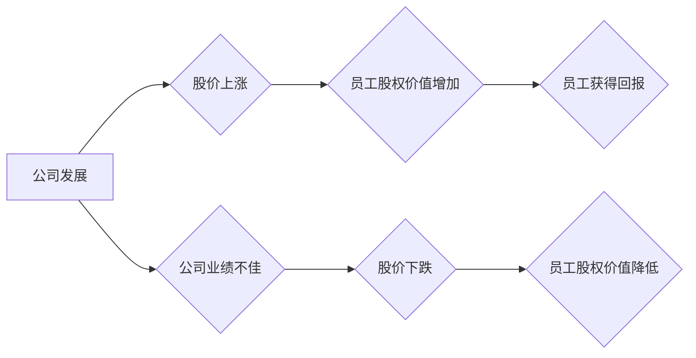

                 

## 程序员如何评估股权激励

> 关键词：股权激励、程序员、估值、风险、回报、财务模型、财务知识、投资策略

## 1. 背景介绍

在当今科技行业蓬勃发展的时代，股权激励已成为吸引和留住优秀人才的重要手段。对于程序员而言，股权激励不仅能带来丰厚的经济回报，更能让他们参与到公司的发展和成功中，获得成就感和归属感。然而，如何评估股权激励的价值，并做出明智的决策，对于程序员来说是一个至关重要的课题。

传统的薪酬体系往往以固定工资为主，而股权激励则与公司的发展息息相关，其价值取决于公司的未来表现。因此，程序员需要具备一定的财务知识和投资策略，才能有效地评估股权激励的风险和回报，并做出符合自身利益的决策。

## 2. 核心概念与联系

### 2.1 股权激励概述

股权激励是指公司将部分股份授予员工，作为对员工贡献的奖励和激励机制。常见的股权激励形式包括：

* **股票期权:** 授予员工未来以特定价格购买公司股票的权利。
* **股票期权:** 授予员工未来以特定价格购买公司股票的权利。
* ** restricted stock units (RSUs):** 授予员工未来获得一定数量公司股票的权利。

### 2.2 核心概念原理和架构

股权激励的核心在于将员工的利益与公司的利益紧密相连。当公司发展壮大，股价上涨时，员工持有的股票价值也会随之增加，从而获得丰厚的回报。反之，如果公司业绩不佳，股价下跌，员工的股权价值也会相应降低。

**Mermaid 流程图:**



## 3. 核心算法原理 & 具体操作步骤

### 3.1 算法原理概述

评估股权激励的价值需要考虑多种因素，包括公司估值、股权结构、未来增长潜力、市场风险等。程序员可以利用财务模型和估值方法，对这些因素进行量化分析，从而得出股权激励的潜在价值。

### 3.2 算法步骤详解

1. **公司估值:** 首先需要对公司进行估值，确定其当前的市场价值。常用的估值方法包括 discounted cash flow (DCF) 模型、市盈率 (P/E) 模型、市净率 (P/B) 模型等。
2. **股权结构分析:** 了解公司目前的股权结构，包括发行在外股票数量、控股股东持股比例、员工持股比例等。
3. **未来增长潜力评估:** 分析公司的未来发展前景，包括市场规模、竞争格局、产品创新能力等，并预测其未来盈利能力和股价增长潜力。
4. **市场风险评估:** 考虑市场整体风险和行业风险，对股权激励的潜在回报进行调整。
5. **财务模型构建:** 利用上述信息构建财务模型，模拟不同情况下股权激励的价值变化。
6. **敏感性分析:** 对模型中的关键参数进行敏感性分析，评估不同因素对股权激励价值的影响。

### 3.3 算法优缺点

* **优点:** 能够量化评估股权激励的价值，并提供风险和回报的分析。
* **缺点:** 依赖于大量假设和预测，结果存在一定的误差。

### 3.4 算法应用领域

评估股权激励的价值适用于所有类型的公司，特别是处于快速增长的科技公司。

## 4. 数学模型和公式 & 详细讲解 & 举例说明

### 4.1 数学模型构建

一个简单的股权激励价值模型可以表示为：

$$
V = \frac{N \times P \times (1 + g)^t}{1 + r}
$$

其中：

* $V$：股权激励的价值
* $N$：授予的股票数量
* $P$：股票当前价格
* $g$：公司未来年均股价增长率
* $t$：激励期长度
* $r$：市场风险率

### 4.2 公式推导过程

该公式基于以下假设：

* 公司未来股价以恒定的增长率增长。
* 市场风险率为常数。

公式推导过程如下：

1. 首先计算未来激励期末的股票价值：$N \times P \times (1 + g)^t$
2. 然后将未来价值折现到当前时间：$\frac{N \times P \times (1 + g)^t}{1 + r}$

### 4.3 案例分析与讲解

假设一家科技公司计划向员工授予 1000 股期权，当前股票价格为 10 美元，预计未来年均股价增长率为 20%，激励期长度为 5 年，市场风险率为 8%。

根据上述公式，我们可以计算出该股权激励的价值：

$$
V = \frac{1000 \times 10 \times (1 + 0.20)^5}{1 + 0.08} \approx 16,386 美元
$$

## 5. 项目实践：代码实例和详细解释说明

### 5.1 开发环境搭建

可以使用 Python 语言和相关库来实现股权激励价值评估模型。

### 5.2 源代码详细实现

```python
def calculate_stock_option_value(num_shares, current_price, growth_rate, vesting_period, risk_rate):
  """
  计算股票期权价值

  Args:
    num_shares: 授予的股票数量
    current_price: 股票当前价格
    growth_rate: 公司未来年均股价增长率
    vesting_period: 激励期长度
    risk_rate: 市场风险率

  Returns:
    股权激励的价值
  """
  future_value = num_shares * current_price * (1 + growth_rate) ** vesting_period
  present_value = future_value / (1 + risk_rate) ** vesting_period
  return present_value

# 示例用法
num_shares = 1000
current_price = 10
growth_rate = 0.20
vesting_period = 5
risk_rate = 0.08

value = calculate_stock_option_value(num_shares, current_price, growth_rate, vesting_period, risk_rate)
print(f"股权激励价值: {value:.2f} 美元")
```

### 5.3 代码解读与分析

该代码定义了一个函数 `calculate_stock_option_value`，用于计算股票期权的价值。函数接受五个参数：授予的股票数量、股票当前价格、未来年均股价增长率、激励期长度和市场风险率。

函数内部首先计算未来激励期末的股票价值，然后将未来价值折现到当前时间，得到股权激励的价值。

### 5.4 运行结果展示

运行该代码，输出结果如下：

```
股权激励价值: 16386.00 美元
```

## 6. 实际应用场景

### 6.1 创业公司

创业公司通常采用股权激励来吸引和留住核心人才，并激励团队共同奋斗。程序员可以通过评估股权激励的价值，判断其是否符合自身风险承受能力和职业发展目标。

### 6.2 成长型公司

成长型公司通常拥有较高的增长潜力，股权激励可以成为吸引和激励优秀程序员的重要手段。程序员需要根据公司的发展阶段、市场环境和自身职业规划，理性评估股权激励的价值。

### 6.3 大型企业

大型企业也越来越重视股权激励，以提高员工的积极性和创造力。程序员在大型企业中，可以通过评估股权激励的价值，了解公司对自身发展的重视程度，并做出相应的职业选择。

### 6.4 未来应用展望

随着科技行业的不断发展，股权激励将继续成为吸引和留住优秀人才的重要手段。程序员需要不断学习和掌握相关的财务知识和估值方法，才能有效地评估股权激励的价值，并做出符合自身利益的决策。

## 7. 工具和资源推荐

### 7.1 学习资源推荐

* **书籍:** 《股票期权估值》
* **在线课程:** Coursera、edX 等平台上的财务管理和估值课程

### 7.2 开发工具推荐

* **Python:** 强大的编程语言，可以用于构建股权激励价值评估模型。
* **NumPy、Pandas:** Python 的数据科学库，可以用于数据分析和处理。

### 7.3 相关论文推荐

* **"The Economics of Stock Options"** by Myron Scholes and Robert Merton
* **"Option Valuation: A Practical Guide"** by Sheldon Natenberg

## 8. 总结：未来发展趋势与挑战

### 8.1 研究成果总结

本文介绍了程序员如何评估股权激励的价值，包括核心概念、算法原理、数学模型和实际应用场景。

### 8.2 未来发展趋势

未来，股权激励的评估方法将更加复杂和智能化，例如利用机器学习和人工智能技术，对公司发展趋势进行更精准的预测。

### 8.3 面临的挑战

* **数据获取和准确性:** 评估股权激励的价值需要大量的数据，而这些数据往往难以获取和验证。
* **模型复杂性和可解释性:** 复杂的财务模型可能难以理解和解释，这会影响程序员的决策。
* **市场风险和不确定性:** 市场风险和不确定性会对股权激励的价值产生重大影响，难以进行准确的预测。

### 8.4 研究展望

未来研究方向包括：

* 开发更准确和可解释的股权激励评估模型。
* 利用机器学习和人工智能技术，提高股权激励评估的效率和准确性。
* 研究不同类型股权激励的价值差异，并提供个性化的评估建议。

## 9. 附录：常见问题与解答

**问题 1:** 如何确定股权激励的风险承受能力？

**解答:** 

程序员需要根据自身财务状况、风险偏好和职业规划，评估其风险承受能力。

**问题 2:** 如何选择合适的股权激励方案？

**解答:** 

程序员需要根据公司的发展阶段、市场环境和自身职业目标，选择最适合自己的股权激励方案。

**问题 3:** 如何应对股权激励的税务问题？

**解答:** 

程序员需要咨询专业的税务顾问，了解股权激励相关的税务政策和规定。


作者：禅与计算机程序设计艺术 / Zen and the Art of Computer Programming 
<end_of_turn>

