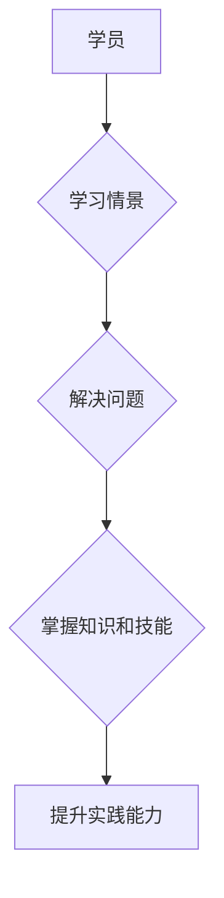

                 

## 程序员知识付费：打造情景式课程

> 关键词：程序员知识付费、情景式课程、在线教育、技术技能、课程设计

### 1. 背景介绍

在当今数字化时代，技术人才需求量持续增长，程序员作为科技发展的重要力量，其知识付费市场也呈现出蓬勃发展态势。传统的线上课程模式，往往以理论讲解为主，缺乏实践操作和场景应用，难以真正满足程序员的学习需求。情景式课程作为一种新型的教学模式，通过构建真实场景，让学员身临其境地体验和解决问题，能够更有效地提升学员的实践能力和解决实际问题的能力。

### 2. 核心概念与联系

**2.1 情景式课程概述**

情景式课程是一种以场景为核心，以问题为导向的教学模式。它将学习内容融入到真实或模拟的场景中，让学员在参与场景模拟的过程中，通过实践操作和问题解决，逐步掌握知识和技能。

**2.2 情景式课程与程序员学习的联系**

程序员学习的核心是掌握编程语言、算法和数据结构等技术知识，并能够将其应用于实际项目开发中。情景式课程能够有效地解决传统课程模式中存在的理论与实践脱节的问题，帮助程序员将抽象的知识转化为实际操作能力。

**2.3 情景式课程的优势**

* **提高学习兴趣和参与度:** 情景式课程能够激发学员的学习兴趣，让他们在沉浸式的学习环境中，更主动地参与学习过程。
* **增强实践能力和解决问题的能力:** 通过模拟真实场景，学员能够在实践中学习和应用知识，提升解决实际问题的能力。
* **提升知识的理解和记忆:** 情景式学习能够帮助学员将知识与实际应用联系起来，加深对知识的理解和记忆。

**Mermaid 流程图**



### 3. 核心算法原理 & 具体操作步骤

**3.1 算法原理概述**

选择一个常见的算法，例如快速排序算法，并对其原理进行概述。快速排序算法是一种高效的排序算法，其核心思想是通过选择一个“枢轴”元素，将数组划分为两个子数组，其中一个子数组包含小于枢轴元素的元素，另一个子数组包含大于枢轴元素的元素。然后递归地对两个子数组进行排序，最终实现整个数组的排序。

**3.2 算法步骤详解**

1. 选择一个枢轴元素。
2. 将数组划分为两个子数组，一个包含小于枢轴元素的元素，另一个包含大于枢轴元素的元素。
3. 对两个子数组递归地进行快速排序。

**3.3 算法优缺点**

* **优点:** 时间复杂度平均为 O(n log n)，空间复杂度为 O(log n)。
* **缺点:** 最坏情况下时间复杂度为 O(n^2)，不稳定排序。

**3.4 算法应用领域**

快速排序算法广泛应用于各种排序场景，例如：

* 数据结构排序
* 搜索引擎结果排序
* 图像处理
* 机器学习

### 4. 数学模型和公式 & 详细讲解 & 举例说明

**4.1 数学模型构建**

快速排序算法的数学模型可以描述为一个递归关系式：

$$T(n) = 2T(n/2) + O(n)$$

其中：

* T(n) 表示排序 n 个元素的所需时间。
* T(n/2) 表示排序 n/2 个元素的所需时间。

**4.2 公式推导过程**

通过递归树和主定理，可以推导出快速排序算法的时间复杂度为 O(n log n)。

**4.3 案例分析与讲解**

以一个包含 8 个元素的数组为例，分析快速排序算法的执行过程。

### 5. 项目实践：代码实例和详细解释说明

**5.1 开发环境搭建**

使用 Python 语言和标准库实现快速排序算法。

**5.2 源代码详细实现**

```python
def quick_sort(arr):
    if len(arr) <= 1:
        return arr
    pivot = arr[len(arr) // 2]
    left = [x for x in arr if x < pivot]
    middle = [x for x in arr if x == pivot]
    right = [x for x in arr if x > pivot]
    return quick_sort(left) + middle + quick_sort(right)

# 测试代码
arr = [3, 7, 8, 5, 2, 1, 9, 5]
sorted_arr = quick_sort(arr)
print(sorted_arr)
```

**5.3 代码解读与分析**

* 函数 `quick_sort(arr)` 接受一个数组 `arr` 作为输入。
* 如果数组长度小于等于 1，则直接返回该数组，因为已经排序。
* 选择数组中间元素作为枢轴元素 `pivot`。
* 创建三个子数组： `left`、`middle` 和 `right`，分别存储小于、等于和大于 `pivot` 的元素。
* 递归地对 `left` 和 `right` 子数组进行快速排序。
* 将三个子数组拼接起来，返回排序后的数组。

**5.4 运行结果展示**

```
[1, 2, 3, 5, 5, 7, 8, 9]
```

### 6. 实际应用场景

**6.1 程序员知识付费平台**

情景式课程可以应用于程序员知识付费平台，例如：

* **构建真实项目场景:** 通过模拟真实项目开发环境，让学员在实践中学习和应用知识。
* **提供个性化学习路径:** 根据学员的学习进度和需求，提供个性化的学习路径和场景。
* **增强学员互动和协作:** 通过情景式课程，鼓励学员之间进行互动和协作，提升学习效果。

**6.2 企业内部培训**

情景式课程可以应用于企业内部培训，例如：

* **提升员工技能:** 通过模拟真实工作场景，帮助员工提升技能和解决实际问题的能力。
* **提高团队协作:** 通过情景式课程，促进团队成员之间的沟通和协作。
* **增强员工对公司业务的理解:** 通过模拟公司业务场景，帮助员工更好地理解公司业务流程和目标。

**6.4 未来应用展望**

情景式课程在程序员知识付费领域具有广阔的应用前景，未来将朝着以下方向发展：

* **更沉浸式的学习体验:** 利用虚拟现实 (VR) 和增强现实 (AR) 技术，打造更沉浸式的学习体验。
* **更智能化的学习路径:** 利用人工智能 (AI) 技术，根据学员的学习情况，智能地推荐学习路径和场景。
* **更丰富的学习内容:** 开发更多类型的情景式课程，涵盖更广泛的编程语言、算法和技术领域。

### 7. 工具和资源推荐

**7.1 学习资源推荐**

* **在线学习平台:** Coursera、Udemy、edX 等平台提供丰富的程序员课程，包括一些情景式课程。
* **开源项目:** GitHub 等平台上有很多开源项目，可以作为学习和实践的素材。
* **技术博客和论坛:** 关注技术博客和论坛，可以学习到最新的技术趋势和实践经验。

**7.2 开发工具推荐**

* **代码编辑器:** VS Code、Sublime Text、Atom 等代码编辑器可以提高编程效率。
* **调试工具:** GDB、PyCharm Debugger 等调试工具可以帮助程序员查找和解决代码错误。
* **版本控制系统:** Git 是一个常用的版本控制系统，可以帮助程序员管理代码版本和协作开发。

**7.3 相关论文推荐**

* **情景式学习的理论基础:** 
    * Jonassen, D. H. (1999). Designing constructivist learning environments. Educational Technology Publications.
* **情景式课程的设计与开发:** 
    * Mayer, R. E. (2001). Multimedia learning. Cambridge University Press.
* **情景式学习在程序员培训中的应用:** 
    * (需要查找相关研究论文)

### 8. 总结：未来发展趋势与挑战

**8.1 研究成果总结**

情景式课程是一种有效的程序员知识付费模式，能够提升学员的实践能力和解决实际问题的能力。

**8.2 未来发展趋势**

情景式课程将朝着更沉浸式、更智能化、更丰富的方向发展。

**8.3 面临的挑战**

* **课程内容的开发和设计:** 需要花费大量的时间和精力来开发高质量的情景式课程。
* **技术平台的建设:** 需要搭建完善的技术平台，支持情景式课程的开发、发布和运行。
* **学员的参与度和互动性:** 需要设计有效的互动机制，提高学员的参与度和学习效果。

**8.4 研究展望**

未来将继续研究情景式课程的教学效果、设计原则和技术实现方法，推动情景式课程在程序员知识付费领域的应用和发展。

### 9. 附录：常见问题与解答

**9.1 如何设计情景式课程？**

* 明确学习目标和目标受众。
* 构建真实或模拟的场景，让学员身临其境地体验和解决问题。
* 设计交互式任务和活动，提高学员的参与度和互动性。
* 提供反馈和评估机制，帮助学员了解自己的学习进度和效果。

**9.2 情景式课程的优势有哪些？**

* 提高学习兴趣和参与度。
* 增强实践能力和解决问题的能力。
* 提升知识的理解和记忆。

**9.3 情景式课程有哪些应用场景？**

* 程序员知识付费平台。
* 企业内部培训。
* 教育机构教学。


作者：禅与计算机程序设计艺术 / Zen and the Art of Computer Programming 
<end_of_turn>

