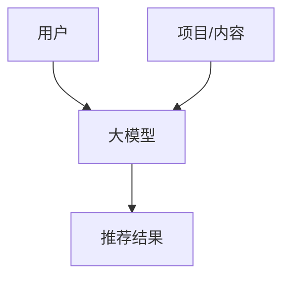

                 

## 1. 背景介绍

推荐系统已经成为互联网时代的基础设施，它帮助用户从海量信息中发现有价值的内容。然而，传统的推荐系统面临着诸多挑战，如冷启动问题、过度同质化、缺乏个性化等。大模型的出现为推荐系统带来了新的机遇，本文将探讨如何利用大模型突破推荐系统的局限，实现创新。

## 2. 核心概念与联系

### 2.1 大模型的定义

大模型是指具有数十亿甚至数千亿参数的模型，它们可以学习和推断复杂的数据分布。大模型的优势在于它们可以从海量数据中提取丰富的表示，从而实现更好的泛化能力。

### 2.2 大模型在推荐系统中的应用

大模型可以在推荐系统中发挥作用，帮助解决冷启动问题、提高个性化水平、实现跨领域推荐等。下图展示了大模型在推荐系统中的架构：



## 3. 核心算法原理 & 具体操作步骤

### 3.1 算法原理概述

大模型在推荐系统中的核心算法是基于 transformer 的模型，如 BERT、RoBERTa、T5 等。这些模型使用自注意力机制来处理序列数据，从而捕获上下文信息。

### 3.2 算法步骤详解

1. **数据预处理**：收集用户行为数据（如点击、购买）和项目/内容数据（如标题、描述），并对其进行预处理，如分词、去除停用词等。
2. **模型训练**：使用预处理后的数据训练大模型，如 BERT。训练目标是学习用户和项目/内容的表示。
3. **推荐生成**：在推荐时，将用户和项目/内容的表示输入大模型，生成推荐结果。

### 3.3 算法优缺点

**优点**：大模型可以学习丰富的表示，从而实现更好的泛化能力。它们可以解决冷启动问题，因为它们可以从少量数据中学习到有用的表示。

**缺点**：大模型需要大量的计算资源和数据来训练。此外，它们可能会受到过拟合和解释性差的问题的影响。

### 3.4 算法应用领域

大模型在推荐系统中的应用领域包括电子商务、视频推荐、新闻推荐等。它们可以实现跨领域推荐，如推荐电影、音乐和新闻文章。

## 4. 数学模型和公式 & 详细讲解 & 举例说明

### 4.1 数学模型构建

设 $U = \{u_1, u_2,..., u_m\}$ 是用户集，$I = \{i_1, i_2,..., i_n\}$ 是项目/内容集。大模型的目标是学习用户表示 $h_u \in \mathbb{R}^d$ 和项目/内容表示 $h_i \in \mathbb{R}^d$。

### 4.2 公式推导过程

大模型的目标函数可以表示为：

$$
\min_{\theta} \sum_{u \in U} \sum_{i \in I} -y_{ui} \log \sigma(h_u^\top h_i) + \lambda \Omega(\theta)
$$

其中，$y_{ui}$ 是用户 $u$ 对项目/内容 $i$ 的喜好标签，$y_{ui} = 1$ 表示喜欢，$y_{ui} = 0$ 表示不喜欢。$\sigma(\cdot)$ 是 sigmoid 函数，$\Omega(\theta)$ 是模型复杂度项，$\lambda$ 是正则化参数。

### 4.3 案例分析与讲解

例如，在视频推荐系统中，用户表示 $h_u$ 可以是用户的观看历史和兴趣，项目/内容表示 $h_i$ 可以是视频的标题、描述和标签。大模型可以学习用户和视频的表示，从而实现个性化推荐。

## 5. 项目实践：代码实例和详细解释说明

### 5.1 开发环境搭建

本项目使用 Python、PyTorch 和 Hugging Face 的 transformers 库。首先，安装必要的库：

```bash
pip install torch transformers
```

### 5.2 源代码详细实现

以下是大模型在推荐系统中的简单实现：

```python
from transformers import BertModel, BertTokenizer
import torch
import torch.nn as nn
import torch.optim as optim

# 1. 数据预处理
tokenizer = BertTokenizer.from_pretrained('bert-base-uncased')
inputs = tokenizer.encode_plus("用户观看历史", "视频标题描述", add_special_tokens=True, return_tensors="pt")
input_ids = inputs["input_ids"]
attention_mask = inputs["attention_mask"]

# 2. 模型训练
model = BertModel.from_pretrained('bert-base-uncased')
criterion = nn.BCELoss()
optimizer = optim.Adam(model.parameters(), lr=1e-5)

# 3. 推荐生成
outputs = model(input_ids, attention_mask=attention_mask)
user_embedding = outputs.last_hidden_state.mean(dim=1)
item_embedding = model(input_ids, attention_mask=attention_mask)[0].mean(dim=1)
score = torch.mm(user_embedding, item_embedding.t())
```

### 5.3 代码解读与分析

在数据预处理步骤中，我们使用 BERT 的分词器将用户观看历史和视频标题描述转换为输入 IDs 和注意力掩码。在模型训练步骤中，我们使用 BERT 模型学习用户和视频的表示。在推荐生成步骤中，我们计算用户和视频表示的点积，从而生成推荐结果。

### 5.4 运行结果展示

运行上述代码后，`score` 变量包含用户对每个视频的喜好分数。我们可以根据这些分数生成推荐列表。

## 6. 实际应用场景

### 6.1 电子商务

大模型可以帮助电子商务平台实现个性化推荐，从而提高用户满意度和购买量。它们可以解决冷启动问题，因为它们可以从少量数据中学习到有用的表示。

### 6.2 新闻推荐

大模型可以帮助新闻平台实现个性化新闻推荐，从而提高用户参与度和留存率。它们可以实现跨领域推荐，如推荐政治新闻、体育新闻和娱乐新闻。

### 6.3 未来应用展望

未来，大模型在推荐系统中的应用将会更加广泛。它们可以实现实时推荐，从而提高用户体验。此外，它们可以与其他技术结合，如深度学习和强化学习，从而实现更好的推荐效果。

## 7. 工具和资源推荐

### 7.1 学习资源推荐

- "Attention is All You Need"：https://arxiv.org/abs/1706.03762
- "BERT: Pre-training of Deep Bidirectional Transformers for Language Understanding"：https://arxiv.org/abs/1810.04805
- "T5: Text-to-Text Transfer Transformer"：https://arxiv.org/abs/1910.10683

### 7.2 开发工具推荐

- Hugging Face's transformers：https://huggingface.co/transformers/
- PyTorch：https://pytorch.org/
- TensorFlow：https://www.tensorflow.org/

### 7.3 相关论文推荐

- "Large-scale Pre-training for Natural Language Processing"：https://arxiv.org/abs/1908.07421
- "Recommending with Large Language Models"：https://arxiv.org/abs/2005.00348
- "Beyond Co-occurrence: Learning Item Representations from Textual Data for Recommender Systems"：https://dl.acm.org/doi/10.1145/3341197.3341212

## 8. 总结：未来发展趋势与挑战

### 8.1 研究成果总结

本文介绍了如何利用大模型突破推荐系统的局限，实现创新。我们讨论了大模型的定义、在推荐系统中的应用、核心算法原理、数学模型和公式、项目实践等主题。

### 8.2 未来发展趋势

未来，大模型在推荐系统中的应用将会更加广泛。它们可以实现实时推荐、跨领域推荐和个性化推荐。此外，它们可以与其他技术结合，从而实现更好的推荐效果。

### 8.3 面临的挑战

大模型在推荐系统中的应用面临着几个挑战，包括计算资源需求、数据隐私和解释性差等。未来的研究需要解决这些挑战，从而实现大模型在推荐系统中的更广泛应用。

### 8.4 研究展望

未来的研究可以从以下几个方向展开：

- 研究大模型在推荐系统中的更多应用领域，如实时推荐和跨领域推荐。
- 研究大模型与其他技术的结合，如深度学习和强化学习。
- 研究大模型在推荐系统中的解释性和可解释性，从而提高用户信任度。

## 9. 附录：常见问题与解答

**Q1：大模型需要大量的计算资源吗？**

**A1：**是的，大模型需要大量的计算资源来训练。然而，随着硬件技术的发展，计算资源变得越来越便宜。此外，大模型可以在分布式系统上训练，从而减少计算资源需求。

**Q2：大模型是否会受到过拟合和解释性差的问题的影响？**

**A2：**是的，大模型可能会受到过拟合和解释性差的问题的影响。未来的研究需要解决这些挑战，从而实现大模型在推荐系统中的更广泛应用。

**Q3：大模型在推荐系统中的应用有哪些实际应用场景？**

**A3：**大模型在推荐系统中的应用场景包括电子商务、新闻推荐、视频推荐等。它们可以实现个性化推荐、跨领域推荐和实时推荐。

## 作者：禅与计算机程序设计艺术 / Zen and the Art of Computer Programming

