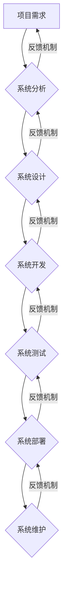

                 

##  系统思考对于管理复杂项目的重要性

> 关键词：系统思考、复杂项目、项目管理、系统架构、系统设计、迭代开发、风险管理、团队协作

### 1. 背景介绍

在当今科技日新月异的时代，软件开发项目越来越复杂，涉及的领域更加广泛，团队规模也越来越庞大。传统的项目管理方法论在面对这些复杂项目时，往往显得力不从心。 

传统项目管理方法通常采用瀑布式开发模式，将项目划分为多个独立的阶段，每个阶段完成之后再进入下一个阶段。这种模式在项目规模较小、需求相对稳定时较为适用，但对于复杂项目来说，其局限性显现：

* **缺乏灵活性:** 瀑布式开发模式对需求变化的适应性较差，一旦需求发生变化，可能需要重新启动整个项目，导致时间和成本大幅增加。
* **难以应对风险:** 瀑布式开发模式在项目后期才开始进行风险评估和控制，一旦风险爆发，难以及时有效地进行应对。
* **沟通障碍:** 不同阶段的团队之间缺乏有效的沟通，导致信息传递不畅，项目进度难以协调。

面对这些挑战，系统思考成为管理复杂项目的重要方法论。

### 2. 核心概念与联系

系统思考是一种以整体为导向的思维方式，强调系统内部各个部分之间的相互联系和相互影响。它认为，任何一个系统都是由多个相互关联的子系统组成的，每个子系统都对整个系统的行为产生影响。

**系统思考的核心概念包括：**

* **系统:** 一个由相互关联的子系统组成的整体。
* **子系统:** 系统中的一个独立部分，它与其他子系统相互作用，共同构成整个系统。
* **反馈机制:** 系统中子系统之间的相互作用，导致系统状态发生变化。
* **边界:** 系统与外部环境的分界线。
* **视域:** 系统思考者对系统的理解范围。

**系统思考与项目管理的关系:**

系统思考可以帮助项目经理更好地理解项目作为一个复杂系统的运作机制，从而制定更有效的项目管理策略。

**系统思考与项目管理的联系可以用以下流程图表示:**



### 3. 核心算法原理 & 具体操作步骤

系统思考的核心算法并非一个具体的算法，而是基于系统分析、系统设计、系统开发、系统测试、系统部署、系统维护等多个环节的迭代循环和反馈机制。

**3.1 算法原理概述**

系统思考的核心算法原理是基于以下几个方面：

* **分解与整合:** 将复杂项目分解成多个子系统，并通过系统设计将子系统整合在一起。
* **迭代开发:** 通过多次迭代开发，不断完善系统设计和实现，并根据反馈进行调整。
* **风险管理:** 在项目各个阶段进行风险评估和控制，并制定相应的应急预案。
* **团队协作:** 鼓励团队成员之间进行有效的沟通和协作，共同解决问题。

**3.2 算法步骤详解**

系统思考的算法步骤可以概括为以下几个阶段：

1. **项目需求分析:** 首先需要对项目需求进行详细分析，明确项目的目标、范围、功能、性能等要求。
2. **系统架构设计:** 根据项目需求，设计系统的整体架构，包括子系统划分、数据流、接口定义等。
3. **系统模块开发:** 将系统架构分解成多个模块，并进行模块开发。
4. **系统测试:** 对开发完成的模块进行测试，确保模块功能正确、性能满足要求。
5. **系统集成:** 将各个模块集成在一起，形成完整的系统。
6. **系统部署:** 将系统部署到生产环境，并进行上线测试。
7. **系统维护:** 对上线后的系统进行维护和更新，确保系统稳定运行。

**3.3 算法优缺点**

**优点:**

* **适应性强:** 系统思考的迭代开发模式能够适应需求变化，并及时进行调整。
* **风险控制:** 通过在项目各个阶段进行风险评估和控制，能够有效地降低项目风险。
* **团队协作:** 系统思考强调团队协作，能够提高团队效率和项目质量。

**缺点:**

* **复杂度高:** 系统思考需要对项目进行全面的分析和设计，复杂度较高。
* **需要经验:** 系统思考需要项目经理具备一定的经验和技能，才能有效地应用。

**3.4 算法应用领域**

系统思考的应用领域非常广泛，包括软件开发、硬件设计、金融管理、医疗保健、教育等各个领域。

### 4. 数学模型和公式 & 详细讲解 & 举例说明

系统思考中常用的数学模型包括：

* **反馈回路模型:** 用于描述系统中子系统之间的相互作用和反馈机制。
* **系统动力学模型:** 用于模拟系统随时间变化的行为。
* **网络模型:** 用于描述系统中各个子系统之间的连接关系。

**4.1 数学模型构建**

构建系统数学模型需要根据系统的具体情况，选择合适的模型类型，并进行参数化。例如，对于一个软件开发项目，可以使用反馈回路模型来描述开发、测试、部署等环节之间的相互作用。

**4.2 公式推导过程**

系统动力学模型的公式推导过程通常涉及微分方程和差分方程。例如，一个简单的系统动力学模型可以描述人口增长，其公式为：

$$
\frac{dP}{dt} = rP(1-\frac{P}{K})
$$

其中：

* $P$ 表示人口数量
* $t$ 表示时间
* $r$ 表示人口增长率
* $K$ 表示环境承载力

**4.3 案例分析与讲解**

**案例:** 

假设一个软件开发项目，其开发时间和测试时间之间存在反馈机制。开发时间越短，测试时间越长，反之亦然。

**分析:**

我们可以使用反馈回路模型来描述这种关系。开发时间和测试时间可以看作是两个变量，它们之间存在负反馈关系。

**解释:**

当开发时间缩短时，测试时间会延长，因为需要更多的时间来测试缩短开发周期带来的潜在问题。反之，当开发时间延长时，测试时间会缩短，因为开发人员已经对代码进行了充分的测试。

### 5. 项目实践：代码实例和详细解释说明

系统思考在实际项目实践中，需要结合具体的项目需求和技术环境进行应用。以下是一个简单的代码实例，演示了如何使用系统思考的迭代开发模式进行软件开发。

**5.1 开发环境搭建**

* 操作系统: Ubuntu 20.04 LTS
* 编程语言: Python 3.8
* 开发工具: VS Code

**5.2 源代码详细实现**

```python
# 系统设计文档
# 系统名称: 简单任务管理系统
# 系统功能: 用户可以创建任务，设置任务优先级，查看任务列表，标记任务完成

# 模块划分:
# 1. 任务管理模块
# 2. 用户管理模块
# 3. 数据存储模块

# 迭代开发计划:
# 第一次迭代: 实现任务管理模块的基本功能
# 第二次迭代: 实现用户管理模块的基本功能
# 第三次迭代: 实现数据存储功能

# 任务管理模块代码示例
class Task:
    def __init__(self, title, priority):
        self.title = title
        self.priority = priority
        self.completed = False

    def mark_completed(self):
        self.completed = True

# 用户管理模块代码示例
class User:
    def __init__(self, name):
        self.name = name
        self.tasks = []

    def add_task(self, task):
        self.tasks.append(task)

# 数据存储模块代码示例
def save_tasks(tasks):
    # 将任务数据保存到文件或数据库中

# 运行代码示例
user = User("Alice")
task1 = Task("写代码", "高")
task2 = Task("写文档", "低")
user.add_task(task1)
user.add_task(task2)
```

**5.3 代码解读与分析**

* 代码示例展示了系统设计文档、模块划分、迭代开发计划等系统思考的各个环节。
* 任务管理模块和用户管理模块分别实现了任务创建和用户管理的基本功能。
* 数据存储模块代码示例展示了如何将任务数据保存到文件或数据库中。

**5.4 运行结果展示**

运行代码后，可以创建任务，设置任务优先级，查看任务列表，标记任务完成等操作。

### 6. 实际应用场景

系统思考在实际项目实践中，可以应用于各种场景，例如：

* **软件开发项目:** 帮助项目经理更好地理解项目复杂性，制定更有效的项目管理策略，提高项目成功率。
* **硬件设计项目:** 帮助工程师更好地理解硬件系统之间的相互作用，设计更可靠、更高效的硬件系统。
* **金融管理项目:** 帮助金融机构更好地理解金融市场复杂性，制定更有效的风险管理策略。
* **医疗保健项目:** 帮助医疗机构更好地理解患者需求，提供更个性化的医疗服务。

**6.4 未来应用展望**

随着人工智能、大数据等技术的不断发展，系统思考在未来将有更广泛的应用场景。例如，可以用于预测系统行为、优化系统性能、自动生成系统设计方案等。

### 7. 工具和资源推荐

**7.1 学习资源推荐**

* **书籍:**
    * 《系统思考》 - Peter Senge
    * 《第五项修炼》 - Jim Collins
    * 《复杂》 - Melanie Mitchell
* **在线课程:**
    * Coursera: Systems Thinking
    * edX: Systems Thinking for Sustainability

**7.2 开发工具推荐**

* **UML工具:**
    * Lucidchart
    * Draw.io
* **项目管理工具:**
    * Jira
    * Trello

**7.3 相关论文推荐**

* **The Fifth Discipline: The Art and Practice of the Learning Organization** - Peter Senge
* **Complexity: A Guided Tour** - Melanie Mitchell
* **Systems Thinking for Sustainability** - Donella Meadows

### 8. 总结：未来发展趋势与挑战

**8.1 研究成果总结**

系统思考已经成为管理复杂项目的重要方法论，它能够帮助项目经理更好地理解项目复杂性，制定更有效的项目管理策略，提高项目成功率。

**8.2 未来发展趋势**

未来，系统思考将与人工智能、大数据等技术融合，更加深入地应用于项目管理领域。例如，可以利用人工智能技术自动生成系统设计方案，利用大数据技术预测系统行为，从而提高项目管理的效率和准确性。

**8.3 面临的挑战**

系统思考的应用也面临着一些挑战，例如：

* **需要专业的知识和技能:** 系统思考的应用需要项目经理具备一定的系统思维能力和项目管理经验。
* **需要跨部门协作:** 系统思考的应用需要各个部门之间进行有效的沟通和协作。
* **需要不断迭代和改进:** 系统思考是一个动态的过程，需要不断地迭代和改进，才能更好地适应项目需求的变化。

**8.4 研究展望**

未来，需要进一步研究系统思考的应用方法，开发更有效的系统思考工具，培养更多具备系统思维能力的项目管理人才。


### 9. 附录：常见问题与解答

**常见问题:**

* 系统思考和传统项目管理有什么区别？
* 如何应用系统思考到实际项目中？
* 系统思考的应用有哪些局限性？

**解答:**

* 系统思考和传统项目管理的区别在于，系统思考强调系统整体的运作机制，而传统项目管理则更关注各个阶段的独立完成。
* 应用系统思考到实际项目中，需要首先进行系统分析，明确项目需求和目标，然后进行系统设计，将系统分解成多个子系统，并进行模块开发、测试、集成和部署。
* 系统思考的应用也面临着一些局限性，例如需要专业的知识和技能，需要跨部门协作，需要不断迭代和改进。


作者：禅与计算机程序设计艺术 / Zen and the Art of Computer Programming 
<end_of_turn>

