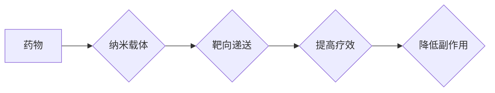

                 

## 纳米技术在药物递送中的应用：提高治疗效果

> 关键词：纳米技术、药物递送、靶向治疗、生物相容性、载体、递送效率、副作用

## 1. 背景介绍

药物递送一直是医学领域面临的重大挑战之一。传统的药物递送方式存在着诸多局限性，例如药物在体内分布不均匀、药物代谢快、副作用大等问题。这些局限性限制了药物治疗的疗效和安全性。

纳米技术的发展为药物递送领域带来了新的机遇。纳米材料具有独特的物理化学性质，例如高比表面积、可控尺寸、良好的生物相容性等，使其成为理想的药物载体。纳米药物递送系统可以将药物包裹在纳米颗粒中，通过改变纳米颗粒的表面性质和结构，实现对药物的精准控制，提高药物的靶向性、递送效率和生物利用度，同时降低药物的副作用。

## 2. 核心概念与联系

### 2.1 纳米技术

纳米技术是指对物质进行微观操控，其尺度范围通常在1到100纳米之间。在这个尺度下，物质的物理、化学和生物学性质会发生显著变化，展现出独特的特性。纳米材料具有以下特点：

* **高比表面积:** 纳米材料的表面积与体积比远远大于宏观材料，这使得它们具有更高的活性。
* **量子效应:** 当材料尺寸减小到纳米级时，量子效应会变得显著，导致材料的电子结构和光学性质发生变化。
* **可控尺寸和形状:** 纳米材料的尺寸和形状可以精确控制，这为其在药物递送中的应用提供了更大的灵活性。

### 2.2 药物递送

药物递送是指将药物从给药部位输送到目标组织或细胞的过程。传统的药物递送方式存在着以下问题：

* **药物分布不均匀:** 药物在体内分布不均匀，导致某些组织或细胞无法获得足够的药物浓度。
* **药物代谢快:** 药物在体内代谢速度快，导致药物在体内停留时间短，疗效降低。
* **副作用大:** 药物在非目标组织或细胞的积累会导致副作用。

### 2.3 纳米药物递送系统

纳米药物递送系统是指利用纳米材料作为载体，将药物包裹在纳米颗粒中，实现对药物的精准控制，提高药物的靶向性、递送效率和生物利用度，同时降低药物的副作用。

**Mermaid 流程图**



## 3. 核心算法原理 & 具体操作步骤

### 3.1 算法原理概述

纳米药物递送系统的设计和开发需要考虑多种因素，包括纳米材料的选择、药物负载量、表面修饰、递送途径等。常用的纳米药物递送系统包括脂质体、聚合物纳米颗粒、金纳米颗粒等。

### 3.2 算法步骤详解

1. **纳米载体选择:** 根据药物的性质和治疗目标选择合适的纳米载体。例如，脂质体适合递送水溶性药物，聚合物纳米颗粒适合递送脂溶性药物。
2. **药物负载:** 将药物负载到纳米载体中。可以通过物理吸附、包封、共沉淀等方法实现药物负载。
3. **表面修饰:** 对纳米载体的表面进行修饰，提高其生物相容性、靶向性、稳定性等。常用的表面修饰方法包括共价键合、静电吸附、包被等。
4. **递送途径选择:** 根据药物的治疗目标选择合适的递送途径。例如，静脉注射、口服、鼻腔喷雾等。
5. **体内分布和代谢研究:** 研究纳米药物递送系统的体内分布和代谢情况，评估其安全性。

### 3.3 算法优缺点

**优点:**

* **提高药物靶向性:** 纳米载体可以靶向递送药物到特定组织或细胞，提高药物的治疗效果。
* **提高药物递送效率:** 纳米载体可以保护药物免受体内酶的降解，延长药物在体内的停留时间，提高药物的生物利用度。
* **降低药物副作用:** 纳米载体可以将药物集中递送至目标部位，减少药物对非目标组织或细胞的损害。

**缺点:**

* **纳米材料的安全性:** 一些纳米材料可能对人体健康造成潜在的风险。
* **纳米药物递送系统的制备工艺复杂:** 制备纳米药物递送系统需要复杂的工艺操作和设备。
* **纳米药物递送系统的成本高:** 纳米药物递送系统的制备成本较高。

### 3.4 算法应用领域

纳米药物递送技术在以下领域具有广泛的应用前景:

* **癌症治疗:** 靶向递送抗癌药物到肿瘤细胞，提高治疗效果，降低副作用。
* **感染性疾病治疗:** 靶向递送抗生素到感染部位，提高治疗效果，减少抗生素耐药性。
* **心血管疾病治疗:** 靶向递送药物到心血管系统，治疗心血管疾病。
* **神经系统疾病治疗:** 靶向递送药物到大脑，治疗神经系统疾病。

## 4. 数学模型和公式 & 详细讲解 & 举例说明

### 4.1 数学模型构建

纳米药物递送系统的动力学过程可以用数学模型来描述。常用的模型包括：

* **单室模型:** 描述药物在体内单一区域的浓度变化。
* **多室模型:** 描述药物在体内多个区域的浓度变化。
* **微分方程模型:** 描述药物在体内浓度变化的微分方程。

### 4.2 公式推导过程

例如，单室模型的数学表达式为：

$$
\frac{dC}{dt} = k_a \cdot C_a - k_e \cdot C
$$

其中：

* $C$ 是药物在体内浓度。
* $C_a$ 是给药浓度。
* $k_a$ 是吸收常数。
* $k_e$ 是消除常数。

### 4.3 案例分析与讲解

假设给药浓度为 $C_a = 100 \mu g/mL$，吸收常数为 $k_a = 0.1 min^{-1}$，消除常数为 $k_e = 0.05 min^{-1}$。

通过解上述微分方程，可以得到药物在体内的浓度随时间变化的曲线。

## 5. 项目实践：代码实例和详细解释说明

### 5.1 开发环境搭建

* 操作系统: Windows/macOS/Linux
* 编程语言: Python
* 库: NumPy, SciPy, Matplotlib

### 5.2 源代码详细实现

```python
import numpy as np
from scipy.integrate import odeint
import matplotlib.pyplot as plt

# 参数设置
C_a = 100  # 给药浓度
k_a = 0.1  # 吸收常数
k_e = 0.05  # 消除常数

# 微分方程
def model(C, t):
    dC_dt = k_a * C_a - k_e * C
    return dC_dt

# 时间点
t = np.linspace(0, 10, 100)

# 初始浓度
C0 = 0

# 解微分方程
C = odeint(model, C0, t)

# 绘制曲线
plt.plot(t, C)
plt.xlabel('时间 (min)')
plt.ylabel('药物浓度 (μg/mL)')
plt.title('药物浓度随时间变化曲线')
plt.show()
```

### 5.3 代码解读与分析

该代码首先定义了模型参数，然后定义了描述药物浓度变化的微分方程。使用 `odeint` 函数解微分方程，得到药物浓度随时间变化的曲线。最后使用 `matplotlib` 库绘制曲线。

### 5.4 运行结果展示

运行代码后，会生成一个药物浓度随时间变化的曲线图。

## 6. 实际应用场景

纳米药物递送技术已经应用于多种疾病的治疗，例如：

* **癌症治疗:** Doxil (脂质体包裹的紫杉醇) 用于治疗卵巢癌、肺癌等。
* **感染性疾病治疗:** Abraxane (聚合物纳米颗粒包裹的紫杉醇) 用于治疗胰腺癌、乳腺癌等。
* **心血管疾病治疗:**  Sildenafil (纳米颗粒包裹的伟哥) 用于治疗心血管疾病。

### 6.4 未来应用展望

纳米药物递送技术在未来将有更广泛的应用前景，例如：

* **个性化治疗:** 根据患者的基因信息和疾病状态，设计个性化的纳米药物递送系统。
* **远程控制药物释放:** 利用外部刺激，远程控制纳米药物递送系统的药物释放。
* **多功能纳米药物递送系统:** 将多种功能整合到纳米药物递送系统中，例如药物递送、基因治疗、影像诊断等。

## 7. 工具和资源推荐

### 7.1 学习资源推荐

* **书籍:**
    * "Nanomedicine: Basic Principles and Applications" by S.M. Moghimi
    * "Nanotechnology in Drug Delivery" by S.K. Jain
* **期刊:**
    * "Nanomedicine"
    * "Advanced Drug Delivery Reviews"

### 7.2 开发工具推荐

* **纳米材料合成设备:** 超声波雾化器、微流控芯片、喷雾干燥器等。
* **纳米药物递送系统表征设备:** 透射电子显微镜、原子力显微镜、动态光散射仪等。

### 7.3 相关论文推荐

* "Targeted drug delivery using nanoparticles" by Peer et al. (2007)
* "Nanoparticle-based drug delivery systems: current status and future prospects" by Torchilin (2006)

## 8. 总结：未来发展趋势与挑战

### 8.1 研究成果总结

纳米技术在药物递送领域取得了显著的进展，开发了多种新型纳米药物递送系统，提高了药物的靶向性、递送效率和生物利用度，降低了药物的副作用。

### 8.2 未来发展趋势

未来纳米药物递送技术将朝着以下方向发展:

* **个性化治疗:** 根据患者的基因信息和疾病状态，设计个性化的纳米药物递送系统。
* **远程控制药物释放:** 利用外部刺激，远程控制纳米药物递送系统的药物释放。
* **多功能纳米药物递送系统:** 将多种功能整合到纳米药物递送系统中，例如药物递送、基因治疗、影像诊断等。

### 8.3 面临的挑战

纳米药物递送技术还面临着一些挑战，例如：

* **纳米材料的安全性:** 一些纳米材料可能对人体健康造成潜在的风险。
* **纳米药物递送系统的制备工艺复杂:** 制备纳米药物递送系统需要复杂的工艺操作和设备。
* **纳米药物递送系统的成本高:** 纳米药物递送系统的制备成本较高。

### 8.4 研究展望

未来需要进一步研究纳米材料的安全性、开发更有效的纳米药物递送系统、降低纳米药物递送系统的制备成本，才能将纳米药物递送技术应用于临床实践。

## 9. 附录：常见问题与解答

**Q1: 纳米材料对人体健康有哪些潜在风险？**

**A1:** 一些纳米材料可能对人体健康造成潜在的风险，例如：

* **细胞毒性:** 一些纳米材料可能对细胞造成毒性。
* **氧化应激:** 一些纳米材料可能诱导细胞氧化应激。
* **炎症反应:** 一些纳米材料可能引起炎症反应。

**Q2: 如何降低纳米药物递送系统的制备成本？**

**A2:** 可以通过以下方法降低纳米药物递送系统的制备成本：

* **开发更简便的制备工艺:** 例如，利用微流控芯片等技术，实现纳米药物递送系统的快速、高效制备。
* **使用更廉价的纳米材料:** 例如，利用生物可降解的纳米材料，降低制备成本。

**Q3: 纳米药物递送技术何时才能应用于临床实践？**

**A3:** 纳米药物递送技术已经应用于多种疾病的治疗，例如癌症、感染性疾病、心血管疾病等。但是，还需要进一步研究纳米材料的安全性、开发更有效的纳米药物递送系统、降低纳米药物递送系统的制备成本，才能将纳米药物递送技术应用于更广泛的疾病治疗。


作者：禅与计算机程序设计艺术 / Zen and the Art of Computer Programming 
<end_of_turn>

