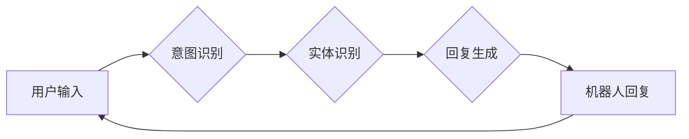

                 

## 聊天机器人客户服务：即时支持和帮助

> 关键词：聊天机器人、客户服务、自然语言处理、机器学习、人工智能、对话系统、自动化

### 1. 背景介绍

在当今数字化的时代，客户期望获得快速、便捷、个性化的服务体验。传统客服模式，例如电话、邮件等，往往难以满足这些需求，尤其是在面对大量客户咨询时。 聊天机器人作为一种新兴的客户服务技术，凭借其即时响应、24/7可用性和自动化处理能力，逐渐成为企业提升客户服务效率和体验的重要工具。

聊天机器人是一种能够通过自然语言与人类进行对话的计算机程序。它利用自然语言处理（NLP）和机器学习（ML）技术，能够理解用户的意图，并提供相应的回复。在客户服务领域，聊天机器人可以自动处理常见问题、引导用户获取所需信息、排队叫号、预约服务等，从而减轻人工客服的负担，提高服务效率。

### 2. 核心概念与联系

#### 2.1 自然语言处理（NLP）

自然语言处理是人工智能领域的一个重要分支，旨在使计算机能够理解、处理和生成人类语言。在聊天机器人中，NLP技术用于理解用户的输入文本，识别用户的意图和实体，并生成自然流畅的回复文本。

#### 2.2 机器学习（ML）

机器学习是人工智能领域的核心技术之一，它通过算法训练模型，使模型能够从数据中学习，并进行预测或分类。在聊天机器人中，机器学习技术用于训练模型识别用户的意图、实体和情感，并生成相应的回复。

#### 2.3 对话系统

对话系统是聊天机器人的核心组成部分，它负责管理与用户的对话流程，包括识别用户意图、生成回复文本、维护对话上下文等。

**Mermaid 流程图**



### 3. 核心算法原理 & 具体操作步骤

#### 3.1 算法原理概述

聊天机器人常用的算法包括：

* **规则匹配:** 基于预先定义的规则和知识库，匹配用户输入与规则，并生成相应的回复。
* **模板匹配:** 基于预定义的模板，匹配用户输入与模板，并填充模板中的变量生成回复。
* **机器学习:** 利用机器学习算法，训练模型识别用户意图和实体，并生成相应的回复。

#### 3.2 算法步骤详解

以机器学习算法为例，其具体操作步骤如下：

1. **数据收集和预处理:** 收集大量用户与客服的对话数据，并进行清洗、标注和格式化处理。
2. **特征提取:** 从对话数据中提取特征，例如单词、词性、语法结构、情感倾向等。
3. **模型训练:** 利用机器学习算法，训练模型识别用户意图和实体。常用的算法包括支持向量机（SVM）、决策树、随机森林、深度学习等。
4. **模型评估:** 使用测试数据评估模型的性能，例如准确率、召回率、F1-score等。
5. **模型部署:** 将训练好的模型部署到聊天机器人系统中，用于处理用户咨询。

#### 3.3 算法优缺点

**优点:**

* **自动化程度高:** 可以自动处理大量用户咨询，减轻人工客服的负担。
* **响应速度快:** 可以即时响应用户咨询，提高客户服务效率。
* **个性化程度高:** 可以根据用户的历史对话记录和偏好，提供个性化的服务。

**缺点:**

* **理解能力有限:** 对于复杂或模糊的语言，可能难以理解用户意图。
* **缺乏情感共鸣:** 无法像人类客服一样，理解和回应用户的 emosi。
* **数据依赖性强:** 需要大量高质量的对话数据进行训练，否则模型性能会下降。

#### 3.4 算法应用领域

* **电商:** 提供商品咨询、订单跟踪、退换货服务等。
* **金融:** 提供账户查询、转账、理财咨询等。
* **医疗:** 提供预约挂号、问诊、药品查询等。
* **教育:** 提供学习辅导、考试答疑、课程咨询等。

### 4. 数学模型和公式 & 详细讲解 & 举例说明

#### 4.1 数学模型构建

在聊天机器人中，常用的数学模型包括：

* **词向量模型:** 将单词映射到向量空间，捕捉单词之间的语义关系。例如，Word2Vec、GloVe等模型。
* **序列模型:** 用于处理序列数据，例如文本。例如，RNN、LSTM、Transformer等模型。

#### 4.2 公式推导过程

以词向量模型为例，其目标是学习一个词嵌入矩阵，使得相似的单词拥有相似的向量表示。

假设我们有词汇表 V，包含 N 个单词。每个单词对应一个词向量，维度为 d。词嵌入矩阵 W 是一个 N x d 的矩阵，其中第 i 行代表第 i 个单词的词向量。

词向量模型的目标函数通常是交叉熵损失函数，其公式如下：

$$
L = -\sum_{i=1}^{N} \sum_{j=1}^{|V|} y_{ij} \log(p_{ij})
$$

其中：

* $y_{ij}$ 是一个指示变量，如果第 i 个单词出现在第 j 个上下文窗口中，则 $y_{ij} = 1$，否则 $y_{ij} = 0$。
* $p_{ij}$ 是模型预测第 i 个单词出现在第 j 个上下文窗口中的概率。

#### 4.3 案例分析与讲解

假设我们有一个词汇表 V = {"苹果", "香蕉", "橘子", "水果"}，我们希望学习一个词嵌入矩阵 W，使得相似的单词拥有相似的向量表示。

我们可以使用 Word2Vec 模型训练词嵌入矩阵。训练过程中，模型会学习到以下关系：

* "苹果" 和 "香蕉" 都是水果，因此它们的向量表示应该比较接近。
* "橘子" 也是水果，但与 "苹果" 和 "香蕉" 的关系更弱，因此它们的向量表示应该更远。

经过训练，我们可以得到一个词嵌入矩阵 W，其中 "苹果" 和 "香蕉" 的向量表示比较接近，而 "橘子" 的向量表示则更远。

### 5. 项目实践：代码实例和详细解释说明

#### 5.1 开发环境搭建

* Python 3.x
* TensorFlow 或 PyTorch
* NLTK 或 SpaCy

#### 5.2 源代码详细实现

```python
# 使用 TensorFlow 训练一个简单的词向量模型

import tensorflow as tf

# 定义词嵌入层
embedding_layer = tf.keras.layers.Embedding(input_dim=vocab_size, output_dim=embedding_size)

# 定义模型
model = tf.keras.Sequential([
    embedding_layer,
    tf.keras.layers.Dense(units=1, activation='sigmoid')
])

# 编译模型
model.compile(optimizer='adam', loss='binary_crossentropy', metrics=['accuracy'])

# 训练模型
model.fit(x_train, y_train, epochs=10)

# 使用模型预测
predictions = model.predict(x_test)
```

#### 5.3 代码解读与分析

* `embedding_layer`: 定义一个词嵌入层，将单词映射到向量空间。
* `model`: 定义一个简单的模型，包含词嵌入层和一个全连接层。
* `compile`: 编译模型，指定优化器、损失函数和评估指标。
* `fit`: 训练模型，使用训练数据进行训练。
* `predict`: 使用训练好的模型预测测试数据。

#### 5.4 运行结果展示

训练完成后，我们可以使用测试数据评估模型的性能，例如准确率、召回率等。

### 6. 实际应用场景

#### 6.1 电商客服

聊天机器人可以帮助电商企业处理常见客户咨询，例如商品信息查询、订单跟踪、退换货服务等。

#### 6.2 金融客服

聊天机器人可以帮助金融机构处理客户账户查询、转账、理财咨询等服务。

#### 6.3 医疗客服

聊天机器人可以帮助医疗机构提供预约挂号、问诊、药品查询等服务。

#### 6.4 未来应用展望

随着人工智能技术的不断发展，聊天机器人将在更多领域得到应用，例如教育、旅游、政府服务等。

### 7. 工具和资源推荐

#### 7.1 学习资源推荐

* **书籍:**
    * 《深度学习》
    * 《自然语言处理》
    * 《聊天机器人技术》
* **在线课程:**
    * Coursera
    * edX
    * Udacity

#### 7.2 开发工具推荐

* **TensorFlow:** 开源深度学习框架
* **PyTorch:** 开源深度学习框架
* **Rasa:** 开源对话平台
* **Dialogflow:** Google 提供的对话平台

#### 7.3 相关论文推荐

* **BERT: Pre-training of Deep Bidirectional Transformers for Language Understanding**
* **GPT-3: Language Models are Few-Shot Learners**
* **XLNet: Generalized Autoregressive Pretraining for Language Understanding**

### 8. 总结：未来发展趋势与挑战

#### 8.1 研究成果总结

近年来，聊天机器人技术取得了显著进展，特别是深度学习技术的应用，使得聊天机器人的理解能力和生成能力大幅提升。

#### 8.2 未来发展趋势

* **更强大的理解能力:** 能够理解更复杂、更模糊的语言，并进行更深入的语义理解。
* **更个性化的服务:** 能够根据用户的个性化需求和偏好，提供更精准、更个性化的服务。
* **更自然的交互体验:** 能够与用户进行更自然、更流畅的对话，例如使用语音交互、表情符号等。

#### 8.3 面临的挑战

* **数据质量问题:** 聊天机器人需要大量高质量的对话数据进行训练，而获取高质量数据的难度较大。
* **安全性和隐私问题:** 聊天机器人需要处理用户的敏感信息，因此需要保证数据的安全性和隐私性。
* **伦理问题:** 聊天机器人可能会被用于欺骗、误导用户，因此需要考虑其伦理问题。

#### 8.4 研究展望

未来，聊天机器人技术将继续朝着更智能、更安全、更可靠的方向发展。

### 9. 附录：常见问题与解答

* **Q: 聊天机器人可以替代人工客服吗？**

A: 聊天机器人可以有效减轻人工客服的负担，但目前还无法完全替代人工客服。对于复杂、需要情感共鸣的咨询，人工客服仍然是不可替代的。

* **Q: 如何训练一个好的聊天机器人？**

A: 训练一个好的聊天机器人需要大量高质量的对话数据、合适的算法模型和专业的训练方法。

* **Q: 聊天机器人的安全性如何保证？**

A: 聊天机器人的安全性需要从多个方面考虑，例如数据加密、身份验证、恶意攻击防御等。

作者：禅与计算机程序设计艺术 / Zen and the Art of Computer Programming


<end_of_turn>

