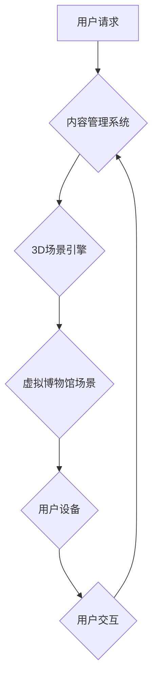

                 

## 虚拟博物馆策展:全球文化遗产的数字化展示

> 关键词：虚拟现实、增强现实、数字孪生、文化遗产、博物馆数字化、3D建模、人工智能、云计算、大数据

## 1. 背景介绍

随着科技的飞速发展，虚拟现实（VR）、增强现实（AR）和数字孪生等技术的成熟，虚拟博物馆的建设已成为文化遗产保护和传承的新趋势。传统博物馆受限于物理空间和展出时间，难以满足人们日益增长的文化需求。而虚拟博物馆通过数字化手段，打破了时空限制，为用户提供沉浸式、互动式的文化体验，成为展示和传播文化遗产的有效平台。

## 2. 核心概念与联系

**2.1 虚拟博物馆的概念**

虚拟博物馆是指利用计算机技术，构建一个虚拟的博物馆环境，通过网络平台向用户提供虚拟参观、互动体验等服务。它可以模拟真实博物馆的布局和展品，并提供更多元的互动功能，例如360度全景展示、文物放大、虚拟导览等。

**2.2 核心技术**

虚拟博物馆的建设依赖于多种核心技术，包括：

* **3D建模技术:** 用于构建虚拟博物馆的场景和文物模型，实现逼真的视觉效果。
* **虚拟现实（VR）技术:** 提供沉浸式的虚拟参观体验，用户可以身临其境地感受博物馆环境。
* **增强现实（AR）技术:** 将虚拟元素叠加到现实世界中，例如通过手机或平板电脑，用户可以查看文物信息、观看3D模型等。
* **数字孪生技术:** 建立文物和博物馆的虚拟镜像，实现实时监测、分析和管理。
* **人工智能（AI）技术:** 用于智能导览、文物识别、用户行为分析等，提升用户体验和博物馆运营效率。

**2.3 架构设计**

虚拟博物馆的架构通常包括以下几个部分：

* **内容管理系统:** 用于管理博物馆的文物信息、展品数据、导览内容等。
* **3D场景引擎:** 用于渲染虚拟博物馆的场景和文物模型。
* **用户交互系统:** 用于处理用户的操作指令，例如鼠标点击、键盘输入、手势识别等。
* **网络传输系统:** 用于将虚拟博物馆的内容传输到用户设备。
* **云计算平台:** 用于存储和处理海量数据，提供高性能计算和存储服务。

**Mermaid 流程图**



## 3. 核心算法原理 & 具体操作步骤

**3.1 算法原理概述**

虚拟博物馆的建设涉及多种算法，例如3D建模算法、纹理贴图算法、光照计算算法、路径规划算法等。这些算法共同作用，实现虚拟博物馆的逼真渲染、交互体验和智能化功能。

**3.2 算法步骤详解**

* **3D建模算法:**

    1. **数据采集:** 利用激光扫描、照片grammetry等技术采集文物和博物馆环境的真实数据。
    2. **数据处理:** 对采集到的数据进行处理，例如点云数据处理、图像拼接等，生成3D模型的原始数据。
    3. **模型构建:** 利用3D建模软件，根据原始数据构建3D模型，包括几何形状、纹理贴图、材质属性等。

* **纹理贴图算法:**

    1. **纹理采集:** 利用高分辨率相机拍摄文物表面纹理图像。
    2. **纹理处理:** 对纹理图像进行处理，例如去噪、颜色校正等，生成高质量的纹理贴图。
    3. **纹理映射:** 将纹理贴图映射到3D模型表面，赋予模型真实感。

* **光照计算算法:**

    1. **光源定义:** 定义虚拟博物馆中的光源类型、位置、强度等参数。
    2. **光线追踪:** 利用光线追踪算法模拟光线在虚拟场景中的传播，计算每个点的亮度和颜色。
    3. **阴影生成:** 根据光线追踪结果生成阴影效果，增强场景的真实感。

**3.3 算法优缺点**

* **优点:** 

    * 能够实现逼真的虚拟场景和文物模型，提供沉浸式的体验。
    * 可以根据用户需求定制化场景和内容，满足多样化的文化需求。
    * 可以突破时空限制，让更多人了解和体验文化遗产。

* **缺点:**

    * 建设虚拟博物馆需要投入大量的时间和资源，例如3D建模、数据处理、技术开发等。
    * 虚拟体验无法完全替代现实体验，例如无法触摸文物、感受文物材质等。
    * 需要考虑网络带宽、设备性能等因素，确保用户能够流畅地体验虚拟博物馆。

**3.4 算法应用领域**

* **博物馆数字化:** 建设虚拟博物馆，提供线上参观、互动体验等服务。
* **文物保护:** 利用数字孪生技术，实时监测文物状态，预防文物损坏。
* **文化传播:** 将文化遗产数字化，传播到全球范围内，促进文化交流。
* **教育教学:** 利用虚拟博物馆，为学生提供沉浸式的文化学习体验。

## 4. 数学模型和公式 & 详细讲解 & 举例说明

**4.1 数学模型构建**

虚拟博物馆的构建涉及多个数学模型，例如3D空间坐标系、光照模型、纹理映射模型等。

* **3D空间坐标系:** 用于描述虚拟场景中的物体位置和方向。

    * **笛卡尔坐标系:** 使用三个坐标轴 (x, y, z) 来表示物体的空间位置。
    * **球坐标系:** 使用三个坐标 (ρ, θ, φ) 来表示物体的空间位置，其中ρ表示距离原点，θ表示与x轴的夹角，φ表示与z轴的夹角。

* **光照模型:** 用于计算物体在不同光照条件下的颜色和亮度。

    * **Blinn-Phong模型:** 结合了漫反射和镜面反射，能够模拟物体表面更真实的反射效果。

    $$
    L_d = k_d \cdot I_d \cdot \max(0, N \cdot L)
    $$

    $$
    L_s = k_s \cdot I_s \cdot \max(0, H \cdot V)^n
    $$

    其中：

    * $L_d$：漫反射光强
    * $k_d$：漫反射系数
    * $I_d$：入射光强
    * $N$：法线向量
    * $L$：入射光向量
    * $L_s$：镜面反射光强
    * $k_s$：镜面反射系数
    * $I_s$：入射光强
    * $H$：半光向量
    * $V$：观察向量
    * $n$：镜面反射指数

* **纹理映射模型:** 用于将纹理图像映射到3D模型表面，赋予模型真实感。

    * **UV坐标系:** 将3D模型表面映射到二维平面，方便纹理图像的贴图。

**4.2 公式推导过程**

上述公式的推导过程涉及线性代数、微积分等数学知识，具体推导过程可以参考相关书籍和论文。

**4.3 案例分析与讲解**

例如，在虚拟博物馆中展示古埃及金字塔，可以使用3D建模算法构建金字塔模型，并利用纹理贴图算法将金字塔的表面纹理贴图到模型上，使其更加逼真。可以使用光照模型计算金字塔在不同光照条件下的颜色和亮度，模拟金字塔在阳光下的阴影效果。

## 5. 项目实践：代码实例和详细解释说明

**5.1 开发环境搭建**

虚拟博物馆的开发环境通常包括以下软件：

* **3D建模软件:** 例如Blender、Maya、3ds Max等。
* **游戏引擎:** 例如Unity、Unreal Engine等。
* **编程语言:** 例如C#、Python、JavaScript等。
* **数据库:** 例如MySQL、MongoDB等。

**5.2 源代码详细实现**

以下是一个简单的虚拟博物馆场景代码示例，使用Unity游戏引擎和C#编程语言实现：

```csharp
using UnityEngine;

public class VirtualMuseum : MonoBehaviour
{
    public GameObject museumScene; // 虚拟博物馆场景

    void Start()
    {
        // 加载虚拟博物馆场景
        Instantiate(museumScene);
    }
}
```

**5.3 代码解读与分析**

* `public GameObject museumScene;`: 定义一个公共变量，用于存储虚拟博物馆场景的GameObject对象。
* `void Start()`: 在游戏开始时执行的函数。
* `Instantiate(museumScene);`: 使用Instantiate函数实例化博物馆场景，将其加载到游戏场景中。

**5.4 运行结果展示**

运行该代码后，将加载虚拟博物馆场景，用户可以自由探索博物馆环境。

## 6. 实际应用场景

**6.1 博物馆数字化**

虚拟博物馆可以为博物馆提供线上参观、互动体验等服务，吸引更多用户访问，提升博物馆的影响力。例如，北京故宫博物院的虚拟博物馆，可以让人们在家中体验故宫的宏伟建筑和丰富的文物收藏。

**6.2 文物保护**

数字孪生技术可以用于监测文物状态，预防文物损坏。例如，可以利用传感器收集文物温度、湿度、震动等数据，并将其与虚拟模型进行实时对比，及时发现文物异常情况。

**6.3 文化传播**

虚拟博物馆可以将文化遗产数字化，传播到全球范围内，促进文化交流。例如，联合国教科文组织的虚拟博物馆，展示了世界各地的文化遗产，让更多人了解不同文化的魅力。

**6.4 未来应用展望**

随着技术的不断发展，虚拟博物馆的应用场景将更加广泛，例如：

* **沉浸式教育:** 利用虚拟现实技术，为学生提供沉浸式的文化学习体验。
* **虚拟展览:** 利用虚拟博物馆平台，举办线上展览，吸引更多用户参与。
* **文物修复:** 利用虚拟模型和3D打印技术，辅助文物修复工作。

## 7. 工具和资源推荐

**7.1 学习资源推荐**

* **书籍:**

    * 《虚拟现实技术》
    * 《增强现实技术》
    * 《数字孪生技术》

* **在线课程:**

    * Coursera: 虚拟现实开发
    * Udemy: 增强现实开发
    * edX: 数字孪生技术

**7.2 开发工具推荐**

* **3D建模软件:** Blender, Maya, 3ds Max
* **游戏引擎:** Unity, Unreal Engine
* **编程语言:** C#, Python, JavaScript

**7.3 相关论文推荐**

* 《虚拟博物馆的构建与应用》
* 《数字孪生技术在文物保护中的应用》
* 《增强现实技术在博物馆导览中的应用》

## 8. 总结：未来发展趋势与挑战

**8.1 研究成果总结**

虚拟博物馆的建设取得了显著成果，为文化遗产保护和传承提供了新的途径。

**8.2 未来发展趋势**

* **更加逼真的虚拟体验:** 利用更先进的3D建模、光照计算、纹理贴图等技术，实现更加逼真的虚拟场景和文物模型。
* **更加智能化的交互体验:** 利用人工智能技术，实现更加智能化的导览、文物识别、用户行为分析等功能，提升用户体验。
* **更加丰富的互动内容:** 开发更加丰富的互动内容，例如虚拟展览、文物修复、文化体验等，吸引更多用户参与。

**8.3 面临的挑战**

* **技术难度:** 虚拟博物馆的建设需要整合多种技术，技术难度较高。
* **成本投入:** 虚拟博物馆的建设需要投入大量的时间和资源，成本较高。
* **用户接受度:** 一些用户可能对虚拟体验的接受度不高，需要不断提升虚拟体验的真实感和趣味性。

**8.4 研究展望**

未来，虚拟博物馆的研究将更加注重以下方面：

* **沉浸式体验:** 利用虚拟现实、增强现实等技术，打造更加沉浸式的虚拟体验。
* **个性化定制:** 根据用户的兴趣和需求，提供个性化的虚拟博物馆体验。
* **跨文化交流:** 利用虚拟博物馆平台，促进不同文化之间的交流和理解。

## 9. 附录：常见问题与解答

**9.1 如何访问虚拟博物馆？**

大多数虚拟博物馆都提供线上访问服务，用户可以通过浏览器或移动应用程序访问。

**9.2 虚拟博物馆的体验与现实博物馆有什么区别？**

虚拟博物馆无法完全替代现实博物馆，例如无法触摸文物、感受文物材质等。但是，虚拟博物馆可以突破时空限制，提供更加便捷、灵活的参观体验。

**9.3 虚拟博物馆的未来发展趋势是什么？**

虚拟博物馆的未来发展趋势是更加逼真、智能化、互动化，将成为文化遗产保护和传承的重要平台。


作者：禅与计算机程序设计艺术 / Zen and the Art of Computer Programming 
<end_of_turn>

