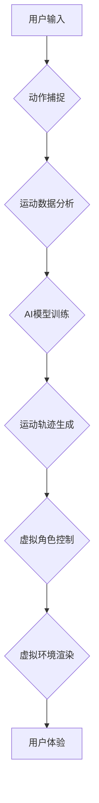

                 

## 虚拟运动现实：AI模拟的极限体验

> 关键词：虚拟现实、增强现实、人工智能、运动模拟、游戏开发、机器学习、神经网络

## 1. 背景介绍

虚拟现实（VR）和增强现实（AR）技术近年来发展迅速，为我们提供了沉浸式体验和交互式环境。而人工智能（AI）的不断进步，特别是深度学习和机器学习领域的突破，为虚拟运动现实（VMR）的实现提供了强大的技术支撑。VMR旨在通过AI模拟逼真的运动体验，让用户在虚拟环境中进行各种运动活动，例如跑步、游泳、攀岩、打球等。

传统的运动模拟技术往往局限于物理模型和图形渲染，难以完全捕捉运动的复杂性和真实感。而VMR通过AI算法学习和分析真实运动数据，可以生成更逼真的运动轨迹、动作姿态和物理反馈，从而提供更沉浸式和真实的运动体验。

## 2. 核心概念与联系

VMR的核心概念包括虚拟环境、运动模拟、AI算法和用户交互。

* **虚拟环境:**  VMR需要构建逼真的虚拟环境，包括场景、物体、光照和音效等。这可以利用3D建模、纹理贴图和物理引擎等技术实现。
* **运动模拟:**  VMR需要模拟各种运动行为，例如跑步、跳跃、投掷等。这需要考虑运动的物理规律、人体运动学和动作捕捉等技术。
* **AI算法:**  AI算法是VMR的核心，用于学习和分析真实运动数据，生成逼真的运动轨迹和动作姿态。常见的AI算法包括深度学习、强化学习和行为克隆等。
* **用户交互:**  用户可以通过控制器、手势识别或其他方式与虚拟环境进行交互，控制虚拟角色的运动和动作。

**Mermaid 流程图:**



## 3. 核心算法原理 & 具体操作步骤

### 3.1  算法原理概述

VMR的核心算法通常基于机器学习，特别是深度学习。通过训练深度神经网络，可以学习到真实运动数据的特征和规律，从而生成逼真的运动轨迹和动作姿态。常见的算法包括：

* **行为克隆:**  通过收集大量真实运动数据，训练一个神经网络模型，将输入的控制信号映射到相应的运动轨迹。
* **强化学习:**  训练一个智能体在虚拟环境中学习运动技能，通过奖励机制优化运动轨迹，使其更加逼真和流畅。
* **生成对抗网络 (GAN):**  利用两个神经网络对抗训练，生成更加逼真的运动数据。

### 3.2  算法步骤详解

以行为克隆为例，其具体操作步骤如下：

1. **数据采集:** 收集大量真实运动数据，包括运动轨迹、关节角度、肌肉活动等。
2. **数据预处理:** 对采集到的数据进行清洗、规范化和特征提取等处理，使其适合深度学习模型的训练。
3. **模型构建:**  构建一个深度神经网络模型，例如循环神经网络 (RNN) 或卷积神经网络 (CNN)，用于学习运动数据的特征和规律。
4. **模型训练:**  利用训练数据训练深度神经网络模型，调整模型参数，使其能够准确地预测运动轨迹。
5. **模型评估:**  使用测试数据评估模型的性能，例如预测精度、流畅度等。
6. **模型部署:**  将训练好的模型部署到虚拟环境中，用于生成逼真的运动轨迹。

### 3.3  算法优缺点

**优点:**

* 可以生成逼真的运动轨迹和动作姿态。
* 可以学习到复杂运动的规律和特征。
* 可以根据用户的输入进行个性化的运动模拟。

**缺点:**

* 需要大量的真实运动数据进行训练。
* 模型训练过程复杂，需要强大的计算资源。
* 模型的性能受训练数据质量的影响。

### 3.4  算法应用领域

* **游戏开发:**  为游戏角色生成逼真的运动行为，提升游戏体验。
* **体育训练:**  模拟各种运动场景，帮助运动员进行训练和评估。
* **医疗康复:**  帮助患者进行康复训练，恢复运动能力。
* **教育培训:**  提供沉浸式的运动学习体验，提高学习效率。

## 4. 数学模型和公式 & 详细讲解 & 举例说明

### 4.1  数学模型构建

VMR中的运动模拟可以基于物理模型和数学公式进行实现。常见的物理模型包括牛顿运动定律、刚体动力学和弹性力学等。

**牛顿运动定律:**

$$F = ma$$

其中，F是力，m是质量，a是加速度。

**刚体动力学:**

$$T = I\alpha$$

其中，T是力矩，I是惯性矩，α是角加速度。

### 4.2  公式推导过程

通过上述物理模型和数学公式，可以推导出运动轨迹、速度、加速度等物理量。例如，根据牛顿第二定律，可以推导出物体运动的轨迹方程。

### 4.3  案例分析与讲解

例如，模拟一个球体的抛物线运动，可以利用牛顿运动定律和重力加速度来计算球体的运动轨迹。

## 5. 项目实践：代码实例和详细解释说明

### 5.1  开发环境搭建

VMR项目开发环境通常包括以下软件：

* **3D建模软件:**  例如Blender、Maya、3ds Max等，用于创建虚拟环境和物体模型。
* **物理引擎:**  例如PhysX、Havok、Bullet等，用于模拟物体之间的物理交互。
* **游戏引擎:**  例如Unity、Unreal Engine等，用于构建虚拟环境和游戏逻辑。
* **AI开发工具:**  例如TensorFlow、PyTorch等，用于训练和部署AI模型。

### 5.2  源代码详细实现

以下是一个简单的VMR代码示例，使用Python和Unity引擎实现一个虚拟跑步场景：

```python
# Unity脚本示例

using UnityEngine;

public class VirtualRunner : MonoBehaviour
{
    public float speed = 5f;
    public Transform groundCheck;
    public float groundDistance = 0.4f;
    public LayerMask groundMask;

    private bool isGrounded;
    private Rigidbody rb;

    void Start()
    {
        rb = GetComponent<Rigidbody>();
    }

    void Update()
    {
        isGrounded = Physics.CheckSphere(groundCheck.position, groundDistance, groundMask);

        if (isGrounded && Input.GetKeyDown(KeyCode.Space))
        {
            rb.AddForce(Vector3.up * 10f, ForceMode.Impulse);
        }

        float horizontalInput = Input.GetAxis("Horizontal");
        Vector3 movement = transform.right * horizontalInput * speed * Time.deltaTime;
        rb.MovePosition(transform.position + movement);
    }
}
```

### 5.3  代码解读与分析

这段代码实现了一个虚拟跑步角色。

* `speed`变量控制角色的跑步速度。
* `groundCheck`变量指向角色脚部的检测点。
* `groundDistance`变量控制检测脚部是否触地距离。
* `groundMask`变量定义了可以检测到的地面层。
* `isGrounded`变量记录角色是否触地。
* `rb`变量获取角色的Rigidbody组件。
* `Update()`函数在每一帧执行，检测角色是否触地，并根据玩家输入控制角色的移动。

### 5.4  运行结果展示

运行这段代码后，角色可以在虚拟环境中左右移动，并根据玩家输入跳跃。

## 6. 实际应用场景

VMR技术在多个领域具有广泛的应用前景：

### 6.1  体育训练

VMR可以模拟各种运动场景，例如篮球、足球、游泳等，帮助运动员进行训练和评估。运动员可以在虚拟环境中反复练习动作，并获得即时的反馈，从而提高训练效率和效果。

### 6.2  医疗康复

VMR可以帮助患者进行康复训练，恢复运动能力。例如，患者可以利用虚拟环境进行虚拟行走训练，帮助恢复平衡感和协调能力。

### 6.3  教育培训

VMR可以提供沉浸式的运动学习体验，提高学习效率。例如，学生可以通过虚拟环境学习不同的运动技能，并获得即时的反馈和指导。

### 6.4  未来应用展望

随着人工智能和虚拟现实技术的不断发展，VMR技术将有更广泛的应用场景，例如：

* **虚拟体育比赛:**  玩家可以在虚拟环境中进行体育比赛，体验真实的比赛氛围。
* **虚拟运动社交:**  玩家可以与朋友在线进行虚拟运动，分享运动体验。
* **虚拟运动娱乐:**  VMR可以开发出各种有趣的运动游戏，为玩家提供新的娱乐方式。

## 7. 工具和资源推荐

### 7.1  学习资源推荐

* **书籍:**

    * 《深度学习》 - Ian Goodfellow, Yoshua Bengio, Aaron Courville
    * 《机器学习》 - Tom Mitchell
    * 《游戏开发人工智能》 -  Michael Mateas

* **在线课程:**

    * Coursera: 深度学习课程
    * Udacity: 机器学习工程师课程
    * edX: 游戏开发课程

### 7.2  开发工具推荐

* **3D建模软件:** Blender, Maya, 3ds Max
* **物理引擎:** PhysX, Havok, Bullet
* **游戏引擎:** Unity, Unreal Engine
* **AI开发工具:** TensorFlow, PyTorch

### 7.3  相关论文推荐

* **Generative Adversarial Networks** - Ian Goodfellow et al. (2014)
* **Deep Reinforcement Learning** - Volodymyr Mnih et al. (2015)
* **Behavior Cloning: Learning to Drive from Demonstration** -  Deirdre Quillen et al. (2017)

## 8. 总结：未来发展趋势与挑战

### 8.1  研究成果总结

VMR技术近年来取得了显著的进展，特别是AI算法的不断进步，为VMR的实现提供了强大的技术支撑。VMR技术已经应用于多个领域，例如体育训练、医疗康复和教育培训等。

### 8.2  未来发展趋势

未来VMR技术的发展趋势包括：

* **更逼真的运动模拟:**  通过更先进的AI算法和物理模型，生成更加逼真的运动轨迹和动作姿态。
* **更沉浸式的虚拟环境:**  利用更先进的VR技术，构建更加逼真的虚拟环境，提升用户体验。
* **更个性化的运动体验:**  根据用户的运动水平、目标和喜好，提供个性化的运动训练和娱乐体验。

### 8.3  面临的挑战

VMR技术还面临一些挑战，例如：

* **数据获取和标注:**  训练VMR模型需要大量的真实运动数据，获取和标注这些数据成本较高。
* **模型复杂性和计算资源:**  训练VMR模型需要复杂的算法和强大的计算资源。
* **用户体验和交互:**  需要设计更加自然、流畅的用户交互方式，提升用户体验。

### 8.4  研究展望

未来VMR技术的研究方向包括：

* **探索更先进的AI算法:**  例如强化学习、迁移学习等，提高运动模拟的逼真度和智能化程度。
* **研究更有效的运动数据采集和标注方法:**  降低数据获取和标注成本。
* **开发更便捷的用户交互方式:**  例如手势识别、语音控制等，提升用户体验。


## 9. 附录：常见问题与解答

**Q1: VMR和VR的区别是什么？**

**A1:**  VR是指虚拟现实，它通过头戴显示器和手柄等设备，将用户沉浸在一个虚拟环境中。而VMR是虚拟运动现实，它是在VR的基础上，利用AI技术模拟逼真的运动体验。

**Q2: VMR技术有哪些应用场景？**

**A2:**  VMR技术可以应用于体育训练、医疗康复、教育培训、虚拟体育比赛、虚拟运动社交等多个领域。

**Q3: 如何学习VMR技术？**

**A3:**  可以学习深度学习、机器学习、游戏开发等相关知识，并利用开源工具和资源进行实践。

**作者：禅与计算机程序设计艺术 / Zen and the Art of Computer Programming** 


<end_of_turn>

